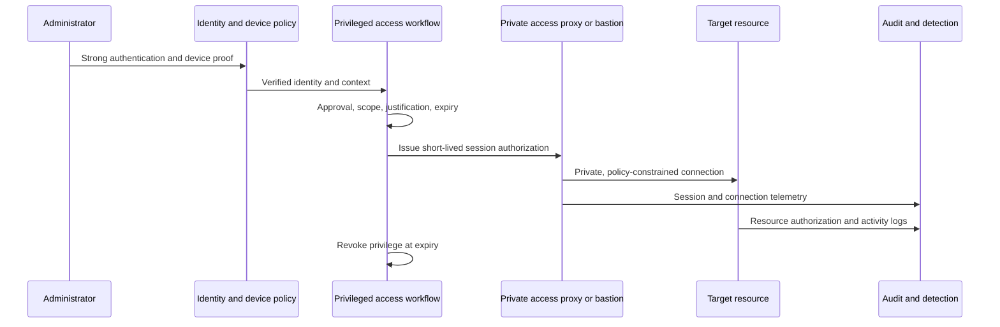

> **文档类型：** 操作指南
> **规范性术语：** **MUST**、**MUST NOT**、**SHOULD**、**SHOULD NOT** 和 **MAY** 是要求级别。
> **适用范围：** 跨四个云的身份感知的即时私有管理、设备和会话控制、分段、审计、break-glass 和恢复。
> **例外流程：** 偏离要求需要记录风险评估、补偿控制、指定风险负责人和到期日期。

|控制领域|价值|
|---|---|
|文件编号 | `HTG-19` |
|负责人|云卓越中心 |
|审核周期|至少每年一次，并且在身份、访问或网络发生重大变化之后 |
|证据|访问请求、设备和身份检查、会话日志、命令证据、批准跟踪、break-glass 测试和吊销日志记录 |

# 如何对私有云资源实施零信任管理

> **简要决定：** 在最短的必要时间内授予最小的私有管理会话，验证操作员和设备，并保存会话证据。

> **文件类型：** 实施指南
> **主要示例：** Microsoft Entra ID、特权身份管理和私有 Azure 管理
> **云范围：** Azure、AWS、GCP 和 Oracle Cloud Infrastructure (OCI)
> **工作原则：**验证每个会话的身份、设备、上下文和授权；网络位置本身并不能给予信任。

## 目标

为管理员提供对私有虚拟机、Kubernetes API、数据库、云控制台和管理端点的限时访问，而无需永久权限、公共管理端口、共享账户或广泛连接的跳转网络。

零信任结合了身份、设备运行状况、最小权限、私有连接、会话控制、资源授权、遥测和测试恢复。仅仅部署堡垒并不能达到目标。

## 定义访问策略

对于每项管理能力，日志记录：

- 指定角色和责任所有者；
- 合格的用户或群体以及职责分离的限制；
- 允许的资源、环境、命令和数据平面；
- 防网络钓鱼身份验证和受管设备要求；
- 批准、票证、理由、期限和重新验证条件；
- 允许的访问路径、协议、源上下文和会话记录策略；
- 日志、告警、审查、撤销和紧急访问要求。

将控制平面角色与操作系统、Kubernetes、数据库和应用角色分开。云订阅所有权不得自动授予生产数据访问权限。

## 参考访问流程

## 建立身份控制

1. 将员工身份联合到中央身份提供商；禁止非托管本地云用户，受控恢复身份除外。
2. 特权角色需要防网络钓鱼的 MFA。
3. 评估设备合规性、风险、位置和会话上下文。
4. 使特权角色符合资格而不是永久有效。
5. 生产和高影响力角色需要批准和有限的激活期限。
6. 分配最窄的提供商和资源原生权限。
7. 运行访问审查并删除不活动、孤立、嵌套或冲突的分配。
8. 关于角色授予、策略更改、激活失败、异常会话和紧急身份使用的告警。

在策略需要的情况下，使用单独的管理身份来执行特权工作。不允许服务身份或流水线身份以交互方式登录。

## 创建私有访问路径

使用身份识别代理、托管堡垒、会话服务或特权访问工作站路径。目标不应具有公共管理 IP 或入站 SSH/RDP 规则。通过受管理的 DNS 解析私有名称，限制访问层的路由和安全组，并记录接受和拒绝的连接。

避免使用可以到达每个环境的扁平跳线盒网络。按生产状态、监管边界、协议和操作员角色细分访问。首选不会向管理员工作站公开目标凭据的代理连接。

## 映射多云能力

|能力|Azure|AWS | GCP |OCI |
|---|---|---|---|---|
|员工身份联合 |Microsoft Entra ID | IAM Identity Center 或联合 IdP | Cloud Identity 或员工身份联合 |Identity Domains federation |
|即时特权| Entra PIM 和角色条件 |临时角色会话和批准的访问工作流程 |Privileged Access Manager 和 IAM 条件 |通过受控自动化制定有时限的策略|
|代理虚拟机访问 | Azure Bastion 或批准的私有代理 |Systems Manager Session Manager |Identity-Aware Proxy TCP forwarding |Bastion service|
| Kubernetes 接入 |内部集成 AKS RBAC | EKS 访问条目和 IAM | GKE IAM 和 Kubernetes RBAC | OKE IAM 和 Kubernetes RBAC |
|审计证据| Entra、Azure Activity Log and resource logs | CloudTrail 和服务日志 | Cloud Audit Logs|Audit services and resource logs|

提供商功能不同；规范化的要求是强大的身份、设备/上下文验证、有时限的授权、私有代理传输、资源级执行和相关证据。

## 安全的特定资源管理

### 虚拟机

使用短期证书、提供商会话服务或集中身份登录。在可行的情况下禁用密码身份验证，通过受控程序轮换主机密钥，使用 `sudo` 或等效策略限制提升，并根据隐私和法律要求采集命令。

### Kubernetes
通过员工身份提供商进行身份验证，将窄组映射到 Kubernetes RBAC，分离命名空间和集群角色，禁用非托管静态 kubeconfig，并对特权 Pod、机密读取、模拟和集群角色更改发出告警。

### 数据库

更喜欢基于身份的数据库身份验证和私有端点。将数据库管理与应用模式部署和数据读取者角色分开。审计特权语句并保护数据库管理员的审计日志。

### 云门户和 API

在支持的情况下应用即时角色、管理范围条件、受保护的管理工作站以及持续会话评估。在安全的情况下，拒绝在批准的区域、资源类型或策略边界之外进行更改。

## 保护管理工作站

需要具有安全启动和屏幕锁定策略的托管、加密、修补、端点监控设备。将特权浏览与电子邮件和一般互联网使用分开。在平台控制允许的情况下阻止令牌导出、浏览器同步、非托管扩展和本地凭据存储。

合规设备只是一个信号，而不是永久的信任。重新评估身份风险、设备状态、网络上下文、请求的权限或会话行为何时发生变化。

## 设计紧急通道

维护至少两个独立保护的恢复身份或适合身份提供商故障模型的过程。仅将它们排除在阻止恢复、通过双重控制离线存储凭据或密钥、监控每次使用以及按受控计划进行测试的策略之外。

即使账户在技术上是持久的，紧急访问也必须在操作上有时间限制。使用后，轮换凭证、审查所有操作、删除临时授权并记录事件或练习。

## 监控和响应

关联身份认证、设备决策、角色激活、审批、代理连接、目标授权、资源操作和会话终止。告警：

- 永久的高权限任务；
- 无需批准或票据即可激活；
- 从不受管理或有风险的设备进行访问；
- 直接公共管理流量或绕过代理；
- 不寻常的资源范围、地理位置、时间、命令或数据访问；
- 记录中断、会话日志失败或时钟漂移；
- 紧急身份使用。

对于可疑的泄露，撤销会话和角色激活、隔离设备、禁用受影响的访问路径、保留日志、评估资源更改、轮换暴露的凭据并验证干净恢复。

## 验证

- [ ] 目标不公开公共 SSH、RDP、Kubernetes API 或数据库管理路径，除非正式例外。
- [ ] 未经激活、批准、兼容设备或所需 MFA 的用户无法连接。
- [ ] 激活的访问仅限于批准的资源、角色、协议和持续时间。
- [ ] 到期和紧急撤销按照设计终止授权和活动会话。
- [ ] 管理员无法从非生产转向生产或跨租户边界。
- [ ] 日志关联身份、设备、批准、会话、目标和资源操作。
- [ ] 身份提供商、堡垒/代理、DNS 和区域故障场景已测试恢复。
- [ ] 紧急访问起作用，立即发出告警，并生成完整的审计日志记录。

## 完成标准

当没有网络位置授予隐式信任、特权角色符合条件且有时间限制、每个会话之前都有强身份和设备策略、目标缺乏旁路路径、资源原生授权限制操作、遥测相关和受保护以及测试紧急恢复时，私有管理已准备就绪。

## 相关主题

- [零信任和私有访问设计](../networking-identity-security/nis-zero-trust-and-private-access-design.md)
- [云身份与访问架构](../networking-identity-security/nis-cloud-identity-and-access-architecture.md)
- [托管身份和工作负载身份联合](../networking-identity-security/nis-managed-identities-and-workload-federation.md)
- [云安全和零信任标准](../standards-best-practices/cloud-security-and-zero-trust-standard.md)

## 相关仓库

- [andyxuan2010/azure-landingzone](https://github.com/andyxuan2010/azure-landingzone) — 实现受管理的 Azure 基础、私有网络、Key Vault 和支持本指南中的访问模型的管理控制。
- [andyxuan2010/aws-landingzone](https://github.com/andyxuan2010/aws-landingzone) — 提供多账户 AWS 基础，可以在其中应用联合管理和账户级护栏。
- [andyxuan2010/oci-landingzone](https://github.com/andyxuan2010/oci-landingzone) — 提供 OCI 隔间、网络和 Vault 基础，以实现等效的私有管理路径。
