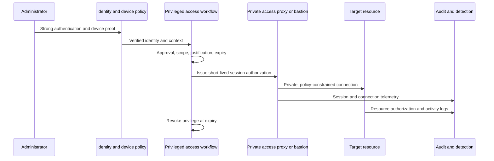

> **Document class:** How-to Guides implementation guide
> **Normative terms:** **MUST**, **MUST NOT**, **SHOULD**, **SHOULD NOT**, and **MAY** are requirements levels.
> **Applicability:** Identity-aware just-in-time private administration, device and session controls, segmentation, audit, break-glass, and recovery across four clouds.
> **Exception process:** Deviations require a documented risk assessment, compensating controls, named risk owner, and expiry date.

| Control field | Value |
|---|---|
| Document ID | `HTG-19` |
| Owner | Cloud Center of Excellence |
| Review cycle | At least annually and after material identity, access, or network changes |
| Evidence | Access request, device and identity checks, session logs, command evidence, approval trail, break-glass test, and revocation record |

# How to Implement Zero-Trust Administration for Private Cloud Resources

> **Decision in brief:** Grant the smallest private administrative session for the shortest necessary time, verify the operator and device, and preserve session evidence.

> **Document type:** Implementation guide
> **Primary examples:** Microsoft Entra ID, Privileged Identity Management, and private Azure administration
> **Cloud scope:** Azure, AWS, GCP, and Oracle Cloud Infrastructure (OCI)
> **Operating principle:** Verify identity, device, context, and authorization for each session; network location alone grants no trust.

## Objective

Provide administrators with time-bound access to private virtual machines, Kubernetes APIs, databases, cloud consoles, and management endpoints without permanent privileges, public management ports, shared accounts, or broadly connected jump networks.

Zero trust combines identity, device health, least privilege, private connectivity, session control, resource authorization, telemetry, and tested recovery. Deploying a bastion alone does not meet the objective.

## Define the access policy

For each administrative capability, record:

- named role and accountable owner;
- eligible users or groups and segregation-of-duties constraints;
- resources, environments, commands, and data planes permitted;
- phishing-resistant authentication and managed-device requirements;
- approval, ticket, justification, duration, and reauthentication conditions;
- permitted access path, protocol, source context, and session-recording policy;
- logging, alerting, review, revocation, and emergency-access requirements.

Separate control-plane roles from operating-system, Kubernetes, database, and application roles. Cloud subscription ownership must not automatically grant production data access.

## Reference access flow

## Establish identity controls

1. Federate workforce identities to a central identity provider; prohibit unmanaged local cloud users except controlled recovery identities.
2. Require phishing-resistant MFA for privileged roles.
3. Evaluate device compliance, risk, location, and session context.
4. Make privileged roles eligible rather than permanently active.
5. Require approval and a bounded activation duration for production and high-impact roles.
6. Assign the narrowest provider and resource-native permissions.
7. Run access reviews and remove inactive, orphaned, nested, or conflicting assignments.
8. Alert on role grants, policy changes, failed activations, anomalous sessions, and use of emergency identities.

Use separate administrative identities for privileged work where policy requires it. Do not allow service identities or pipeline identities to sign in interactively.

## Create the private access path

Use an identity-aware proxy, managed bastion, session service, or privileged access workstation path. Targets should have no public administrative IP or inbound SSH/RDP rule. Resolve private names through governed DNS, restrict routes and security groups to the access tier, and log both accepted and denied connections.

Avoid a flat jump-box network that can reach every environment. Segment access by production status, regulatory boundary, protocol, and operator role. Prefer brokered connections that do not expose target credentials to the administrator workstation.

## Map multi-cloud capabilities

| Capability | Azure | AWS | GCP | OCI |
|---|---|---|---|---|
| Workforce federation | Microsoft Entra ID | IAM Identity Center or federated IdP | Cloud Identity or workforce federation | Identity Domains federation |
| Just-in-time privilege | Entra PIM and role conditions | Temporary role sessions and approved access workflow | Privileged Access Manager and IAM Conditions | Time-bound policies through governed automation |
| Brokered VM access | Azure Bastion or approved private proxy | Systems Manager Session Manager | Identity-Aware Proxy TCP forwarding | Bastion service |
| Kubernetes access | Entra-integrated AKS RBAC | EKS access entries and IAM | GKE IAM and Kubernetes RBAC | OKE IAM and Kubernetes RBAC |
| Audit evidence | Entra, Azure Activity, and resource logs | CloudTrail and service logs | Cloud Audit Logs | Audit service and resource logs |

Provider features differ; the normalized requirements are strong identity, device/context validation, time-bound authorization, private brokered transport, resource-level enforcement, and correlated evidence.

## Secure resource-specific administration

### Virtual machines

Use short-lived certificates, provider session services, or centralized identity login. Disable password authentication where practical, rotate host keys through governed procedures, restrict elevation with `sudo` or equivalent policy, and capture commands according to privacy and legal requirements.

### Kubernetes

Authenticate through the workforce identity provider, map narrow groups to Kubernetes RBAC, separate namespace and cluster roles, disable unmanaged static kubeconfigs, and alert on privileged pods, secret reads, impersonation, and cluster-role changes.

### Databases

Prefer identity-based database authentication and private endpoints. Separate database administration from application schema deployment and data-reader roles. Audit privileged statements and protect audit logs from database administrators.

### Cloud portals and APIs

Apply just-in-time roles, management-scope conditions, protected administrative workstations, and continuous session evaluation where supported. Deny changes outside approved regions, resource types, or policy boundaries when safe to do so.

## Protect the administrative workstation

Require managed, encrypted, patched, endpoint-monitored devices with secure boot and screen-lock policy. Separate privileged browsing from email and general internet use. Block token export, browser synchronization, unmanaged extensions, and local credential storage where platform controls allow.

A compliant device is one signal, not permanent trust. Reevaluate when identity risk, device state, network context, requested privilege, or session behavior changes.

## Design emergency access

Maintain at least two independently protected recovery identities or procedures appropriate to the identity-provider failure model. Exclude them only from policies that would prevent recovery, store credentials or keys offline with dual control, monitor every use, and test on a controlled schedule.

Emergency access must be time-bound operationally even if the account is technically persistent. After use, rotate credentials, review all actions, remove temporary grants, and record the incident or exercise.

## Monitor and respond

Correlate identity authentication, device decision, role activation, approval, proxy connection, target authorization, resource action, and session termination. Alert on:

- permanent high-privilege assignments;
- activation without required approval or ticket;
- access from unmanaged or risky devices;
- direct public management traffic or bypass of the broker;
- unusual resource scope, geography, time, command, or data access;
- logging interruption, session-recording failure, or clock drift;
- emergency identity use.

On suspected compromise, revoke sessions and role activations, isolate the device, disable affected access paths, preserve logs, assess resource changes, rotate exposed credentials, and validate clean recovery.

## Validation

- [ ] Targets expose no public SSH, RDP, Kubernetes API, or database administration path unless formally excepted.
- [ ] A user without activation, approval, compliant device, or required MFA cannot connect.
- [ ] Activated access is limited to the approved resource, role, protocol, and duration.
- [ ] Expiry and emergency revocation terminate authorization and active sessions as designed.
- [ ] Administrators cannot pivot from non-production to production or across tenant boundaries.
- [ ] Logs correlate identity, device, approval, session, target, and resource actions.
- [ ] Identity-provider, bastion/proxy, DNS, and regional failure scenarios have tested recovery.
- [ ] Emergency access works, alerts immediately, and produces a complete review record.

## Completion criteria

Private administration is ready when no network location grants implicit trust, privileged roles are eligible and time-bound, strong identity and device policy precede every session, targets lack bypass paths, resource-native authorization limits actions, telemetry is correlated and protected, and emergency recovery is tested.

## Related topics

- [Zero-Trust and Private-Access Design](../networking-identity-security/nis-zero-trust-and-private-access-design.md)
- [Cloud Identity and Access Architecture](../networking-identity-security/nis-cloud-identity-and-access-architecture.md)
- [Managed Identities and Workload Federation](../networking-identity-security/nis-managed-identities-and-workload-federation.md)
- [Cloud Security and Zero-Trust Standard](../standards-best-practices/cloud-security-and-zero-trust-standard.md)

## Related repos

- [andyxuan2010/azure-landingzone](https://github.com/andyxuan2010/azure-landingzone) — implements governed Azure foundations, private networking, Key Vault, and administrative controls that support the access model in this guide.
- [andyxuan2010/aws-landingzone](https://github.com/andyxuan2010/aws-landingzone) — provides a multi-account AWS foundation where federated administration and account-level guardrails can be applied.
- [andyxuan2010/oci-landingzone](https://github.com/andyxuan2010/oci-landingzone) — provides OCI compartments, networking, and Vault foundations for implementing equivalent private administrative paths.
