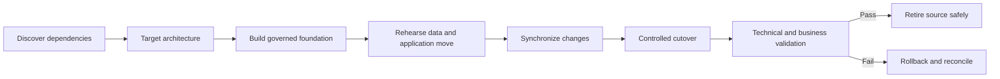

> **文档类型：** 操作指南
> **规范性术语：** **MUST**、**MUST NOT**、**SHOULD**、**SHOULD NOT** 和 **MAY** 是要求级别。
> **适用范围：** 跨云迁移发现、依赖关系映射、数据移动、演练、切换、验证、回滚和退役。
> **例外流程：** 偏离要求需要记录风险评估、补偿控制、指定风险负责人和到期日期。

|控制领域|价值|
|---|---|
|文件编号 | `HTG-30` |
|负责人|云卓越中心 |
|审核周期|至少每年一次，并且在重大迁移、工作负载或提供商变更之后 |
|证据|依赖清单、迁移计划、演练结果、数据校验和、切换决策、业务验证、回滚窗口和退役证据 |

# 如何在云提供商之间迁移工作负载

> **决策简述：** 通过演练的数据和回滚来迁移已验证的服务能力，并保持旧路径可用，直到业务验证完成。

> **文档类型：** 迁移实施指南  
> **操作原则：** 迁移经过验证的服务能力，而不仅仅是计算和数据，并保持回滚可行，直到业务验证完成。

## 目标

在 Azure、AWS、GCP 或 OCI 之间移动或重新构建工作负载平台，影响受到控制。迁移包括身份、网络、DNS、证书、数据、应用制品、可观测性、备份、操作、合规性、成本和退役。

## 选择迁移策略

为每个组件选择保留、退役、迁移、重新托管、重构平台、重构或替换。根据业务成果、数据引力、提供商耦合、许可、延迟、合规性、支持、工程能力和退出成本做出决策。多云要求并不意味着每个组件都必须在每个云中运行。

## 迁移流程

## 发现真正的依赖图

清单入站和出站流量、身份提供商、服务身份、DNS、证书、数据库、队列、对象存储、文件共享、批处理作业、集成、可观测性、备份、部署系统、许可、支持、数据驻留和峰值需求。监控运行时流量和日志；仅访谈和 CMDB 记录就缺少依赖性。

## 建立目标基础

在部署工作负载之前创建组织层次结构、账户、身份联合、网络中转、DNS、安全控制、策略、日志、备份、密钥管理、配额和成本分配。仅当所有权和状态明确时才使用批准的模块并导入现有资源。

## 计划数据移动

定义事实来源、初始副本、变更采集、排序、模式转换、加密、带宽、校验和、协调、冻结窗口、RPO 和回滚。测试全尺寸传输持续时间和节流。复制并不能证明语义正确性；验证记录计数、余额、引用完整性和应用行为。

## 演练

使用匿名或受保护的数据进行至少一次类似生产环境的演练。测量每个步骤、依赖性、手动决策和回滚时间。在目标云中运行性能、安全性、故障、备份、恢复和操作就绪性测试。根据观测到的结果更新操作手册。

## 切换

1. 确认变更批准、所有者、支持、沟通和回滚阈值。
2. 冻结不兼容的更改并验证源和目标的运行状况。
3. 完成最终同步和完整性检查。
4. 在可行的情况下通过加权路由迁移少量流量。
5. 监控旅程 SLI、错误、延迟、饱和度、安全信号和复制延迟。
6. 仅在通过监控门后增加流量。
7. 记录写入无法安全返回源的确切点。
8. 在宣布完成之前获取业务验证。

## 回滚与协调

回滚标准必须是数字和有时限的。定义 DNS/流量反转、数据写入所有权、排队事件处理、架构兼容性以及切换期间接受的写入协调。如果数据分歧导致回滚不安全，请执行前向恢复计划，而不是临时进行双向写入。

## 安全退役

在商定的稳定期过后，删除路由和信任、撤销源凭证、保留所需的日志和备份、导出最终证据、发布许可证和承诺、删除批准保留下的数据、更新目录和图表以及关闭提供商支持依赖项。继续成本监控，直到剩余支出达到预期基线。

## 验证

- [ ] 依赖项清单由运行时遥测和所有者确认。
- [ ] 目标满足安全性、弹性、性能、备份、合规性和成本要求。
- [ ] 全面的数据传输和协调满足 RPO 和切换持续时间。
- [ ] 回滚或前向恢复经过预演并具有明确的决策权。
- [ ] 业务旅程，不仅仅是基础设施的健康状况，在切换后都会过去。
- [ ] 源停用可保留证据并消除访问、数据和剩余成本。

## 相关主题

- [多云架构与治理](../cloud-foundations-governance/multi-cloud-architecture-and-governance.md)
- [云应用平台选择](../applications-kubernetes/app-cloud-application-platform-selection.md)
- [如何设计备份与容灾](how-to-design-backup-and-disaster-recovery.md)
- [如何选择应用流量和负载均衡服务](how-to-select-application-traffic-services.md)

## 相关仓库

- [andyxuan2010/azure-template](https://github.com/andyxuan2010/azure-template) — 为迁移 Landing Zone 提供可复用的 Azure 目标状态基础结构模式。
- [andyxuan2010/aws-template](https://github.com/andyxuan2010/aws-template) — 为跨提供商重新构建平台提供等效的 AWS 模块和交付模式。
- [andyxuan2010/oci-template](https://github.com/andyxuan2010/oci-template) — 提供用于构建备用目标基础的 OCI Terraform 模块。
- [andyxuan2010/azcopy-bulk](https://github.com/andyxuan2010/azcopy-bulk) — 演示与涉及 Azure Storage 的数据移动阶段相关的批量传输自动化。
