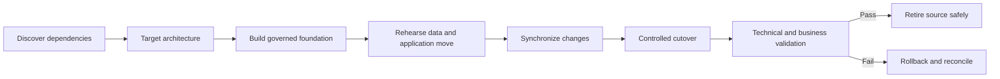

> **Document class:** How-to Guides implementation guide
> **Normative terms:** **MUST**, **MUST NOT**, **SHOULD**, **SHOULD NOT**, and **MAY** are requirements levels.
> **Applicability:** Cross-cloud migration discovery, dependency mapping, data movement, rehearsal, cutover, validation, rollback, and retirement.
> **Exception process:** Deviations require a documented risk assessment, compensating controls, named risk owner, and expiry date.

| Control field | Value |
|---|---|
| Document ID | `HTG-30` |
| Owner | Cloud Center of Excellence |
| Review cycle | At least annually and after material migration, workload, or provider changes |
| Evidence | Dependency inventory, migration plan, rehearsal results, data checksums, cutover decision, business validation, rollback window, and retirement evidence |

# How to Migrate a Workload Between Cloud Providers

> **Decision in brief:** Migrate a verified service capability with rehearsed data and rollback, and keep the old path available until business validation completes.

> **Document type:** Migration implementation guide  
> **Operating principle:** Migrate a verified service capability, not merely compute and data, and keep rollback viable until business validation is complete.

## Objective

Move or re-platform a workload between Azure, AWS, GCP, or OCI with controlled impact. The migration includes identity, network, DNS, certificates, data, application artifacts, observability, backup, operations, compliance, cost, and decommissioning.

## Select the migration strategy

Choose retain, retire, relocate, rehost, replatform, refactor, or replace for each component. Base the decision on business outcome, data gravity, provider coupling, licensing, latency, compliance, support, engineering capacity, and exit cost. A multi-cloud requirement does not imply that every component must run in every cloud.

## Migration flow

## Discover the real dependency graph

Inventory inbound and outbound traffic, identity providers, service identities, DNS, certificates, databases, queues, object stores, file shares, batch jobs, integrations, observability, backups, deployment systems, licensing, support, data residency, and peak demand. Observe runtime traffic and logs; interviews and CMDB records alone miss dependencies.

## Build the target foundation

Create organization hierarchy, accounts, identity federation, network transit, DNS, security controls, policy, logging, backup, key management, quotas, and cost allocation before deploying the workload. Use approved modules and import existing resources only when ownership and state are clear.

## Plan data movement

Define source of truth, initial copy, change capture, ordering, schema conversion, encryption, bandwidth, checksums, reconciliation, freeze window, RPO, and rollback. Test full-scale transfer duration and throttling. Replication is not proof of semantic correctness; validate record counts, balances, referential integrity, and application behavior.

## Rehearse

Perform at least one production-like rehearsal with anonymized or protected data. Measure every step, dependency, manual decision, and rollback time. Run performance, security, failure, backup, restore, and operational-readiness tests in the target cloud. Update the runbook from observed results.

## Cut over

1. Confirm change approval, owners, support, communication, and rollback thresholds.
2. Freeze incompatible changes and verify source and target health.
3. Complete final synchronization and integrity checks.
4. Shift a small traffic cohort through weighted routing where feasible.
5. Monitor journey SLIs, errors, latency, saturation, security signals, and replication lag.
6. Increase traffic only after the observation gate passes.
7. Record the exact point after which writes cannot safely return to the source.
8. Obtain business validation before declaring completion.

## Rollback and reconciliation

Rollback criteria must be numerical and time-bound. Define DNS/traffic reversal, data-write ownership, queued-event handling, schema compatibility, and reconciliation for writes accepted during cutover. If data divergence makes rollback unsafe, execute a forward-recovery plan instead of improvising bidirectional writes.

## Decommission safely

After the agreed stabilization period, remove routes and trust, revoke source credentials, preserve required logs and backups, export final evidence, release licenses and commitments, delete data under approved retention, update the catalog and diagrams, and close provider support dependencies. Continue cost monitoring until residual spend reaches the expected baseline.

## Validation

- [ ] The dependency inventory is confirmed by runtime telemetry and owners.
- [ ] The target meets security, resilience, performance, backup, compliance, and cost requirements.
- [ ] Full-scale data transfer and reconciliation meet RPO and cutover duration.
- [ ] Rollback or forward recovery is rehearsed and has clear decision authority.
- [ ] Business journeys, not only infrastructure health, pass after cutover.
- [ ] Source retirement preserves evidence and removes access, data, and residual cost.

## Related topics

- [Multi-Cloud Architecture and Governance](../cloud-foundations-governance/multi-cloud-architecture-and-governance.md)
- [Cloud Application Platform Selection](../applications-kubernetes/app-cloud-application-platform-selection.md)
- [How to Design Backup and Disaster Recovery](how-to-design-backup-and-disaster-recovery.md)
- [How to Select Application Traffic and Load-Balancing Services](how-to-select-application-traffic-services.md)

## Related repos

- [andyxuan2010/azure-template](https://github.com/andyxuan2010/azure-template) — provides reusable Azure target-state infrastructure patterns for a migration landing zone.
- [andyxuan2010/aws-template](https://github.com/andyxuan2010/aws-template) — supplies equivalent AWS modules and delivery patterns for cross-provider re-platforming.
- [andyxuan2010/oci-template](https://github.com/andyxuan2010/oci-template) — provides OCI Terraform modules for building an alternate target foundation.
- [andyxuan2010/azcopy-bulk](https://github.com/andyxuan2010/azcopy-bulk) — demonstrates bulk transfer automation relevant to data-movement phases involving Azure Storage.
