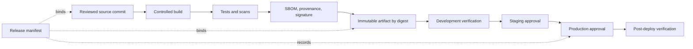

> **文档类型：** 操作指南
> **规范性术语：** **MUST**、**MUST NOT**、**SHOULD**、**SHOULD NOT** 和 **MAY** 是要求级别。
> **适用范围：** 构建来源、签名、验证、升级、环境批准、回滚和多云制品存储。
> **例外流程：** 偏离要求需要记录风险评估、补偿控制、指定风险负责人和到期日期。

|控制领域|价值|
|---|---|
|文件编号 | `HTG-14` |
|负责人|云卓越中心 |
|审核周期|至少每年一次以及在重大构建、签署或发布更改之后 |
|证据|源修订、构建证明、签名验证、不可变摘要、审批跟踪、部署结果和回滚日志记录 |

# 如何跨环境晋级不可变的制品

> **简要决定：** 构建一次，验证来源证明，并通过受保护的环境晋级相同的不可变制品，而无需重建。

> **文件类型：** 实施指南
> **主要示例：** Azure Container Registry 和 Azure Pipelines 或 GitHub Actions
> **云范围：** Azure、AWS、GCP 和 Oracle Cloud Infrastructure (OCI)
> **操作原则：** 构建一次，通过摘要识别，在每个边界进行验证，并晋级元数据而不是重建。

## 目标

创建一个发布流程，其中开发、测试、登台和生产使用完全相同的字节。配置仍然特定于环境，但应用包、容器镜像、Helm Chart、Terraform 计划捆绑包或静态站点制品在资格后不会更改。

## 为什么重建为何不安全

针对每个环境进行重建可以选择不同的依赖项、基础镜像、时间戳、构建标志或受损的上游内容。匹配的版本标签并不证明匹配的内容。使用加密摘要作为发布标识，并将标签仅视为人类可读的指针。

## 晋级模式

## 定义发布契约

每个发布清单必须包含：
```yaml
schema_version: 1
release_id: orders-api-2026.08.02.1
source_revision: 0123456789abcdef
artifact_uri: registry.example.com/orders/api
artifact_digest: sha256:replace-with-real-digest
sbom_uri: evidence/orders-api-2026.08.02.1/sbom.spdx.json
provenance_uri: evidence/orders-api-2026.08.02.1/provenance.json
build_workflow: build-orders-api
test_evidence: evidence/orders-api-2026.08.02.1/tests.json
configuration_schema: "3.2"
```
清单不得包含凭据或环境机密。对其进行签名或将其存储在不可变的证据系统中。

## 构建并验证一次

1. 检查临时工作线程上的不可变提交。
2. 从锁定文件和批准的镜像中恢复依赖关系。
3. 构建固定的工具链或构建器镜像。
4. 运行单元、集成、许可证、漏洞和策略检查。
5. 生成 SBOM 并构建绑定源、构建器、依赖项和输出摘要的来源。
6. 通过批准的工作负载身份对制品进行签名或创建无密钥签名。
7. 推送到不可变仓库并防止在回滚窗口期间删除摘要。
8. 创建放行清单并记录所有证据。

对于容器，部署 `repository@sha256:digest`，而不是 `latest` 等可变标签。对于包和档案，请在使用前验证已发布的 SHA-256 校验和。

## 将制品与配置分开

在部署时注入特定于环境的端点、规模设置、功能开关和机密引用。根据版本化架构验证它们。不要将生产凭证、主机名或租户标识符编译到制品中。

配置变更需要自己的审查、版本、审计日志记录和回滚。仅配置版本仍必须识别未更改的制品摘要。

## 实施晋级门

|门 |所需证据|决策所有者|
|---|---|---|
|构建发展 |成功构建、签名、SBOM、关键扫描已通过 |交付自动化|
|开发测试|部署验证和自动化功能测试|产品团队|
|测试到分期|集成、性能、迁移和恢复结果 |服务所有者 |
|暂存到生产 |风险评估、变更窗口、批准、回滚目标 |生产审批人 |
|生产完成 |健康、SLO、安全和发布记录验证 |服务所有者 |

批准授权摘要和目标环境。如果摘要发生变化，事先批准无效。

## 配置多云制品服务

|能力|Azure|AWS | GCP |OCI |
|---|---|---|---|---|
|容器仓库 | Azure Container Registry |Amazon ECR |Artifact Registry | OCI Container Registry |
|包仓库 |Azure Artifacts|CodeArtifact |Artifact Registry |制品注册服务或批准的仓库 |
|部署身份 |托管身份或联合 | IAM 与 OIDC 的角色 |工作负载身份联合|工作负载或资源主体 |
|策略执行| Azure Policy 和准入控制 | IAM、Config、准入控制 |Organization Policy、Binary Authorization | IAM、Cloud Guard、准入控制 |

首选注册表复制或提供商支持的保留摘要的导入。跨云或 Security Zones 复制时，验证源和目标摘要并保留签名的传输日志记录。

## 通过摘要部署

部署阶段必须：

1. 阅读批准的发布清单。
2. 验证其签名和架构。
3. 解决制品并将其摘要与批准的值进行比较。
4. 验证签名、来源证明、SBOM 存在和策略结果。
5. 确认环境配置兼容性。
6. 使用环境范围的身份进行部署。
7. 记录目标、开始和结束时间、审批者、部署摘要、配置版本和结果。
8. 运行健康和业务交易验证。

防止部署身份覆盖仓库内容或更改证据。

## 安全回滚

通过摘要保留最后一个已知的良好制品和兼容配置。回滚意味着重新部署该日志记录对；这并不意味着重建旧的源标签。数据库更改需要扩展和收缩迁移、经过测试的恢复过程或明确的前向修复计划。

当部署后运行状况恶化时停止自动升级。保留失败的发布以供调查，而不是删除其证据。

## 验证

- [ ] 开发、暂存和生产报告相同的制品摘要。
- [ ] 更改标签不会更改摘要固定部署。
- [ ] 准入或部署门拒绝未签名和未经批准的制品。
- [ ] 来源标识预期的提交、工作流程、构建器和依赖项。
- [ ] 环境配置经过架构验证并且不包含嵌入的机密值。
- [ ] 跨区域或跨云副本具有相同的源和目标摘要。
- [ ] 回滚会重新部署已知良好的摘要而不重建它。
- [ ] 发布记录链接提交、制品、证据、批准、配置和目标。

## 完成标准

当在整个发布路径中使用一个经过验证的制品、每个环境都按摘要部署、强制执行签名和来源证明、独立管理配置、批准将准确的内容绑定到准确的目标以及回滚使用保留的已知良好制品时，升级就完成了。

## 相关主题

- [环境晋级、审批、发布控制](../ci-cd-automation/environment-promotion-approval-and-release-controls.md)
- [实用的 CI/CD 蓝图](../ci-cd-automation/practical-ci-cd-blueprint.md)
- [CI/CD 流水线与发布控制标准](../standards-best-practices/ci-cd-pipeline-and-release-control-standard.md)
- [如何在发布前验证基础设施](how-to-validate-infrastructure-before-release.md)
