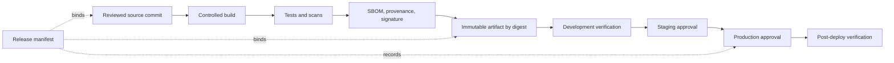

> **Document class:** How-to Guides implementation guide
> **Normative terms:** **MUST**, **MUST NOT**, **SHOULD**, **SHOULD NOT**, and **MAY** are requirements levels.
> **Applicability:** Build provenance, signing, verification, promotion, environment approvals, rollback, and multi-cloud artifact storage.
> **Exception process:** Deviations require a documented risk assessment, compensating controls, named risk owner, and expiry date.

| Control field | Value |
|---|---|
| Document ID | `HTG-14` |
| Owner | Cloud Center of Excellence |
| Review cycle | At least annually and after material build, signing, or release changes |
| Evidence | Source revision, build attestations, signature verification, immutable digest, approval trail, deployment result, and rollback record |

# How to Promote Immutable Artifacts Across Environments

> **Decision in brief:** Build once, verify provenance, and promote the same immutable artifact through protected environments without rebuilding.

> **Document type:** Implementation guide
> **Primary examples:** Azure Container Registry and Azure Pipelines or GitHub Actions
> **Cloud scope:** Azure, AWS, GCP, and Oracle Cloud Infrastructure (OCI)
> **Operating principle:** Build once, identify by digest, verify at every boundary, and promote metadata rather than rebuilding.

## Objective

Create a release flow in which development, test, staging, and production consume the exact same bytes. Configuration remains environment-specific, but the application package, container image, Helm chart, Terraform plan bundle, or static-site artifact does not change after qualification.

## Why rebuilds are unsafe

Rebuilding for each environment can select different dependencies, base images, timestamps, build flags, or compromised upstream content. A matching version label does not prove matching content. Use a cryptographic digest as the release identity and treat tags as human-readable pointers only.

## Promotion model



## Define the release contract

Each release manifest must contain:

```yaml
schema_version: 1
release_id: orders-api-2026.08.02.1
source_revision: 0123456789abcdef
artifact_uri: registry.example.com/orders/api
artifact_digest: sha256:replace-with-real-digest
sbom_uri: evidence/orders-api-2026.08.02.1/sbom.spdx.json
provenance_uri: evidence/orders-api-2026.08.02.1/provenance.json
build_workflow: build-orders-api
test_evidence: evidence/orders-api-2026.08.02.1/tests.json
configuration_schema: "3.2"
```

The manifest must not contain credentials or environment secrets. Sign it or store it in an immutable evidence system.

## Build and attest once

1. Check out an immutable commit on an ephemeral worker.
2. Restore dependencies from lock files and approved mirrors.
3. Build in a pinned toolchain or builder image.
4. Run unit, integration, license, vulnerability, and policy checks.
5. Generate an SBOM and build provenance that binds source, builder, dependencies, and output digest.
6. Sign the artifact or create a keyless signature through approved workload identity.
7. Push to an immutable repository and prevent digest deletion during the rollback window.
8. Create the release manifest and record all evidence.

For containers, deploy `repository@sha256:digest`, not a mutable tag such as `latest`. For packages and archives, verify a published SHA-256 checksum before use.

## Separate artifact from configuration

Inject environment-specific endpoints, scale settings, feature flags, and secret references at deployment time. Validate them against a versioned schema. Do not compile production credentials, hostnames, or tenant identifiers into the artifact.

Configuration changes need their own review, version, audit record, and rollback. A configuration-only release must still identify the unchanged artifact digest.

## Implement promotion gates

| Gate | Required evidence | Decision owner |
|---|---|---|
| Build to development | Successful build, signature, SBOM, critical scans passed | Delivery automation |
| Development to test | Deployment verification and automated functional tests | Product team |
| Test to staging | Integration, performance, migration, and recovery results | Service owner |
| Staging to production | Risk assessment, change window, approvals, rollback target | Production approver |
| Production completion | Health, SLO, security, and release-record verification | Service owner |

Approvals authorize a digest and target environment. If the digest changes, prior approval is invalid.

## Configure multi-cloud artifact services

| Capability | Azure | AWS | GCP | OCI |
|---|---|---|---|---|
| Container repository | Azure Container Registry | Amazon ECR | Artifact Registry | OCI Registry |
| Package repository | Azure Artifacts | CodeArtifact | Artifact Registry | Artifact Registry service or approved repository |
| Deployment identity | Managed identity or federation | IAM role with OIDC | Workload Identity Federation | Workload or resource principal |
| Policy enforcement | Azure Policy and admission controls | IAM, Config, admission controls | Organization Policy, Binary Authorization | IAM, Cloud Guard, admission controls |

Prefer registry replication or provider-supported import that preserves the digest. When copying across clouds or security zones, verify the source and destination digest and retain a signed transfer record.

## Deploy by digest

The deploy stage must:

1. Read the approved release manifest.
2. Verify its signature and schema.
3. Resolve the artifact and compare its digest with the approved value.
4. Verify signature, provenance, SBOM presence, and policy results.
5. Confirm environment configuration compatibility.
6. Deploy using an environment-scoped identity.
7. Record target, start and end time, approver, deployed digest, configuration version, and outcome.
8. Run health and business-transaction verification.

Prevent the deployment identity from overwriting repository content or changing evidence.

## Roll back safely

Keep the last known-good artifact and compatible configuration available by digest. Rollback means redeploying that recorded pair; it does not mean rebuilding an old source tag. Database changes require expand-and-contract migrations, tested restore procedures, or an explicit forward-fix plan.

Stop automated promotion when post-deployment health degrades. Preserve the failed release for investigation instead of deleting its evidence.

## Validation

- [ ] Development, staging, and production report the same artifact digest.
- [ ] Changing a tag does not change a digest-pinned deployment.
- [ ] The admission or deployment gate rejects unsigned and unapproved artifacts.
- [ ] Provenance identifies the expected commit, workflow, builder, and dependencies.
- [ ] Environment configuration is schema-validated and contains no embedded secret values.
- [ ] Cross-region or cross-cloud copies have identical source and destination digests.
- [ ] A rollback redeploys a known-good digest without rebuilding it.
- [ ] The release record links commit, artifact, evidence, approval, configuration, and target.

## Completion criteria

Promotion is complete when one verified artifact is used throughout the release path, every environment deploys by digest, signatures and provenance are enforced, configuration is independently governed, approvals bind exact content to exact targets, and rollback uses retained known-good artifacts.

## Related topics

- [Environment Promotion, Approval, and Release Controls](../ci-cd-automation/environment-promotion-approval-and-release-controls.md)
- [A Practical CI/CD Blueprint](../ci-cd-automation/practical-ci-cd-blueprint.md)
- [CI/CD Pipeline and Release-Control Standard](../standards-best-practices/ci-cd-pipeline-and-release-control-standard.md)
- [How to Validate Infrastructure Before Release](how-to-validate-infrastructure-before-release.md)
