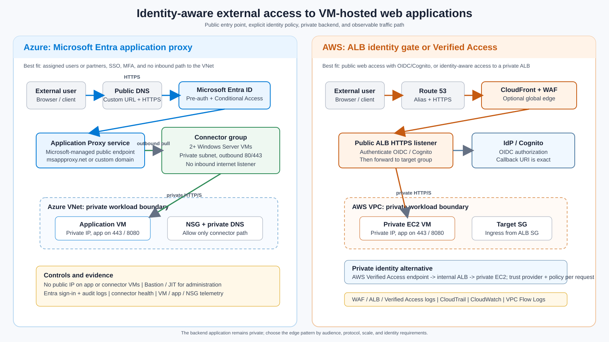

> **Document class:** How-to Guides implementation guide
> **Normative terms:** **MUST**, **MUST NOT**, **SHOULD**, **SHOULD NOT**, and **MAY** are requirements levels.
> **Applicability:** Private Azure VM application publication through Microsoft Entra application proxy or AWS equivalents, with identity, network, and observability controls.
> **Exception process:** Deviations require a documented risk assessment, compensating controls, named risk owner, and expiry date.

| Control field | Value |
|---|---|
| Document ID | `HTG-33` |
| Owner | Cloud Center of Excellence |
| Review cycle | At least annually and after material proxy, identity, or workload changes |
| Evidence | Proxy and connector configuration, identity policy, private reachability, TLS and health tests, sign-in logs, backend logs, and rollback evidence |

# How to Publish an Azure VM Application through an Identity-Aware Proxy

> **Decision in brief:** Authenticate before forwarding to a private backend, keep the workload network closed to the internet, and correlate identity, proxy, and application evidence.

> **Document type:** Implementation guide
> **Primary example:** Microsoft Entra application proxy with a private Azure VM
> **Cloud scope:** Azure and AWS
> **Operating principle:** Publish the application service, not the workload network; authenticate before forwarding, keep the backend private, and make the path observable.

## Objective

Expose an HTTP or HTTPS application running on an Azure virtual machine to approved external users without assigning the application VM a public IP or opening inbound internet ports to the workload VNet. The primary implementation uses Microsoft Entra application proxy and a private network connector on Windows Server VMs in Azure.

This guide also maps the design to AWS. It covers browser-based web applications and small-to-medium partner or workforce audiences. It does not make a VM-hosted application suitable for anonymous internet scale, arbitrary TCP/UDP, or administrative access; use the alternatives below when those are the actual requirements.

## Architecture outcome

The user reaches a public application URL and authenticates with the identity provider. The cloud proxy or edge service then forwards only an authorized request to a private application endpoint. The application VM and connector or target VM have no public inbound path. The following graphic shows the primary Azure pattern and two AWS equivalents.



### Trust boundaries

1. **Public client boundary:** The browser or API client is untrusted. It reaches only the proxy or edge hostname over HTTPS.
2. **Identity boundary:** Microsoft Entra ID, an OIDC provider, or Amazon Cognito authenticates the user and evaluates policy. Authentication is not application authorization; the application still enforces its own roles and data permissions.
3. **Proxy boundary:** The proxy terminates the external session and creates a separate connection to the backend. The Azure connector uses outbound connections to the Application Proxy service; it does not accept inbound internet connections.
4. **Workload boundary:** The VM is addressed by private DNS or private IP. Network controls permit only the approved proxy, load balancer, or connector path to the application port.
5. **Evidence boundary:** Identity, proxy, network, VM, application, and configuration-change logs are correlated and retained according to the workload requirement.

## Choose the solution

Use the narrowest service that satisfies the audience, protocol, availability, and security requirements.

| Option | Choose when | Main controls | Important limits |
|---|---|---|---|
| Microsoft Entra application proxy | Named workforce or partner users need browser access, SSO, MFA, Conditional Access, and no inbound path to the VNet | Entra pre-authentication, user/group assignment, connector group, private backend, audit and sign-in logs | Web protocols only; connector runs on Windows Server; licensing and application compatibility apply; not an anonymous public edge |
| Azure Application Gateway with WAF | The application is internet-facing, needs regional Layer 7 routing, WAF, TLS termination, health probes, or session affinity | Public listener, WAF policy, private backend, NSG, backend health, diagnostic logs | The gateway is the public entry point and must be operated and protected as an edge service; identity must be implemented at the gateway or application |
| Azure Front Door Standard/Premium plus private origin | Users are global, the application needs global edge routing, WAF, acceleration, or multi-region failover | Front Door WAF, origin protection, custom domain, private origin where supported, health probes | Adds a global edge and cost; it is not a replacement for application authorization |
| Reverse proxy on an Azure VM | A legacy application requires a particular rewrite, header, or protocol behavior not provided by managed services | NGINX, HAProxy, or IIS patching, TLS, WAF or upstream protection, VM hardening, health and failover | Highest operations burden and a new internet-facing server; avoid for a default platform pattern |
| VPN or Microsoft Entra Private Access | Access should be private to a workforce or managed device rather than publicly reachable | Device and identity policy, private routing, per-app segmentation, no public application URL | Adds client or private-access dependencies and is not the normal choice for external customers |

For AWS, use an HTTPS Application Load Balancer with an `authenticate-oidc` or `authenticate-cognito` listener action for a public browser application. Use CloudFront and AWS WAF when global delivery or edge protection is required. Use AWS Verified Access with an internal Application Load Balancer when the application should remain private while still being reachable by approved external users without a VPN. AWS Systems Manager Session Manager is an administrative path, not a public application proxy.

## High-level Azure design

Microsoft Entra application proxy is a cloud service in front of a private network connector. The connector is a lightweight Windows agent that makes outbound connections to the service and then connects to the internal application. Microsoft describes this as an outbound-only pattern: the connector does not require inbound firewall ports, and the application can be exposed through an external URL after Entra authentication.

### Recommended production topology

- Put the application VM in a workload subnet with no public IP.
- Put at least two connector VMs in a separate connector subnet, using separate fault domains or availability zones where the region supports them.
- Give connector VMs controlled outbound access through Azure NAT Gateway or Azure Firewall. Permit the documented Microsoft Entra connector destinations on TCP 80 and 443.
- Permit the application port from the connector subnet only. Prefer HTTPS from connector to application for sensitive data.
- Use Azure Bastion, a private management path, or a controlled jump host for administration. Do not allow internet RDP or SSH to either VM.
- Use private DNS for the internal application name. If the application uses host-based routing or absolute URLs, make its internal and external hostname behavior explicit.
- Assign the application to a connector group dedicated to the region, network boundary, or environment. Do not share one unrestricted connector group across production and non-production.
- Send VM, NSG, application, connector health, Entra sign-in, Entra audit, and configuration-change telemetry to approved monitoring and evidence systems.

The Azure connector group is a logical high-availability unit. Microsoft recommends at least two connectors in a group and explains that traffic is distributed across connectors without guaranteed session affinity. If the backend needs sticky sessions, use a cookie-aware Layer 7 backend or redesign the application to store session state outside a single VM.

### Application compatibility

Application Proxy is a good fit for HTTP/HTTPS web applications and some APIs. Confirm the following before committing to it:

- the application can be reached from the connector VM by the configured internal URL;
- redirects, absolute URLs, cookies, WebSockets, large uploads, long-lived connections, and health endpoints behave through the proxy;
- the application trusts forwarded headers only from the connector or an approved internal proxy;
- the application has an independent authorization model after Entra authentication;
- integrated Windows authentication is handled deliberately. Domain join and Kerberos constrained delegation may be required for IWA SSO;
- the application does not depend on arbitrary TCP/UDP, source-IP affinity, or direct inbound callbacks that the proxy does not support.

## Prerequisites

Before changing production, obtain:

- an Azure subscription, a Microsoft Entra tenant, and an Application Administrator or delegated equivalent;
- Microsoft Entra ID licensing that supports Application Proxy, typically P1 or P2 for the target tenant;
- an approved public DNS zone and a certificate in PFX format if a custom Application Proxy domain is required;
- an application VM that is patched, backed up as appropriate, and reachable privately on a documented HTTP/HTTPS port;
- a Windows Server 2016 or later connector VM image with the current supported .NET and connector prerequisites. Use a current supported Windows Server image for new deployments;
- two connector VMs for production, a connector group assignment, and a documented outbound egress path;
- network and security approval for the application port, DNS record, identity policy, logging, and external exposure;
- a test user group and a rollback owner. Never test first with the only production administrator account.

## Implement the Azure environment

The following commands are illustrative topology scaffolding. Replace placeholder values, use the organization’s approved naming and tagging modules, and deploy persistent resources through reviewed Bicep or Terraform. The commands do not create public IPs for the application or connector VMs.

### Create private subnets and security boundaries

Create separate subnets for the workload and connector tier. Reserve an Azure Bastion subnet or an approved private administration path separately. Use a NAT Gateway or Azure Firewall for connector egress; a subnet with no egress cannot register or operate the connector.

```powershell
az group create --name <resource-group> --location <region>

az network vnet create `
  --resource-group <resource-group> `
  --name <vnet-name> `
  --address-prefixes 10.40.0.0/16 `
  --subnet-name snet-app `
  --subnet-prefixes 10.40.1.0/24

az network vnet subnet create `
  --resource-group <resource-group> `
  --vnet-name <vnet-name> `
  --name snet-connector `
  --address-prefixes 10.40.2.0/24

az network nsg create --resource-group <resource-group> --name nsg-app
az network nsg create --resource-group <resource-group> --name nsg-connector

az network vnet subnet update `
  --resource-group <resource-group> `
  --vnet-name <vnet-name> `
  --name snet-app `
  --network-security-group nsg-app

az network vnet subnet update `
  --resource-group <resource-group> `
  --vnet-name <vnet-name> `
  --name snet-connector `
  --network-security-group nsg-connector
```

Define the final rules in policy-as-code. The intended minimum is:

| Resource | Inbound | Outbound |
|---|---|---|
| Application VM NSG | Application port only from the connector subnet or an approved internal gateway; management only from Bastion or the administration subnet | Required application dependencies, monitoring, update, and DNS destinations |
| Connector VM NSG | Management only from Bastion or the administration subnet; no internet-sourced application ports | TCP 443 to Microsoft Entra Application Proxy destinations and TCP 80 for certificate-revocation downloads; DNS and required update destinations |
| NAT Gateway or Azure Firewall | Not an inbound listener for the application | Documented connector egress, logging, and threat controls |

Do not use a broad `0.0.0.0/0` source on the application VM rule. Azure Application Proxy traffic reaches the connector through the connector’s outbound session, so an inbound rule from the public internet is neither required nor desirable.

### Deploy the application VM privately

Create or move the application VM into `snet-app` without a public IP. Bind the application to the documented private listener and expose a health endpoint that returns a meaningful status without leaking secrets.

```powershell
az vm create `
  --resource-group <resource-group> `
  --name <app-vm-name> `
  --image <approved-image> `
  --size <approved-size> `
  --vnet-name <vnet-name> `
  --subnet snet-app `
  --public-ip-address "" `
  --admin-username <break-glass-or-bootstrap-user> `
  --ssh-key-values <approved-public-key-or-secret-reference>
```

For a Windows application VM, use the organization’s approved Windows image and management path instead of the SSH example. The important properties are private placement, no public IP, patching, endpoint protection, backup policy, and an application listener that is reachable from the connector subnet.

From each connector VM, verify the internal name, port, certificate chain, and health endpoint before publishing:

```powershell
Resolve-DnsName app.internal.example.com
Test-NetConnection app.internal.example.com -Port 443
Invoke-WebRequest https://app.internal.example.com/health -UseBasicParsing
```

If the application is HTTP-only internally, use `http://app.internal.example.com:8080` as the internal URL only after approving the connector-to-VM risk. The external URL should still require HTTPS.

### Deploy and register connector VMs

Create two Windows Server connector VMs in `snet-connector`. Use separate zones or fault domains where supported, and do not place both connectors behind one untested egress dependency. The connector machines can be domain joined when integrated Windows authentication is required; otherwise, use the least privileged supported configuration.

```powershell
az vm create `
  --resource-group <resource-group> `
  --name <connector-vm-01> `
  --image Win2022Datacenter `
  --size Standard_D2s_v5 `
  --vnet-name <vnet-name> `
  --subnet snet-connector `
  --public-ip-address "" `
  --zone 1 `
  --admin-username <bootstrap-user> `
  --admin-password <approved-bootstrap-password>

az vm create `
  --resource-group <resource-group> `
  --name <connector-vm-02> `
  --image Win2022Datacenter `
  --size Standard_D2s_v5 `
  --vnet-name <vnet-name> `
  --subnet snet-connector `
  --public-ip-address "" `
  --zone 2 `
  --admin-username <bootstrap-user> `
  --admin-password <approved-bootstrap-password>
```

The exact image, SKU, zone, and bootstrap mechanism are environment decisions. Do not copy placeholder credentials into a command history or pipeline log. Prefer Azure Bastion, Just-In-Time access, a private runner, or a one-time administrative workflow.

On each VM:

1. Apply the approved Windows baseline, updates, endpoint protection, time synchronization, and monitoring.
2. Verify DNS resolution and outbound TCP 80/443 through the approved NAT Gateway or Azure Firewall.
3. Download the current Microsoft Entra private network connector from the Microsoft Entra admin center. Install it on the VM and register it to the same tenant that owns the Application Proxy application.
4. Confirm that both connectors are **Active** in the connector group. Keep automatic connector updates enabled.
5. If an outbound proxy is required, configure it using the supported connector procedure. Do not terminate or inline-inspect the connector’s outbound TLS session unless Microsoft explicitly supports the design.
6. Disable HTTP/2 on connector servers running Windows Server 2019 or later when required for Application Proxy publishing, and verify the current connector documentation before rollout.

The connector uses outbound connections to Microsoft services and the application. It does not turn the connector VM into a public reverse-proxy listener. Treat the connector VM as a privileged infrastructure agent: patch it, monitor it, restrict administration, and isolate connector groups by trust boundary.

### Publish the application in Microsoft Entra ID

In the Microsoft Entra admin center:

1. Go to **Entra ID > Enterprise applications > New application > Add an on-premises application**.
2. Set a clear application name and use the connector group created for this workload.
3. Set **Internal URL** to the URL already tested from the connector, such as `https://app.internal.example.com`.
4. Set **Pre-Authentication** to **Microsoft Entra ID**. Do not choose pass-through when the design requires Entra pre-authentication and Conditional Access before the request reaches the private network.
5. Use the generated `msappproxy.net` URL for a first test. Configure a custom domain only after the application works with the default endpoint.
6. Assign a test user group under **Users and groups**. Keep the application hidden from the My Apps portal when it is an API or a deliberately unlisted service.
7. Configure the appropriate SSO mode. Use integrated Windows authentication and KCD only when the application requires it and the domain trust, SPNs, delegation, and connector identity are approved.
8. For new Application Proxy enterprise applications created after June 30, 2026, explicitly grant the required `User.Read` delegated permission and admin consent when the portal requests it.
9. Test the external URL from an unmanaged network and from the intended managed device policy. Confirm that an unassigned user, a policy-failing device, and a failed MFA challenge are denied.

Application Proxy handles the front-door authentication decision, but the application must still authorize operations, tenants, roles, and data. Do not treat membership in the Entra application assignment as a substitute for application authorization.

### Configure a custom domain and certificate

Use a custom domain when the application has absolute links, SAML or strict redirect URI requirements, branding requirements, or a need to keep one stable external name.

1. Verify the custom domain in Microsoft Entra ID.
2. In the Application Proxy application, upload the approved PFX certificate and select the custom external URL.
3. Add the CNAME record shown by the Application Proxy portal at the public DNS provider. Point the external name to the Application Proxy `msappproxy.net` name, not to the private VM IP.
4. If internal and external users should use the same hostname, implement split DNS deliberately. Internal resolution must return the approved private path; external resolution must return the Application Proxy endpoint.
5. Confirm certificate expiry alerting and document who owns renewal. Remove DNS records when the Application Proxy application or tenant is retired to prevent dangling aliases.

### Add observability and operational controls

Correlate the external request ID, Entra sign-in, connector activity, private VM web log, and application transaction ID where the products expose the fields. Monitor:

- Entra sign-in failures, Conditional Access results, unusual locations, impossible travel, risky users, and assignment changes;
- connector active/inactive state, service restarts, update status, CPU, memory, ephemeral-port pressure, and outbound connectivity;
- application response codes, latency, health endpoint status, redirects, authentication failures, and session behavior;
- NSG flow logs or equivalent network telemetry, DNS resolution, NAT or firewall egress, and unexpected public IP association;
- certificate expiry, DNS changes, VM patch state, backup state, and configuration drift.

Keep a runbook for connector loss. A single connector failure should not interrupt the service. A connector-group or region failure requires a documented recovery path, such as a second connector group, a second regional application, or a planned migration to an edge service.

## Implement the AWS equivalent

AWS does not have a one-product copy of Microsoft Entra application proxy. Select the equivalent by the desired boundary:

| Requirement | AWS implementation | Flow |
|---|---|---|
| Public browser application with identity pre-authentication | Public Application Load Balancer with HTTPS listener authentication using OIDC or Amazon Cognito | Route 53 or CloudFront -> ALB authenticate action -> private EC2 target group |
| Global public delivery and edge protection | CloudFront with AWS WAF and an ALB or VPC origin | Route 53 -> CloudFront/WAF -> ALB or private VPC origin -> EC2 |
| Private application for approved external users without VPN | AWS Verified Access with a trust provider and an internal ALB endpoint | Public Verified Access endpoint -> policy evaluation -> internal ALB -> private EC2 |
| Administrative VM access | AWS Systems Manager Session Manager | Operator identity -> SSM -> EC2; no public application endpoint |

### Public ALB implementation

1. Create a VPC with subnets in at least two Availability Zones. Place the ALB in subnets appropriate for an internet-facing load balancer and place EC2 instances in private application subnets.
2. Create separate security groups. Allow TCP 443 from the intended client population to the ALB security group. Allow the EC2 security group to receive only the target and health-check ports from the ALB security group. Do not allow `0.0.0.0/0` to the EC2 application port.
3. Launch the EC2 instances without public IPv4 addresses. Use Systems Manager for administration, and provide NAT or VPC endpoints for required operating-system and management egress.
4. Create an HTTP or HTTPS target group with a dedicated health path. Register instances across Availability Zones and verify target health before adding the listener rule.
5. Request or import the public certificate into AWS Certificate Manager. Create an HTTPS listener on port 443 and redirect HTTP to HTTPS if port 80 is enabled.
6. Add an `authenticate-oidc` action for the corporate IdP or `authenticate-cognito` for Amazon Cognito, followed by a forward action to the target group. Register the exact ALB or custom-domain callback URI with the IdP. The ALB authentication action is supported on HTTPS listeners.
7. Create a Route 53 alias to the ALB, or place CloudFront in front of the ALB. If CloudFront fronts an authenticated ALB, forward the authentication cookies, query strings, and required headers; do not cache an authenticated response past the session policy.
8. Associate AWS WAF with CloudFront or the ALB as appropriate. Start with managed rules in a measured mode, tune narrow exclusions, then enforce. Enable ALB access logs, WAF logs, CloudTrail, CloudWatch metrics, VPC Flow Logs, and EC2/application logs.

AWS security groups support referencing the ALB security group as the source of the EC2 ingress rule. That identity-based network relationship is preferable to trusting the ALB subnet CIDR alone, but it does not replace application authorization or host hardening.

### Verified Access implementation

Use Verified Access when the requirement is closer to private identity-aware access than to a normal anonymous public website:

1. Create an internal ALB in the same VPC as the private EC2 targets. Keep the EC2 security group restricted to the ALB security group.
2. Create a Verified Access trust provider for the workforce or customer identity and define a Verified Access group policy that expresses user, device, and context requirements.
3. Create a load-balancer Verified Access endpoint. AWS requires an internal ALB or NLB, a public application domain, and a public certificate whose name matches that domain.
4. Route the public DNS name to the Verified Access endpoint and test the allow and deny paths with the intended client posture.
5. Enable Verified Access logs and correlate policy decisions with the ALB, EC2, application, and identity-provider evidence.

Verified Access evaluates each application request against trust data and policy and denies access until a policy permits it. It is not a generic replacement for an ALB, WAF, or application authorization. Validate protocol, WebSocket, client-IP, session, and regional-availability requirements before selecting it.

## Security design requirements

- Do not assign a public IP to an application VM, connector VM, or EC2 target when the selected proxy or load balancer can use private addressing.
- Do not expose RDP, SSH, WinRM, database ports, or cloud-management ports through the public application listener.
- Terminate and re-establish TLS intentionally. Validate the backend certificate and hostname when the proxy supports it; document any exception.
- Restrict the backend to the proxy or load-balancer path and test direct-IP, alternate-hostname, and bypass attempts.
- Use managed identities, instance profiles, or short-lived federation for cloud APIs. Do not place long-lived cloud keys in the VM or application configuration.
- Treat `X-Forwarded-For`, OIDC claims, and proxy-added headers as untrusted until their source, signature, and trust boundary are verified.
- Use a WAF for public applications that need common web exploit protection. Identity pre-authentication alone is not a WAF.
- Apply rate limits and abuse controls at the layer that understands the client identity and route. Protect the application from expensive or unbounded requests.
- Use a separate connector group, ALB, policy, and log scope for production. Record exceptions with owner, expiry, and compensating controls.

## Validation

- [ ] The external hostname resolves to the approved proxy or edge service, never to a VM public IP.
- [ ] HTTPS certificate, redirect URI, host header, cookie, and redirect behavior are correct.
- [ ] An assigned compliant user can reach the application and an unassigned or policy-failing user cannot.
- [ ] Application authorization still denies an authenticated user without the required application role or tenant permission.
- [ ] The application VM and connector or EC2 target have no public management or application ingress.
- [ ] Backend security rules permit traffic only from the connector, ALB, or approved internal gateway.
- [ ] Connector-group, zone, target, and health-probe failure behavior is tested and documented.
- [ ] Direct-IP, alternate-hostname, forged-forwarded-header, and bypass-path tests fail safely.
- [ ] Identity, proxy, network, VM, and application logs correlate a representative request without recording secrets or tokens.
- [ ] Certificate renewal, DNS rollback, connector replacement, VM restore, and edge-policy rollback are tested.
- [ ] Cost, latency, throughput, upload size, long-lived connection, and peak-concurrency behavior match the workload objective.

## Troubleshooting or rollback

| Symptom | Likely boundary | Checks and action |
|---|---|---|
| Application Proxy URL is unreachable | DNS, Entra app, or connector group | Check the external DNS record, app status, user assignment, connector status, and Entra sign-in result. Do not open an inbound VM port as the first fix. |
| Connector is inactive | Egress, service, certificate, or patch state | Check Windows services, connector event logs, DNS, outbound TCP 80/443, required Microsoft destinations, time, and certificate renewal. Repair or replace one connector at a time. |
| Connector is active but backend fails | Private DNS, route, NSG, port, or application listener | Run `Resolve-DnsName`, `Test-NetConnection`, and an authenticated health request from each connector. Compare the configured Internal URL with the working private URL. |
| Login loops or redirects to an internal name | URL translation, custom domain, cookie, or app configuration | Use one stable hostname where possible, configure custom DNS and certificate, review redirect URIs, and fix application absolute URLs. |
| AWS ALB authentication loops | HTTPS listener, callback URI, cookie, or CloudFront forwarding | Confirm exact lowercase callback URLs, HTTPS end to end, query strings and cookies forwarded through CloudFront, and a unique cookie name per application. |
| Backend is reachable directly | Public IP, permissive security rule, route, or alternate hostname | Remove the public address, tighten NSG/security-group rules, remove bypass DNS, and re-run direct-IP and direct-host tests. |

For rollback, first disable or remove the external route or application assignment while keeping the private application healthy. Then restore the prior DNS or edge configuration, verify that direct public access is not exposed, and preserve identity, proxy, network, and application logs. Remove connector or edge resources only after the DNS TTL, active sessions, and recovery evidence are understood.

## Related topics

- [How to Configure Cloud Firewalls, Egress Controls, and Route Inspection](how-to-configure-firewalls-egress-and-route-inspection.md)
- [How to Select Application Traffic and Load-Balancing Services](how-to-select-application-traffic-services.md)
- [How to Implement Zero-Trust Administration for Private Cloud Resources](how-to-implement-zero-trust-private-administration.md)
- [Firewalls, Routing, and Network Security Controls](../networking-identity-security/nis-firewalls-routing-and-network-security-controls.md)
- [Zero-Trust and Private-Access Design](../networking-identity-security/nis-zero-trust-and-private-access-design.md)

## Official references

- [Microsoft Entra application proxy overview](https://learn.microsoft.com/en-us/entra/identity/app-proxy/overview-what-is-app-proxy)
- [Microsoft Entra private network connectors](https://learn.microsoft.com/en-us/entra/global-secure-access/concept-connectors)
- [Configure connectors for Microsoft Entra Private Access and Application Proxy](https://learn.microsoft.com/en-us/entra/global-secure-access/how-to-configure-connectors)
- [Application Proxy high availability and load balancing](https://learn.microsoft.com/en-us/entra/identity/app-proxy/application-proxy-high-availability-load-balancing)
- [Configure custom domains in Microsoft Entra application proxy](https://learn.microsoft.com/en-us/entra/identity/app-proxy/how-to-configure-custom-domain)
- [Add an on-premises application for remote access through Application Proxy](https://learn.microsoft.com/en-us/entra/identity/app-proxy/application-proxy-add-on-premises-application)
- [Azure Application Gateway overview](https://learn.microsoft.com/en-us/azure/application-gateway/overview)
- [Azure Front Door overview](https://learn.microsoft.com/en-us/azure/frontdoor/front-door-overview)
- [Authenticate users using an AWS Application Load Balancer](https://docs.aws.amazon.com/elasticloadbalancing/latest/application/listener-authenticate-users.html)
- [AWS Application Load Balancer security groups](https://docs.aws.amazon.com/elasticloadbalancing/latest/application/load-balancer-update-security-groups.html)
- [AWS Verified Access](https://docs.aws.amazon.com/verified-access/latest/ug/what-is-verified-access.html)
- [Create a load-balancer endpoint for AWS Verified Access](https://docs.aws.amazon.com/verified-access/latest/ug/create-load-balancer-endpoint.html)
- [Restrict access to an Application Load Balancer behind CloudFront](https://docs.aws.amazon.com/AmazonCloudFront/latest/DeveloperGuide/restrict-access-to-load-balancer.html)
