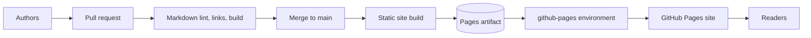
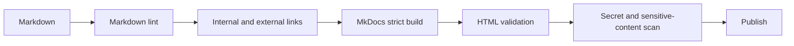

> **文档类型：** 操作指南
> **规范性术语：** **MUST**、**MUST NOT**、**SHOULD**、**SHOULD NOT** 和 **MAY** 是要求级别。
> **适用范围：** 版本化 Markdown 发布、静态站点生成、GitHub Actions 质量门、页面安全、域和回滚。
> **例外流程：** 偏离要求需要记录风险评估、补偿控制、指定风险负责人和到期日期。

|控制领域|价值|
|---|---|
|文件编号 | `HTG-12` |
|负责人|云卓越中心 |
|审核周期|至少每年一次以及在重大站点、工作流程或托管发生变化之后 |
|证据|提交、构建制品、验证器输出、链接和可访问性检查、部署日志、来源证明和回滚测试 |

# 如何使用 GitHub Pages 发布文档

> **简要决定：** 通过可重复的工作流程仅发布经过验证的源，使生成的站点可追溯到提交，并保留回滚路径。

> **文件类型：** 实施指南
> **主要示例：** Azure 和 Terraform
> **云范围：** Azure、AWS、GCP 和 Oracle Cloud Infrastructure (OCI)
> **操作原则：** 使用短期身份、不可变制品、最小权限、策略即代码和自动验证。


## 目标

将 Markdown 文档转换为可搜索、版本化的静态站点，并通过 GitHub Pages 发布。源代码保留在 Git 中； GitHub Actions 构建一个不可变的站点制品并将其部署到 Pages 环境。

GitHub Pages 是一项静态托管服务。请勿将机密、仅供内部使用的架构、凭据、私有端点、客户数据或机密运行手册发布到公共页面站点。

## 参考架构

## 选择静态站点生成器

常用选项：

|生成器|优势|权衡|
|---|---|---|
| MkDocs Material |强大的文档 UX 和 Markdown 支持 | Python 依赖和主题配置 |
| Docusaurus |版本管理、React 生态系统、大型站点 |Node 构建和更复杂的应用结构|
|杰基尔 |原生 GitHub Pages 历史和简单站点 |基于分支的构建中的插件限制|
|雨果 |快速构建和单个二进制文件 |主题和模板学习曲线|

本指南使用 MkDocs。 GitHub Pages 部署模式与其他生成器类似。

## 仓库结构
```text
documentation/
├── .github/
│   └── workflows/
│       └── pages.yml
├── docs/
│   ├── index.md
│   ├── how-to/
│   ├── reference/
│   ├── assets/
│   └── stylesheets/
├── overrides/
├── .markdownlint.json
├── mkdocs.yml
├── requirements.txt
└── README.md
```
## 创建站点

`requirements.txt`：
```text
mkdocs==1.6.1
mkdocs-material==9.6.14
```
这些版本只是示例。固定您的组织已测试的版本，并通过依赖项拉取请求更新它们。

`mkdocs.yml`：
```yaml
site_name: Cloud Engineering Guides
site_description: Standardized multi-cloud engineering documentation
site_url: https://contoso.github.io/cloud-guides/

repo_name: contoso/cloud-guides
repo_url: https://github.com/contoso/cloud-guides

theme:
  name: material
  features:
    - navigation.sections
    - navigation.top
    - search.highlight
    - content.code.copy

markdown_extensions:
  - admonition
  - attr_list
  - tables
  - toc:
      permalink: true

nav:
  - Home: index.md
  - How-to Guides:
      - Start an Infrastructure Repository: how-to/start-repository.md
      - Remote State: how-to/remote-state.md
```
## 本地构建
```bash
python -m venv .venv
source .venv/bin/activate
python -m pip install --upgrade pip
pip install -r requirements.txt
mkdocs serve
```
生产构建：
```bash
mkdocs build --strict
```
`--strict` 将警告变为失败。损坏的导航和参考应该会阻止发布。

## 添加质量门

Markdown 棉绒：
```bash
npx markdownlint-cli2 "docs/**/*.md"
```
链接检查：
```bash
lychee --no-progress "docs/**/*.md" "site/**/*.html"
```
可以使用经批准的词典添加拼写或术语检查。不要盲目自动更正产品名称、命令或代码。

品质流水线：

## 配置 GitHub 页面

在仓库中：

1. 打开**设置**。
2. 选择**页面**。
3. 在 **构建和部署** 下，选择 **GitHub Actions**。
4. 如果需要，为`github-pages`配置环境保护。
5. 仅在 DNS 所有权准备就绪后才能设置自定义域。

GitHub 支持从分支或通过 GitHub Actions 进行发布。当站点需要自定义构建、质量检查或固定依赖项时，使用 Actions 是更好的选择。

## GitHub Actions 工作流程
```yaml
name: publish-pages

on:
  push:
    branches: [main]
    paths:
      - "docs/**"
      - "mkdocs.yml"
      - "requirements.txt"
      - ".github/workflows/pages.yml"
  workflow_dispatch:

permissions:
  contents: read

concurrency:
  group: pages
  cancel-in-progress: true

jobs:
  build:
    runs-on: ubuntu-latest
    steps:
      - uses: actions/checkout@v4

      - uses: actions/setup-python@v5
        with:
          python-version: "3.13"
          cache: pip

      - name: Install
        run: |
          python -m pip install --upgrade pip
          pip install -r requirements.txt

      - name: Build
        run: mkdocs build --strict

      - name: Configure Pages
        uses: actions/configure-pages@v5

      - name: Upload Pages artifact
        uses: actions/upload-pages-artifact@v3
        with:
          path: site

  deploy:
    needs: build
    runs-on: ubuntu-latest
    environment:
      name: github-pages
      url: ${{ steps.deployment.outputs.page_url }}
    permissions:
      pages: write
      id-token: write
    steps:
      - name: Deploy
        id: deployment
        uses: actions/deploy-pages@v4
```
将 Action 固定到高保证环境所使用的提交 SHA。

## Mermaid 图

默认情况下，MkDocs 不会在每个配置中渲染 Mermaid。添加受支持的插件或 JavaScript 集成，并根据站点的内容安全策略对其进行测试。

降价示例：
````markdown
```mermaid
流程图LR
    A[来源] --> B[构建]
    B --> C[页数]
```
````
不要假设图表会呈现，因为 GitHub 的仓库查看器会呈现它们。静态站点生成器有自己的渲染流水线。

## 元数据标准化

对于文档库，请使用一致的前题：
```yaml
---
title: Article title
summary: A concise description between 30 and 220 characters.
tags: cloud, engineering
status: published
order: 100
---
```
添加验证脚本：
```python
from pathlib import Path
import yaml

for path in Path("docs").rglob("*.md"):
    text = path.read_text(encoding="utf-8")
    if not text.startswith("---\n"):
        raise SystemExit(f"{path}: missing front matter")
    _, front, _ = text.split("---", 2)
    data = yaml.safe_load(front)
    for key in ["title", "summary", "tags", "status", "order"]:
        if key not in data:
            raise SystemExit(f"{path}: missing {key}")
    if not 30 <= len(data["summary"]) <= 220:
        raise SystemExit(f"{path}: summary length invalid")
```
## 版本控制

选项：

- 一个持续更新的站点，包含 Git 历史记录。
- 版本化文档目录，例如 `/v1/`、`/v2/`。
- Docusaurus 或 Mike 用于版本切换。
- 发布重现先前版本的标签。

不要为每个拼写错误创建新的文档版本。用户必须区分的版本行为和接口。

## 自定义域和 TLS

对于 `docs.example.com`：

1. 在 GitHub Pages 中配置自定义域。
2. 创建提供商文档中的 DNS 记录。
3. 验证域。
4. 证书颁发后强制执行 HTTPS。
5. 通过代码审查保护 DNS 更改。
6. 监控证书和 DNS 健康状况。

不要创建未经验证的自定义域映射；当 DNS 和仓库设置不一致时，就会存在域接管风险。

## 安全和隐私

- 页面站点可以是公开的，具体取决于仓库和组织计划/设置。
- 扫描源和生成的站点以获取机密。
- 删除内部 IP、租户 ID、凭据和机密架构，除非发布获取批准。
- 避免嵌入违反隐私策略的分析。
- 托管外部默认页面行为时，使用限制性内容安全策略。
- 审查第三方 JavaScript。
- 不要公开包含敏感构建时值的源映射。
- 将图表和屏幕截图视为数据。

## 验证
```bash
curl -I https://contoso.github.io/cloud-guides/
curl --fail https://contoso.github.io/cloud-guides/sitemap.xml
```
检查：

- 主页返回`200`。
- CSS、JavaScript、图像和字体加载。
- 搜索作品。
- 内部链接在仓库基本路径下工作。
- Mermaid 图渲染。
- 规范 URL 是正确的。
- 自定义域正确重定向。
- 不显示草稿或受限页面。
- 源提交与部署相匹配。

## 回滚

GitHub Pages 部署源自源代码。通过恢复破坏的提交并重建来回滚。
```bash
git revert <bad-commit>
git push origin main
```
如需紧急删除，请通过仓库设置取消发布页面站点，但保留事件证据。不要删除仓库历史记录来删除机密；轮换机密并使用批准的历史重写程序。

## 故障排除

|症状|原因 |更正|
|---|---|---|
|站点显示 404 |页面源未配置或基本路径错误 |选择 GitHub Actions 并设置正确的 `site_url` |
| CSS 缺失 |绝对路径忽略项目子路径 |配置生成器基本 URL |
|仅在本地构建成功 |取消固定的依赖项或区分大小写的路径 | Linux 上的 Pin 版本和测试 |
|Mermaid 显示为代码 |渲染器未配置|添加支持的 Mermaid 集成 |
|部署被拒绝 |缺少 `pages: write` 或 `id-token: write` |设置部署作业权限 |
|自定义域证书待处理 | DNS 未传播或日志记录冲突 |修正 DNS 并等待验证 |
|草稿页已发布 |导航或构建包括它 |添加基于状态的排除或单独的草稿分支 |

## 完成的定义

当 Markdown 和元数据通过验证、链接和严格构建通过、页面工作流程使用最低权限、站点制品可重现、敏感内容扫描通过、导航和图表渲染、HTTPS 和自定义域正确以及通过源恢复进行回滚测试时，文档发布就完成了。

## 相关主题

- [如何使用 Azure DevOps 部署 Terraform](how-to-deploy-terraform-with-azure-devops.md)
- [如何使用 GitHub Actions 部署 Terraform](how-to-deploy-terraform-with-github-actions.md)
- [如何启动新的基础设施仓库](how-to-start-a-new-infrastructure-repository.md)

## 官方参考文档

- GitHub 页面概述：https://docs.github.com/en/pages/getting-started-with-github-pages/what-is-github-pages
- 发布来源：https://docs.github.com/en/pages/getting-started-with-github-pages/configuring-a-publishing-source-for-your-github-pages-site
- 自定义 GitHub Actions 工作流程：https://docs.github.com/en/pages/getting-started-with-github-pages/using-custom-workflows-with-github-pages
- GitHub 页面限制：https://docs.github.com/en/pages/getting-started-with-github-pages/github-pages-limits
- MkDocs：https://www.mkdocs.org/
- MkDocs Material：https://squidfunk.github.io/mkdocs-material/

## 相关仓库

- [andyxuan2010/andyxuan2010.github.io](https://github.com/andyxuan2010/andyxuan2010.github.io) — 已发布规范化 Markdown、生成的库导航、主题感知静态资源和 GitHub Pages 交付的参考实现。
