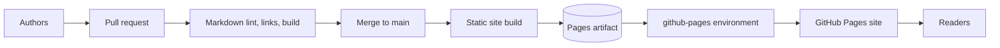
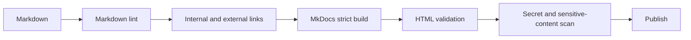
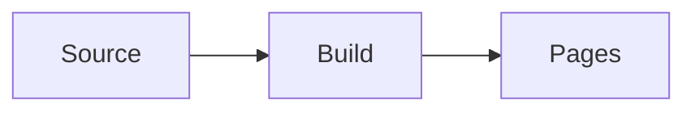

> **Document class:** How-to Guides implementation guide
> **Normative terms:** **MUST**, **MUST NOT**, **SHOULD**, **SHOULD NOT**, and **MAY** are requirements levels.
> **Applicability:** Versioned Markdown publication, static-site generation, GitHub Actions quality gates, Pages security, domain, and rollback.
> **Exception process:** Deviations require a documented risk assessment, compensating controls, named risk owner, and expiry date.

| Control field | Value |
|---|---|
| Document ID | `HTG-12` |
| Owner | Cloud Center of Excellence |
| Review cycle | At least annually and after material site, workflow, or hosting changes |
| Evidence | Commit, build artifact, validator output, link and accessibility checks, deployment record, provenance, and rollback test |

# How to Publish Documentation with GitHub Pages

> **Decision in brief:** Publish only validated source through a repeatable workflow, keep the generated site traceable to a commit, and retain a rollback path.

> **Document type:** Implementation guide
> **Primary examples:** Azure and Terraform
> **Cloud scope:** Azure, AWS, GCP, and Oracle Cloud Infrastructure (OCI)
> **Operating principle:** Use short-lived identity, immutable artifacts, least privilege, policy-as-code, and automated validation.


## Objective

Turn Markdown documentation into a searchable, versioned static site and publish it through GitHub Pages. The source remains in Git; GitHub Actions builds an immutable site artifact and deploys it to the Pages environment.

GitHub Pages is a static hosting service. Do not publish secrets, internal-only architecture, credentials, private endpoints, customer data, or confidential runbooks to a public Pages site.

## Reference architecture



## Choose a static-site generator

Common options:

| Generator | Strength | Trade-off |
|---|---|---|
| MkDocs Material | Strong documentation UX and Markdown support | Python dependency and theme configuration |
| Docusaurus | Versioning, React ecosystem, large sites | Node build and more application structure |
| Jekyll | Native GitHub Pages history and simple sites | Plugin restrictions in branch-based builds |
| Hugo | Fast builds and single binary | Theme and template learning curve |

This guide uses MkDocs. The GitHub Pages deployment pattern is similar for other generators.

## Repository structure

```text
documentation/
├── .github/
│   └── workflows/
│       └── pages.yml
├── docs/
│   ├── index.md
│   ├── how-to/
│   ├── reference/
│   ├── assets/
│   └── stylesheets/
├── overrides/
├── .markdownlint.json
├── mkdocs.yml
├── requirements.txt
└── README.md
```

## Create the site

`requirements.txt`:

```text
mkdocs==1.6.1
mkdocs-material==9.6.14
```

The versions are examples. Pin versions that your organization has tested and update them through dependency pull requests.

`mkdocs.yml`:

```yaml
site_name: Cloud Engineering Guides
site_description: Standardized multi-cloud engineering documentation
site_url: https://contoso.github.io/cloud-guides/

repo_name: contoso/cloud-guides
repo_url: https://github.com/contoso/cloud-guides

theme:
  name: material
  features:
    - navigation.sections
    - navigation.top
    - search.highlight
    - content.code.copy

markdown_extensions:
  - admonition
  - attr_list
  - tables
  - toc:
      permalink: true

nav:
  - Home: index.md
  - How-to Guides:
      - Start an Infrastructure Repository: how-to/start-repository.md
      - Remote State: how-to/remote-state.md
```

## Build locally

```bash
python -m venv .venv
source .venv/bin/activate
python -m pip install --upgrade pip
pip install -r requirements.txt
mkdocs serve
```

Production build:

```bash
mkdocs build --strict
```

`--strict` turns warnings into failures. Broken navigation and references should block publication.

## Add quality gates

Markdown lint:

```bash
npx markdownlint-cli2 "docs/**/*.md"
```

Link check:

```bash
lychee --no-progress "docs/**/*.md" "site/**/*.html"
```

Spell or terminology checks can be added with an approved dictionary. Do not blindly auto-correct product names, commands, or code.

Quality pipeline:



## Configure GitHub Pages

In the repository:

1. Open **Settings**.
2. Select **Pages**.
3. Under **Build and deployment**, select **GitHub Actions**.
4. Configure environment protection for `github-pages` if required.
5. Set a custom domain only after DNS ownership is ready.

GitHub supports publishing from a branch or through GitHub Actions. Actions is preferable when the site requires a custom build, quality checks, or pinned dependencies.

## GitHub Actions workflow

```yaml
name: publish-pages

on:
  push:
    branches: [main]
    paths:
      - "docs/**"
      - "mkdocs.yml"
      - "requirements.txt"
      - ".github/workflows/pages.yml"
  workflow_dispatch:

permissions:
  contents: read

concurrency:
  group: pages
  cancel-in-progress: true

jobs:
  build:
    runs-on: ubuntu-latest
    steps:
      - uses: actions/checkout@v4

      - uses: actions/setup-python@v5
        with:
          python-version: "3.13"
          cache: pip

      - name: Install
        run: |
          python -m pip install --upgrade pip
          pip install -r requirements.txt

      - name: Build
        run: mkdocs build --strict

      - name: Configure Pages
        uses: actions/configure-pages@v5

      - name: Upload Pages artifact
        uses: actions/upload-pages-artifact@v3
        with:
          path: site

  deploy:
    needs: build
    runs-on: ubuntu-latest
    environment:
      name: github-pages
      url: ${{ steps.deployment.outputs.page_url }}
    permissions:
      pages: write
      id-token: write
    steps:
      - name: Deploy
        id: deployment
        uses: actions/deploy-pages@v4
```

Pin actions to commit SHAs for high-assurance environments.

## Mermaid diagrams

MkDocs does not render Mermaid by default in every configuration. Add a supported plugin or JavaScript integration and test it under the site's content-security policy.

Example Markdown:

````markdown

````

Do not assume diagrams render because GitHub's repository viewer renders them. The static site generator has its own rendering pipeline.

## Metadata normalization

For a documentation library, use consistent front matter:

```yaml
---
title: Article title
summary: A concise description between 30 and 220 characters.
tags: cloud, engineering
status: published
order: 100
---
```

Add a validation script:

```python
from pathlib import Path
import yaml

for path in Path("docs").rglob("*.md"):
    text = path.read_text(encoding="utf-8")
    if not text.startswith("---\n"):
        raise SystemExit(f"{path}: missing front matter")
    _, front, _ = text.split("---", 2)
    data = yaml.safe_load(front)
    for key in ["title", "summary", "tags", "status", "order"]:
        if key not in data:
            raise SystemExit(f"{path}: missing {key}")
    if not 30 <= len(data["summary"]) <= 220:
        raise SystemExit(f"{path}: summary length invalid")
```

## Versioning

Options:

- One continuously updated site with Git history.
- Versioned documentation directories such as `/v1/`, `/v2/`.
- Docusaurus or Mike for version switching.
- Release tags that reproduce a prior build.

Do not create a new documentation version for every typo. Version behavior and interfaces that users must distinguish.

## Custom domain and TLS

For `docs.example.com`:

1. Configure the custom domain in GitHub Pages.
2. Create the provider-documented DNS record.
3. Verify the domain.
4. Enforce HTTPS after certificate issuance.
5. Protect DNS changes through code review.
6. Monitor certificate and DNS health.

Do not create an unverified custom domain mapping; domain takeover risks exist when DNS and repository settings become inconsistent.

## Security and privacy

- Pages sites can be public depending on repository and organization plan/settings.
- Scan source and generated site for secrets.
- Remove internal IPs, tenant IDs, credentials, and confidential architecture unless publication is approved.
- Avoid embedding analytics that violate privacy policy.
- Use a restrictive content-security policy when hosting outside default Pages behavior.
- Review third-party JavaScript.
- Do not expose source maps containing sensitive build-time values.
- Treat diagrams and screenshots as data.

## Validation

```bash
curl -I https://contoso.github.io/cloud-guides/
curl --fail https://contoso.github.io/cloud-guides/sitemap.xml
```

Check:

- Homepage returns `200`.
- CSS, JavaScript, images, and fonts load.
- Search works.
- Internal links work under the repository base path.
- Mermaid diagrams render.
- Canonical URLs are correct.
- Custom domain redirects correctly.
- No draft or restricted page appears.
- Source commit matches deployment.

## Rollback

GitHub Pages deployments are derived from source. Roll back by reverting the breaking commit and rebuilding.

```bash
git revert <bad-commit>
git push origin main
```

For an urgent takedown, unpublish the Pages site through repository settings, but preserve incident evidence. Do not delete repository history to remove a secret; rotate the secret and use approved history-rewrite procedures.

## Troubleshooting

| Symptom | Cause | Correction |
|---|---|---|
| Site shows 404 | Pages source not configured or base path wrong | Select GitHub Actions and set correct `site_url` |
| CSS missing | Absolute paths ignore project subpath | Configure generator base URL |
| Build succeeds locally only | Unpinned dependencies or case-sensitive paths | Pin versions and test on Linux |
| Mermaid displayed as code | Renderer not configured | Add supported Mermaid integration |
| Deployment denied | Missing `pages: write` or `id-token: write` | Set deploy-job permissions |
| Custom domain certificate pending | DNS not propagated or conflicting records | Correct DNS and wait for verification |
| Draft page published | Navigation or build includes it | Add status-based exclusion or separate draft branch |

## Definition of done

Documentation publication is complete when Markdown and metadata pass validation, links and strict builds pass, the Pages workflow uses least privilege, the site artifact is reproducible, sensitive-content scans pass, navigation and diagrams render, HTTPS and custom domain are correct, and rollback by source revert is tested.

## Related topics

- [How to Deploy Terraform with Azure DevOps](how-to-deploy-terraform-with-azure-devops.md)
- [How to Deploy Terraform with GitHub Actions](how-to-deploy-terraform-with-github-actions.md)
- [How to Start a New Infrastructure Repository](how-to-start-a-new-infrastructure-repository.md)

## Official references

- GitHub Pages overview: https://docs.github.com/en/pages/getting-started-with-github-pages/what-is-github-pages
- Publishing source: https://docs.github.com/en/pages/getting-started-with-github-pages/configuring-a-publishing-source-for-your-github-pages-site
- Custom GitHub Actions workflow: https://docs.github.com/en/pages/getting-started-with-github-pages/using-custom-workflows-with-github-pages
- GitHub Pages limits: https://docs.github.com/en/pages/getting-started-with-github-pages/github-pages-limits
- MkDocs: https://www.mkdocs.org/
- Material for MkDocs: https://squidfunk.github.io/mkdocs-material/

## Related repos

- [andyxuan2010/andyxuan2010.github.io](https://github.com/andyxuan2010/andyxuan2010.github.io) — published reference implementation for normalized Markdown, generated Library navigation, theme-aware static assets, and GitHub Pages delivery.
