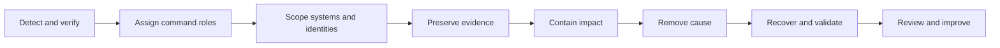

> **文档类型：** 操作指南
> **规范性术语：** **MUST**、**MUST NOT**、**SHOULD**、**SHOULD NOT** 和 **MAY** 是要求级别。
> **适用范围：** 跨云事件指挥、检测、遏制、证据保存、恢复、通信和经验教训。
> **例外流程：** 偏离要求需要记录风险评估、补偿控制、指定风险负责人和到期日期。

|控制领域|价值|
|---|---|
|文件编号 | `HTG-26` |
|负责人|云卓越中心 |
|审核周期|至少每年一次以及在重大事件、提供商或服务发生变化之后 |
|证据|时间线、事件角色、检测和遏制日志、保存的证据、恢复批准、利益相关者更新和事件后行动 |

# 如何运行多云事件响应

> **决策简述：** 首先建立指挥并保存证据，包含最小的安全范围，并且仅从已知良好的状态恢复。

> **文档类型：** 操作手册  
> **操作原则：** 建立指挥、保存证据、包含最小的安全范围、仅从已知良好的状态恢复。

## 目标

为可用性、安全性、数据、身份、网络、流水线和提供商事件提供一种响应模型。提供商控制台和术语有所不同，但严重性、决策权、证据、遏制、恢复和沟通必须保持一致。

## 响应流程

## 事件发生前的准备

- 维护服务、依赖性、所有者、数据分类和提供商支持清单。
- 将审计日志集中在时间同步的受保护边界中。
- 预授权紧急角色、隔离自动化、洁净室账户和沟通渠道。
- 按客户、安全、监管、数据和控制影响定义严重性。
- 保留离线联系方式和提供商升级标识符。
- 实施身份泄露、勒索软件、区域中断、数据损坏和流水线泄露。

## 建立命令

分配一名事件指挥官、行动主管、安全/证据主管、通信主管和抄写员。使用 UTC 时间线。将事实、假设、决定和行动分开。建立节奏并记录谁可以隔离工作负载、撤销身份、故障转移、通知监管机构或寻求提供商支持。

## 调查并保存证据

采集告警上下文、身份会话、审计日志、网络流、资源配置、部署历史记录、不稳定的工作负载状态、哈希值和提供商案例日志记录。将证据导出到访问控制的、不可变的位置。在收集响应计划所需的内容之前，请勿销毁受损资源。

## 安全收容

首选可逆步骤：撤销特定会话、禁用联合规则、隔离网段、停止部署、阻止恶意指示器或将应用切换到只读模式。账户范围内的关闭可能会增加危害并消除有用状态。验证无法通过其他云或身份路径绕过遏制。

## 恢复

删除恶意持久性和易受攻击的配置，轮换暴露的凭据和衍生品，从受信任的制品重建，恢复干净的数据，验证安全性和业务旅程，然后逐渐返回流量。增加监控窗口期间的监控并保留回滚能力。

## 提供商证据映射

|证据|Azure|AWS | GCP |OCI |
|---|---|---|---|---|
|控制平面|活动和 Entra 日志 |CloudTrail| Cloud Audit Logs|审计|
|网络| NSG 流和防火墙日志 | VPC 流日志和防火墙日志 | VPC 流日志和防火墙日志 | VCN 流量和防火墙日志 |
|检测| Defender 和 Sentinel 集成 | GuardDuty 和 Security Hub |Security Command Center|Cloud Guard|
|资源状态|Resource Graph/IaC |Config/IaC |Asset Inventory/IaC |搜索 / IaC |

## 验证

- [ ] 寻呼到达负责的响应者并在目标时间内建立命令。
- [ ] 响应者可以跨云关联身份、资源、网络、部署和应用活动。
- [ ] 如果生产租户或账户受到威胁，证据导出仍然可用。
- [ ] 紧急隔离和会话撤销经过测试且可逆。
- [ ] 干净恢复和客户旅程验证满足恢复目标。
- [ ] 法律、隐私、客户、执行人员和提供商通信已指定所有者。

## 事后回顾
建立一条无责时间线，识别技术和组织影响因素，量化客户和控制影响，记录检测遗漏的内容，并与所有者和日期分配纠正措施。通过测试验证完成情况，而不是根据书面意图结束行动。

## 相关主题

- [事件响应和故障排除](../operations-reliability-finops/incident-response-and-troubleshooting.md)
- [云运营与可靠性模型](../operations-reliability-finops/cloud-operations-and-reliability-model.md)
- [如何构建集中式多云可观测性](how-to-build-centralized-multicloud-observability.md)

## 相关仓库

- [andyxuan2010/azure-scripts](https://github.com/andyxuan2010/azure-scripts) — 提供可作为经过测试的事件响应自动化进行管理的 Azure 操作脚本。
- [andyxuan2010/ARO-management](https://github.com/andyxuan2010/ARO-management) — 包含与 Azure Red Hat OpenShift 工作负载的遏制和恢复相关的集群管理实用程序。
