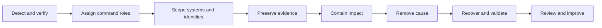

> **Document class:** How-to Guides implementation guide
> **Normative terms:** **MUST**, **MUST NOT**, **SHOULD**, **SHOULD NOT**, and **MAY** are requirements levels.
> **Applicability:** Cross-cloud incident command, detection, containment, evidence preservation, recovery, communication, and lessons learned.
> **Exception process:** Deviations require a documented risk assessment, compensating controls, named risk owner, and expiry date.

| Control field | Value |
|---|---|
| Document ID | `HTG-26` |
| Owner | Cloud Center of Excellence |
| Review cycle | At least annually and after material incident, provider, or service changes |
| Evidence | Timeline, incident roles, detection and containment logs, preserved evidence, recovery approvals, stakeholder updates, and post-incident actions |

# How to Run a Multi-Cloud Incident Response

> **Decision in brief:** Establish command and preserve evidence first, contain the smallest safe scope, and restore only from a known-good state.

> **Document type:** Operations runbook  
> **Operating principle:** Establish command, preserve evidence, contain the smallest safe scope, and restore only from a known-good state.

## Objective

Provide one response model for availability, security, data, identity, network, pipeline, and provider incidents. Provider consoles and terminology differ, but severity, decision rights, evidence, containment, recovery, and communication must remain consistent.

## Response flow

## Prepare before an incident

- Maintain service, dependency, owner, data-classification, and provider-support inventories.
- Centralize audit logs in a protected boundary with synchronized time.
- Pre-authorize emergency roles, isolation automation, clean-room accounts, and communication channels.
- Define severity by customer, safety, regulatory, data, and control impact.
- Keep offline contact details and provider escalation identifiers.
- Exercise identity compromise, ransomware, regional outage, data corruption, and pipeline compromise.

## Establish command

Assign an incident commander, operations lead, security/evidence lead, communications lead, and scribe. Use one timeline in UTC. Separate facts, hypotheses, decisions, and actions. Establish a cadence and record who can isolate workloads, revoke identities, fail over, notify regulators, or engage provider support.

## Investigate and preserve evidence

Capture alert context, identity sessions, audit logs, network flows, resource configuration, deployment history, volatile workload state, hashes, and provider case records. Export evidence to an access-controlled, immutable location. Do not destroy a compromised resource before collecting what the response plan requires.

## Contain safely

Prefer reversible steps: revoke specific sessions, disable a federation rule, quarantine a network segment, stop a deployment, block a malicious indicator, or switch an application to read-only mode. Account-wide shutdown may increase harm and erase useful state. Validate that containment cannot be bypassed through another cloud or identity path.

## Recover

Remove malicious persistence and vulnerable configuration, rotate exposed credentials and derivatives, rebuild from trusted artifacts, restore clean data, validate security and business journeys, then return traffic gradually. Increase monitoring during the observation window and retain rollback capability.

## Provider evidence mapping

| Evidence | Azure | AWS | GCP | OCI |
|---|---|---|---|---|
| Control plane | Activity and Entra logs | CloudTrail | Cloud Audit Logs | Audit |
| Network | NSG flow and firewall logs | VPC Flow Logs and firewall logs | VPC Flow Logs and firewall logs | VCN flow and firewall logs |
| Detection | Defender and Sentinel integrations | GuardDuty and Security Hub | Security Command Center | Cloud Guard |
| Resource state | Resource Graph / IaC | Config / IaC | Asset Inventory / IaC | Search / IaC |

## Validation

- [ ] A page reaches an accountable responder and establishes command within the target time.
- [ ] Responders can correlate identity, resource, network, deployment, and application activity across clouds.
- [ ] Evidence export remains available if the production tenant or account is compromised.
- [ ] Emergency isolation and session revocation are tested and reversible.
- [ ] Clean restoration and customer-journey validation meet recovery objectives.
- [ ] Legal, privacy, customer, executive, and provider communications have named owners.

## Post-incident review

Build a blameless timeline, identify technical and organizational contributing factors, quantify customer and control impact, record what detection missed, and assign corrective actions with owners and dates. Verify completion through tests rather than closing actions on written intent.

## Related topics

- [Incident Response and Troubleshooting](../operations-reliability-finops/incident-response-and-troubleshooting.md)
- [Cloud Operations and Reliability Model](../operations-reliability-finops/cloud-operations-and-reliability-model.md)
- [How to Build Centralized Multi-Cloud Observability](how-to-build-centralized-multicloud-observability.md)

## Related repos

- [andyxuan2010/azure-scripts](https://github.com/andyxuan2010/azure-scripts) — provides Azure operational scripts that can be governed as tested incident-response automation.
- [andyxuan2010/ARO-management](https://github.com/andyxuan2010/ARO-management) — contains cluster-management utilities relevant to containment and recovery of Azure Red Hat OpenShift workloads.
