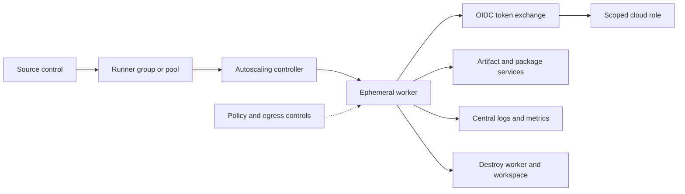

> **文档类型：** 操作指南
> **规范性术语：** **MUST**、**MUST NOT**、**SHOULD**、**SHOULD NOT** 和 **MAY** 是要求级别。
> **适用范围：** 自托管 CI/CD 运行器隔离、短暂性、最小特权、修补、网络、机密和跨四个云的操作。
> **例外流程：** 偏离要求需要记录风险评估、补偿控制、指定风险负责人和到期日期。

|控制领域|价值|
|---|---|
|文件编号 | `HTG-13` |
|负责人|云卓越中心 |
|审核周期|至少每年一次，并且在重大运行器、镜像或流水线发生变化之后 |
|证据|运行器镜像和补丁状态、隔离测试、作业日志、访问策略、出口审查、机密暴露检查和处置证据 |

# 如何保护和操作自托管 CI/CD 运行器

> **简要决定：** 使用具有最小信任和网络访问权限的短命隔离运行器，然后证明拆卸并审核每个作业边界。

> **文件类型：** 实施指南
> **主要示例：** Azure 和 GitHub Actions 或 Azure DevOps
> **云范围：** Azure、AWS、GCP 和 Oracle Cloud Infrastructure (OCI)
> **操作原则：** 将每项工作视为不可信代码，将每一个运行器视为一次性的。

## 目标

仅当托管运行器无法满足私有网络、性能、合规性或工具要求时，才部署自托管运行器。完成服务隔离和信任区域划分，使用短期工作负载身份，为每个作业创建一个临时工作节点，限制网络路径，采集操作遥测数据并证明清理工作。

## 前提条件

- 经批准的运行器用例和指定的服务所有者。
- 针对生产、非生产和不受信任的拉取请求单独的运行组或池。
- 强化的、版本化的基础镜像和自动化镜像流水线。
- 对所需源、制品、状态和云端点的私有访问。
- 为每个部署环境配置的工作负载身份联合。
- 集中日志、漏洞管理、修补和事件响应集成。

切勿将公共仓库作业、分叉拉取请求和特权部署作业放在同一个运行器池上。

## 目标架构

控制器接受作业但不持有部署权限。一个工作节点接收一个作业，获取作业绑定的身份，发送日志，并且无论作业成功、失败或超时，都会被销毁。

## 信任区域标准化

为这些边界创建不同的池：

|信任区|允许的工作负载|身份天花板 |网络天花板|
|---|---|---|---|
|不受信任 |分叉和外部贡献 |无 Cloud Deploy 身份 |仅公共包镜像 |
|构建|审查分支构建和测试 |制品写入，无生产访问权限 |源、包和制品端点 |
|非生产|测试部署 |环境范围的部署者 |非生产性服务|
|生产|批准的不可变版本 |狭义生产部署器 |所需的生产控制和数据平面|

在联合条件下使用仓库、分支、工作流、环境和运行器组声明。标签本身就是路由提示，而不是安全边界。

## 构建运行器镜像

1. 从受支持的最小操作系统镜像开始。
2. 仅安装固定的运行器、CLI、Terraform、容器和安全工具版本。
3. 删除作业不需要的编译器和管理实用程序。
4. 配置非管理作业账户；拒绝交互式登录。
5. 安装策略所需的端点保护和遥测。
6. 生成软件物料清单、扫描镜像、签名并记录其摘要。
7. 按计划立即重建关键漏洞。

不要对长寿的运行器进行原地突变。替换镜像，移除旧的工作节点，并证明只有批准的摘要正在运行。

## 提供临时工作节点

对于 Azure，将 VM Scale Sets、Container Apps jobs 或 Kubernetes-based runner controllers on AKS 放置在专用订阅和虚拟网络中。使用托管标识进行引导操作，使用工作负载身份联合获取作业部署权限。请勿在镜像中存储可复用的云凭证。

等效的放置模式是：

|能力|Azure|AWS | GCP |OCI |
|---|---|---|---|---|
|短暂计算 | VM Scale Sets、Container Apps jobs、AKS | EC2 Auto Scaling、ECS、EKS | Managed Instance Groups、Cloud Run jobs、GKE | Instance Pools、Container Instances、OKE |
|引导身份 |托管身份|实例配置文件 |附加服务账户|实例主体 |
|作业身份联合|内部工作负载身份联合| IAM OIDC 信任 |工作负载身份联合|工作负载身份或资源主体 |
|镜像控制|Azure Compute Gallery、ACR | AMI、ECR |image families、Artifact Registry |custom images、OCIR |

工作节点必须及时注册、只接受一个作业、取消注册、清除附加存储和内存中的机密，然后终止。协调作业必须删除废弃的工作节点和过时的注册。

## 限制身份和网络访问

- 将 CI/CD OIDC 令牌交换为短期环境角色。
- 将计划/读取权限与应用/写入权限分开。
- 拒绝角色分配、策略修改、身份创建和机密导出，除非工作流程明确要求它们。
- 在支持的情况下，将私有端点用于内部包、制品、Terraform 状态和管理服务。
- 默认拒绝入站连接；运行器发起出站连接。
- 允许通过受控代理、防火墙策略、服务标签或批准的私有端点进行出口。
- 保护元数据端点并阻止工作节点之间的流量。
- 保持生产和非生产 DNS、路由、子网、身份和日志分开。

不要仅仅因为软件包安装方便而允许不受限制的互联网出口。镜像依赖关系并验证校验和。

## 保护工作和制品

将可复用的工作流程、Actions、任务、容器、模块和包固定到不可变的版本或摘要。防止作业打印环境变量或令牌响应。屏蔽是次要控制，不能可靠地保护转换后的机密。

构建一次并晋级相同的签名制品。生产运行器按摘要下载、验证来源并部署；它不会重建源。

## 监控并操作服务

收集以下内容而不记录机密值：

- 控制器和工作节点生命周期事件；
- 仓库、工作流程、运行、作业、环境和提交标识符；
- 镜像摘要、运行器版本、工具版本和策略结果；
- 队列时间、启动时间、作业持续时间、故障率和清理持续时间；
- 调用者身份、目标范围、联合拒绝和特权 API 活动；
- 出口拒绝、恶意软件检测、磁盘压力和废弃工作节点数量。

当未经批准的仓库到达特权池、工作节点处理多个作业、清理失败、镜像年龄超过策略、注册令牌被重用或在批准的版本之外发生特权访问时发出告警。

## 失败和恢复过程

1. 停止向受影响池分配新作业。
2. 保留控制器、云审计、网络和工作流程证据。
3. 终止从可疑镜像创建的所有工作节点。
4. 当令牌或工作流程可能被滥用时，撤销运行器注册和联合信任。
5. 轮换任何可能已暴露的凭证。
6. 从已知良好的签名镜像重建并在隔离池中进行验证。
7. 逐步恢复服务并记录预防措施。

切勿重用可能受到威胁的工作节点来调查其自身。

## 验证

- [ ] 一个 worker 只接受一个作业，并在成功、失败、取消和超时后被销毁。
- [ ] 不受信任的作业无法访问云元数据、内部服务、机密或特权池。
- [ ] 生产联合拒绝错误的仓库、分支、工作流程、环境或受众。
- [ ] 网络测试证明默认拒绝入口和受控出口。
- [ ] 正在运行的镜像摘要与已签名的批准版本匹配。
- [ ] 清理会删除工作区数据、附加磁盘、注册和临时标识。
- [ ] 日志将作业与其提交、制品摘要、工作节点、身份和目标相关联。
- [ ] 已执行容量、控制器故障、区域丢失和入侵响应操作手册。

## 完成标准
当信任区域被隔离、工作节点是临时的、身份受工作限制且权限最低、依赖关系不可变、网络路径受到限制、清理不断协调、测试入侵恢复以及记录所有权和服务目标时，运行器服务就准备好了。

## 相关主题

- [共享运行器安全与清理规范](../ci-cd-automation/shared-runner-security-and-hygiene.md)
- [流水线身份和机密处理](../ci-cd-automation/pipeline-identity-and-secret-handling.md)
- [如何排除常见流水线故障](how-to-troubleshoot-common-pipeline-failures.md)
- [共享运行器安全与清理标准](../standards-best-practices/shared-runner-security-and-hygiene-standard.md)
