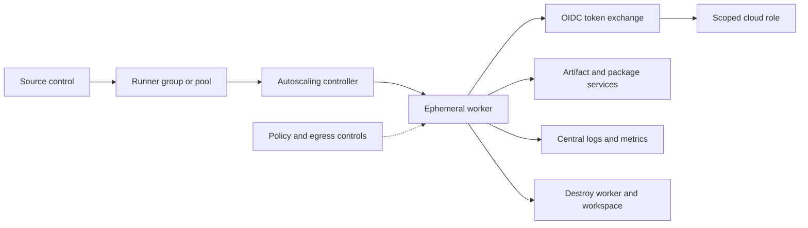

> **Document class:** How-to Guides implementation guide
> **Normative terms:** **MUST**, **MUST NOT**, **SHOULD**, **SHOULD NOT**, and **MAY** are requirements levels.
> **Applicability:** Self-hosted CI/CD runner isolation, ephemerality, least privilege, patching, networking, secrets, and operations across four clouds.
> **Exception process:** Deviations require a documented risk assessment, compensating controls, named risk owner, and expiry date.

| Control field | Value |
|---|---|
| Document ID | `HTG-13` |
| Owner | Cloud Center of Excellence |
| Review cycle | At least annually and after material runner, image, or pipeline changes |
| Evidence | Runner image and patch status, isolation tests, job logs, access policy, egress review, secret exposure checks, and disposal evidence |

# How to Secure and Operate Self-Hosted CI/CD Runners

> **Decision in brief:** Use short-lived isolated runners with minimal trust and network access, then prove teardown and audit every job boundary.

> **Document type:** Implementation guide
> **Primary examples:** Azure and GitHub Actions or Azure DevOps
> **Cloud scope:** Azure, AWS, GCP, and Oracle Cloud Infrastructure (OCI)
> **Operating principle:** Treat every job as untrusted code and every runner as disposable.

## Objective

Deploy self-hosted runners only when hosted runners cannot satisfy private-network, performance, compliance, or tooling requirements. The completed service isolates trust zones, uses short-lived workload identity, creates an ephemeral worker per job, restricts network paths, captures operational telemetry, and proves cleanup.

## Preconditions

- An approved runner use case and named service owner.
- Separate runner groups or pools for production, non-production, and untrusted pull requests.
- A hardened, versioned base image and an automated image pipeline.
- Private access to required source, artifact, state, and cloud endpoints.
- Workload federation configured for each deployment environment.
- Central logging, vulnerability management, patching, and incident-response integration.

Never place public-repository jobs, forked pull requests, and privileged deployment jobs on the same runner pool.

## Target architecture

The controller accepts jobs but holds no deployment privilege. A worker receives one job, obtains a job-bound identity, sends logs, and is destroyed whether the job succeeds, fails, or times out.

## Normalize trust zones

Create distinct pools for these boundaries:

| Trust zone | Permitted workload | Identity ceiling | Network ceiling |
|---|---|---|---|
| Untrusted | Forks and external contributions | No cloud deployment identity | Public package mirrors only |
| Build | Reviewed branch builds and tests | Artifact write, no production access | Source, package, and artifact endpoints |
| Non-production | Test deployments | Environment-scoped deployer | Non-production services |
| Production | Approved immutable releases | Narrow production deployer | Required production control and data planes |

Use repository, branch, workflow, environment, and runner-group claims in federation conditions. Labels alone are routing hints and are not security boundaries.

## Build the runner image

1. Start from the smallest supported operating-system image.
2. Install only pinned runner, CLI, Terraform, container, and security-tool versions.
3. Remove compilers and administrative utilities that jobs do not require.
4. Configure a non-administrative job account; deny interactive login.
5. Install endpoint protection and telemetry required by policy.
6. Generate a software bill of materials, scan the image, sign it, and record its digest.
7. Rebuild on a schedule and immediately for critical vulnerabilities.

Do not mutate long-lived runners in place. Replace the image, drain old workers, and prove that only the approved digest is running.

## Provision ephemeral workers

For Azure, place a scale set, Container Apps jobs, or AKS-based runner controller in a dedicated subscription and virtual network. Use managed identity for bootstrap operations and workload federation for job deployment permissions. Store no reusable cloud credential in the image.

The equivalent placement patterns are:

| Capability | Azure | AWS | GCP | OCI |
|---|---|---|---|---|
| Ephemeral compute | VM Scale Sets, Container Apps jobs, AKS | EC2 Auto Scaling, ECS, EKS | Managed Instance Groups, Cloud Run jobs, GKE | Instance Pools, Container Instances, OKE |
| Bootstrap identity | Managed identity | Instance profile | Attached service account | Instance principal |
| Job federation | Entra workload identity federation | IAM OIDC trust | Workload Identity Federation | Workload identity or resource principal |
| Image control | Compute Gallery, ACR | AMI, ECR | Image families, Artifact Registry | Custom images, OCIR |

Workers must register just in time, accept exactly one job, deregister, erase attached storage and memory-backed secrets, and terminate. A reconciliation job must delete abandoned workers and stale registrations.

## Restrict identity and network access

- Exchange the CI/CD OIDC token for a short-lived environment role.
- Separate plan/read permissions from apply/write permissions.
- Deny role assignment, policy modification, identity creation, and secret export unless the workflow explicitly requires them.
- Use private endpoints for internal package, artifact, Terraform state, and management services where supported.
- Default-deny inbound connectivity; runners initiate outbound connections.
- Allow egress by controlled proxy, firewall policy, service tag, or approved private endpoint.
- Protect metadata endpoints and block worker-to-worker traffic.
- Keep production and non-production DNS, routes, subnets, identities, and logs separable.

Do not allow unrestricted internet egress merely because package installation is convenient. Mirror dependencies and verify checksums.

## Protect jobs and artifacts

Pin reusable workflows, actions, tasks, containers, modules, and packages to immutable versions or digests. Prevent jobs from printing environment variables or token responses. Masking is a secondary control and cannot reliably protect transformed secrets.

Build once and promote the same signed artifact. A production runner downloads by digest, verifies provenance, and deploys; it does not rebuild source.

## Observe and operate the service

Collect the following without recording secret values:

- controller and worker lifecycle events;
- repository, workflow, run, job, environment, and commit identifiers;
- image digest, runner version, tool versions, and policy result;
- queue time, startup time, job duration, failure rate, and cleanup duration;
- caller identity, target scope, federation denial, and privileged API activity;
- egress denial, malware detection, disk pressure, and abandoned-worker count.

Alert when an unapproved repository reaches a privileged pool, a worker handles multiple jobs, cleanup fails, image age exceeds policy, registration tokens are reused, or privileged access occurs outside an approved release.

## Failure and recovery procedure

1. Stop new job assignment to the affected pool.
2. Preserve controller, cloud audit, network, and workflow evidence.
3. Terminate all workers created from the suspect image.
4. Revoke runner registrations and federation trust when token or workflow misuse is possible.
5. Rotate any credential that could have been exposed.
6. Rebuild from a known-good signed image and validate in an isolated pool.
7. Restore service gradually and document preventive actions.

Never reuse a potentially compromised worker to investigate itself.

## Validation

- [ ] A worker accepts only one job and is destroyed after success, failure, cancellation, and timeout.
- [ ] Untrusted jobs cannot reach cloud metadata, internal services, secrets, or privileged pools.
- [ ] Production federation rejects the wrong repository, branch, workflow, environment, or audience.
- [ ] Network tests prove default-deny ingress and controlled egress.
- [ ] The running image digest matches the signed approved release.
- [ ] Cleanup removes workspace data, attached disks, registrations, and temporary identities.
- [ ] Logs correlate a job to its commit, artifact digest, worker, identity, and target.
- [ ] Capacity, controller failure, region loss, and compromise runbooks have been exercised.

## Completion criteria

The runner service is ready when trust zones are isolated, workers are ephemeral, identities are job-bound and least-privilege, dependencies are immutable, network paths are constrained, cleanup is continuously reconciled, compromise recovery is tested, and ownership and service objectives are documented.

## Related topics

- [Shared Runner Security and Hygiene](../ci-cd-automation/shared-runner-security-and-hygiene.md)
- [Pipeline Identity and Secret Handling](../ci-cd-automation/pipeline-identity-and-secret-handling.md)
- [How to Troubleshoot Common Pipeline Failures](how-to-troubleshoot-common-pipeline-failures.md)
- [Shared Runner Security and Hygiene Standard](../standards-best-practices/shared-runner-security-and-hygiene-standard.md)
