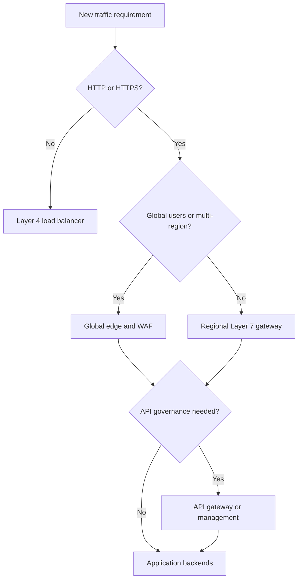
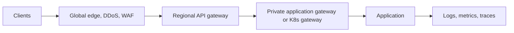

> **文档类型：** 操作指南
> **规范性术语：** **MUST**、**MUST NOT**、**SHOULD**、**SHOULD NOT** 和 **MAY** 是要求级别。
> **适用范围：** 全球边缘、第 4 层和第 7 层路由、WAF、API、TLS、运行状况、故障转移和跨多个云的提供商选择。
> **例外流程：** 偏离要求需要记录风险评估、补偿控制、指定风险负责人和到期日期。

|控制领域|价值|
|---|---|
|文件编号 | `HTG-18` |
|负责人|云卓越中心 |
|审核周期|至少每年一次，并且在发生重大流量、安全或提供商变更之后 |
|证据|决策矩阵、威胁模型、路由和健康测试、TLS 策略、故障转移结果、WAF 日志和所有权日志记录 |

# 如何选择应用流量和负载均衡服务

> **决策简述：** 根据协议、身份、延迟、可用性和操作模型要求来选择流量服务，而不仅仅是根据提供商的熟悉程度。

> **文件类型：** 决策和实施指南
> **主要示例：** Azure Front Door、Application Gateway、API Management 和负载均衡器
> **云范围：** Azure、AWS、GCP 和 Oracle Cloud Infrastructure (OCI)
> **操作原则：** 按协议、范围、策略和故障目标进行选择；仅当每一层都有不同的职责时才组合服务。

## 目标

选择满足全球覆盖范围、协议行为、TLS、Web 保护、API 治理、私有访问、性能、可用性、可观测性和恢复要求的最小流量服务架构。产品名称不可互换：第 4 层负载均衡器无法提供应用路由，并且 WAF 不是 API Management 平台。

## 从流量需求开始

日志记录：

- 客户及其地理位置或网络位置；
- 公开、合作伙伴、混合或私有曝光；
- TCP、UDP、HTTP、HTTPS、HTTP/2、gRPC、WebSocket 和相互 TLS 要求；
- 全球与区域进入和故障转移；
- 主机、路径、标头、cookie、源或基于内容的路由；
- WAF、DDoS、机器人、速率限制、配额、身份验证、转换和开发人员门户需求；
- 源 IP 保留、会话亲和性、连接持续时间、有效负载限制和超时需求；
- 证书所有权、TLS 策略、日志、延迟、吞吐量、可用性、RTO 和 RPO。

## 决策流程

私有应用可以使用区域网关、负载均衡器和 API 网关的私有变体。当所有客户端和后端都局限于一个私有区域时，全球边缘是不必要的。

## 将功能与服务类别相匹配

|服务等级|使用时 |不要仅选择 |
|---|---|---|
|全球边缘|任播入口、CDN、全局 HTTP 路由、多区域故障转移、边缘 WAF |单一私有区域应用 |
|区域七层网关| HTTP 路由、TLS 终止、WAF、私有或区域入口 |原始 UDP 或任意 TCP |
|第 4 层负载均衡器 |高吞吐量 TCP/UDP、源 IP 或协议透明性 | URL 路由、JWT 验证、转换 |
| API 网关/管理|身份验证、配额、密钥、产品、版本、转换、分析 |一般站点加速或非 API 流量|
| Kubernetes 入口/网关 |集群本地应用路由和服务集成|企业边缘保护本身|
|服务网格网关 |工作负载感知的东西向策略和双向 TLS |互联网边缘、CDN 或一般 DDoS 保护 |

## 常见成分

使用每个层进行不同的控制：

这种组合对于全球监管的 API 来说是合理的，但它增加了延迟、成本、证书、故障模式和故障排除边界。区域 Web 应用可能只需要一个第 7 层网关。

## 提供商映射

|服务等级|Azure|AWS | GCP |OCI |
|---|---|---|---|---|
|全球 HTTP 边缘 |Front Door |具有 ALB 或 API 来源的 CloudFront |Global external Application Load Balancer and Cloud CDN |具有 Traffic Management 和 CDN 功能（如适用）的 Flexible Load Balancer |
|区域第 7 层 |Application Gateway|Application Load Balancer |Regional external or internal Application Load Balancer |Flexible Load Balancer|
|第 4 层 |Load Balancer|Network Load Balancer|Proxy or passthrough Network Load Balancer |Network Load Balancer|
| API 管理 | API Management | API Gateway | Apigee 或 API Gateway | API Gateway |
| WAF |Front Door 或 Application Gateway WAF | AWS WAF |Cloud Armor| OCI WAF |
|全局 DNS 流量调度 |Traffic Manager 或 DNS | Route 53 |Cloud DNS routing policies |Traffic Management Steering Policies|

在实施之前验证当前的区域可用性、协议支持、配额和定价。

## 设计 TLS 和身份

定义 TLS 终止位置以及是否在每个后端重新建立它。首选端到端加密并自动执行证书颁发、续订、轮换和到期告警。使用现代 TLS 策略和文档例外。

WAF 规则保护 HTTP 行为；他们不对用户进行身份验证。在应用或 API 层验证令牌并授权操作。当客户端证书身份是显式信任设计的一部分时，请使用相互 TLS。

## 配置健康和路由

- 使用专用的运行状况端点来验证服务流量所需的依赖关系，但不会暴露敏感细节。
- 有意设置间隔、超时、阈值和预期状态。
- 在删除后端之前排空连接。
- 使用加权或金丝雀路由进行渐进式交付。
- 绑定会话关联性，并在无状态设计可行时避免使用它。
- 配置重试和超时预算，以便各层在故障期间不会增加流量。
- 仅保留和信任来自批准代理的转发的客户端标头。

对于多区域故障转移，区分边缘检测、DNS 缓存、后端运行状况、状态复制和应用恢复。健康端点并不能证明数据是最新的。

## 实施安全控制

通过私有连接、安全组、服务标签或经过身份验证的来源，将后端限制为来自批准的网关路径的流量。防止直接公共后端访问。在检测模式下启动 WAF 托管规则，通过缩小排除范围调整误报，然后强制执行。在具有必要身份和路由上下文的层应用速率限制。

单独保护管理端点，切勿通过应用侦听器公开平台管理接口。

## 监控和测试
将边缘、网关、API、入口和应用日志与请求或跟踪标识符相关联。监控请求率、响应代码、源延迟、TLS 故障、WAF 操作、拒绝的身份验证、饱和度、不健康的后端、故障转移事件、连接计数和成本。

- [ ] 协议、负载、超时、gRPC/WebSocket 和客户端 IP 行为匹配要求。
- [ ] 直接后端访问被阻止。
- [ ] 证书续订和即将到期告警已得到证实。
- [ ] WAF 阳性和阴性测试无需广泛排除。
- [ ] 速率限制和 API 配额会按预期失败。
- [ ] 后端、区域、网关实例和区域故障满足目标。
- [ ] 日志跟踪从入口点到后端的请求，而不暴露令牌。
- [ ] 容量和成本测试代表峰值和类似攻击的流量。

## 验证

当每个服务层都有记录在案的责任、删除不必要的跃点、测试协议和安全策略、后端无法绕过边缘、运行状况和故障转移满足目标、证书自动化以及遥测提供端到端请求关联时，选择就完成了。

## 相关主题

- [负载均衡和 Application Gateway 模式](../networking-identity-security/nis-load-balancing-and-application-gateway-patterns.md)
- [弹性、扩展和部署策略](../applications-kubernetes/app-resilience-scaling-and-deployment-strategies.md)
- [如何配置云防火墙、出口控制和路由检查](how-to-configure-firewalls-egress-and-route-inspection.md)
- [网络和私有连接标准](../standards-best-practices/network-and-private-connectivity-standard.md)

## 相关仓库

- [andyxuan2010/AksIngressControllerDemo](https://github.com/andyxuan2010/AksIngressControllerDemo) — 演示 AKS 入口、Helm 和应用路由组件，这些组件可以位于本指南中选择的流量服务后面。
- [andyxuan2010/3tierweb](https://github.com/andyxuan2010/3tierweb) — 提供 AWS 三层参考工作负载，用于评估负载均衡器、扩展和后端隔离决策。
