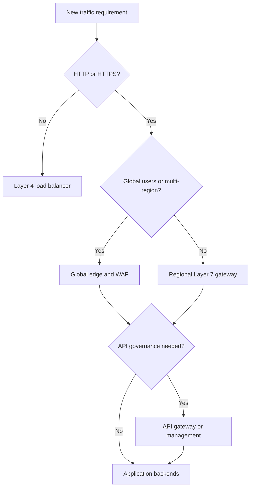
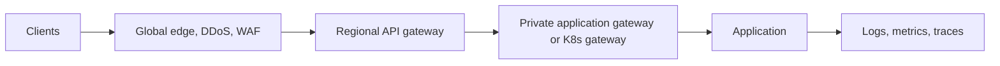

> **Document class:** How-to Guides implementation guide
> **Normative terms:** **MUST**, **MUST NOT**, **SHOULD**, **SHOULD NOT**, and **MAY** are requirements levels.
> **Applicability:** Global edge, Layer 4 and Layer 7 routing, WAF, API, TLS, health, failover, and provider selection across multiple clouds.
> **Exception process:** Deviations require a documented risk assessment, compensating controls, named risk owner, and expiry date.

| Control field | Value |
|---|---|
| Document ID | `HTG-18` |
| Owner | Cloud Center of Excellence |
| Review cycle | At least annually and after material traffic, security, or provider changes |
| Evidence | Decision matrix, threat model, routing and health tests, TLS policy, failover result, WAF logs, and ownership record |

# How to Select Application Traffic and Load-Balancing Services

> **Decision in brief:** Choose traffic services from protocol, identity, latency, availability, and operating-model requirements, not from provider familiarity alone.

> **Document type:** Decision and implementation guide
> **Primary examples:** Azure Front Door, Application Gateway, API Management, and Load Balancer
> **Cloud scope:** Azure, AWS, GCP, and Oracle Cloud Infrastructure (OCI)
> **Operating principle:** Select by protocol, scope, policy, and failure objective; compose services only when each layer has a distinct responsibility.

## Objective

Choose the minimum traffic-service architecture that satisfies global reach, protocol behavior, TLS, web protection, API governance, private access, performance, availability, observability, and recovery requirements. Product names are not interchangeable: a Layer 4 load balancer cannot provide application routing, and a WAF is not an API-management platform.

## Start with traffic requirements

Record:

- clients and their geographic or network locations;
- public, partner, hybrid, or private exposure;
- TCP, UDP, HTTP, HTTPS, HTTP/2, gRPC, WebSocket, and mutual TLS requirements;
- global versus regional entry and failover;
- host, path, header, cookie, source, or content-based routing;
- WAF, DDoS, bot, rate-limit, quota, authentication, transformation, and developer-portal needs;
- source-IP preservation, session affinity, connection duration, payload limits, and timeout needs;
- certificate ownership, TLS policy, logging, latency, throughput, availability, RTO, and RPO.

## Decision flow

Private applications can use private variants of regional gateways, load balancers, and API gateways. A global edge is unnecessary when all clients and backends are confined to one private region.

## Match capability to service class

| Service class | Use when | Do not select only for |
|---|---|---|
| Global edge | Anycast entry, CDN, global HTTP routing, multi-region failover, edge WAF | A single private regional application |
| Regional Layer 7 gateway | HTTP routing, TLS termination, WAF, private or regional ingress | Raw UDP or arbitrary TCP |
| Layer 4 load balancer | High-throughput TCP/UDP, source-IP or protocol transparency | URL routing, JWT validation, transformations |
| API gateway/management | Authentication, quotas, keys, products, versions, transformations, analytics | General website acceleration or non-API traffic |
| Kubernetes ingress/gateway | Cluster-local application routing and service integration | Enterprise edge protection by itself |
| Service mesh gateway | Workload-aware east-west policy and mutual TLS | Internet edge, CDN, or general DDoS protection |

## Common compositions

Use each layer for a distinct control:

This composition is justified for global regulated APIs, but it adds latency, cost, certificates, failure modes, and troubleshooting boundaries. A regional web application may need only one Layer 7 gateway.

## Provider mapping

| Service class | Azure | AWS | GCP | OCI |
|---|---|---|---|---|
| Global HTTP edge | Front Door | CloudFront with ALB or API origin | Global external Application Load Balancer and Cloud CDN | Flexible Load Balancer with Traffic Management and CDN capabilities as applicable |
| Regional Layer 7 | Application Gateway | Application Load Balancer | Regional external or internal Application Load Balancer | Flexible Load Balancer |
| Layer 4 | Load Balancer | Network Load Balancer | Proxy or passthrough Network Load Balancer | Network Load Balancer |
| API management | API Management | API Gateway | Apigee or API Gateway | API Gateway |
| WAF | Front Door or Application Gateway WAF | AWS WAF | Cloud Armor | OCI WAF |
| Global DNS steering | Traffic Manager or DNS | Route 53 | Cloud DNS routing policies | Traffic Management steering policies |

Verify current regional availability, protocol support, quotas, and pricing before implementation.

## Design TLS and identity

Define where TLS terminates and whether it is re-established to every backend. Prefer end-to-end encryption and automate certificate issuance, renewal, rotation, and expiry alerting. Use modern TLS policy and document exceptions.

WAF rules protect HTTP behavior; they do not authenticate users. Validate tokens and authorize operations at the application or API layer. Use mutual TLS when client certificate identity is part of the explicit trust design.

## Configure health and routing

- Use a dedicated health endpoint that verifies the dependencies needed to serve traffic but does not expose sensitive detail.
- Set interval, timeout, threshold, and expected status deliberately.
- Drain connections before removing a backend.
- Use weighted or canary routing for progressive delivery.
- Bound session affinity and avoid it when stateless design is possible.
- Configure retry and timeout budgets so layers do not multiply traffic during failure.
- Preserve and trust forwarded client headers only from approved proxies.

For multi-region failover, distinguish edge detection, DNS caching, backend health, state replication, and application recovery. A healthy endpoint does not prove that data is current.

## Implement security controls

Restrict backends to traffic from the approved gateway path through private connectivity, security groups, service tags, or authenticated origins. Prevent direct public backend access. Start WAF managed rules in detection mode, tune false positives with narrow exclusions, then enforce. Apply rate limits at the layer with the necessary identity and route context.

Protect administrative endpoints separately and never expose platform management interfaces through the application listener.

## Observe and test

Correlate edge, gateway, API, ingress, and application logs with a request or trace identifier. Monitor request rate, response codes, origin latency, TLS failures, WAF actions, rejected authentication, saturation, unhealthy backends, failover events, connection counts, and cost.

- [ ] Protocol, payload, timeout, gRPC/WebSocket, and client-IP behavior match requirements.
- [ ] Direct backend access is blocked.
- [ ] Certificate renewal and near-expiry alerts are proven.
- [ ] WAF positive and negative tests work without broad exclusions.
- [ ] Rate limits and API quotas fail predictably.
- [ ] Backend, zone, gateway instance, and region failure meet objectives.
- [ ] Logs trace a request from entry point to backend without exposing tokens.
- [ ] Capacity and cost tests represent peak and attack-like traffic.

## Validation

Selection is complete when every service layer has a documented responsibility, unnecessary hops are removed, protocols and security policies are tested, backends cannot bypass the edge, health and failover meet objectives, certificates are automated, and telemetry provides end-to-end request correlation.

## Related topics

- [Load Balancing and Application Gateway Patterns](../networking-identity-security/nis-load-balancing-and-application-gateway-patterns.md)
- [Resilience, Scaling, and Deployment Strategies](../applications-kubernetes/app-resilience-scaling-and-deployment-strategies.md)
- [How to Configure Cloud Firewalls, Egress Controls, and Route Inspection](how-to-configure-firewalls-egress-and-route-inspection.md)
- [Network and Private-Connectivity Standard](../standards-best-practices/network-and-private-connectivity-standard.md)

## Related repos

- [andyxuan2010/AksIngressControllerDemo](https://github.com/andyxuan2010/AksIngressControllerDemo) — demonstrates AKS ingress, Helm, and application-routing components that can sit behind the traffic services selected in this guide.
- [andyxuan2010/3tierweb](https://github.com/andyxuan2010/3tierweb) — provides an AWS three-tier reference workload for evaluating load-balancer, scaling, and backend-isolation decisions.
