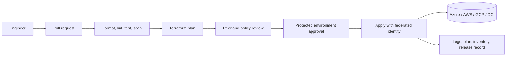
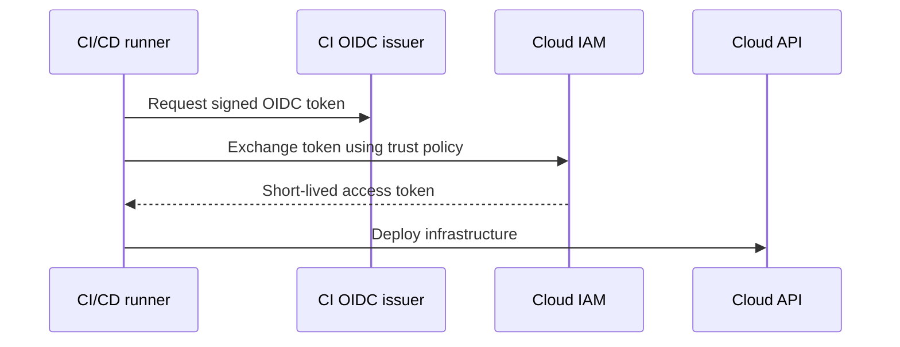
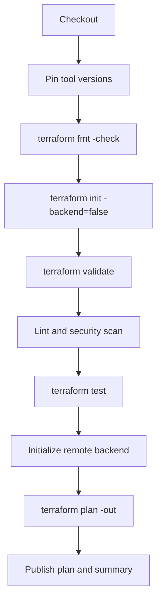

> **文档类型：** 操作指南
> **规范性术语：** **MUST**、**MUST NOT**、**SHOULD**、**SHOULD NOT** 和 **MAY** 是要求级别。
> **适用范围：** 新的多云基础设施仓库布局、所有权、IaC、CI/CD、安全、测试、发布和操作控制。
> **例外流程：** 偏离要求需要记录风险评估、补偿控制、指定风险负责人和到期日期。

|控制领域|价值|
|---|---|
|文件编号 | `HTG-01` |
|负责人|云卓越中心 |
|审核周期|至少每年一次，并且在重大仓库变更、IaC 或交付变更之后 |
|证据|仓库支架、分支和所有权规则、验证结果、身份配置、计划制品、文档和恢复检查 |

# 如何启动新的基础设施仓库

> **简要决定：** 从仓库契约开始，该契约从第一次提交开始就明确了所有权、验证、身份、发布和恢复。

> **文件类型：** 实施指南
> **主要示例：** Azure 和 Terraform
> **云范围：** Azure、AWS、GCP 和 Oracle Cloud Infrastructure (OCI)
> **操作原则：** 使用短期身份、不可变制品、最小权限、策略即代码和自动验证。


## 目标

创建一个可由多名工程师操作的仓库，而无需依赖未记录的本地知识。仓库必须明确所有权、环境边界、状态位置、验证、部署和回滚。

本指南假设使用 Terraform，但仓库控件也应用于 OpenTofu、Bicep、CloudFormation、Pulumi、Deployment Manager 替代品和 OCI Resource Manager。

## 目标运营模式

对有限的平台或产品使用一个仓库。不要创建包含不相关的 Landing Zone、应用堆栈和实验代码的单个仓库，除非有故意的单一仓库操作模型。

## 先决条件

- 具有受保护分支和强制拉取请求的源代码控制组织。
- 每个目标云的远程状态服务或对象存储。
- CI/CD 的工作负载标识。避免使用永久访问密钥和客户端机密。
- 包含批准版本的模块目录。
- 平台工程、安全、网络和工作负载的指定所有者。
- 定义的环境模型，例如 `dev`、`test`、`stage` 和 `prod`。

## 标准仓库结构
```text
infrastructure-repository/
├── .github/
│   ├── CODEOWNERS
│   ├── dependabot.yml
│   └── workflows/
├── .azuredevops/
│   └── pipelines/
├── docs/
│   ├── architecture.md
│   ├── operations.md
│   └── decisions/
├── environments/
│   ├── dev/
│   │   ├── backend.hcl
│   │   └── environment.tfvars
│   ├── test/
│   └── prod/
├── modules/
│   └── local-composition/
├── policies/
├── scripts/
├── tests/
├── .editorconfig
├── .gitignore
├── .pre-commit-config.yaml
├── .terraform-version
├── CODE_OF_CONDUCT.md
├── CONTRIBUTING.md
├── Makefile
├── README.md
├── main.tf
├── outputs.tf
├── providers.tf
├── variables.tf
└── versions.tf
```
将可复用模块保存在专用模块仓库或注册表中。 `modules/local-composition` 目录用于特定于仓库的组合，不打算成为共享产品。

## 初始化仓库
```bash
mkdir infrastructure-repository
cd infrastructure-repository
git init
mkdir -p docs/decisions environments/{dev,test,prod} \
  modules/local-composition policies scripts tests \
  .github/workflows .azuredevops/pipelines
touch README.md CONTRIBUTING.md .editorconfig .gitignore \
  main.tf variables.tf outputs.tf providers.tf versions.tf
```
使用显式 Terraform 和提供商约束创建 `versions.tf`：
```hcl
terraform {
  required_version = ">= 1.8, < 2.0"

  required_providers {
    azurerm = {
      source  = "hashicorp/azurerm"
      version = "~> 4.0"
    }
  }
}
```
示例约束是说明性的。根据您测试的企业基线选择约束。提交 `.terraform.lock.hcl` 进行根配置，以便提供程序选择是可重复的。

## 配置仓库维护规范

推荐`.gitignore`：
```gitignore
.terraform/
*.tfstate
*.tfstate.*
crash.log
crash.*.log
*.tfplan
*.auto.tfvars
*.auto.tfvars.json
.env
.env.*
override.tf
override.tf.json
*_override.tf
*_override.tf.json
```
不要忽略根配置中的 `.terraform.lock.hcl`。切勿提交包含机密、私钥、云凭证或未脱敏生产数据的状态、计划。

推荐的本地命令：
```makefile
.PHONY: fmt init validate test plan

fmt:
	terraform fmt -recursive -check

init:
	terraform init -backend=false

validate: init
	terraform validate

test:
	terraform test

plan:
	terraform plan -var-file=environments/$(ENV)/environment.tfvars
```
## 定义云和环境边界

对独立的爆炸半径边界使用单独的状态文件。一个实用的模型是：
```text
<organization>/<platform>/<cloud>/<region>/<environment>/<component>
```
示例：
```text
contoso/network/azure/canadacentral/prod/hub
contoso/data/aws/ca-central-1/prod/postgresql
contoso/apps/gcp/northamerica-northeast1/test/api
contoso/security/oci/ca-toronto-1/prod/vault
```
当环境具有不同的权限、审批路径、保留要求或故障域时，请勿使用 Terraform 工作区作为强隔离的替代品。单独的目录、流水线、身份和状态更容易审核。

## 配置身份

提供商映射：

|云|首选 CI 身份 |避免 |
|---|---|---|
|Azure|内部工作负载身份联合|客户机密和发布配置文件 |
|AWS |通过 OIDC 承担的 IAM 角色 |长期访问密钥 |
| GCP |工作负载身份联合|服务账户 JSON 密钥 |
|OCI |资源主体、实例主体或受控联合模式 |用户 API 密钥复制到流水线中 |

单独计划并申请权限。拉取请求标识通常应该读取资源和状态，但不能修改生产。受保护的部署身份可以仅应用于其分配的环境。

## 添加拉取请求控件

至少需要：

1. 成功格式化、验证、linting、安全扫描和测试。
2. 生成的基础设施变更计划。
3.来自`CODEOWNERS`的审查。
4. 不直接推送到默认分支。
5. 根据组织策略的要求，签署承诺或验证身份。
6. 经明确批准保护生产环境。
7. 操作、模块、提供程序和工具的依赖项更新自动化。

示例 `CODEOWNERS`：
```text
*                         @platform-engineering
/environments/prod/       @platform-engineering @security @service-owner
/modules/                  @terraform-module-maintainers
/policies/                 @cloud-governance
```
## 引导文档

初始 `README.md` 必须注明：

- 目的和非目标。
- 架构图。
- 支持的云和区域。
- 环境和状态模型。
- 所需的工具版本。
- 认证程序。
- 本地验证命令。
- 流水线流程和批准。
- 部署和回滚过程。
- 所有权和升级路径。
- 架构决策记录在案的链接。

使用 ADR 进行不可逆转或昂贵的决策，例如仓库边界、状态后端选择、网络拓扑、身份模型和模块源。

## 最小 CI 流水线

使用固定 Action 或任务版本。对于第三方 GitHub Actions，请在可行的情况下固定到完整提交 SHA。将 CI 扩展视为可执行软件。

## 验证

在第一次合并之前运行：
```bash
terraform fmt -recursive -check
terraform init -backend=false
terraform validate
terraform test
tflint --recursive
checkov -d .
```
另请验证：

- 测试部署无需静态密钥即可获取云凭证。
- 状态锁定在同时计划尝试下起作用。
- 生产应用需要受保护的批准。
- 日志和计划制品已定义保留。
- 可以根据记录在案的先决条件重新创建仓库。
- 第二位工程师可以执行记录在案的工作流程。

## 回滚和恢复

基础设施回滚并不等同于应用回滚。当架构发生更改时，重新应用旧的提交可能会破坏或替换资源。使用这个命令：

1. 停止进一步应用。
2. 保留失败的计划、日志、状态版本和提交 SHA。
3. 确定失败是否是代码、提供程序行为、策略、云 API 或部分资源创建。
4. 制定新的纠正计划。
5. 仅当状态本身损坏并且实际云资源与恢复的状态匹配时才恢复先前的状态版本。
6. 记录事件并添加回归测试。

## 完成的定义

当仓库具有记录在案的所有者、受保护的主分支、联合 CI 身份、隔离的远程状态、确定性工具版本、自动计划生成、策略和安全检查、生产批准、操作文档和经过测试的恢复路径时，该仓库就已准备就绪。

## 相关主题

- [如何使用 Azure DevOps 部署 Terraform](how-to-deploy-terraform-with-azure-devops.md)
- [如何配置远程状态和环境文件](how-to-configure-remote-state-and-environment-files.md)
- [如何使用 GitHub Actions 部署 Terraform](how-to-deploy-terraform-with-github-actions.md)

## 官方参考文档

- Terraform 配置结构：https://developer.hashicorp.com/terraform/language/modules/develop/structure
- Terraform 风格指南：https://developer.hashicorp.com/terraform/language/style
- Terraform 依赖锁定文件：https://developer.hashicorp.com/terraform/language/files/dependency-lock
- GitHub 保护分支：https://docs.github.com/en/repositories/configuring-branches-and-merges-in-your-repository/managing-protected-branches
- Azure 工作负载身份联合：https://learn.microsoft.com/en-us/entra/workload-id/workload-identity-federation
- AWS IAM OIDC 联盟：https://docs.aws.amazon.com/IAM/latest/UserGuide/id_roles_providers_create_oidc.html
- Google 工作负载身份联合：https://cloud.google.com/iam/docs/workload-identity-federation

## 相关仓库

- [andyxuan2010/azure-template](https://github.com/andyxuan2010/azure-template) — 真实来源的 Azure Terraform 仓库结构，包含模块、规划工具、流水线、示例、测试和文档。
- [andyxuan2010/oci-template](https://github.com/andyxuan2010/oci-template) — 可复用的 OCI Terraform 模块库，说明相同的仓库原则如何映射到隔间、网络、IAM、计算、存储、DNS 和负载均衡。
- [andyxuan2010/azure-landingzone](https://github.com/andyxuan2010/azure-landingzone) — 结合模块、流水线模板、运行手册、脚本、网络和共享平台模式的受控 Landing Zone 实现。
