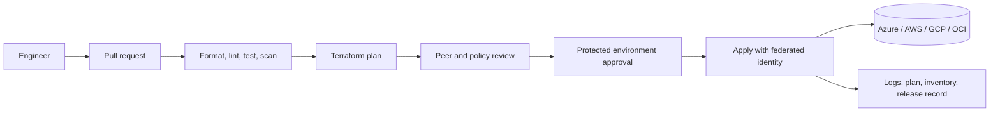
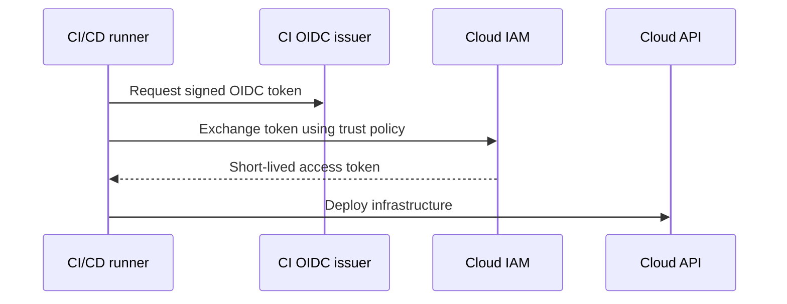
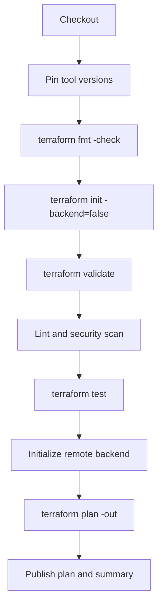

> **Document class:** How-to Guides implementation guide
> **Normative terms:** **MUST**, **MUST NOT**, **SHOULD**, **SHOULD NOT**, and **MAY** are requirements levels.
> **Applicability:** New multi-cloud infrastructure repository layout, ownership, IaC, CI/CD, security, testing, release, and operations controls.
> **Exception process:** Deviations require a documented risk assessment, compensating controls, named risk owner, and expiry date.

| Control field | Value |
|---|---|
| Document ID | `HTG-01` |
| Owner | Cloud Center of Excellence |
| Review cycle | At least annually and after material repository, IaC, or delivery changes |
| Evidence | Repository scaffold, branch and ownership rules, validation results, identity configuration, plan artifact, documentation, and recovery checks |

# How to Start a New Infrastructure Repository

> **Decision in brief:** Start with a repository contract that makes ownership, validation, identity, release, and recovery explicit from the first commit.

> **Document type:** Implementation guide
> **Primary examples:** Azure and Terraform
> **Cloud scope:** Azure, AWS, GCP, and Oracle Cloud Infrastructure (OCI)
> **Operating principle:** Use short-lived identity, immutable artifacts, least privilege, policy-as-code, and automated validation.


## Objective

Create a repository that can be operated by more than one engineer without relying on undocumented local knowledge. The repository must make ownership, environment boundaries, state locations, validation, deployment, and rollback explicit.

This guide assumes Terraform, but the repository controls also apply to OpenTofu, Bicep, CloudFormation, Pulumi, Deployment Manager replacements, and OCI Resource Manager.

## Target operating model



Use one repository for a bounded platform or product. Do not create a single repository that contains unrelated landing zones, application stacks, and experimental code unless there is a deliberate monorepo operating model.

## Prerequisites

- A source-control organization with protected branches and mandatory pull requests.
- A remote state service or object store for each target cloud.
- A workload identity for CI/CD. Avoid permanent access keys and client secrets.
- A module catalog with approved versions.
- Named owners for platform engineering, security, networking, and the workload.
- A defined environment model, such as `dev`, `test`, `stage`, and `prod`.

## Standard repository structure

```text
infrastructure-repository/
├── .github/
│   ├── CODEOWNERS
│   ├── dependabot.yml
│   └── workflows/
├── .azuredevops/
│   └── pipelines/
├── docs/
│   ├── architecture.md
│   ├── operations.md
│   └── decisions/
├── environments/
│   ├── dev/
│   │   ├── backend.hcl
│   │   └── environment.tfvars
│   ├── test/
│   └── prod/
├── modules/
│   └── local-composition/
├── policies/
├── scripts/
├── tests/
├── .editorconfig
├── .gitignore
├── .pre-commit-config.yaml
├── .terraform-version
├── CODE_OF_CONDUCT.md
├── CONTRIBUTING.md
├── Makefile
├── README.md
├── main.tf
├── outputs.tf
├── providers.tf
├── variables.tf
└── versions.tf
```

Keep reusable modules in a dedicated module repository or registry. The `modules/local-composition` directory is for repository-specific composition that is not intended to become a shared product.

## Initialize the repository

```bash
mkdir infrastructure-repository
cd infrastructure-repository
git init
mkdir -p docs/decisions environments/{dev,test,prod} \
  modules/local-composition policies scripts tests \
  .github/workflows .azuredevops/pipelines
touch README.md CONTRIBUTING.md .editorconfig .gitignore \
  main.tf variables.tf outputs.tf providers.tf versions.tf
```

Create `versions.tf` with explicit Terraform and provider constraints:

```hcl
terraform {
  required_version = ">= 1.8, < 2.0"

  required_providers {
    azurerm = {
      source  = "hashicorp/azurerm"
      version = "~> 4.0"
    }
  }
}
```

The example constraint is illustrative. Select constraints based on your tested enterprise baseline. Commit `.terraform.lock.hcl` for root configurations so provider selections are reproducible.

## Configure repository hygiene

Recommended `.gitignore`:

```gitignore
.terraform/
*.tfstate
*.tfstate.*
crash.log
crash.*.log
*.tfplan
*.auto.tfvars
*.auto.tfvars.json
.env
.env.*
override.tf
override.tf.json
*_override.tf
*_override.tf.json
```

Do not ignore `.terraform.lock.hcl` in a root configuration. Never commit state, plans containing secrets, private keys, cloud credentials, or unredacted production data.

Recommended local commands:

```makefile
.PHONY: fmt init validate test plan

fmt:
	terraform fmt -recursive -check

init:
	terraform init -backend=false

validate: init
	terraform validate

test:
	terraform test

plan:
	terraform plan -var-file=environments/$(ENV)/environment.tfvars
```

## Define cloud and environment boundaries

Use separate state files for independent blast-radius boundaries. A practical model is:

```text
<organization>/<platform>/<cloud>/<region>/<environment>/<component>
```

Examples:

```text
contoso/network/azure/canadacentral/prod/hub
contoso/data/aws/ca-central-1/prod/postgresql
contoso/apps/gcp/northamerica-northeast1/test/api
contoso/security/oci/ca-toronto-1/prod/vault
```

Do not use Terraform workspaces as a substitute for strong isolation when environments have different permissions, approval paths, retention requirements, or failure domains. Separate directories, pipelines, identities, and state are easier to audit.

## Configure identity



Provider mapping:

| Cloud | Preferred CI identity | Avoid |
|---|---|---|
| Azure | Entra workload identity federation | Client secrets and publish profiles |
| AWS | IAM role assumed through OIDC | Long-lived access keys |
| GCP | Workload Identity Federation | Service-account JSON keys |
| OCI | Resource principals, instance principals, or a controlled federation pattern | User API keys copied into pipelines |

Separate plan and apply permissions. The pull-request identity should normally read resources and state but not modify production. The protected deployment identity may apply only to its assigned environment.

## Add pull-request controls

At minimum, require:

1. Successful formatting, validation, linting, security scanning, and tests.
2. A generated plan for infrastructure changes.
3. Review from `CODEOWNERS`.
4. No direct pushes to the default branch.
5. Signed commits or verified identities where organizational policy requires them.
6. Protected production environments with explicit approval.
7. Dependency update automation for actions, modules, providers, and tooling.

Example `CODEOWNERS`:

```text
*                         @platform-engineering
/environments/prod/       @platform-engineering @security @service-owner
/modules/                  @terraform-module-maintainers
/policies/                 @cloud-governance
```

## Bootstrap documentation

The initial `README.md` must state:

- Purpose and non-goals.
- Architecture diagram.
- Supported clouds and regions.
- Environment and state model.
- Required tool versions.
- Authentication procedure.
- Local validation commands.
- Pipeline flow and approvals.
- Deployment and rollback procedure.
- Ownership and escalation path.
- Links to architecture decision records.

Use an ADR for irreversible or expensive decisions such as repository boundaries, state backend selection, network topology, identity model, and module source.

## Minimum CI pipeline



Use fixed action or task versions. For third-party GitHub Actions, pin to a full commit SHA where feasible. Treat CI extensions as executable software.

## Validation

Run before the first merge:

```bash
terraform fmt -recursive -check
terraform init -backend=false
terraform validate
terraform test
tflint --recursive
checkov -d .
```

Also verify:

- A test deployment can acquire cloud credentials without static secrets.
- State locking works under simultaneous plan attempts.
- Production apply requires a protected approval.
- Logs and plan artifacts have defined retention.
- The repository can be recreated from documented prerequisites.
- A second engineer can execute the documented workflow.

## Rollback and recovery

Infrastructure rollback is not equivalent to application rollback. Reapplying an older commit can destroy or replace resources when schemas have changed. Use this order:

1. Stop further applies.
2. Preserve the failing plan, logs, state version, and commit SHA.
3. Determine whether the failure is code, provider behavior, policy, cloud API, or partial resource creation.
4. Generate a new corrective plan.
5. Restore a prior state version only when state itself is corrupt and the actual cloud resources match the restored state.
6. Record the incident and add a regression test.

## Definition of done

The repository is ready when it has a documented owner, protected main branch, federated CI identity, isolated remote state, deterministic tool versions, automated plan generation, policy and security checks, production approval, operational documentation, and a tested recovery path.

## Related topics

- [How to Deploy Terraform with Azure DevOps](how-to-deploy-terraform-with-azure-devops.md)
- [How to Configure Remote State and Environment Files](how-to-configure-remote-state-and-environment-files.md)
- [How to Deploy Terraform with GitHub Actions](how-to-deploy-terraform-with-github-actions.md)

## Official references

- Terraform configuration structure: https://developer.hashicorp.com/terraform/language/modules/develop/structure
- Terraform style guide: https://developer.hashicorp.com/terraform/language/style
- Terraform dependency lock file: https://developer.hashicorp.com/terraform/language/files/dependency-lock
- GitHub protected branches: https://docs.github.com/en/repositories/configuring-branches-and-merges-in-your-repository/managing-protected-branches
- Azure workload identity federation: https://learn.microsoft.com/en-us/entra/workload-id/workload-identity-federation
- AWS IAM OIDC federation: https://docs.aws.amazon.com/IAM/latest/UserGuide/id_roles_providers_create_oidc.html
- Google Workload Identity Federation: https://cloud.google.com/iam/docs/workload-identity-federation

## Related repos

- [andyxuan2010/azure-template](https://github.com/andyxuan2010/azure-template) — source-of-truth Azure Terraform repository structure with modules, planning harnesses, pipelines, examples, tests, and documentation.
- [andyxuan2010/oci-template](https://github.com/andyxuan2010/oci-template) — reusable OCI Terraform module library illustrating how the same repository principles map to compartments, networking, IAM, compute, storage, DNS, and load balancing.
- [andyxuan2010/azure-landingzone](https://github.com/andyxuan2010/azure-landingzone) — governed landing-zone implementation combining modules, pipeline templates, runbooks, scripts, networking, and shared platform patterns.
