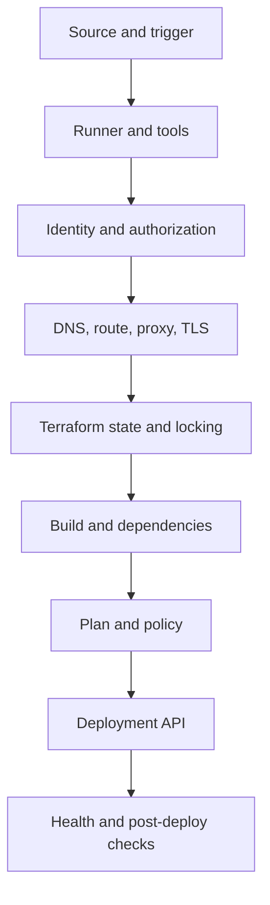
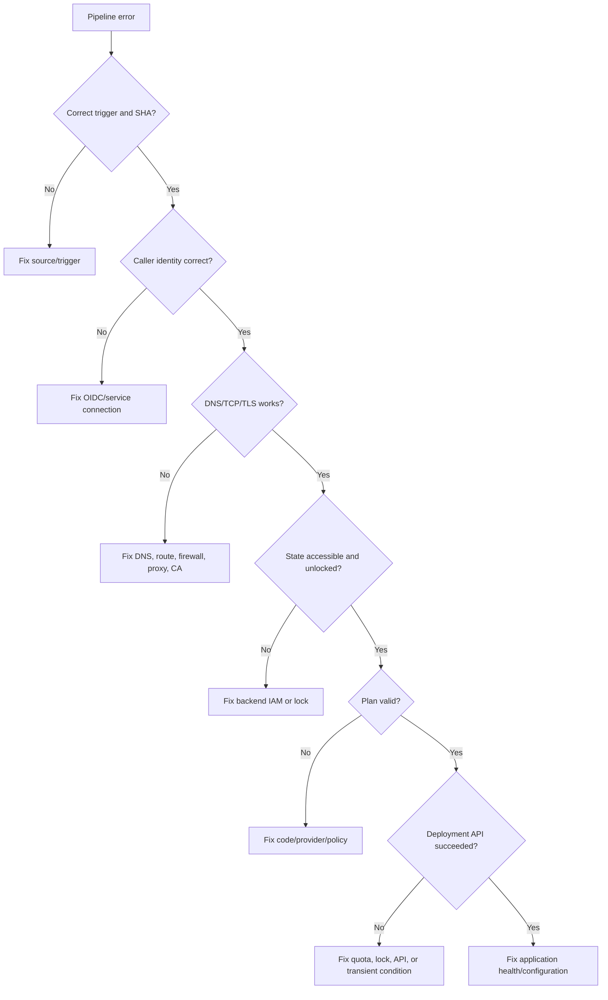

> **文档类型：** 操作指南
> **规范性术语：** **MUST**、**MUST NOT**、**SHOULD**、**SHOULD NOT** 和 **MAY** 是要求级别。
> **适用范围：** 跨源、身份、运行器、网络、Terraform、制品、批准和云 API 的系统 CI/CD 诊断。
> **例外流程：** 偏离要求需要记录风险评估、补偿控制、指定风险负责人和到期日期。

|控制领域|价值|
|---|---|
|文件编号 | `HTG-10` |
|负责人|云卓越中心 |
|审核周期|至少每年一次以及在重大流水线、提供商或事件发生变化之后 |
|证据|失败时间戳、提交、日志、相关 ID、假设、重现结果、修复和回归测试 |

# 如何排除常见流水线故障

> **决策简述：** 从第一个失败边界进行分类，保留证据，一次测试一个假设，并在结束事件之前添加回归检查。

> **文件类型：** 实施指南
> **主要示例：** Azure 和 Terraform
> **云范围：** Azure、AWS、GCP 和 Oracle Cloud Infrastructure (OCI)
> **操作原则：** 使用短期身份、不可变制品、最小权限、策略即代码和自动验证。


## 目标

通过隔离故障层而不是重复重新运行作业来排除流水线故障。重新运行可能会隐藏竞争条件、占用部署窗口并产生重复的副作用。

## 故障域模型

确定第一个失败边界。后来的错误往往是次要的。

## 捕捉证据

日志记录：
```text
pipeline run ID
job and step
commit SHA
branch or tag
environment
runner image and version
tool versions
cloud account/subscription/project/compartment
caller identity
timestamp and region
error code and request/correlation ID
state key and lock ID
artifact name and digest
```
请勿将机密、令牌、完整环境转储或 Terraform 状态粘贴到票证中。

## 分类顺序

按顺序运行这些问题：

1. 预期的流水线是否触发？
2. 是否检查了正确的提交？
3. 运行器是否健康、适应能力强？
4. 是否获取了预期的身份？
5. DNS 是否解析到预期地址？
6. TCP/TLS 是否连接？
7、身份可以访问状态吗？
8. 初始化是否选择了预期的后端和提供商？
9. 失败是确定性的吗？
10. 云 API 是否拒绝、超时或部分完成？
11.是否部署成功但验证失败？

## 源和触发器失败

症状：

- 流水线未启动。
- 部署了错误的分支或过时的提交。
- 路径过滤器忽略了更改。
- 拉取请求工作流程与合并工作流程不同。

检查：
```bash
git rev-parse HEAD
git status --porcelain
git log -1 --oneline
```
验证触发规则、分支过滤器、路径过滤器、计划时区、可复用工作流版本以及事件是否来自分叉。

纠正措施：使触发器可测试并在每个部署日志中包含签出的 SHA。

## 运行器和工具故障

症状：

- 未找到命令。
- 提供商校验和不匹配。
- 本地和 CI 之间的不同行为。
- 磁盘已耗尽。
- Docker 拉动受到限制。
- 架构不匹配。

检查：
```bash
uname -a
df -h
free -m || true
terraform version
git --version
docker version || true
env | sort | sed -E 's/(TOKEN|SECRET|PASSWORD|KEY)=.*/\1=REDACTED/I'
```
不要依赖预安装的任何版本。固定 Terraform、提供程序、操作/任务、语言运行时和包管理器。

## 身份验证失败

首先使用非机密命令打印呼叫者身份。

Azure：
```bash
az account show --query '{tenant:tenantId,subscription:id,user:user.name}' -o json
```
AWS：
```bash
aws sts get-caller-identity
```
通用控制点：
```bash
gcloud auth list
gcloud config list project
```
OCI：
```bash
oci iam region list --auth instance_principal
```
常见原因：

- OIDC 发布者、受众或主题不匹配。
- 选择了错误的环境。
- 静态凭证过期。
- 角色传播延迟。
- 尽管控制平面角色存在，但数据平面角色缺失。
- 跨账户信任条件不正确。
- 运行器时钟偏差。
- Secret 对于分叉的拉取请求不可用。

缩小信任条件。不要通过广泛分配所有者或管理员来解决授权失败。

## DNS、网络、代理和 TLS 故障
```bash
getent hosts "$HOST"
dig "$HOST"
nc -vz "$HOST" 443
curl -sv "https://$HOST/" -o /dev/null
openssl s_client -connect "$HOST:443" -servername "$HOST"
```
释义：

|结果 |意义|
|---|---|
| NX 域 | DNS 区域/日志记录/转发问题 |
|公共 IP 代替私有 IP |私有区域未关联或解析器路径被绕过 |
| TCP 超时 |路由、防火墙、安全组、NSG、代理或服务端点 |
| TLS 未知 CA |企业 CA 缺失、被拦截或证书链错误 |
| TLS 主机名不匹配 | FQDN、直接 IP 或自定义 DNS 别名错误 |
| HTTP 401/403 |网络作品；授权现在是失败的层|

对于 App Service 私有部署，测试应用和 SCM/Kudu 主机名。

## Terraform 初始化和提供程序失败
```bash
rm -rf .terraform
terraform init -reconfigure
terraform providers
terraform validate
```
常见原因：

- 缓存后端指向另一个环境。
- 锁定文件不包括运行器平台。
- 提供商注册表被阻止。
- 模块来源验证失败。
- 未配置代理或自定义 CA。
- 后端身份缺乏数据平面访问。

不要将删除 `.terraform.lock.hcl` 作为例行修复。有意更新并查看提供商的更改。

## 状态锁失败

读取锁元数据。确定所属运行。
```bash
terraform plan -lock-timeout=5m
```
仅在确认没有活动计划/应用后：
```bash
terraform force-unlock <LOCK_ID>
```
应用运行时强制解锁可能会破坏协调并产生冲突的更改。

## 计划失败

类别：

- 语法或类型错误。
- 提供商 API 读取失败。
- 策略否认。
- 配额或命名验证。
- 意外的更换。
- 漂移。
- 阻止策略评估的未知值。

有用的命令：
```bash
terraform fmt -recursive -check
terraform validate
terraform plan -out=tfplan
terraform show -json tfplan > tfplan.json
```
将无效计划与有效但不可接受的计划分开。策略拒绝是一种设计决策，而不是流水线故障。

## 制品故障

症状：

- 应用找不到计划。
- 哈希值不同。
- ZIP 布局不正确。
- 容器标签指向不同的镜像。
- 制品已过期。

控制：
```bash
sha256sum artifact.zip
unzip -l artifact.zip | head
docker buildx imagetools inspect registry/image@sha256:<digest>
```
使用不可变摘要并通过提交 SHA 存储制品元数据。确保计划和应用使用相同的仓库状态、工具版本、后端和变量输入。

## 审批和环境失败

Azure 开发运营：

- 环境不是预先创建的。
- 流水线缺乏使用环境的许可。
- 等待批准/检查。
- 服务连接批准待定。

GitHub：

- 所需的审稿人待定。
- 环境不允许分支。
- 缺少环境变量。
- 工作流缺乏部署权限。

不要通过重命名代码中的环境来绕过控制。修复保护配置。

## 云 API 和配额失败

云 API 返回请求 ID。抓住他们。检查：

- 区域服务可用性。
- 订阅/账户/项目/隔间配额。
- 资源提供商注册。
- 组织策略。
- 命名的唯一性。
- API 启用。
- 最终一致性。
- 资源锁。
- 对同一资源的并发操作。

仅重试幂等操作，并且仅重试已记录在案的瞬态错误。使用带抖动的有界指数退避。

## 部署成功，验证失败

除非另有证明，否则这是应用或环境故障。

检查：

- 正确的制品版本。
- 健康端点。
- 启动日志。
- 机密参考文档。
- DNS 和依赖项访问。
- 数据库模式兼容性。
- 负载均衡器后端运行状况。
- Kubernetes 探测器。
- App Service 插槽设置。
- 功能开关。

不要仅仅因为部署 API 返回 `200` 就将发布标记为成功。

## 决策树

## 事件结束

流水线事件直到以下情况才会结束：

- 确定根本原因。
- 临时解决方法已被删除或日志记录。
- 添加回归测试或控制。
- 诊断期间授予的多余权限将被撤销。
- 日志中暴露的机密会被轮换。
- 操作手册已更正。
- 事件链接到请求 ID、提交和证据。

## 验证

当第一个故障边界得到证实、修复最小化、部署状态得到协调、凭据和权限安全、重试合理、部署后运行状况通过并且回归控制可防止再次发生时，故障排除就完成了。

## 相关主题

- [如何定义 SLO 和错误预算](how-to-define-slos-and-error-budgets.md)
- [如何运行多云事件响应](how-to-run-a-multicloud-incident-response.md)
- [如何使用 Azure DevOps 部署 Terraform](how-to-deploy-terraform-with-azure-devops.md)

## 官方参考文档

- Azure Pipelines 运行顺序：https://learn.microsoft.com/en-us/azure/devops/pipelines/process/runs
- GitHub Actions 故障排除：https://docs.github.com/en/actions/monitoring-and-troubleshooting-workflows
- Terraform 调试：https://developer.hashicorp.com/terraform/internals/debugging
- Terraform 状态锁定：https://developer.hashicorp.com/terraform/language/state/locking
- Kubernetes 应用调试：https://kubernetes.io/docs/tasks/debug/debug-application/

## 相关仓库

- [andyxuan2010/ci-cd-template](https://github.com/andyxuan2010/ci-cd-template) — CI/CD 启动器，带有 GitHub Actions、环境设置和 PowerShell/Bash 实用程序，适合重现和纠正流水线故障。
- [andyxuan2010/azure-template](https://github.com/andyxuan2010/azure-template) — 经过验证的 Terraform 模块、规划工具、测试和 Azure DevOps 流水线，可演示受控的故障边界。
- [andyxuan2010/azure-landingzone](https://github.com/andyxuan2010/azure-landingzone) — 面向生产的 Terraform 和流水线实现，具有用于端到端诊断的运行手册和共享平台依赖项。
