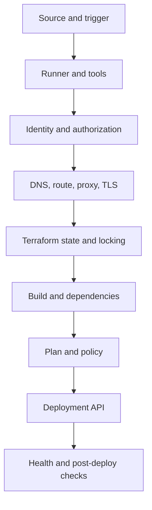
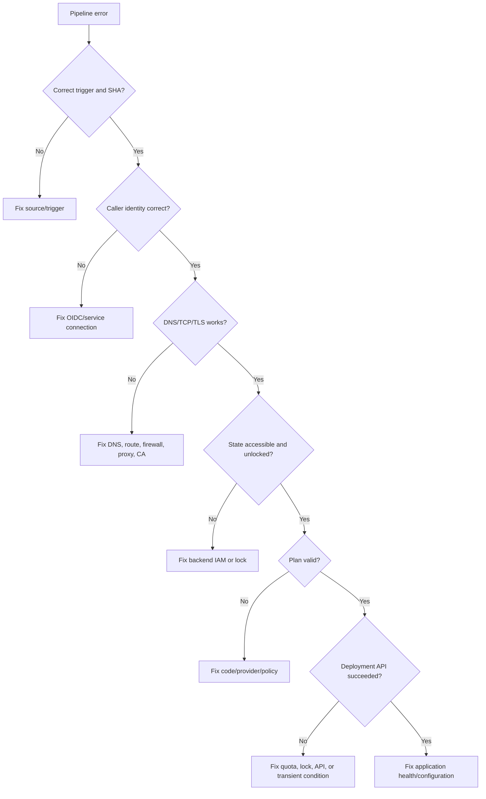

> **Document class:** How-to Guides implementation guide
> **Normative terms:** **MUST**, **MUST NOT**, **SHOULD**, **SHOULD NOT**, and **MAY** are requirements levels.
> **Applicability:** Systematic CI/CD diagnosis across source, identity, runners, networks, Terraform, artifacts, approvals, and cloud APIs.
> **Exception process:** Deviations require a documented risk assessment, compensating controls, named risk owner, and expiry date.

| Control field | Value |
|---|---|
| Document ID | `HTG-10` |
| Owner | Cloud Center of Excellence |
| Review cycle | At least annually and after material pipeline, provider, or incident changes |
| Evidence | Failure timestamp, commit, logs, correlation IDs, hypothesis, reproduced result, remediation, and regression test |

# How to Troubleshoot Common Pipeline Failures

> **Decision in brief:** Triage from the first failing boundary, preserve evidence, test one hypothesis at a time, and add a regression check before closing the incident.

> **Document type:** Implementation guide
> **Primary examples:** Azure and Terraform
> **Cloud scope:** Azure, AWS, GCP, and Oracle Cloud Infrastructure (OCI)
> **Operating principle:** Use short-lived identity, immutable artifacts, least privilege, policy-as-code, and automated validation.


## Objective

Troubleshoot pipelines by isolating the failing layer instead of repeatedly rerunning jobs. A rerun can hide a race condition, consume deployment windows, and create duplicate side effects.

## Failure-domain model



Identify the first failing boundary. Later errors are often secondary.

## Capture evidence

Record:

```text
pipeline run ID
job and step
commit SHA
branch or tag
environment
runner image and version
tool versions
cloud account/subscription/project/compartment
caller identity
timestamp and region
error code and request/correlation ID
state key and lock ID
artifact name and digest
```

Do not paste secrets, tokens, full environment dumps, or Terraform state into tickets.

## Triage sequence

Run these questions in order:

1. Did the expected pipeline trigger?
2. Is the correct commit checked out?
3. Is the runner healthy and compatible?
4. Did it obtain the expected identity?
5. Does DNS resolve to the expected address?
6. Does TCP/TLS connect?
7. Can the identity access state?
8. Did initialization select the expected backend and providers?
9. Is the failure deterministic?
10. Did the cloud API reject, time out, or partially complete?
11. Did deployment succeed but verification fail?

## Source and trigger failures

Symptoms:

- Pipeline did not start.
- Wrong branch or stale commit deployed.
- Path filter ignored the change.
- Pull request workflow differs from merge workflow.

Checks:

```bash
git rev-parse HEAD
git status --porcelain
git log -1 --oneline
```

Verify trigger rules, branch filters, path filters, scheduled timezone, reusable workflow version, and whether the event comes from a fork.

Corrective action: make triggers testable and include the checked-out SHA in every deployment record.

## Runner and tool failures

Symptoms:

- Command not found.
- Provider checksum mismatch.
- Different behavior between local and CI.
- Disk exhausted.
- Docker pull throttled.
- Architecture mismatch.

Checks:

```bash
uname -a
df -h
free -m || true
terraform version
git --version
docker version || true
env | sort | sed -E 's/(TOKEN|SECRET|PASSWORD|KEY)=.*/\1=REDACTED/I'
```

Do not rely on whatever version happens to be preinstalled. Pin Terraform, providers, actions/tasks, language runtimes, and package managers.

## Identity failures

First print the caller identity using a non-secret command.

Azure:

```bash
az account show --query '{tenant:tenantId,subscription:id,user:user.name}' -o json
```

AWS:

```bash
aws sts get-caller-identity
```

GCP:

```bash
gcloud auth list
gcloud config list project
```

OCI:

```bash
oci iam region list --auth instance_principal
```

Common causes:

- OIDC issuer, audience, or subject mismatch.
- Wrong environment selected.
- Expired static credential.
- Role propagation delay.
- Data-plane role missing although control-plane role exists.
- Cross-account trust condition incorrect.
- Runner clock skew.
- Secret is unavailable to forked pull requests.

Fix trust conditions narrowly. Do not solve an authorization failure by assigning owner or administrator broadly.

## DNS, network, proxy, and TLS failures

```bash
getent hosts "$HOST"
dig "$HOST"
nc -vz "$HOST" 443
curl -sv "https://$HOST/" -o /dev/null
openssl s_client -connect "$HOST:443" -servername "$HOST"
```

Interpretation:

| Result | Meaning |
|---|---|
| NXDOMAIN | DNS zone/record/forwarding issue |
| Public IP instead of private | Private zone not associated or resolver path bypassed |
| TCP timeout | Route, firewall, security group, NSG, proxy, or service endpoint |
| TLS unknown CA | Missing corporate CA, interception, or wrong certificate chain |
| TLS hostname mismatch | Wrong FQDN, direct IP, or custom DNS alias |
| HTTP 401/403 | Network works; authorization is now the failing layer |

For App Service private deployment, test both application and SCM/Kudu hostnames.

## Terraform initialization and provider failures

```bash
rm -rf .terraform
terraform init -reconfigure
terraform providers
terraform validate
```

Common causes:

- Cached backend points to another environment.
- Lock file excludes runner platform.
- Provider registry blocked.
- Module source authentication failed.
- Proxy or custom CA not configured.
- Backend identity lacks data-plane access.

Do not delete `.terraform.lock.hcl` as a routine fix. Update it deliberately and review provider changes.

## State lock failures

Read the lock metadata. Determine the owning run.

```bash
terraform plan -lock-timeout=5m
```

Only after confirming no active plan/apply:

```bash
terraform force-unlock <LOCK_ID>
```

A forced unlock while an apply is running can corrupt coordination and produce conflicting changes.

## Plan failures

Categories:

- Syntax or type error.
- Provider API read failure.
- Policy denial.
- Quota or naming validation.
- Unexpected replacement.
- Drift.
- Unknown values that prevent policy evaluation.

Useful commands:

```bash
terraform fmt -recursive -check
terraform validate
terraform plan -out=tfplan
terraform show -json tfplan > tfplan.json
```

Separate an invalid plan from a valid but unacceptable plan. A policy denial is a design decision, not a pipeline malfunction.

## Artifact failures

Symptoms:

- Apply cannot find plan.
- Hash differs.
- ZIP layout incorrect.
- Container tag points to a different image.
- Artifact expired.

Controls:

```bash
sha256sum artifact.zip
unzip -l artifact.zip | head
docker buildx imagetools inspect registry/image@sha256:<digest>
```

Use immutable digests and store artifact metadata with the commit SHA. Ensure plan and apply use the same repository state, tool versions, backend, and variable inputs.

## Approval and environment failures

Azure DevOps:

- Environment not pre-created.
- Pipeline lacks permission to use environment.
- Approval/check pending.
- Service connection approval pending.

GitHub:

- Required reviewer pending.
- Branch not allowed by environment.
- Environment variable missing.
- Workflow lacks deployment permission.

Do not bypass controls by renaming the environment in code. Fix the protection configuration.

## Cloud API and quota failures

Cloud APIs return request IDs. Capture them. Check:

- Regional service availability.
- Subscription/account/project/compartment quota.
- Resource-provider registration.
- Organization policy.
- Naming uniqueness.
- API enablement.
- Eventual consistency.
- Resource locks.
- Concurrent operation on the same resource.

Retry only idempotent operations and only for documented transient errors. Use bounded exponential backoff with jitter.

## Deployment succeeded, verification failed

This is an application or environment failure until proven otherwise.

Check:

- Correct artifact version.
- Health endpoint.
- Startup logs.
- Secret references.
- DNS and dependency access.
- Database schema compatibility.
- Load balancer backend health.
- Kubernetes probes.
- App Service slot settings.
- Feature flags.

Do not mark the release successful merely because the deployment API returned `200`.

## Decision tree



## Incident closure

A pipeline incident is not closed until:

- Root cause is identified.
- The temporary workaround is removed or documented.
- A regression test or control is added.
- Excess permissions granted during diagnosis are revoked.
- Secrets exposed in logs are rotated.
- Runbooks are corrected.
- The incident links to request IDs, commits, and evidence.

## Validation

Troubleshooting is complete when the first failing boundary is proven, the fix is minimal, the deployment state is reconciled, credentials and permissions are safe, retries are justified, post-deployment health passes, and a regression control prevents recurrence.

## Related topics

- [How to Define SLOs and Error Budgets](how-to-define-slos-and-error-budgets.md)
- [How to Run a Multi-Cloud Incident Response](how-to-run-a-multicloud-incident-response.md)
- [How to Deploy Terraform with Azure DevOps](how-to-deploy-terraform-with-azure-devops.md)

## Official references

- Azure Pipelines run sequence: https://learn.microsoft.com/en-us/azure/devops/pipelines/process/runs
- GitHub Actions troubleshooting: https://docs.github.com/en/actions/monitoring-and-troubleshooting-workflows
- Terraform debugging: https://developer.hashicorp.com/terraform/internals/debugging
- Terraform state locking: https://developer.hashicorp.com/terraform/language/state/locking
- Kubernetes application debugging: https://kubernetes.io/docs/tasks/debug/debug-application/

## Related repos

- [andyxuan2010/ci-cd-template](https://github.com/andyxuan2010/ci-cd-template) — CI/CD starter with GitHub Actions, environment setup, and PowerShell/Bash utilities suitable for reproducing and correcting pipeline failures.
- [andyxuan2010/azure-template](https://github.com/andyxuan2010/azure-template) — validated Terraform modules, planning harnesses, tests, and Azure DevOps pipelines that demonstrate controlled failure boundaries.
- [andyxuan2010/azure-landingzone](https://github.com/andyxuan2010/azure-landingzone) — production-oriented Terraform and pipeline implementation with runbooks and shared platform dependencies for end-to-end diagnosis.
