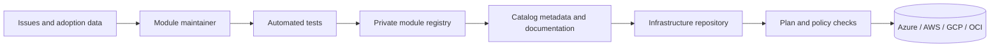
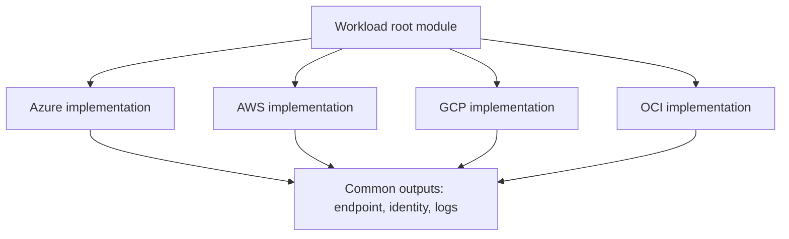
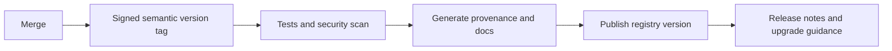

> **文档类型：** 操作指南
> **规范性术语：** **MUST**、**MUST NOT**、**SHOULD**、**SHOULD NOT** 和 **MAY** 是要求级别。
> **适用范围：** 批准的 Terraform 模块选择、版本控制、使用、验证、升级、所有权和多云目录治理。
> **例外流程：** 偏离要求需要记录风险评估、补偿控制、指定风险负责人和到期日期。

|控制领域|价值|
|---|---|
|文件编号 | `HTG-02` |
|负责人|云卓越中心 |
|审核周期|至少每年一次，并且在重大模块、提供程序或界面发生变化之后 |
|证据|模块元数据、版本和来源证明、兼容性测试、计划输出、消费者批准、升级结果和弃用日志记录 |

# 如何使用 Terraform 模块目录

> **简要决定：** 按版本和契约使用批准的模块，在升级之前验证兼容性，并保持所有权和弃用可见。

> **文件类型：** 实施指南
> **主要示例：** Azure 和 Terraform
> **云范围：** Azure、AWS、GCP 和 Oracle Cloud Infrastructure (OCI)
> **操作原则：** 使用短期身份、不可变制品、最小权限、策略即代码和自动验证。


## 目标

使用共享的 Terraform 模块，无需将目录变成不受控制的代码集合。模块目录是一个产品表面：模块需要所有权、语义版本控制、兼容性声明、示例、测试、发布说明和退役过程。

## 目录架构

## 模块分类

使用一致的分类法：

|层 |目的|示例|
|---|---|---|
|基础模块|使用企业默认值封装一项服务 |存储账户、S3 存储桶、GCS 存储桶、OCI Object Storage 存储桶 |
|模式|将服务组合成可复用的设计 |私有网络应用、中心网络、Kubernetes 平台 |
|Landing Zone 组件 |实施组织规模的控制 |账户/订阅/项目/隔间基线 |
|工作负载构成 |连接一个应用的目录模块 | API、数据库、监控、DNS |
|策略模块|分发策略定义或分配 | Azure Policy、AWS Organizations 策略、GCP Organization Policy、OCI Security Zones |

避免仅仅重命名每个提供程序参数的模块。有用的模块可以强制执行稳定的契约，减少重复的设计决策，并添加测试或控制。

## 查找并评估模块

在使用模块之前，请检查：

1. 所有者和支持层。
2. 最新稳定版本和发布日期。
3. 提供程序和 Terraform 兼容性。
4. 输入、输出、默认值和示例。
5. 安全控制和策略例外。
6. 升级说明和已知重大更改。
7. 测试覆盖率和发布来源。
8. 弃用状态。
9. 许可和批准的来源。
10. 模块是否公开所需的提供程序功能。

当所有权不清楚、版本未标记、源可变、示例需要静态凭据或隐藏关键行为时，拒绝模块。

## 使用注册表模块
```hcl
module "network" {
  source  = "app.terraform.io/contoso/network/azurerm"
  version = "3.4.2"

  name                = "prod-hub"
  address_space       = ["10.20.0.0/16"]
  location            = var.location
  resource_group_name = var.resource_group_name

  tags = local.required_tags
}
```
在生产根模块中固定确切的版本。诸如 `>= 1.0` 之类的宽松约束允许未经审查的主要版本。在使用自动依赖项更新的情况下，让自动化提出更改引脚并生成计划的拉取请求。

Git 源示例：
```hcl
module "network" {
  source = "git::https://github.com/contoso/terraform-azurerm-network.git?ref=v3.4.2"
}
```
不要使用 `main` 等分支作为生产源。分支是可变的并且会破坏再现性。

## 多云模块命名

使用注册表约定：
```text
terraform-<provider>-<name>
```
示例：
```text
terraform-azurerm-private-web-app
terraform-aws-private-web-service
terraform-google-private-service
terraform-oci-private-application
```
对于云中立的外观，请使用单独的特定于提供程序的子模块。不要将根本不同的服务强行放入最小公分母接口中。

## 验证模块契约

检查变量：
```bash
terraform-config-inspect ./module
terraform-docs markdown table ./module
```
运行模块示例：
```bash
cd examples/basic
terraform init
terraform validate
terraform plan
terraform test
```
确认：

- 确实需要所需的输入。
- 默认值对于生产来说是安全的。
- 敏感输出标记为 `sensitive = true`。
- 该模块不会创建隐藏的公共访问。
- 资源名称和标签遵循企业标准。
- 输出仅公开稳定的集成点。
- 提供程序配置是从根模块传递的，而不是在内部声明的。
- 提供程序别名已记录在案。

## 特定于提供程序的消费示例

Azure：
```hcl
module "key_vault" {
  source  = "app.terraform.io/contoso/key-vault/azurerm"
  version = "2.1.0"

  public_network_access_enabled = false
  enable_rbac_authorization     = true
}
```
AWS：
```hcl
module "bucket" {
  source  = "app.terraform.io/contoso/secure-bucket/aws"
  version = "4.0.1"

  block_public_access = true
  versioning_enabled  = true
}
```
通用控制点：
```hcl
module "storage" {
  source  = "app.terraform.io/contoso/secure-bucket/google"
  version = "2.3.0"

  uniform_bucket_level_access = true
  public_access_prevention    = "enforced"
}
```
OCI：
```hcl
module "bucket" {
  source  = "app.terraform.io/contoso/secure-bucket/oci"
  version = "1.7.0"

  storage_tier = "Standard"
  visibility   = "NoPublicAccess"
}
```
输入名称不同是因为提供程序的功能不同。标准化概念，而不是人为的语法。

## 升级模块

使用受控序列：
```bash
git checkout -b chore/upgrade-network-module
# Change only the module version first.
terraform init -upgrade
terraform fmt -recursive
terraform validate
terraform test
terraform plan -out=upgrade.tfplan
terraform show -json upgrade.tfplan > upgrade-plan.json
```
评论：

- 资源替换。
- 需要 `moved` 块的地址更改。
- 提供程序升级。
- 默认值更改。
- 新的公共端点。
- IAM 扩展。
- 加密或记录更改。
- 重命名输出。
- 状态迁移。

`moved` 块示例：
```hcl
moved {
  from = module.network.azurerm_virtual_network.this
  to   = module.network.azurerm_virtual_network.main
}
```
当映射有效时，`moved` 块会更改状态地址，而无需重新创建对象。

## 内部发布模块

可发布的模块应包括：
```text
README.md
CHANGELOG.md
LICENSE
main.tf
variables.tf
outputs.tf
versions.tf
examples/
tests/
```
发布流程：

使用语义版本控制：

- 补丁：兼容缺陷修复。
- 次要：向后兼容能力。
- 重大：破坏界面或行为改变。

即使变量类型保持不变，更改默认值也可能会造成破坏。

## 故障排除

|症状|可能的原因 |纠正措施|
|---|---|---|
|找不到模块 |源地址或注册中心认证错误|验证命名空间、提供程序名称和令牌范围 |
|版本不可用 |标签未发布或受约束排除 |检查注册表版本和精确约束 |
|提供程序配置错误 |子模块错误地声明或期望别名 |从 root 显式传递提供程序 |
|意外的更换 |资源地址或 ForceNew 字段已更改 |比较计划；仅使用 `moved` 进行地址重构 |
|输出缺失 |版本契约变更 |阅读发布说明；刻意更新消费者|
|计划期间访问被拒绝 |模块读取计划身份范围之外的数据源 |授予只读范围或重新设计模块 |

## 验证

当源和版本不可变、所有权已知、声明兼容性、示例和测试通过、计划经过审查、策略检查通过、重大更改得到解决以及所选版本记录在发布证据中时，模块就可以安全使用。

## 相关主题

- [如何配置远程状态和环境文件](how-to-configure-remote-state-and-environment-files.md)
- [如何使用 Azure DevOps 部署 Terraform](how-to-deploy-terraform-with-azure-devops.md)
- [如何使用 GitHub Actions 部署 Terraform](how-to-deploy-terraform-with-github-actions.md)

## 官方参考文档

- Terraform 模块使用：https://developer.hashicorp.com/terraform/tutorials/modules/module-use
- 标准模块结构：https://developer.hashicorp.com/terraform/language/modules/develop/structure
- 模块来源：https://developer.hashicorp.com/terraform/language/modules/sources
- HCP Terraform 私有注册表：https://developer.hashicorp.com/terraform/cloud-docs/registry
- Terraform 测试：https://developer.hashicorp.com/terraform/language/tests
- 语义版本控制：https://semver.org/

## 相关仓库

- [andyxuan2010/azure-template](https://github.com/andyxuan2010/azure-template) — 维护 Azure 模块源，其中包含适合目录发布的示例、测试、文档和基于流水线的验证。
- [andyxuan2010/oci-template](https://github.com/andyxuan2010/oci-template) — OCI 模块库展示了围绕可复用基础设施功能组织的特定于提供程序的目录。
