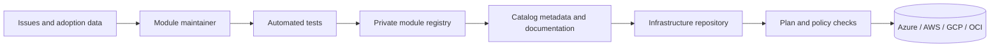
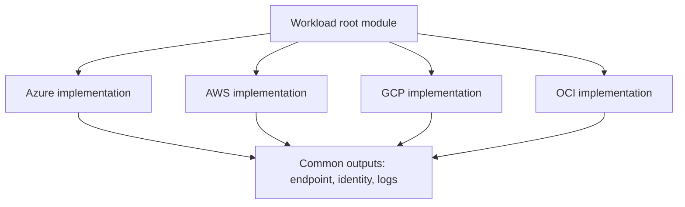
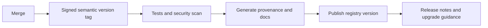

> **Document class:** How-to Guides implementation guide
> **Normative terms:** **MUST**, **MUST NOT**, **SHOULD**, **SHOULD NOT**, and **MAY** are requirements levels.
> **Applicability:** Approved Terraform module selection, versioning, consumption, validation, upgrade, ownership, and multi-cloud catalog governance.
> **Exception process:** Deviations require a documented risk assessment, compensating controls, named risk owner, and expiry date.

| Control field | Value |
|---|---|
| Document ID | `HTG-02` |
| Owner | Cloud Center of Excellence |
| Review cycle | At least annually and after material module, provider, or interface changes |
| Evidence | Module metadata, version and provenance, compatibility tests, plan output, consumer approval, upgrade result, and deprecation record |

# How to Use the Terraform Module Catalog

> **Decision in brief:** Consume approved modules by version and contract, validate compatibility before upgrading, and keep ownership and deprecation visible.

> **Document type:** Implementation guide
> **Primary examples:** Azure and Terraform
> **Cloud scope:** Azure, AWS, GCP, and Oracle Cloud Infrastructure (OCI)
> **Operating principle:** Use short-lived identity, immutable artifacts, least privilege, policy-as-code, and automated validation.


## Objective

Use shared Terraform modules without turning the catalog into an uncontrolled collection of code. A module catalog is a product surface: modules require ownership, semantic versioning, compatibility declarations, examples, tests, release notes, and a retirement process.

## Catalog architecture



## Module classification

Use a consistent taxonomy:

| Layer | Purpose | Example |
|---|---|---|
| Primitive | Wraps one service with enterprise defaults | Storage account, S3 bucket, GCS bucket, OCI Object Storage bucket |
| Pattern | Composes services into a reusable design | Private web application, hub network, Kubernetes platform |
| Landing-zone component | Implements organization-scale controls | Account/subscription/project/compartment baseline |
| Workload composition | Connects catalog modules for one application | API, database, monitoring, DNS |
| Policy module | Distributes policy definitions or assignments | Azure Policy, AWS Organizations policies, GCP Org Policy, OCI Security Zones |

Avoid modules that merely rename every provider argument. A useful module enforces a stable contract, reduces repeated design decisions, and adds tests or controls.

## Find and assess a module

Before consuming a module, inspect:

1. Owner and support tier.
2. Latest stable version and release date.
3. Provider and Terraform compatibility.
4. Inputs, outputs, defaults, and examples.
5. Security controls and policy exceptions.
6. Upgrade notes and known breaking changes.
7. Test coverage and release provenance.
8. Deprecation status.
9. License and approved source.
10. Whether the module exposes required provider features.

Reject a module when ownership is unclear, versions are untagged, the source is mutable, examples require static credentials, or critical behavior is hidden.

## Consume a registry module

```hcl
module "network" {
  source  = "app.terraform.io/contoso/network/azurerm"
  version = "3.4.2"

  name                = "prod-hub"
  address_space       = ["10.20.0.0/16"]
  location            = var.location
  resource_group_name = var.resource_group_name

  tags = local.required_tags
}
```

Pin an exact version in production root modules. A permissive constraint such as `>= 1.0` allows an unreviewed major release. Where automated dependency updates are used, let automation raise a pull request that changes the pin and generates a plan.

Git source example:

```hcl
module "network" {
  source = "git::https://github.com/contoso/terraform-azurerm-network.git?ref=v3.4.2"
}
```

Do not use a branch such as `main` as the production source. Branches are mutable and break reproducibility.

## Multi-cloud module naming

Use the registry convention:

```text
terraform-<provider>-<name>
```

Examples:

```text
terraform-azurerm-private-web-app
terraform-aws-private-web-service
terraform-google-private-service
terraform-oci-private-application
```

For a cloud-neutral facade, use separate provider-specific child modules. Do not force fundamentally different services into a lowest-common-denominator interface.



## Validate the module contract

Inspect variables:

```bash
terraform-config-inspect ./module
terraform-docs markdown table ./module
```

Run the module example:

```bash
cd examples/basic
terraform init
terraform validate
terraform plan
terraform test
```

Confirm:

- Required inputs are truly required.
- Defaults are safe for production.
- Sensitive outputs are marked `sensitive = true`.
- The module does not create hidden public access.
- Resource names and tags follow enterprise standards.
- Outputs expose only stable integration points.
- Provider configuration is passed from the root module rather than declared internally.
- Aliased providers are documented.

## Provider-specific consumption examples

Azure:

```hcl
module "key_vault" {
  source  = "app.terraform.io/contoso/key-vault/azurerm"
  version = "2.1.0"

  public_network_access_enabled = false
  enable_rbac_authorization     = true
}
```

AWS:

```hcl
module "bucket" {
  source  = "app.terraform.io/contoso/secure-bucket/aws"
  version = "4.0.1"

  block_public_access = true
  versioning_enabled  = true
}
```

GCP:

```hcl
module "storage" {
  source  = "app.terraform.io/contoso/secure-bucket/google"
  version = "2.3.0"

  uniform_bucket_level_access = true
  public_access_prevention    = "enforced"
}
```

OCI:

```hcl
module "bucket" {
  source  = "app.terraform.io/contoso/secure-bucket/oci"
  version = "1.7.0"

  storage_tier = "Standard"
  visibility   = "NoPublicAccess"
}
```

Input names differ because provider capabilities differ. Standardize concepts, not artificial syntax.

## Upgrade a module

Use a controlled sequence:

```bash
git checkout -b chore/upgrade-network-module
# Change only the module version first.
terraform init -upgrade
terraform fmt -recursive
terraform validate
terraform test
terraform plan -out=upgrade.tfplan
terraform show -json upgrade.tfplan > upgrade-plan.json
```

Review for:

- Resource replacement.
- Address changes that require `moved` blocks.
- Provider upgrades.
- Default-value changes.
- New public endpoints.
- IAM expansion.
- Encryption or logging changes.
- Renamed outputs.
- State migrations.

Example `moved` block:

```hcl
moved {
  from = module.network.azurerm_virtual_network.this
  to   = module.network.azurerm_virtual_network.main
}
```

A `moved` block changes the state address without recreating the object when the mapping is valid.

## Publish a module internally

A publishable module should include:

```text
README.md
CHANGELOG.md
LICENSE
main.tf
variables.tf
outputs.tf
versions.tf
examples/
tests/
```

Release process:



Use semantic versioning:

- Patch: compatible defect fix.
- Minor: backward-compatible capability.
- Major: breaking interface or behavior change.

Changing a default can be breaking even if the variable type remains unchanged.

## Troubleshooting

| Symptom | Likely cause | Corrective action |
|---|---|---|
| Module not found | Wrong source address or registry authentication | Validate namespace, provider name, and token scope |
| Version unavailable | Tag not published or excluded by constraint | Inspect registry versions and exact constraint |
| Provider configuration error | Child module declares or expects aliases incorrectly | Pass providers explicitly from root |
| Unexpected replacement | Resource address or ForceNew field changed | Compare plans; use `moved` only for address refactors |
| Output missing | Version contract changed | Read release notes; update consumer deliberately |
| Access denied during plan | Module reads data sources outside plan identity scope | Grant read-only scope or redesign the module |

## Validation

A module is safely consumed when the source and version are immutable, ownership is known, compatibility is declared, examples and tests pass, the plan is reviewed, policy checks pass, breaking changes are addressed, and the selected version is recorded in the release evidence.

## Related topics

- [How to Configure Remote State and Environment Files](how-to-configure-remote-state-and-environment-files.md)
- [How to Deploy Terraform with Azure DevOps](how-to-deploy-terraform-with-azure-devops.md)
- [How to Deploy Terraform with GitHub Actions](how-to-deploy-terraform-with-github-actions.md)

## Official references

- Terraform module use: https://developer.hashicorp.com/terraform/tutorials/modules/module-use
- Standard module structure: https://developer.hashicorp.com/terraform/language/modules/develop/structure
- Module sources: https://developer.hashicorp.com/terraform/language/modules/sources
- HCP Terraform private registry: https://developer.hashicorp.com/terraform/cloud-docs/registry
- Terraform testing: https://developer.hashicorp.com/terraform/language/tests
- Semantic Versioning: https://semver.org/

## Related repos

- [andyxuan2010/azure-template](https://github.com/andyxuan2010/azure-template) — maintained Azure module source with examples, tests, documentation, and pipeline-based validation suitable for catalog publication.
- [andyxuan2010/oci-template](https://github.com/andyxuan2010/oci-template) — OCI module library demonstrating a provider-specific catalog organized around reusable infrastructure capabilities.
