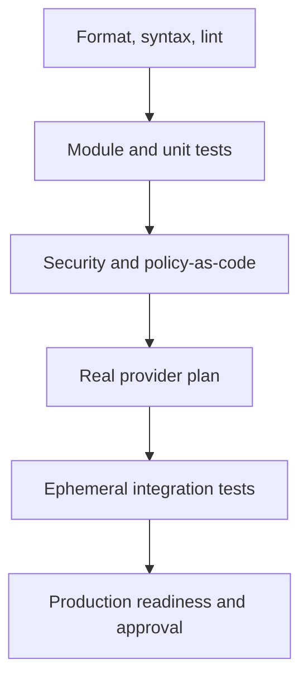
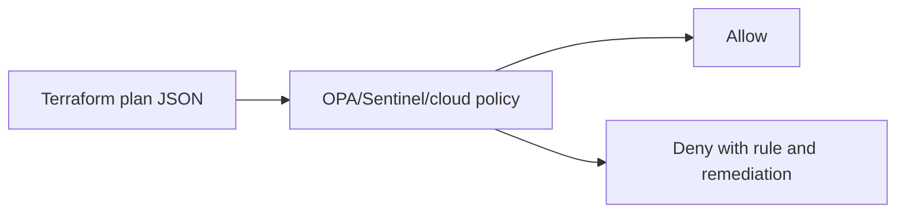
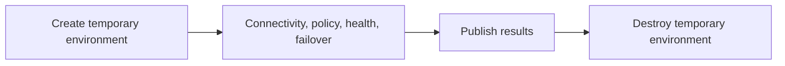

> **文档类型：** 操作指南
> **规范性术语：** **MUST**、**MUST NOT**、**SHOULD**、**SHOULD NOT** 和 **MAY** 是要求级别。
> **适用范围：** 预发布格式、单元和集成测试、策略、安全性、成本、计划、部署检查和恢复验证。
> **例外流程：** 偏离要求需要记录风险评估、补偿控制、指定风险负责人和到期日期。

|控制领域|价值|
|---|---|
|文件编号 | `HTG-11` |
|负责人|云卓越中心 |
|审核周期|至少每年一次，并且在重大验证、策略或提供商变更之后 |
|证据|源修订、测试报告、策略和安全结果、成本估算、保存的计划、集成结果和发布决策 |

# 如何在发布前验证基础设施

> **决策简述：** 通过验证代码、计划、策略、成本、集成行为和恢复路径作为一个门户，使发布审批以证据为驱动。

> **文件类型：** 实施指南
> **主要示例：** Azure 和 Terraform
> **云范围：** Azure、AWS、GCP 和 Oracle Cloud Infrastructure (OCI)
> **操作原则：** 使用短期身份、不可变制品、最小权限、策略即代码和自动验证。


## 目标

防止不安全的基础设施变更影响生产。验证必须证明的不仅仅是语法的正确性。它应该评估代码质量、模块行为、策略、安全性、成本、资源替换、集成、可运维性和恢复。

## 验证金字塔

首先运行廉价的确定性检查。仅在静态检查通过后才运行昂贵的云集成测试。

## Gate 1：格式和语法
```bash
terraform fmt -recursive -check
terraform init -backend=false
terraform validate
```
这可以采集格式、解析、类型、提供商架构和内部引用错误。它并不证明凭证、配额、策略、网络或云 API 将允许部署。

## Gate 2：lint 和文档
```bash
tflint --recursive
terraform-docs markdown table --output-check .
```
验证：

- 命名约定。
- 已弃用的参数。
- 未使用的变量和输出。
- 提供商限制。
- 变量描述和类型。
- 敏感输出。
- 例子。
- 自述文件的准确性。
- 模块所有权和版本。

不要在发布流水线中自动更正生产代码。应进行纠正并进行审查。

## Gate 3：测试

Terraform 测试示例：
```hcl
run "plan_private_storage" {
  command = plan

  assert {
    condition     = azurerm_storage_account.this.public_network_access_enabled == false
    error_message = "Storage account must not expose public network access."
  }

  assert {
    condition     = azurerm_storage_account.this.min_tls_version == "TLS1_2"
    error_message = "Storage account must require TLS 1.2 or later."
  }
}
```
测试：

- 所需的标签和标签。
- 加密。
- 公共访问。
- 日志记录。
- 身份分配。
- 备份。
- 网络布局。
- 高可用性。
- 允许的 SKU 和区域。
- 输出契约。

对逻辑使用模拟测试，对提供商行为使用真实集成测试。

## 4号门：安全扫描

至少使用一台基础设施即代码扫描器和一台机密扫描器：
```bash
checkov -d .
trivy config .
gitleaks detect --source .
```
按严重性、可利用性、暴露度和补偿控制来处理发现的问题。没有到期日或所有者的一揽子忽略文件不是治理。

每个例外都应包括：
```text
rule ID
resource
business justification
risk owner
compensating control
approval
expiry date
tracking ticket
```
## Gate 5：策略即代码

拒绝释放条件的示例：

- 公共存储或数据库。
- 暴露于互联网的管理端口。
- 缺少加密。
- 不受支持的区域。
- 未批准的资源类型。
- 缺少诊断。
- 对通配符资源的通配符 IAM 操作。
- 没有删除保护的生产资源。
- 私有端点缺少所需的 DNS 关联。

使用原生云护栏作为第二防线：

- Azure Policy。
- AWS Organizations 服务控制策略和配置规则。
- GCP Organization Policy。
- OCI Security Zones 和 Cloud Guard。

流水线策略不会取代云强制策略。

## 第 6 关：依赖性和供应链审查

检查更改：

- Terraform 版本。
- 提供商版本。
- 模块版本。
- GitHub Actions 和 Azure DevOps 任务。
- 容器构建镜像。
- 包仓库。
- 校验和与签名。
```bash
terraform providers lock \
  -platform=linux_amd64 \
  -platform=windows_amd64 \
  -platform=darwin_arm64
```
提交并审核 `.terraform.lock.hcl`。对于模块，固定不可变版本或提交 SHA。

## Gate 7：类生产计划
```bash
terraform init -reconfigure \
  -backend-config=environments/prod/backend.hcl

terraform plan \
  -input=false \
  -lock-timeout=5m \
  -var-file=environments/prod/environment.tfvars \
  -out=prod.tfplan

terraform show -json prod.tfplan > prod.tfplan.json
```
评论：

- 创建、更新、删除和替换计数。
- 敏感资源变化。
- IAM 扩展。
- 网络路由、防火墙和 DNS。
- 数据库和存储生命周期。
- 资源移动。
- 提供商默认更改。
- 未知值。
- 与变化无关的漂移。

对有状态、身份、网络或公共端点资源的任何替换都需要明确的所有者审查。

## 自动破坏性变更门

外壳检查示例：
```bash
set -euo pipefail

deletes=$(jq '
  [.resource_changes[]
   | select(.change.actions | index("delete"))]
  | length
' prod.tfplan.json)

if [ "$deletes" -gt 0 ]; then
  echo "Plan contains $deletes delete action(s)."
  exit 1
fi
```
这是故意简单的。生产实施应区分批准的替换、移动的资源、临时资源和策略例外。

## 第 8 关：成本和配额

估计：

- 每月基线。
- 峰值规模。
- 网络出口。
- 日志记录和数据保留。
- 私有端点和 DNS 解析器。
- AI 令牌和检索成本。
- Kubernetes 激增容量。
- 备份存储。
- 跨区域复制。

释放前验证配额。有效的 Terraform 计划在应用过程中仍可能失败，因为稍后检查配额或容量不可用。

## Gate 9：临时集成测试

测试最容易失败的行为：

- 私有 DNS 解析。
- TLS。
- 工作负载身份。
- 机密访问。
- 数据库连接。
- 负载均衡器的健康状况。
- 自动扩缩容。
- 备份和恢复。
——策略执行。
- 破坏行为。

使用唯一的前缀和自动过期。清理失败必须提醒负责人。

## Gate 10：运营就绪状态

生产前，验证：

- 存在仪表板和告警。
- 日志有正确的保留。
- 操作手册已链接。
- 待命的负责人已知。
- 备份和恢复已经过测试。
- 容量和配额充足。
- 维护窗口已获取批准。
- 存在回滚或前向修复程序。
- 依赖关系支持更改。
- 变更记录包含计划和制品摘要。

## 多云验证矩阵

|验证 |Azure|AWS | GCP |OCI |
|---|---|---|---|---|
|身份检查| `az account show` | `aws sts get-caller-identity` | `gcloud auth list` |具有选定身份验证模式的 OCI CLI |
|原生策略| Azure Policy | SCP/Config|Organization Policy|Security Zones/Cloud Guard|
|网络日志|NSG Flow Logs/Network Watcher|VPC Flow Logs|VPC Flow Logs|VCN Flow Logs|
|配额 | Azure 配额 API/门户 |服务配额 |云配额 |限制、配额和使用 |
|审计| Azure Activity Log |CloudTrail| Cloud Audit Logs|Audit service|

## 公布证据

存储：
```json
{
  "commit": "0123456789abcdef",
  "terraform_version": "pinned-baseline",
  "provider_lock_hash": "sha256:...",
  "plan_hash": "sha256:...",
  "artifact_hash": "sha256:...",
  "policy_result": "pass",
  "security_result": "pass-with-approved-exceptions",
  "integration_test": "pass",
  "approvers": ["platform-owner", "service-owner"],
  "release_id": "rel-2026-08-01-42"
}
```
不要将原始状态或未脱敏的机密存储在发布证据中。

## 回滚验证

紧急情况前测试回滚：

- 以前的应用制品可以针对新架构运行吗？
- 插槽或修订版可以移回吗？
- Kubernetes Helm 版本可以回滚吗？
- DNS 更改可以在 TTL 内恢复吗？
- 有状态资源可以恢复吗？
- 状态后端是否有版本控制？
- 是否明确识别了不可逆操作？

对于基础设施来说，经过审查的前向修复通常比应用旧代码更安全。

## 验证

当确定性静态检查通过、测试和安全扫描通过或已批准有时限的例外情况、策略允许计划、明确审查破坏性更改、固定依赖项、成本和配额可接受、关键集成在代表性环境中通过、运营就绪并记录回滚限制时，发布即被验证。

## 相关主题

- [如何配置远程状态和环境文件](how-to-configure-remote-state-and-environment-files.md)
- [如何实现策略即代码](how-to-implement-policy-as-code.md)
- [如何使用 Azure DevOps 部署 Terraform](how-to-deploy-terraform-with-azure-devops.md)

## 官方参考文档

- Terraform 验证：https://developer.hashicorp.com/terraform/cli/commands/validate
- Terraform 测试：https://developer.hashicorp.com/terraform/language/tests
- Terraform 计划 JSON：https://developer.hashicorp.com/terraform/internals/json-format
- Azure Policy：https://learn.microsoft.com/en-us/azure/governance/policy/
- AWS Organizations 策略：https://docs.aws.amazon.com/organizations/latest/userguide/orgs_manage_policies.html
- GCP Organization Policy：https://cloud.google.com/resource-manager/docs/organization-policy/overview
- OCI Security Zones：https://docs.oracle.com/en-us/iaas/security-zone/

## 相关仓库

- [andyxuan2010/azure-template](https://github.com/andyxuan2010/azure-template) — 真实来源 Terraform 模块，包含适合发布门的示例、测试、规划工具和 CI 验证。
- [andyxuan2010/oci-template](https://github.com/andyxuan2010/oci-template) — 可复用的 OCI Terraform 模块，用于针对共享工程控制执行特定于提供商的验证。
- [andyxuan2010/azure-landingzone](https://github.com/andyxuan2010/azure-landingzone) — 受监管的 Landing Zone 实施，可以一起验证策略、网络、平台服务、流水线和运营就绪情况。
