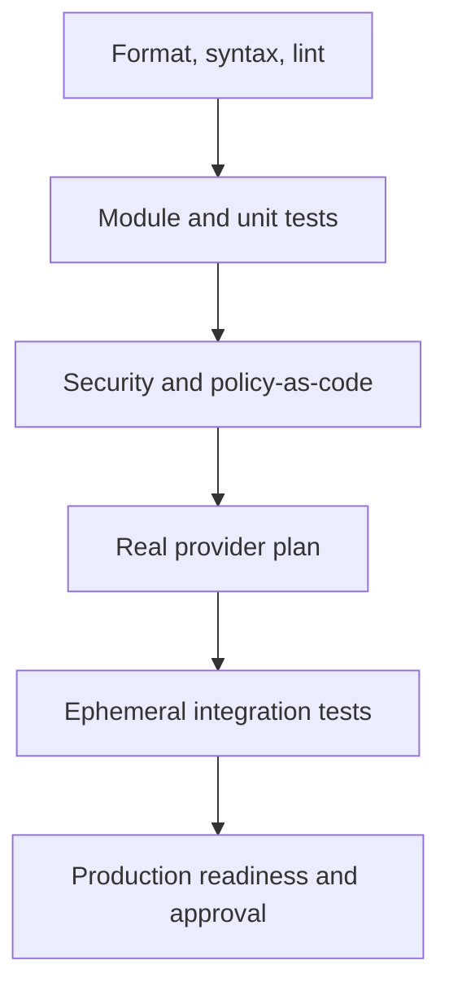
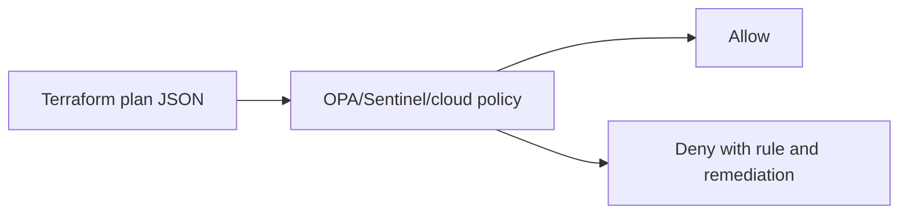
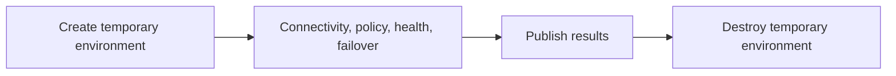

> **Document class:** How-to Guides implementation guide
> **Normative terms:** **MUST**, **MUST NOT**, **SHOULD**, **SHOULD NOT**, and **MAY** are requirements levels.
> **Applicability:** Pre-release format, unit and integration tests, policy, security, cost, plans, deployment checks, and recovery validation.
> **Exception process:** Deviations require a documented risk assessment, compensating controls, named risk owner, and expiry date.

| Control field | Value |
|---|---|
| Document ID | `HTG-11` |
| Owner | Cloud Center of Excellence |
| Review cycle | At least annually and after material validation, policy, or provider changes |
| Evidence | Source revision, test reports, policy and security findings, cost estimate, saved plan, integration result, and release decision |

# How to Validate Infrastructure Before Release

> **Decision in brief:** Make release approval evidence-driven by validating the code, plan, policy, cost, integration behavior, and recovery path as one gate.

> **Document type:** Implementation guide
> **Primary examples:** Azure and Terraform
> **Cloud scope:** Azure, AWS, GCP, and Oracle Cloud Infrastructure (OCI)
> **Operating principle:** Use short-lived identity, immutable artifacts, least privilege, policy-as-code, and automated validation.


## Objective

Prevent unsafe infrastructure changes from reaching production. Validation must prove more than syntax correctness. It should assess code quality, module behavior, policy, security, cost, resource replacement, integration, operability, and recovery.

## Validation pyramid



Run cheap deterministic checks first. Run expensive cloud integration tests only after static checks pass.

## Gate 1: formatting and syntax

```bash
terraform fmt -recursive -check
terraform init -backend=false
terraform validate
```

This catches formatting, parsing, type, provider-schema, and internal-reference errors. It does not prove that credentials, quota, policy, network, or cloud APIs will permit deployment.

## Gate 2: lint and documentation

```bash
tflint --recursive
terraform-docs markdown table --output-check .
```

Validate:

- Naming conventions.
- Deprecated arguments.
- Unused variables and outputs.
- Provider constraints.
- Variable descriptions and types.
- Sensitive outputs.
- Examples.
- README accuracy.
- Module ownership and version.

Do not auto-correct production code in the release pipeline. Corrections should be committed and reviewed.

## Gate 3: tests

Terraform test example:

```hcl
run "plan_private_storage" {
  command = plan

  assert {
    condition     = azurerm_storage_account.this.public_network_access_enabled == false
    error_message = "Storage account must not expose public network access."
  }

  assert {
    condition     = azurerm_storage_account.this.min_tls_version == "TLS1_2"
    error_message = "Storage account must require TLS 1.2 or later."
  }
}
```

Test:

- Required tags and labels.
- Encryption.
- Public access.
- Logging.
- Identity assignment.
- Backup.
- Network placement.
- High availability.
- Allowed SKUs and regions.
- Output contracts.

Use mocked tests for logic and real integration tests for provider behavior.

## Gate 4: security scanning

Use at least one infrastructure-as-code scanner and one secret scanner:

```bash
checkov -d .
trivy config .
gitleaks detect --source .
```

Treat findings by severity, exploitability, exposure, and compensating controls. A blanket ignore file with no expiry or owner is not governance.

Every exception should include:

```text
rule ID
resource
business justification
risk owner
compensating control
approval
expiry date
tracking ticket
```

## Gate 5: policy-as-code



Examples of release-denying conditions:

- Public storage or database.
- Internet-exposed management port.
- Missing encryption.
- Unsupported region.
- Unapproved resource type.
- Missing diagnostics.
- Wildcard IAM action on wildcard resource.
- Production resource without deletion protection.
- Private endpoint missing required DNS association.

Use native cloud guardrails as a second line:

- Azure Policy.
- AWS Organizations service control policies and Config rules.
- GCP Organization Policy.
- OCI Security Zones and Cloud Guard.

Pipeline policy does not replace cloud-enforced policy.

## Gate 6: dependency and supply-chain review

Review changes to:

- Terraform version.
- Provider versions.
- Module versions.
- GitHub Actions and Azure DevOps tasks.
- Container build images.
- Package repositories.
- Checksums and signatures.

```bash
terraform providers lock \
  -platform=linux_amd64 \
  -platform=windows_amd64 \
  -platform=darwin_arm64
```

Commit and review `.terraform.lock.hcl`. For modules, pin immutable versions or commit SHAs.

## Gate 7: production-like plan

```bash
terraform init -reconfigure \
  -backend-config=environments/prod/backend.hcl

terraform plan \
  -input=false \
  -lock-timeout=5m \
  -var-file=environments/prod/environment.tfvars \
  -out=prod.tfplan

terraform show -json prod.tfplan > prod.tfplan.json
```

Review:

- Create, update, delete, and replace counts.
- Sensitive resource changes.
- IAM expansion.
- Network routes, firewalls, and DNS.
- Database and storage lifecycle.
- Resource movement.
- Provider default changes.
- Unknown values.
- Drift unrelated to the change.

Any replacement of a stateful, identity, network, or public endpoint resource requires explicit owner review.

## Automated destructive-change gate

Example shell check:

```bash
set -euo pipefail

deletes=$(jq '
  [.resource_changes[]
   | select(.change.actions | index("delete"))]
  | length
' prod.tfplan.json)

if [ "$deletes" -gt 0 ]; then
  echo "Plan contains $deletes delete action(s)."
  exit 1
fi
```

This is intentionally simple. A production implementation should distinguish approved replacements, moved resources, ephemeral resources, and policy exceptions.

## Gate 8: cost and quota

Estimate:

- Monthly baseline.
- Peak scale.
- Network egress.
- Logging and data retention.
- Private endpoints and DNS resolvers.
- AI token and retrieval costs.
- Kubernetes surge capacity.
- Backup storage.
- Cross-region replication.

Validate quota before release. A valid Terraform plan can still fail during apply because quota is checked later or capacity is unavailable.

## Gate 9: ephemeral integration test



Test the most failure-prone behavior:

- Private DNS resolution.
- TLS.
- Workload identity.
- Secret access.
- Database connection.
- Load-balancer health.
- Autoscaling.
- Backup and restore.
- Policy enforcement.
- Destroy behavior.

Use a unique prefix and automatic expiry. A failed cleanup must alert an owner.

## Gate 10: operational readiness

Before production, verify:

- Dashboards and alerts exist.
- Logs have correct retention.
- Runbook is linked.
- On-call owner is known.
- Backup and restore have been tested.
- Capacity and quota are sufficient.
- Maintenance window is approved.
- Rollback or forward-fix procedure exists.
- Dependencies support the change.
- Change record contains plan and artifact digest.

## Multi-cloud validation matrix

| Validation | Azure | AWS | GCP | OCI |
|---|---|---|---|---|
| Identity check | `az account show` | `aws sts get-caller-identity` | `gcloud auth list` | OCI CLI with selected auth mode |
| Native policy | Azure Policy | SCP/Config | Organization Policy | Security Zones/Cloud Guard |
| Network logs | NSG flow logs / Network Watcher | VPC Flow Logs | VPC Flow Logs | VCN Flow Logs |
| Quota | Azure quota APIs/portal | Service Quotas | Cloud Quotas | Limits, Quotas and Usage |
| Audit | Azure Activity Log | CloudTrail | Cloud Audit Logs | Audit service |

## Release evidence

Store:

```json
{
  "commit": "0123456789abcdef",
  "terraform_version": "pinned-baseline",
  "provider_lock_hash": "sha256:...",
  "plan_hash": "sha256:...",
  "artifact_hash": "sha256:...",
  "policy_result": "pass",
  "security_result": "pass-with-approved-exceptions",
  "integration_test": "pass",
  "approvers": ["platform-owner", "service-owner"],
  "release_id": "rel-2026-08-01-42"
}
```

Do not store raw state or unredacted secrets in release evidence.

## Rollback validation

Test rollback before the emergency:

- Can the previous application artifact run against the new schema?
- Can a slot or revision be shifted back?
- Can a Kubernetes Helm release be rolled back?
- Can DNS changes be reverted within TTL?
- Can a stateful resource be restored?
- Is the state backend versioned?
- Are irreversible operations explicitly identified?

For infrastructure, a reviewed forward fix is often safer than applying old code.

## Validation

A release is validated when deterministic static checks pass, tests and security scans pass or have approved time-bound exceptions, policy allows the plan, destructive changes are explicitly reviewed, dependencies are pinned, cost and quota are acceptable, critical integrations pass in a representative environment, operational readiness is complete, and rollback limitations are documented.

## Related topics

- [How to Configure Remote State and Environment Files](how-to-configure-remote-state-and-environment-files.md)
- [How to Implement policy-as-code](how-to-implement-policy-as-code.md)
- [How to Deploy Terraform with Azure DevOps](how-to-deploy-terraform-with-azure-devops.md)

## Official references

- Terraform validate: https://developer.hashicorp.com/terraform/cli/commands/validate
- Terraform tests: https://developer.hashicorp.com/terraform/language/tests
- Terraform plan JSON: https://developer.hashicorp.com/terraform/internals/json-format
- Azure Policy: https://learn.microsoft.com/en-us/azure/governance/policy/
- AWS Organizations policies: https://docs.aws.amazon.com/organizations/latest/userguide/orgs_manage_policies.html
- GCP Organization Policy: https://cloud.google.com/resource-manager/docs/organization-policy/overview
- OCI Security Zones: https://docs.oracle.com/en-us/iaas/security-zone/

## Related repos

- [andyxuan2010/azure-template](https://github.com/andyxuan2010/azure-template) — source-of-truth Terraform modules with examples, tests, planning harnesses, and CI validation suitable for release gates.
- [andyxuan2010/oci-template](https://github.com/andyxuan2010/oci-template) — reusable OCI Terraform modules for exercising provider-specific validation against shared engineering controls.
- [andyxuan2010/azure-landingzone](https://github.com/andyxuan2010/azure-landingzone) — governed landing-zone implementation where policy, networking, platform services, pipelines, and operational readiness can be validated together.
