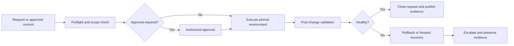

> **文档类型：** 基础设施架构参考模型
> **规范性术语：** **MUST**、**MUST NOT**、**SHOULD**、**SHOULD NOT** 和 **MAY** 是要求级别。
> **适用范围：** Enterprise Ansible 创作、控制器、清单、凭证、执行环境、目标访问、升级、恢复和多云操作。
> **例外流程：** 偏离要求需要记录风险评估、补偿控制、指定风险负责人和到期日期。

|控制领域|价值|
|---|---|
|文件编号 | `IA-02` |
|负责人|云卓越中心 |
|审核周期|至少每年一次，并且在重大自动化、控制器或目标平台发生变化之后 |
|证据|源修订、执行环境摘要、清单和凭证映射、批准历史记录、作业结果、目标更改和恢复证据 |

# Ansible 自动化架构参考模型

> **简要决定：** 分离源、策略、执行、清单、凭证和证据边界，以便 Ansible 可以在不授予不受限制的生产访问权限的情况下进行扩展。

## 目的

该参考模型定义了如何将 Ansible 自动化设计为企业平台功能而不是脚本集合。它涵盖配置管理、服务器预配后续工作、应用和中间件编排、云控制平面操作、合规性修复和操作手册。

该模型将创作、策略、执行、目标清单、凭证和证据分开。这种分离允许团队自动化不同的工作负载，而无需让每个作者不受限制地访问每个环境。它还使自动化可重复、可审查、可测试、可监控和可恢复。

在建立新的 Ansible 服务、集成团队负责的 Playbook、引入 Ansible 自动化平台或 AWX、构建自助服务自动化门户或将 Ansible 连接到 CI/CD 系统时，请使用此模型。根据组织的规模和监管要求调整实施，但将偏差记录为架构决策。

## 范围和设计成果

该架构旨在：

- Linux 和 Windows 服务器配置和维护；
- 网络、安全、数据库、中间件和应用运行手册；
- 通过提供商集合或 API 进行 Azure、AWS、GCP 和 OCI 资源操作；
- 包含数据中心、边缘和云目标的混合环境；
- 定期的合规性检查和受控的修复措施；
- 事件触发或工单触发的操作工作流程；和
- 由中央平台团队和委派工作负载团队提供的自动化。

Ansible 补充了声明式基础设施配置。 Terraform、Bicep、CloudFormation、OpenTofu 或同等工具应在选择时保持长期云拓扑的权威性； Ansible 可以在配置后配置系统并协调运维操作。

目标结果是：

- 每个自动化资产都有明确的所有者和信任边界；
- 可从版本化源修订版和不可变执行环境中重复执行；
- 对目标和云 API 的最低权限访问；
- 反映经批准的事实来源而非未记录在案的主机列表的清单；
- 从开发到生产的安全晋级；
- 每次重大运行的机器可读审核证据；和
- 经过测试的故障、取消、恢复和紧急访问路径。

## 架构原则

1. **自动化是一种产品。** Playbook、角色、集合、执行环境、清单、流水线和 Runbook 具有所有者、支持的接口、发布说明和生命周期控制。
2. **仓库是权威意图。** 生产自动化 MUST 可追溯到已审查的提交或已批准的紧急变更记录。
3. **执行是不可变的。** 运行 SHOULD 使用版本化的执行环境、固定的集合依赖项和已知的源修订版。
4. **身份是明确的。** 人工批准、自动化执行、目标访问和云 API 访问是独立的问题，即使一个平台可以在技术上用一个凭证代表它们。
5. **清单是数据，而不是机密存储。** 清单描述目标和关系；凭证和敏感值在执行时从经批准的机密系统解析。
6. **收敛比命令重放更安全。** 任务 SHOULD 描述所需的状态并使用幂等模块。命令式命令需要有记录在案的原因和可监控的成功条件。
7. **设计了爆炸半径。** 组织、控制器实例、项目、清单、凭证、作业模板和审批边界根据所有权和风险进行分区。
8. **每次运行都会留下证据。** 系统记录谁或什么发起了运行、使用了哪些修订版和环境、更改了什么、失败了什么以及需要采取哪些后续行动。
9. **恢复是设计的一部分。** 自动化必须包括预检查、检查点、回滚或前向恢复行为以及关键操作的手动回退。

## 参考架构


该图描述了逻辑功能。它们可以由 Ansible 自动化平台、AWX、企业控制器服务、托管运行器或 CI 运行器和自动化节点的受控组合来交付。产品选择不会消除对模型中显示的边界的需要。

## 逻辑架构层

### 创作和源代码控制层

自动化是在按服务、平台功能或操作域组织的 Git 仓库中编写的。仓库可能包含可复用集合或可部署自动化项目，但区别必须明确。控制器 SHOULD 使用的仓库包含作业模板所需的确切项目接口，而 SHOULD NOT 依赖于未提交的本地文件。

源层应包括：

- 表达操作工作流程或生命周期操作的 Playbook；
- 封装可复用行为的角色或集合；
- 识别目标的清单定义或清单插件；
- 带有敏感度标记的组和主变量模式；
- 依赖文件和执行环境定义；
- lint、单元、集成和安全测试；
- 变更日志、支持所有者、兼容性声明和运行手册；和
- 在非生产环境中安全执行的示例。

拉取请求是更改的正常入口点。审查日志记录应确定变更是否影响目标范围、权限、机密、网络暴露、服务可用性或数据。这些分类可以确定需要哪些审阅者和验证阶段。

### 控制和执行层

控制平面调度、授权、启动、监控和日志记录作业。自动化控制器应被视为具有自己的身份、网络、备份、修补、高可用性和灾难恢复设计的生产服务。

控制器直接或通过集成系统提供：

- 引用已知仓库和修订策略的项目；
- 打包运行时和依赖项的执行环境；
- 清单和清单来源；
- 证书或证书提供商的参考文档；
- 具有固定 Playbook、清单、凭证和限制选择的作业模板；
- 预检查、批准、执行、验证和通知的工作流程；
- 具有速率和并发控制的时间表和事件驱动触发器；
- 团队、角色、组织和审批边界；和
- 作业输出、状态、变更摘要和 API 可访问的证据。

控制平面 MUST NOT 成为业务逻辑的第二个事实来源。定义所需行为的配置属于 Git。控制器对象应该选择、参数化和授权该行为；它们不应包含隐藏在临时字段中的未记录的任务逻辑。

### 清单和目标层

清单是自动化与其管理的系统之间的契约。当不存在权威系统时，它应该源自权威的 CMDB、云资源清单、服务注册表、Kubernetes 清单或 Git 管理的定义。

清单日志记录应回答：

- 目标是什么以及如何连接到它；
- 它属于哪个环境、区域、订阅、账户、项目或隔间；
- 哪个服务和所有者对此负责；
- 应用哪些自动化集合和操作系统假设；
- 目标是否处于活动、隔离、退役或排除状态；和
- 应用哪些维护窗口、风险等级和变更控制。

动态清单是云资源和临时系统的首选。源应应用可预测的刷新策略，并在无法区分空结果和源中断时失败关闭。源中断绝不能默默地产生空清单，从而使广泛的工作能够在不触及预期目标的情况下取得成功。

### 身份和机密层

使用单独的身份：

- 发起或批准变更的人；
- 检索并执行项目的控制器或运行器；
- 用于到达受管理主机或设备的连接；
- 用于调用提供商 API 的云身份；和
- 紧急操作员使用 break-glass 程序。

凭证应该是短暂的，范围应限于最小的清单和操作集，并且可以及时检索。随附的工程标准禁止使用静态密码、长期云密钥以及提交到清单或变量的机密，除非已批准的例外情况。

对于 Azure，在 Azure 上运行的控制器可以使用执行路径支持的托管身份或工作负载身份联合。对于 AWS，使用通过可信运行时或 OIDC 联合获取的 IAM 角色。对于 GCP，请使用工作负载联邦身份验证或服务账户模拟。对于 OCI，请使用适当的资源、实例或工作负载主体。所选模式仍必须将角色限制为作业所需的订阅、账户、项目、隔间、资源和操作。

### 集成和证据层

自动化服务应集成：

- Git 和 CI 用于源验证和发布晋级；
- 用于凭证检索和轮换的 Secret Manager；
- 用于目标发现的服务目录、CMDB 或云清单；
- ITSM 用于请求、变更、事件和批准记录；
- 结果和升级消息的通知系统；
- 作业和目标事件的集中日志和安全分析；和
- 服务运行状况和自动化有效性的指标或仪表板。

当操作运行时间超过几秒时，集成应该是异步的。票证或门户请求应接收相关 ID 和状态链接，而不是等待长时间运行的 HTTP 请求。重试必须有界，幂等键应防止重复执行。

## 高层设计

### 租户和爆炸半径模式

根据所有权、数据敏感性、执行量和故障隔离来选择租户模式。以下模式是有效的：

|模式|使用时 |主要权衡 |
|---|---|---|
|中央控制器，委派团队 |大多数团队共享一个通用平台和控件 |治理有力，但控制器停电影响众多消费者 |
|每个安全边界的控制器 |监管或网络边界禁止共享执行 |更好的隔离，更多的补丁和平台开销 |
|共享控制平面，隔离执行节点|团队需要单独的网络可达性或运行时依赖性 |分离性好，但节点路由和容量需要精心设计|
| CI 管理的执行 |工作流程与拉取请求和部署流水线紧密耦合 |审计跟踪简单，但调度和操作员经验较弱 |
|混合控制器和 CI |控制器处理操作； CI 处理构建和升级 |灵活，但需要明确的触发器和证据所有权 |

默认的企业模式是一个共享的、高度可用的控制平面，具有委派的组织或团队、单独的凭据、清单分区以及网络或运行时边界的隔离执行节点。当共享控制平面违反硬信任边界或产生不可接受的相关风险时，请使用单独的控制器实例。

### 网络布局
将控制器和执行节点放置在可以通过批准的私有路径到达托管目标的位置。不要仅仅为了简化自动化而将 SSH、WinRM、设备管理或云管理端点公开到公共互联网。

网络设计应定义：

- 控制器到执行节点的流量；
- SSH、WinRM、HTTPS、数据库或设备协议的执行节点到目标的流量；
- 执行节点到云 API 和身份端点；
- 执行节点到 Git、注册表、机密、日志记录和票务端点；
- 每个信任区域的 DNS 解析和代理行为；和
- 出口限制、检查、证书验证和私有端点。

当目标网络无法接受入站连接时，请使用该网络内的运行器或执行节点、代理管理服务或受控拉取模式。异常路径不得导致凭证不受管理或控制器的未记录旁路。

### 执行环境

执行环境是自动化的可部署运行时。它应该包含：

- 固定的 Ansible 核心版本；
- 模块所需的 Python 和系统库；
- 明确声明的集合和版本；
- 项目所需的云端 SDK 或设备库；
- 受信任的证书颁发机构和代理配置；
- 支持的非 root 默认运行时；和
- 将镜像摘要链接到源和依赖项清单的来源元数据。

在 CI 中构建执行环境，扫描其中的漏洞和机密，在支持的情况下签署或证明结果，并晋级跨环境的不可变摘要。不允许生产作业在运行期间解析不受约束的 `latest` 镜像或下载任意集合。

### 清单和环境分区

使用单独的清单组或清单源进行开发、测试、暂存和生产。作业模板应绑定到已知环境，并且 SHOULD 要求对高风险操作有明确的目标限制。控制器必须防止有权访问非生产作业的用户替换生产清单或凭证。

推荐的层次结构是：
```text
all
├── cloud_azure
│   ├── azure_dev
│   ├── azure_test
│   └── azure_prod
├── cloud_aws
│   ├── aws_dev
│   └── aws_prod
├── datacenter
│   ├── linux
│   └── windows
└── network_devices
```
环境成员资格、所有者、生命周期状态和服务标识应来自清单源。主机变量应包含连接行为和非敏感事实，而不是密码、私钥、令牌或未经审查的操作覆盖。

### 控制器工作流程模式

生产工作流程应明确控制点的顺序：

预检应验证目标的可达性、维护时段、当前版本、容量、备份或快照状态、依赖项运行状况以及是否有另一个冲突作业正在运行。更改后验证应该测试服务契约，而不仅仅是最后一个任务是否返回 `changed: false`。

## 底层设计

### 仓库布局

以下布局将可复用行为与可部署工作流程分开，并将测试保留在它们保护的代码旁边：
```text
ansible-platform-automation/
├── ansible.cfg
├── collections/
│   └── requirements.yml
├── execution-environment.yml
├── inventories/
│   ├── dev/
│   │   ├── hosts.yml
│   │   ├── group_vars/
│   │   └── host_vars/
│   ├── test/
│   └── prod/
├── playbooks/
│   ├── configure-linux.yml
│   ├── patch-middleware.yml
│   └── rotate-service-certificate.yml
├── roles/
│   ├── baseline_linux/
│   │   ├── defaults/main.yml
│   │   ├── handlers/main.yml
│   │   ├── tasks/main.yml
│   │   ├── templates/
│   │   ├── molecule/default/
│   │   └── README.md
│   └── service_runtime/
├── plugins/
├── tests/
│   ├── unit/
│   └── integration/
├── .ansible-lint
├── .yamllint
├── CHANGELOG.md
├── README.md
└── SUPPORT.md
```
集合仓库可以使用标准 `galaxy.yml` 和集合命名空间布局。重要的设计属性是控制器项目、可复用角色和执行环境具有明确的所有权和发布边界。

### Playbook 契约

可部署的 playbook 应声明其支持的输入、目标组、权限要求、更改行为和验证。最小模式是：
```yaml
---
- name: Apply the managed Linux baseline
  hosts: linux
  gather_facts: true
  become: true
  serial: "{{ baseline_serial | default('25%') }}"
  max_fail_percentage: 10
  pre_tasks:
    - name: Confirm supported operating system
      ansible.builtin.assert:
        that:
          - ansible_facts.os_family in ['Debian', 'RedHat']
        fail_msg: "The baseline does not support this operating system."

  roles:
    - role: baseline_linux
      tags: [baseline]

  post_tasks:
    - name: Verify the managed service is healthy
      ansible.builtin.uri:
        url: "https://{{ inventory_hostname }}:{{ service_port }}/health"
        method: GET
        validate_certs: true
        status_code: 200
      delegate_to: localhost
      become: false
      tags: [validation]
```
该示例说明了几种体系结构控制：显式目标范围、有界并行性、故障限制、支持平台验证、模块限定任务和服务级别后置条件。

###角色界面及变量设计

角色默认值应该是安全的并记录在案。具有安全性、可用性或替换影响的变量应该是显式输入，而不是隐藏的事实。角色应该区分：

- 定义角色契约的 `role_*` 值；
- 由清单或控制器提供的环境值；
- 从目标中发现的事实；和
- 仅为需要它们的任务注入的机密。

对端口、软件包版本、允许的区域、维护时段和功能开关等值使用架构或验证任务。避免使行为依赖于微妙的变量优先级规则。如果变量可以更改生产目标集、权限或破坏性行为，则需要明确批准或单独的作业模板。

### 云 API 访问

云自动化应使用提供程序集合或具有日志记录凭证类型的 API 客户端。该作业应从清单或批准的额外变量白名单中接收订阅、账户、项目或隔间标识符。自由格式的用户输入不得选择任意租户或凭证。

每个云自动化项目应定义：

- 提供商集合和 SDK 版本；
- 云身份和允许的角色操作；
- 支持的资源范围；
- 限制和重试行为；
- 最终一致性的处理；
- 任务是权威性的还是监控性的；和
- 更改后发出的证据。

当资源生命周期复杂性、依赖关系图或状态锁定使直接命令式云更改不安全时，使用 Ansible 围绕资源状态工具进行编排。架构决策应确定哪个系统对于每种资源类型具有权威性。

### 凭证和机密流程

推荐流程为：

1. 用户或服务提交批准的请求。
2. 控制器对作业模板、清单、限制和输入进行授权。
3. 执行节点获取短期身份或机密引用。
4. Secret Manager 仅返回任务所需的凭证。
5. 任务使用凭证而不将其写入事实、制品或标准输出。
6. 凭证过期或根据其策略被撤销。
7. 控制器记录凭证身份和访问事件，而不是机密值。

`no_log: true` 应狭义地应用于可能暴露敏感值的任务，并且日志仍应保留足够的上下文来证明任务已运行以及是否成功。广泛使用 `no_log` 会删除所有诊断信息，存在操作风险。

### 并发和变更波次

使用 `serial`、`throttle`、`forks`、工作流节点依赖项和控制器并发限制来限制爆炸半径。适当的 Wave 大小取决于服务容量、法定人数要求、恢复时间和更改持续时间。从金丝雀或一个故障域开始，验证运行状况，然后进行扩展。
不要假设主机级并行性对于集群服务是安全的。底层设计应说明：

- 最大同时目标数；
- 区域、可用区或集群成员更改的顺序；
- 停止波的条件；
- 在波之间评估的健康信号；和
- 控制器或目标发生故障后的恢复行为。

### 故障和恢复模型

|失败|检测|自动化响应 |操作员处置 |
|---|---|---|---|
|目标遥不可及|连接预检查或任务超时 |根据重要性停止或跳过；不标记成功|调查网络、主机或维护状态 |
|不支持的目标版本 |断言或事实检查 |突变前失败|升级、经批准排除或使用受支持的角色路径 |
|部分变更波次|故障阈值或健康检查|停止后续波次；保留更改的主机列表 |使用 Runbook 回滚或完全前进 |
|云 API 节流|提供商响应或重试指标 |使用有界指数退避并在配额耗尽时停止 |调整波次大小或请求更改配额 |
|控制器断电|控制器健康状况和工作心跳|不开始重复执行；标记运行未知|恢复服务、检查目标状态并安全恢复 |
|机密提供商中断|凭证检索失败 |突变前失败关闭 |恢复 Secret Manager 或使用经批准的紧急通道 |
|糟糕的发布 |变更后验证或事件 |调用回滚或前向修复工作流程 |确认服务恢复并开展纠正工作 |

恢复应围绕目标的实际状态进行设计。仅当任务是幂等的、部分状态被理解并且下一次执行具有清晰的收敛路径时，重新运行失败的 Playbook 才是安全的。

### 控制器可用性和恢复

对于生产用途，定义控制器恢复目标并保护：

- 控制器配置、组织、团队、作业模板、时间表和凭证参考；
- 项目仓库和执行环境镜像；
- 清单源配置和缓存数据行为；
- 作业历史和审计证据；
- 恢复所需的加密密钥或集成凭证；和
- DNS、负载均衡器、代理和私有连接依赖项。

如果控制器备份在恢复后无法到达 Secret Manager、注册表、源仓库或目标，那么它是不够的。在隔离环境中测试恢复并执行代表性的只读和受控写入工作流程。

### 自助服务和事件驱动的自动化

自助服务接口应该公开一小组类型化、经过验证的参数。他们不应公开任意的 Playbook、凭证、清单名称或不受限制的 `--limit` 值。请求层应将业务操作映射到经过审查的作业模板，并记录请求者、目标范围、理由和批准。
事件驱动的自动化应包括重复数据删除、身份验证、模式验证、重放保护、速率限制和显式操作白名单。事件是信号，而不是授权。安全或操作事件可能会自动触发评估，但破坏性修复可能需要批准或具有有限范围的预授权策略。

## 架构审查清单

- [ ] 自动化功能具有负责任的所有者、支持模型和服务目标。
- [ ] 日志记录创作、执行、清单、身份、机密和证据边界。
- [ ] 识别每个资源或配置域的权威系统。
- [ ] 控制器租户、执行节点放置和爆炸半径限制已获取批准。
- [ ] 网络路径使用私有或明确批准的连接且出口受限。
- [ ] 执行环境、集合和 SDK 依赖项是固定且可追踪的。
- [ ] 清单成员资格、所有权、环境和生命周期状态来自批准的来源。
- [ ] 生产作业使用单独的凭据、清单、批准和并发控制。
- [ ] 自助服务参数和事件负载经过验证并列入白名单。
- [ ] 定义了预检查、金丝雀波、更改后验证、回滚和前向恢复。
- [ ] 作业日志、批准、源修订、镜像摘要和结果作为证据保留。
- [ ] 测试控制器、注册表、机密、清单和目标恢复依赖项。
- [ ] 安全监控涵盖特权作业、异常范围、失败的身份验证和机密访问。
- [ ] 异常有所有者、补偿控制和到期日期。

## 验证

架构验证应将文档审查与受控技术测试结合起来：

- 针对每个支持的目标类执行只读作业；
- 证明非授权用户无法选择生产清单或凭证；
- 验证已知安全的 Playbook 不会对合规目标产生任何更改；
- 引入受控配置差异并确认检测和修复均已日志记录；
- 中断多主机变更波并验证停止和恢复行为是否被理解；
- 使测试凭证过期或撤销，并确认失败关闭行为；
- 限制测试云 API 集成并确认有界重试行为；
- 恢复控制器配置并执行代表性恢复工作流程；和
- 关联请求、批准、源修订、执行镜像、作业、目标更改和结束证据。

## 相关主题

- [基础设施架构参考模型](infrastructure-architecture-reference-model.md)
- [基础设施即代码工程标准](../infrastructure-as-code/iac-infrastructure-as-code-engineering-standards.md)
- [流水线即代码标准和可复用模板](../ci-cd-automation/pipeline-as-code-standards-and-reusable-templates.md)
- [流水线身份和机密处理](../ci-cd-automation/pipeline-identity-and-secret-handling.md)
- [身份、机密和工作负载身份联合标准](../standards-best-practices/identity-secrets-and-workload-federation-standard.md)
- [基础设施和应用健康状况监控](../operations-reliability-finops/infrastructure-and-application-health-monitoring.md)
- [如何在发布前验证基础设施](../how-to-guides/how-to-validate-infrastructure-before-release.md)

## 参考文档

- [Ansible 文档](https://docs.ansible.com/)
- [Ansible 最佳实践指南](https://docs.ansible.com/ansible/latest/tips_tricks/ansible_tips_tricks.html)
- [Ansible 内容集合](https://docs.ansible.com/ansible/latest/collections_guide/index.html)
- [Ansible 执行环境](https://docs.ansible.com/ansible/latest/getting_started_ee/index.html)
- [Ansible 自动化平台文档](https://docs.redhat.com/en/documentation/red_hat_ansible_automation_platform/)
- [Microsoft Azure Well-Architected Framework](https://learn.microsoft.com/azure/well-architected/)
- [AWS Well-Architected Framework](https://docs.aws.amazon.com/wellarchitected/latest/framework/welcome.html)
- [GCP Well-Architected Framework](https://cloud.google.com/architecture/framework)
- [OCI Cloud Adoption Framework](https://docs.oracle.com/en-us/iaas/Content/cloud-adoption-framework/home.htm)
