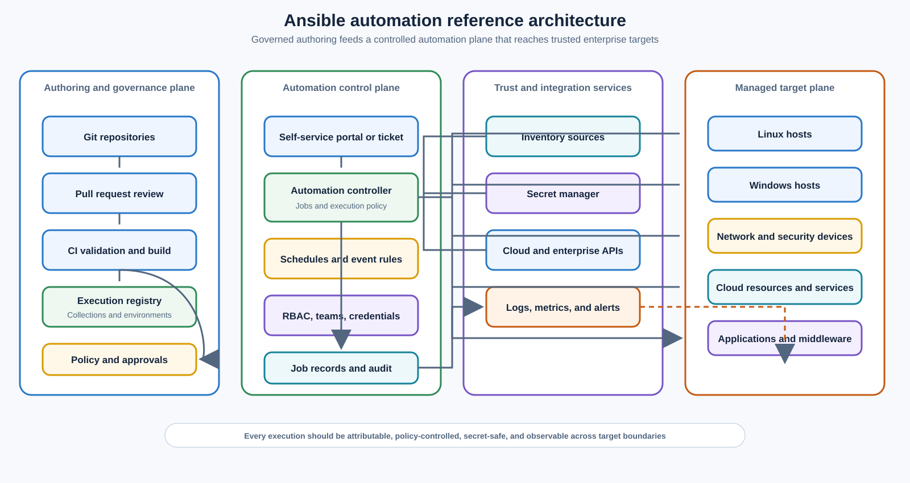
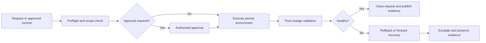

> **Document class:** Infra Architecture reference architecture
> **Normative terms:** **MUST**, **MUST NOT**, **SHOULD**, **SHOULD NOT**, and **MAY** are requirements levels.
> **Applicability:** Enterprise Ansible authoring, controller, inventory, credentials, execution environments, target access, promotion, recovery, and multi-cloud operations.
> **Exception process:** Deviations require a documented risk assessment, compensating controls, named risk owner, and expiry date.

| Control field | Value |
|---|---|
| Document ID | `IA-02` |
| Owner | Cloud Center of Excellence |
| Review cycle | At least annually and after material automation, controller, or target-platform changes |
| Evidence | Source revision, execution-environment digest, inventory and credential mappings, approval history, job results, target changes, and recovery evidence |

# Ansible Automation Architecture Reference Model

> **Decision in brief:** Separate source, policy, execution, inventory, credentials, and evidence boundaries so Ansible can scale without granting unrestricted production access.

## Purpose

This reference model defines how to design Ansible automation as an enterprise platform capability rather than a collection of scripts. It covers configuration management, server provisioning follow-up, application and middleware orchestration, cloud control-plane operations, compliance remediation, and operational runbooks.

The model separates authoring, policy, execution, target inventory, credentials, and evidence. That separation allows teams to automate different workloads without giving every author unrestricted access to every environment. It also makes automation repeatable, reviewable, testable, observable, and recoverable.

Use this model when establishing a new Ansible service, consolidating team-owned playbooks, introducing Ansible Automation Platform or AWX, building a self-service automation portal, or connecting Ansible to a CI/CD system. Adapt the implementation to the organization’s scale and regulatory requirements, but document deviations as architecture decisions.

## Scope and design outcomes

The architecture is intended for:

- Linux and Windows server configuration and maintenance;
- network, security, database, middleware, and application runbooks;
- Azure, AWS, GCP, and OCI resource operations through provider collections or APIs;
- hybrid environments containing datacenter, edge, and cloud targets;
- scheduled compliance checks and controlled remediation;
- event-triggered or ticket-triggered operational workflows; and
- automation delivered by a central platform team and delegated workload teams.

Ansible complements declarative infrastructure provisioning. Terraform, Bicep, CloudFormation, OpenTofu, or an equivalent tool should remain authoritative for long-lived cloud topology where selected; Ansible can configure systems after provisioning and orchestrate operational actions.

The target outcomes are:

- a clear owner and trust boundary for every automation asset;
- repeatable execution from a versioned source revision and immutable execution environment;
- least-privilege access to targets and cloud APIs;
- inventory that reflects an approved source of truth rather than undocumented host lists;
- safe promotion from development through production;
- machine-readable audit evidence for every material run; and
- a tested path for failure, cancellation, recovery, and emergency access.

## Architecture principles

1. **Automation is a product.** Playbooks, roles, collections, execution environments, inventories, pipelines, and runbooks have owners, supported interfaces, release notes, and lifecycle controls.
2. **The repository is the authoritative intent.** Production automation MUST be traceable to a reviewed commit or an approved emergency change record.
3. **Execution is immutable.** A run SHOULD use a versioned execution environment, pinned collection dependencies, and a known source revision.
4. **Identity is explicit.** Human approval, automation execution, target access, and cloud API access are separate concerns even when one platform can technically represent them with one credential.
5. **Inventory is data, not a secret store.** Inventory describes targets and relationships; credentials and sensitive values are resolved at execution time from an approved secret system.
6. **Convergence is safer than command replay.** Tasks SHOULD describe the desired state and use idempotent modules. Imperative commands require a documented reason and an observable success condition.
7. **Blast radius is designed.** Organizations, controller instances, projects, inventories, credentials, job templates, and approval boundaries are partitioned according to ownership and risk.
8. **Every run leaves evidence.** The system records who or what initiated the run, what revision and environment were used, what changed, what failed, and what follow-up is required.
9. **Recovery is part of the design.** Automation must include prechecks, checkpoints, rollback or forward-recovery behavior, and a manual fallback for critical operations.

## Reference architecture



The diagram describes logical capabilities. They may be delivered by Ansible Automation Platform, AWX, an enterprise controller service, a managed runner, or a controlled combination of CI runners and automation nodes. A product selection does not remove the need for the boundaries shown in the model.

## Logical architecture layers

### Authoring and source-control layer

Automation is authored in Git repositories organized by service, platform capability, or operating domain. A repository may contain a reusable collection or a deployable automation project, but the distinction must be clear. A repository that is used by a controller SHOULD contain the exact project interface expected by job templates and SHOULD NOT depend on uncommitted local files.

The source layer should include:

- playbooks that express an operational workflow or lifecycle action;
- roles or collections that encapsulate reusable behavior;
- inventory definitions or inventory plugins that identify targets;
- group and host variable schemas with sensitivity markings;
- dependency files and execution-environment definitions;
- lint, unit, integration, and security tests;
- a changelog, support owner, compatibility statement, and runbook; and
- examples that are safe to execute in a non-production environment.

Pull requests are the normal entry point for changes. The review record should identify whether the change affects target scope, privileges, secrets, network exposure, service availability, or data. These classifications can determine which reviewers and validation stages are required.

### Control and execution layer

The control plane schedules, authorizes, starts, monitors, and records jobs. An automation controller should be treated as a production service with its own identity, network, backup, patching, high-availability, and disaster-recovery design.

The controller provides, directly or through integrated systems:

- projects that reference a known repository and revision policy;
- execution environments that package the runtime and dependencies;
- inventories and inventory sources;
- credentials or references to credential providers;
- job templates with fixed playbook, inventory, credential, and limit choices;
- workflows for prechecks, approvals, execution, validation, and notification;
- schedules and event-driven triggers with rate and concurrency controls;
- teams, roles, organizations, and approval boundaries; and
- job output, status, change summaries, and API-accessible evidence.

The control plane MUST NOT become a second source of truth for business logic. Configuration that defines the desired behavior belongs in Git. Controller objects should select, parameterize, and authorize that behavior; they should not contain undocumented task logic hidden in ad hoc fields.

### Inventory and target layer

Inventory is the contract between automation and the systems it manages. It should be sourced from an authoritative CMDB, cloud resource inventory, service registry, Kubernetes inventory, or a Git-managed definition when no authoritative system exists.

An inventory record should answer:

- what the target is and how to connect to it;
- which environment, region, subscription, account, project, or compartment it belongs to;
- which service and owner are accountable for it;
- which automation collections and operating-system assumptions apply;
- whether the target is active, quarantined, decommissioning, or excluded; and
- which maintenance windows, risk class, and change controls apply.

Dynamic inventory is preferred for cloud resources and ephemeral systems. The source should apply a predictable refresh policy and fail closed when it cannot distinguish an empty result from a source outage. A source outage must not silently produce an empty inventory that allows a broad job to succeed without touching the intended targets.

### Identity and secrets layer

Use separate identities for:

- a human who authors or approves a change;
- the controller or runner that retrieves and executes the project;
- the connection used to reach a managed host or device;
- the cloud identity used to call a provider API; and
- an emergency operator using a break-glass procedure.

Credentials should be short-lived, scoped to the smallest inventory and action set, and retrieved just in time. Static passwords, long-lived cloud keys, and secrets committed to inventory or variables are prohibited by the accompanying engineering standard except under an approved exception.

For Azure, a controller running on Azure may use managed identity or workload identity federation where the execution path supports it. For AWS, use an IAM role obtained through a trusted runtime or OIDC federation. For GCP, use Workload Identity Federation or service-account impersonation. For OCI, use an appropriate resource, instance, or workload principal. The selected pattern must still restrict the role to the subscriptions, accounts, projects, compartments, resources, and actions required by the job.

### Integration and evidence layer

The automation service should integrate with:

- Git and CI for source validation and release promotion;
- a secret manager for credential retrieval and rotation;
- a service catalog, CMDB, or cloud inventory for target discovery;
- ITSM for request, change, incident, and approval records;
- a notification system for result and escalation messages;
- centralized logs and security analytics for job and target events; and
- metrics or dashboards for service health and automation effectiveness.

Integrations should be asynchronous when the operation can run for more than a few seconds. A ticket or portal request should receive a correlation ID and a status link rather than waiting on a long-running HTTP request. Retries must be bounded and idempotency keys should prevent duplicate execution.

## High-level design

### Tenancy and blast-radius patterns

Choose the tenancy pattern using ownership, data sensitivity, execution volume, and failure isolation. The following patterns are valid:

| Pattern | Use when | Main trade-off |
|---|---|---|
| Central controller, delegated teams | Most teams share a common platform and controls | Strong governance, but controller outage affects many consumers |
| Controller per security boundary | Regulatory or network boundaries prohibit shared execution | Better isolation, with more patching and platform overhead |
| Shared control plane, isolated execution nodes | Teams need separate network reachability or runtime dependencies | Good separation, but node routing and capacity require careful design |
| CI-managed execution | Workflows are tightly coupled to pull requests and deployment pipelines | Simple audit trail, but weaker scheduling and operator experience |
| Hybrid controller and CI | Controller handles operations; CI handles build and promotion | Flexible, but requires clear ownership of triggers and evidence |

The default enterprise pattern is a shared, highly available control plane with delegated organizations or teams, separate credentials, inventory partitions, and isolated execution nodes for network or runtime boundaries. Use separate controller instances when a shared control plane would violate a hard trust boundary or create unacceptable correlated risk.

### Network placement

Place controllers and execution nodes where they can reach managed targets through approved private paths. Do not expose SSH, WinRM, device management, or cloud-management endpoints to the public internet solely to simplify automation.

The network design should define:

- controller-to-execution-node traffic;
- execution-node-to-target traffic for SSH, WinRM, HTTPS, database, or device protocols;
- execution-node-to-cloud API and identity endpoints;
- execution-node-to-Git, registry, secret, logging, and ticketing endpoints;
- DNS resolution and proxy behavior for each trust zone; and
- egress restrictions, inspection, certificate validation, and private endpoints.

When a target network cannot accept inbound connections, use a runner or execution node inside that network, a brokered management service, or a controlled pull pattern. The exception path must not result in unmanaged credentials or an unlogged bypass of the controller.

### Execution environments

An execution environment is the deployable runtime for automation. It should contain:

- a pinned Ansible core version;
- Python and system libraries required by the modules;
- explicitly declared collections and versions;
- cloud SDKs or device libraries required by the project;
- trusted certificate authorities and proxy configuration;
- a non-root default runtime where supported; and
- provenance metadata linking the image digest to source and dependency manifests.

Build execution environments in CI, scan them for vulnerabilities and secrets, sign or attest the result where supported, and promote the immutable digest across environments. Do not allow production jobs to resolve an unconstrained `latest` image or download arbitrary collections during a run.

### Inventory and environment partitioning

Use separate inventory groups or inventory sources for development, test, staging, and production. A job template should bind to a known environment and SHOULD require an explicit target limit for high-risk operations. The controller must prevent a user with access to non-production jobs from substituting a production inventory or credential.

A recommended hierarchy is:

```text
all
├── cloud_azure
│   ├── azure_dev
│   ├── azure_test
│   └── azure_prod
├── cloud_aws
│   ├── aws_dev
│   └── aws_prod
├── datacenter
│   ├── linux
│   └── windows
└── network_devices
```

Environment membership, owner, lifecycle state, and service identity should come from the inventory source. Host variables should contain connection behavior and non-sensitive facts, not passwords, private keys, tokens, or unreviewed operational overrides.

### Controller workflow pattern

Production workflows should be explicit about the sequence of control points:



Preflight should validate target reachability, maintenance window, current version, capacity, backup or snapshot status, dependency health, and whether another conflicting job is running. Post-change validation should test the service contract, not merely whether the last task returned `changed: false`.

## Low-level design

### Repository layout

The following layout separates reusable behavior from deployable workflows and keeps tests next to the code they protect:

```text
ansible-platform-automation/
├── ansible.cfg
├── collections/
│   └── requirements.yml
├── execution-environment.yml
├── inventories/
│   ├── dev/
│   │   ├── hosts.yml
│   │   ├── group_vars/
│   │   └── host_vars/
│   ├── test/
│   └── prod/
├── playbooks/
│   ├── configure-linux.yml
│   ├── patch-middleware.yml
│   └── rotate-service-certificate.yml
├── roles/
│   ├── baseline_linux/
│   │   ├── defaults/main.yml
│   │   ├── handlers/main.yml
│   │   ├── tasks/main.yml
│   │   ├── templates/
│   │   ├── molecule/default/
│   │   └── README.md
│   └── service_runtime/
├── plugins/
├── tests/
│   ├── unit/
│   └── integration/
├── .ansible-lint
├── .yamllint
├── CHANGELOG.md
├── README.md
└── SUPPORT.md
```

A collection repository may use the standard `galaxy.yml` and collection namespace layout instead. The important design property is that a controller project, reusable role, and execution environment have explicit ownership and release boundaries.

### Playbook contract

Deployable playbooks should declare their supported inputs, target groups, privilege requirements, change behavior, and validation. A minimal pattern is:

```yaml
---
- name: Apply the managed Linux baseline
  hosts: linux
  gather_facts: true
  become: true
  serial: "{{ baseline_serial | default('25%') }}"
  max_fail_percentage: 10
  pre_tasks:
    - name: Confirm supported operating system
      ansible.builtin.assert:
        that:
          - ansible_facts.os_family in ['Debian', 'RedHat']
        fail_msg: "The baseline does not support this operating system."

  roles:
    - role: baseline_linux
      tags: [baseline]

  post_tasks:
    - name: Verify the managed service is healthy
      ansible.builtin.uri:
        url: "https://{{ inventory_hostname }}:{{ service_port }}/health"
        method: GET
        validate_certs: true
        status_code: 200
      delegate_to: localhost
      become: false
      tags: [validation]
```

The example illustrates several architecture controls: explicit target scope, bounded parallelism, failure limits, supported-platform validation, module-qualified tasks, and a service-level postcondition.

### Role interface and variable design

Role defaults should be safe and documented. Variables with security, availability, or replacement impact should be explicit inputs rather than hidden facts. A role should distinguish:

- `role_*` values that define the role contract;
- environment values supplied by inventory or the controller;
- facts discovered from the target; and
- secrets injected only for the task that requires them.

Use a schema or validation task for values such as ports, package versions, allowed regions, maintenance windows, and feature flags. Avoid making behavior depend on subtle variable-precedence rules. If a variable can change a production target set, privilege, or destructive behavior, require an explicit approval or a separate job template.

### Cloud API access

Cloud automation should use a provider collection or an API client with a documented credential type. The job should receive a subscription, account, project, or compartment identifier from the inventory or approved extra-vars allowlist. Free-form user input must not be able to select an arbitrary tenant or credential.

Each cloud automation project should define:

- the provider collection and SDK versions;
- the cloud identity and allowed role actions;
- the supported resource scopes;
- throttling and retry behavior;
- handling for eventual consistency;
- whether the task is authoritative or observational; and
- the evidence emitted after a change.

Use Ansible for orchestration around a resource-state tool when resource lifecycle complexity, dependency graphs, or state locking make direct imperative cloud changes unsafe. The architecture decision should identify which system is authoritative for each resource type.

### Credentials and secret flow

The recommended flow is:

1. A user or service submits an approved request.
2. The controller authorizes the job template, inventory, limit, and inputs.
3. The execution node obtains a short-lived identity or secret reference.
4. The secret manager returns only the credential required by the task.
5. The task uses the credential without writing it to facts, artifacts, or standard output.
6. The credential expires or is revoked according to its policy.
7. The controller records the credential identity and access event, not the secret value.

`no_log: true` should be applied narrowly to tasks that could expose sensitive values, and logs should still retain enough context to prove that the task ran and whether it succeeded. Broad use of `no_log` that removes all diagnostic information is an operational risk.

### Concurrency and change waves

Use `serial`, `throttle`, `forks`, workflow node dependencies, and controller concurrency limits to bound blast radius. The appropriate wave size depends on service capacity, quorum requirements, recovery time, and change duration. Start with a canary or one failure domain, validate health, then expand.

Do not assume that host-level parallelism is safe for a clustered service. The low-level design should state:

- the maximum simultaneous targets;
- the order in which zones, regions, or cluster members are changed;
- the conditions that stop the wave;
- the health signals evaluated between waves; and
- the resume behavior after a controller or target failure.

### Failure and recovery model

| Failure | Detection | Automation response | Operator action |
|---|---|---|---|
| Target unreachable | Connection precheck or task timeout | Stop or skip according to criticality; do not mark success | Investigate network, host, or maintenance state |
| Unsupported target version | Assertion or facts check | Fail before mutation | Upgrade, exclude with approval, or use a supported role path |
| Partial change wave | Failure threshold or health check | Stop subsequent waves; preserve changed-host list | Roll back or complete forward using the runbook |
| Cloud API throttling | Provider response or retry metrics | Use bounded exponential backoff and stop on quota exhaustion | Adjust wave size or request quota change |
| Controller outage | Controller health and job heartbeat | Do not start duplicate execution; mark run unknown | Restore service, inspect target state, and resume safely |
| Secret provider outage | Credential retrieval failure | Fail closed before mutation | Restore secret service or use approved emergency path |
| Bad release | Post-change validation or incident | Invoke rollback or forward-fix workflow | Confirm service recovery and open corrective work |

Recovery should be designed around the target’s actual state. Re-running a failed playbook is safe only when tasks are idempotent, partial state is understood, and the next execution has a clear convergence path.

### Controller availability and recovery

For production use, define controller recovery objectives and protect:

- controller configuration, organizations, teams, job templates, schedules, and credentials references;
- project repositories and execution-environment images;
- inventory source configuration and cached data behavior;
- job history and audit evidence;
- encryption keys or integration credentials needed to restore; and
- DNS, load-balancer, proxy, and private-connectivity dependencies.

A controller backup is not enough if it cannot reach the secret manager, registry, source repository, or targets after restoration. Test restoration in an isolated environment and execute a representative read-only and controlled write workflow.

### Self-service and event-driven automation

Self-service interfaces should expose a small set of typed, validated parameters. They should not expose arbitrary playbooks, credentials, inventory names, or unrestricted `--limit` values. The request layer should map a business action to a reviewed job template and record the requester, target scope, justification, and approval.

Event-driven automation should include deduplication, authentication, schema validation, replay protection, rate limiting, and an explicit action allowlist. Events are signals, not authorization. A security or operational event may trigger an assessment automatically, but a destructive remediation may require approval or a pre-authorized policy with bounded scope.

## Architecture review checklist

- [ ] The automation capability has an accountable owner, support model, and service objectives.
- [ ] Authoring, execution, inventory, identity, secrets, and evidence boundaries are documented.
- [ ] The authoritative system for each resource or configuration domain is identified.
- [ ] Controller tenancy, execution-node placement, and blast-radius limits are approved.
- [ ] Network paths use private or explicitly approved connectivity with constrained egress.
- [ ] Execution environments, collections, and SDK dependencies are pinned and traceable.
- [ ] Inventory membership, ownership, environment, and lifecycle state come from an approved source.
- [ ] Production jobs use separate credentials, inventories, approvals, and concurrency controls.
- [ ] Self-service parameters and event payloads are validated and allowlisted.
- [ ] Prechecks, canary waves, post-change validation, rollback, and forward recovery are defined.
- [ ] Job logs, approvals, source revisions, image digests, and outcomes are retained as evidence.
- [ ] Controller, registry, secret, inventory, and target recovery dependencies are tested.
- [ ] Security monitoring covers privileged jobs, unusual scope, failed authentication, and secret access.
- [ ] Exceptions have an owner, compensating control, and expiration date.

## Validation

Architecture validation should combine documentation review with controlled technical tests:

- execute a read-only job against each supported target class;
- prove that a non-authorized user cannot select a production inventory or credential;
- verify that a known-safe playbook produces no changes on a compliant target;
- introduce a controlled configuration difference and confirm that detection and remediation are recorded;
- interrupt a multi-host change wave and verify that the stop and resume behavior is understood;
- expire or revoke a test credential and confirm fail-closed behavior;
- throttle a test cloud API integration and confirm bounded retry behavior;
- restore controller configuration and execute a representative recovery workflow; and
- correlate the request, approval, source revision, execution image, job, target changes, and closure evidence.

## Related topics

- [Infrastructure Architecture Reference Model](infrastructure-architecture-reference-model.md)
- [Infrastructure as Code Engineering Standards](../infrastructure-as-code/iac-infrastructure-as-code-engineering-standards.md)
- [Pipeline as Code Standards and Reusable Templates](../ci-cd-automation/pipeline-as-code-standards-and-reusable-templates.md)
- [Pipeline Identity and Secret Handling](../ci-cd-automation/pipeline-identity-and-secret-handling.md)
- [Identity, Secrets, and Workload Federation Standard](../standards-best-practices/identity-secrets-and-workload-federation-standard.md)
- [Infrastructure and Application Health Monitoring](../operations-reliability-finops/infrastructure-and-application-health-monitoring.md)
- [How to Validate Infrastructure Before Release](../how-to-guides/how-to-validate-infrastructure-before-release.md)

## References

- [Ansible documentation](https://docs.ansible.com/)
- [Ansible best practices guide](https://docs.ansible.com/ansible/latest/tips_tricks/ansible_tips_tricks.html)
- [Ansible content collections](https://docs.ansible.com/ansible/latest/collections_guide/index.html)
- [Ansible execution environments](https://docs.ansible.com/ansible/latest/getting_started_ee/index.html)
- [Ansible Automation Platform documentation](https://docs.redhat.com/en/documentation/red_hat_ansible_automation_platform/)
- [Microsoft Azure Well-Architected Framework](https://learn.microsoft.com/azure/well-architected/)
- [AWS Well-Architected Framework](https://docs.aws.amazon.com/wellarchitected/latest/framework/welcome.html)
- [GCP Well-Architected Framework](https://cloud.google.com/architecture/framework)
- [OCI Cloud Adoption Framework](https://docs.oracle.com/en-us/iaas/Content/cloud-adoption-framework/home.htm)
