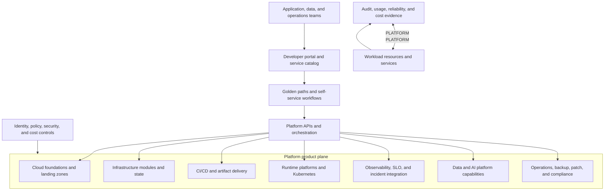

> **文档类型：** 基础设施架构参考模型
> **规范性术语：** **MUST**、**MUST NOT**、**SHOULD**、**SHOULD NOT** 和 **MAY** 是要求级别。
> **适用范围：** 内部平台产品、黄金路径、自助服务工作流程、可复用能力、所有权、支持、采用和生命周期。
> **例外流程：** 偏离要求需要记录风险评估、补偿控制、指定风险负责人和到期日期。

|控制领域|价值|
|---|---|
|文件编号 | `IA-03` |
|负责人|云卓越中心 |
|审核周期|至少每年一次，并且在重大平台、产品或运营模式发生变化之后 |
|证据|能力契约、模板和工作流程版本、策略结果、支持指标、采用措施、所有权日志记录和例外决策 |

# 企业平台工程参考架构

> **决策简述：** 将平台作为具有可组合契约、安全默认值、可度量结果和明确工作负载所有权的产品来运营。

## 目的

该参考架构将企业平台定义为一组内部产品，可减少无差异的工作，同时保持安全性、可靠性、成本和运营所有权。它应用于为多个工程团队提供云基础、应用平台、Kubernetes、基础设施即代码、CI/CD、可观测性、数据和 AI 功能以及运营服务的组织。

平台工程并不是一个负责所有工作负载的中央团队。它是一个具有明确消费者、服务边界、黄金路径、支持期望、采用信号和反馈循环的产品模型。工作负载团队保留对其应用和服务结果的所有权；平台团队负责其发布的功能以及这些功能公开的契约。

## 设计成果

该平台应该使安全且可支持的路径成为常见工作的最简单路径。它应该提供：

- 功能目录和支持的黄金路径；
- 内置策略和所有权的自助服务工作流程；
- 具有版本化契约的可复用模板和模块；
- 平台、工作负载和安全责任之间的明确分离；
- 默认可观测性、身份、备份和恢复集成；
- 从开发到生产的一致路径；
- 可度量的首次部署时间、变更失败、可靠性和采用结果；和
- 具有明确支持和风险模型的特殊设计的逃生口。

## 架构原则

1. **将平台视为产品。** 每个功能都有产品所有者、目标用户、路线图、服务级别、文档、支持模型和退役路径。
2. **针对用户结果进行优化。** 度量减少的认知负荷、交付时间、成功交付和运营质量，而不是发布的模板数量。
3. **使护栏可复用。** 安全和治理控制应嵌入到工作流程、模块、策略和默认设置中，而不是依赖于部落知识。
4. **更喜欢可组合契约。** 消费者应该接收稳定的输入、输出、身份、遥测和生命周期行为。
5. **保持工作负载所有权明确。** 平台可以提供某种功能，而无需接受使用该功能的每个工作负载的所有权。
6. **自动化证据。** 配置、升级、访问、策略、备份和操作事件应留下机器可读的证据。
7. **针对退出和例外进行设计。** 消费者可以留下路径或请求例外，但对支持、成本和风险的影响必须是可见的。

## 参考架构

门户是一个体验层，而不是基础设施或应用配置的权威来源。底层仓库、策略、模块和控制器对其域保持权威。

## 平台产品领域

### 云基础产品

提供管理组或账户层次结构、身份边界、网络连接、日志、安全控制、订阅或账户发放、命名、标记和区域策略。它的契约应该公开工作负载团队可以在不知道控制平面的实现的情况下使用的 Landing Zone 输出。

### 基础设施交付产品

提供 Terraform 或等效模块目录、状态后端、仓库模板、验证工作流程、规划和应用控制、漂移检测和导入指南。它应该防止相同的资源属性被多个系统管理。

### 运行时平台产品

提供受支持的应用运行时，例如 App Service、Container Apps、AKS、托管数据库、队列和事件平台。每个运行时路径都需要参考架构、支持的限制、网络和身份默认值、可观测性、升级过程和恢复模型。

### 交付和供应链产品

提供源代码控制模式、构建运行器、Artifact Registry、来源证明、部署工作流程、升级、批准、机密处理、回滚和证据。该平台应将基础设施交付、应用交付和运营工作流程分开，因为它们的身份和影响范围不同。

### 可靠性和运营产品

提供监控、告警、SLO、事件响应、备份、修补、漏洞修复、维护时段、资产清单和合规性证据。产品契约应说明平台检测到的内容以及工作负载所有者的责任。

## 自助服务和黄金路径

黄金之路应包括：

- 支持的用例和目标消费者；
- 仓库或服务模板；
- 安全身份和机密默认值；
- 网络、策略、成本和命名集成；
- 测试、验证和发布自动化；
- 基线可观测性和 SLO 脚手架；
- 所有权和支持元数据；
- 升级和弃用行为；和
- 逃逸和异常过程。

自助服务应该是渐进的。请求可以从表单或门户开始，但结果应该是团队可以检查和管理的版本化仓库、资源契约或工作流程。不要创建一个隐藏所有实施的门户，并使操作员在每次更改时都依赖一个团队。

## 高级服务契约

|契约面积|平台承诺|消费者责任 |
|---|---|---|
|预配|创建批准的资源和集成 |提供有效的所有权、环境、区域和数据分类 |
|身份 |提供托管身份或联合访问模式 |仅请求所需范围并保护应用使用 |
|安全|应用基线策略和扫描 |修复特定于工作负载的结果和异常 |
|可观测性|发布默认日志、指标、跟踪和仪表板 |定义服务指标并响应告警 |
|可靠性 |日志记录平台限制和故障模式 |定义 SLO、依赖项、备份和恢复目标 |
|交付|提供经过考验的晋级路径 |维护代码、测试、发布意图和回滚行为 |
|支持|提供服务时间和升级 |负责工作负载并提供当前的待命路径 |

## 底层设计

### 仓库和元数据

每个启用的服务都应该公开机器可读的元数据：
```yaml
service:
  name: orders-api
  owner: team-orders
  platform_path: aks-standard
  environment: production
  data_classification: confidential
  criticality: high
  repository: https://github.com/example/orders-api
  support_channel: team-orders-oncall
  slo:
    availability: 99.9
    latency_p95_ms: 500
```
该平台将此元数据用于策略、路由、成本分配、所有权、事件背景和清单。元数据不能替代服务文档或安全审查。

### 工作流程阶段

1. **请求：** 验证消费者、所有者、环境、范围、配额和数据分类。
2. **撰写：** 生成或选择批准的模块、模板和策略。
3. **验证：**运行语法、安全性、策略、成本、依赖性和所有权检查。
4. **规定：**通过保存和审查的计划创建资源。
5. **连接：** 附加身份、网络、机密、日志、指标、备份和告警。
6. **验证：** 运行状况、合规性和运营就绪情况检查。
7. **操作：** 监控、修补、升级、协调审查服务运行状况。
8. **退役：** 根据保留策略删除资源、访问、遥测和日志记录。

每个阶段都应该是可重新启动的或具有明确的部分完成程序。在资源创建之后、所有权注册之前失败的自助服务工作流程会创建非托管基础设施。

## 平台团队拓扑

尽可能使用产品一致的团队模型：

- **基础团队：**云层次结构、身份、网络、策略和 Landing Zone。
- **开发者平台团队：** 门户、模板、工作流程编排和开发者体验。
- **运行时团队：** Kubernetes、应用托管、数据、AI 和消息传递功能。
- **可靠性团队：** 可观测性、SLO、事件、备份、补丁和操作工具。
- **安全和治理：**控制目标、风险接受、检测和独立保证。

团队拓扑是一种组织选择，但能力所有权必须保持明确。一个团队可能小规模负责多种产品；它不应该留下隐含的界限。

## 采用和成熟

|舞台|能力|证据|
|---|---|---|
|基础平台|安全账户/订阅、身份、网络、日志、策略 |Landing Zone 和入驻日志记录|
|可重复|模板、模块、CI 验证、标准运行时路径 |采用和交付指标 |
|自助服务 |具有所有权和证据的批准工作流程 |无需手动返工即可成功请求 |
|产品 | SLO、反馈、路线图、版本控制、弃用 |消费者满意度与平台服务健康度|
|优化 |内部成本、可靠性和开发人员成果优化 |显著改善并减少重复劳动 |

不要因为存在门户或目录而声明成熟度。度量标准是团队是否能够以更少的认知负荷和更少的可避免故障模式安全地交付和操作工作负载。

## 验证

- [ ] 平台能力有所有者、消费者、契约和支持期望。
- [ ] 黄金路径包括身份、安全、策略、可观测性、成本和生命周期控制。
- [ ] 自助服务创建可检查、版本化和可维护的输出。
- [ ] 平台配置后工作负载所有权仍然明确。
- [ ] 例外情况有范围、已批准、有时间限制且可见。
- [ ] 平台工作流程可重新启动并具有部分故障恢复功能。
- [ ] 度量采用率、交付时间、可靠性、成本、支持和消费者反馈。
- [ ] 在强制执行平台功能之前测试弃用和退出路径。

## 操作注意事项

平台团队必须通过 SLO、事件响应、备份、灾难恢复、漏洞管理和变更控制来运营自己的服务。平台 API 和模板是生产接口；更改它们可能会影响许多工作负载。

每季度与消费者和安全利益相关者一起审查平台。淘汰未使用的路径或产生的支持成本高于价值。优先考虑减少重复劳动、故障恢复时间、策略例外和所有权不明确的改进。

## 相关主题

- [基础设施架构参考模型](infrastructure-architecture-reference-model.md)
- [混合和多云运营参考架构](hybrid-and-multi-cloud-operations-reference-architecture.md)
- [如何打造平台工程黄金之路](../how-to-guides/how-to-build-a-platform-engineering-golden-path.md)
- [云平台工程原则](../cloud-foundations-governance/cloud-platform-engineering-principles.md)
- [平台所有权及运营模式](../cloud-foundations-governance/platform-ownership-and-operating-model.md)
- [基础设施即代码工程标准](../infrastructure-as-code/iac-infrastructure-as-code-engineering-standards.md)

## 参考文档

- [CNCF 平台工程术语](https://glossary.cncf.io/platform-engineering/)
- [DORA 能力模型](https://dora.dev/capabilities/)
- [Azure Well-Architected Framework](https://learn.microsoft.com/en-us/azure/well-architected/)
