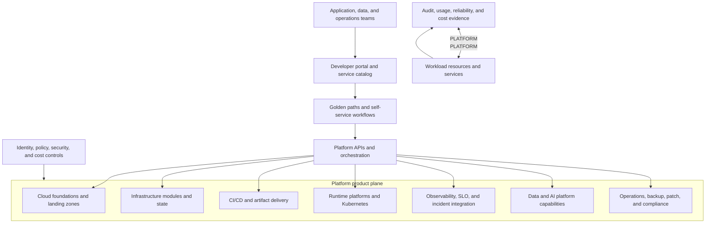

> **Document class:** Infra Architecture reference architecture
> **Normative terms:** **MUST**, **MUST NOT**, **SHOULD**, **SHOULD NOT**, and **MAY** are requirements levels.
> **Applicability:** Internal platform products, golden paths, self-service workflows, reusable capabilities, ownership, support, adoption, and lifecycle.
> **Exception process:** Deviations require a documented risk assessment, compensating controls, named risk owner, and expiry date.

| Control field | Value |
|---|---|
| Document ID | `IA-03` |
| Owner | Cloud Center of Excellence |
| Review cycle | At least annually and after material platform, product, or operating-model changes |
| Evidence | Capability contracts, template and workflow versions, policy results, support metrics, adoption measures, ownership records, and exception decisions |

# Enterprise Platform Engineering Reference Architecture

> **Decision in brief:** Operate the platform as a product with composable contracts, secure defaults, measurable outcomes, and explicit workload ownership.

## Purpose

This reference architecture defines an enterprise platform as a set of internal products that reduce undifferentiated work while preserving security, reliability, cost, and operational ownership. It applies to organizations that provide cloud foundations, application platforms, Kubernetes, infrastructure as code, CI/CD, observability, data and AI capabilities, and operations services to multiple engineering teams.

Platform engineering is not a central team that owns every workload. It is a product model with explicit consumers, service boundaries, paved paths, support expectations, adoption signals, and feedback loops. Workload teams retain ownership of their applications and service outcomes; the platform team owns the capabilities it publishes and the contracts those capabilities expose.

## Design outcomes

The platform should make the secure and supportable path the easiest path for common work. It should provide:

- a catalog of capabilities and supported golden paths;
- self-service workflows with policy and ownership built in;
- reusable templates and modules with versioned contracts;
- clear separation between platform, workload, and security responsibilities;
- default observability, identity, backup, and recovery integration;
- a consistent path from development to production;
- measurable time-to-first-deployment, change-failure, reliability, and adoption outcomes; and
- an escape hatch for exceptional designs with an explicit support and risk model.

## Architecture principles

1. **Treat the platform as a product.** Every capability has a product owner, target users, roadmap, service level, documentation, support model, and retirement path.
2. **Optimize for user outcomes.** Measure reduced cognitive load, lead time, successful delivery, and operational quality rather than the number of templates published.
3. **Make guardrails reusable.** Security and governance controls should be embedded in workflows, modules, policies, and defaults rather than relying on tribal knowledge.
4. **Prefer composable contracts.** Consumers should receive stable inputs, outputs, identities, telemetry, and lifecycle behavior.
5. **Keep workload ownership explicit.** A platform can provide a capability without accepting ownership of every workload that consumes it.
6. **Automate the evidence.** Provisioning, promotion, access, policy, backup, and operational events should leave machine-readable evidence.
7. **Design for exit and exceptions.** Consumers can leave a path or request an exception, but the impact on support, cost, and risk must be visible.

## Reference architecture



The portal is an experience layer, not the authoritative source for infrastructure or application configuration. The underlying repositories, policies, modules, and controllers remain authoritative for their domains.

## Platform product domains

### Cloud foundation product

Provides management-group or account hierarchy, identity boundaries, network connectivity, logging, security controls, subscription or account vending, naming, tagging, and regional policy. Its contract should expose landing-zone outputs that workload teams can consume without knowing the implementation of the control plane.

### Infrastructure delivery product

Provides Terraform or equivalent module catalogs, state backends, repository templates, validation workflows, plan and apply controls, drift detection, and import guidance. It should prevent the same resource attribute from being managed by multiple systems.

### Runtime platform product

Provides supported application runtimes such as App Service, Container Apps, AKS, managed databases, queues, and event platforms. Each runtime path needs a reference architecture, supported limits, network and identity defaults, observability, upgrade process, and recovery model.

### Delivery and supply-chain product

Provides source control patterns, build runners, artifact registries, provenance, deployment workflows, promotion, approvals, secret handling, rollback, and evidence. The platform should separate infrastructure delivery, application delivery, and operations workflows where their identities and blast radius differ.

### Reliability and operations product

Provides monitoring, alerting, SLOs, incident response, backup, patching, vulnerability remediation, maintenance windows, asset inventory, and compliance evidence. The product contract should state what the platform detects and what remains the workload owner’s responsibility.

## Self-service and golden paths

A golden path should include:

- a supported use case and target consumer;
- a repository or service template;
- secure identity and secret defaults;
- network, policy, cost, and naming integration;
- test, validation, and release automation;
- baseline observability and SLO scaffolding;
- ownership and support metadata;
- upgrade and deprecation behavior; and
- an escape and exception process.

Self-service should be progressive. A request can start with a form or portal, but the result should be a versioned repository, resource contract, or workflow that the team can inspect and own. Do not create a portal that hides all implementation and makes operators dependent on one team for every change.

## High-level service contract

| Contract area | Platform promise | Consumer responsibility |
|---|---|---|
| Provisioning | Creates approved resources and integrations | Supplies valid ownership, environment, region, and data classification |
| Identity | Provides managed identity or federated access pattern | Requests only required scopes and protects application use |
| Security | Applies baseline policies and scans | Remediates workload-specific findings and exceptions |
| Observability | Publishes default logs, metrics, traces, and dashboards | Defines service indicators and responds to alerts |
| Reliability | Documents platform limits and failure modes | Defines SLOs, dependencies, backup, and recovery objectives |
| Delivery | Provides tested promotion path | Maintains code, tests, release intent, and rollback behavior |
| Support | Provides service hours and escalation | Owns the workload and supplies a current on-call path |

## Low-level design

### Repository and metadata

Every onboarded service should expose machine-readable metadata:

```yaml
service:
  name: orders-api
  owner: team-orders
  platform_path: aks-standard
  environment: production
  data_classification: confidential
  criticality: high
  repository: https://github.com/example/orders-api
  support_channel: team-orders-oncall
  slo:
    availability: 99.9
    latency_p95_ms: 500
```

The platform uses this metadata for policy, routing, cost allocation, ownership, incident context, and inventory. The metadata is not a replacement for service documentation or security review.

### Workflow stages

1. **Request:** validate consumer, owner, environment, scope, quota, and data classification.
2. **Compose:** generate or select approved modules, templates, and policies.
3. **Validate:** run syntax, security, policy, cost, dependency, and ownership checks.
4. **Provision:** create resources through a saved and reviewed plan.
5. **Connect:** attach identity, network, secrets, logs, metrics, backup, and alerts.
6. **Verify:** run health, compliance, and operational-readiness checks.
7. **Operate:** monitor, patch, upgrade, reconcile, and review service health.
8. **Retire:** remove resources, access, telemetry, and records according to retention policy.

Each stage should be restartable or have a clear partial-completion procedure. A self-service workflow that fails after resource creation but before ownership registration creates unmanaged infrastructure.

## Platform team topology

Use a product-aligned team model where possible:

- **Foundation team:** cloud hierarchy, identity, network, policy, and landing zones.
- **Developer platform team:** portal, templates, workflow orchestration, and developer experience.
- **Runtime teams:** Kubernetes, application hosting, data, AI, and messaging capabilities.
- **Reliability team:** observability, SLO, incident, backup, patch, and operational tooling.
- **Security and governance:** control objectives, risk acceptance, detection, and independent assurance.

Team topology is an organizational choice, but capability ownership must remain explicit. A single team may own multiple products at small scale; it should not leave boundaries implicit.

## Adoption and maturity

| Stage | Capability | Evidence |
|---|---|---|
| Foundation | Secure accounts/subscriptions, identity, network, logs, policy | Landing-zone and onboarding records |
| Repeatable | Templates, modules, CI validation, standard runtime paths | Adoption and delivery metrics |
| Self-service | Approved workflows with ownership and evidence | Successful requests without manual rework |
| Product | SLOs, feedback, roadmap, versioning, deprecation | Consumer satisfaction and platform service health |
| Optimized | Internal cost, reliability, and developer-outcome optimization | Measured improvement and reduced toil |

Do not declare maturity because a portal or catalog exists. The measure is whether teams can safely deliver and operate a workload with less cognitive load and fewer avoidable failure modes.

## Validation

- [ ] Platform capabilities have owners, consumers, contracts, and support expectations.
- [ ] Golden paths include identity, security, policy, observability, cost, and lifecycle controls.
- [ ] Self-service creates inspectable, versioned, and maintainable outputs.
- [ ] Workload ownership remains explicit after platform provisioning.
- [ ] Exceptions are scoped, approved, time-bound, and visible.
- [ ] Platform workflows are restartable and have partial-failure recovery.
- [ ] Adoption, lead time, reliability, cost, support, and consumer feedback are measured.
- [ ] Deprecation and exit paths are tested before a platform capability is made mandatory.

## Operational considerations

The platform team must operate its own services with SLOs, incident response, backup, disaster recovery, vulnerability management, and change control. Platform APIs and templates are production interfaces; changing them can affect many workloads.

Review the platform quarterly with consumers and security stakeholders. Retire paths that are unused or create more support cost than value. Prioritize improvements that reduce repeated toil, failure recovery time, policy exceptions, and unclear ownership.

## Related topics

- [Infrastructure Architecture Reference Model](infrastructure-architecture-reference-model.md)
- [Hybrid and Multi-Cloud Operations Reference Architecture](hybrid-and-multi-cloud-operations-reference-architecture.md)
- [How to Build a Platform Engineering Golden Path](../how-to-guides/how-to-build-a-platform-engineering-golden-path.md)
- [Cloud Platform Engineering Principles](../cloud-foundations-governance/cloud-platform-engineering-principles.md)
- [Platform Ownership and Operating Model](../cloud-foundations-governance/platform-ownership-and-operating-model.md)
- [Infrastructure as Code Engineering Standards](../infrastructure-as-code/iac-infrastructure-as-code-engineering-standards.md)

## References

- [CNCF platform engineering glossary](https://glossary.cncf.io/platform-engineering/)
- [DORA capabilities model](https://dora.dev/capabilities/)
- [Azure Well-Architected Framework](https://learn.microsoft.com/en-us/azure/well-architected/)
