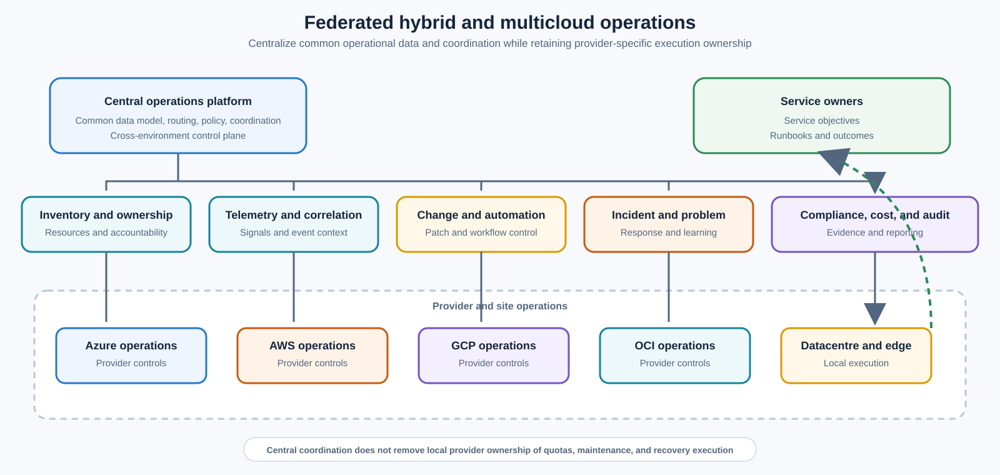
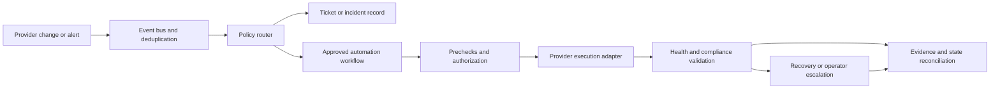

> **文档类型：** 基础设施架构参考模型
> **规范性术语：** **MUST**、**MUST NOT**、**SHOULD**、**SHOULD NOT** 和 **MAY** 是要求级别。
> **适用范围：** 跨 Azure、AWS、GCP、OCI、数据中心、边缘、Kubernetes 和共享服务边界的联合运营。
> **例外流程：** 偏离要求需要记录风险评估、补偿控制、指定风险负责人和到期日期。

|控制领域|价值|
|---|---|
|文件编号 | `IA-04` |
|负责人|云卓越中心 |
|审核周期|至少每年一次以及在重大提供商、地点、身份或恢复发生变化之后 |
|证据|资产清单、身份和访问审查、遥测关联、变更和事件日志、补丁和恢复测试、成本审查和异常日志记录 |

# 混合和多云运营参考架构

> **简要决定：** 标准化跨环境的运营结果和证据，同时将特定于提供商的执行交给负责任的本地团队。

## 目的

此参考架构定义了企业如何跨 Azure、其他公共云、数据中心和边缘位置操作工作负载，而无需假装每个提供商都具有相同的服务或控制语义。它为身份、清单、遥测、变更、配置、事件响应、修补、漏洞管理、备份、恢复和成本建立了通用操作模型。

多云运营应该标准化结果和接口，而不是将提供商的差异化为能力最差的共同点。该架构使用联合模型：中央操作功能提供通用策略、证据和工作流程，而提供商和工作负载团队在更安全或技术上必要的情况下保留本地执行权限。

## 设计成果

该组织应该能够：

- 识别每项资产、所有者、服务、环境、区域和重要性；
- 使用提供商适当的最低权限对操作员和自动化进行身份验证；
- 跨云和本地边界监控服务运行状况；
- 关联提供商变更、应用发布、事件和自动化运行；
- 通过有界的、可审计的工作流程来修补和修复漏洞；
- 应用常见的 SLO、备份、恢复和升级概念；
- 在本地运行手册中保留特定于提供商的控制和故障模式；和
- 使可移植性、集中性和退出风险在架构决策中可见。

## 联合运营模式



中央运营负责通用数据模型、路由、策略和跨环境协调。提供商运营负责特定于提供商的服务控制、配额、维护行为和本地恢复执行。服务团队负责应用行为和服务结果。

## 参考层

### 身份和访问层
使用中央身份生命周期和特定于提供商的角色映射。人类操作员应使用联邦身份、条件访问、即时提升和强身份验证。自动化应使用工作负载身份、托管身份或可用的短期联合。

将这些权限分开：

- 读取清单；
- 可观测性读取和告警管理；
- 改变执行方式；
- 凭证或机密管理；
- 安全修复；
- 备份和恢复；和
- 提供商或租户管理。

不要创建一种绕过提供商边界的全局操作凭证。当集中式工具需要广泛访问时，记录爆炸半径、批准、break-glass 控制、轮换和监控。

### 清单和所有权层

清单应协调提供商 API、CMDB 或服务注册表、Kubernetes 集群、服务器管理代理和应用所有权元数据。它应该识别过时的日志、重复的资产、不受管理的资源和冲突的所有者。

所需属性包括：
```yaml
asset:
  id: provider-resource-id
  provider: azure
  environment: production
  region: eastus
  service: orders
  owner: team-orders
  criticality: high
  data_classification: confidential
  support_tier: 24x7
  recovery:
    rto_minutes: 60
    rpo_minutes: 15
```
清单新鲜度和权威来源必须明确。无法映射到所有者的资产应生成操作或治理操作，而不是从仪表板中消失。

### 可观测性和事件层

将指标、日志、跟踪、审核事件、资源更改、安全结果、补丁合规性、备份状态和成本信号收集到通用关联模型中。当驻留需要时，将原始数据保存在提供商或地区；在适当的情况下集中派生事件和跨云标识符。

规范化字段，例如服务、环境、所有者、提供商、账户或订阅、区域、资源、更改 ID、事件 ID、严重性、时间戳和关联 ID。不要标准化操作员诊断所需的特定于提供商的详细信息。

### 变更和自动化层

对请求、批准、执行、验证和关闭使用通用生命周期。实施方式可能因提供商而异：

|运营|共同意图|特定于提供商的执行 |
|---|---|---|
|预配|创建治理能力| Terraform、Bicep、CloudFormation 或提供商 API |
|配置|聚合服务器状态 | Ansible、cloud-init、扩展或原生管理 |
|修补|应用批准的更新 |Update Manager、SSM、操作系统工具或维护服务 |
|策略 |检测或防止违规行为 | Azure Policy、SCP、Config、Organization Policy、Cloud Guard |
|恢复|恢复服务或数据 |提供商备份、副本、快照或 Runbook |

共同的工作流程记录意图和证据；它不要求每个提供商公开相同的任务模块。

## 高级操作流程

1. 清单发现或收到资产变化。
2. 所有权、分类和关键性得到解决。
3. 遥测和策略检查建立基线健康状况。
4. 变更、告警、漏洞或事件触发工作流程。
5. 工作流程选择特定于提供商的执行路径和身份。
6. 预检查验证范围、依赖性、维护窗口、备份和容量。
7. 金丝雀波或有界波次执行。
8. 运行状况和合规性门决定继续、停止、回滚或升级。
9. 证据在提供商、自动化、票证和事件系统之间相互关联。
10. 所得到的状态被协调到清单和事实来源中。

## 低级控制平面

事件总线必须对生产者进行身份验证，处理重播和重复，强制执行速率限制，并在工作流程需要时保留顺序。提供商事件永远不应该直接将任意输入作为命令执行。

## 服务运营模式

每项服务必须具有：

- 服务所有者和待命路径；
- 提供商和站点依赖性；
- SLO、错误预算和告警阈值；
- 部署、配置、修补和恢复操作手册；
- 备份和恢复证据；
- 数据分类和驻留要求；
- 漏洞和维护窗口；
- 升级和沟通计划；和
- 重大提供商依赖性的退出或迁移假设。

当相同的服务跨越提供商时，定义提供商是主动-主动、主动-被动、工作负载分区还是仅用于可移植性测试。当控制平面、身份、数据或操作员路径仍然依赖于一个提供商时，请勿将工作负载称为多云弹性工作负载。

## 跨界事件响应

事件协调员需要一个时间表，但可能需要多名本地响应人员。运营模式应该：

1. 指定一名事件指挥官和服务负责人。
2. 确定受影响的提供商、站点、区域和依赖关系。
3. 保留提供商和中心证据。
4. 根据服务 SLO 和数据一致性选择缓解措施。
5. 通过批准的身份协调本地提供商的行动。
6. 保持共同的状态和客户影响叙述。
7. 从用户或服务的角度验证恢复。
8. 稳定后协调紧急变更。

在事件发生之前，应将提供商支持案例、云状态、本地网络团队和安全响应人员包含在升级树中。

## 容量、成本和弹性

跨云操作增加了成本和操作复杂性。曲目：

- 每个提供商和环境的基础平台成本；
- 遥测重复和出口；
- 备用或故障转移能力；
- 身份、连接和支持订阅；
- 操作员的重复劳动和专业技能；
- 备份和恢复成本；
- 可移植性或退出投资；和
- 服务可用性和恢复效益。

弹性决策应将故障的概率和影响与第二个提供商或站点的成本和复杂性进行比较。没有经过测试的恢复、复制数据、身份、DNS 和操作员访问的第二个云是一种昂贵的依赖，而不是恢复策略。

## 验证

- [ ] 清单将提供商和站点资产与所有者和服务元数据进行协调。
- [ ] 人类和自动化身份是联合的、范围有限的、受监控的和可恢复的。
- [ ] 遥测将提供商更改、部署、自动化作业和事件关联起来。
- [ ] 特定于提供商的故障和维护行为在操作手册中表示。
- [ ] 中央工作流程对事件进行身份验证、重复数据删除、速率限制和绑定目标范围。
- [ ] 修补、漏洞修复、备份和恢复具有提供商适配器。
- [ ] 跨云恢复已通过数据、身份、DNS、遥测和运维人员进行测试。
- [ ] 与服务所有者一起审查成本和可移植性权衡。
- [ ] 紧急变更已纳入权威事实来源。

## 操作注意事项

中央运营团队负责跨环境模型、共享可观测性、工作流程标准和证据。提供商团队负责本地服务控制和提供商限制。服务所有者负责用户结果和应用运行手册。安全和治理团队定义控制目标并独立审查高风险异常。

在提供商加入、主要迁移、新的监管范围、跨云事件或数据或身份拓扑发生重大变化后，审查架构。

## 相关主题

- [基础设施架构参考模型](infrastructure-architecture-reference-model.md)
- [企业平台工程参考架构](enterprise-platform-engineering-reference-architecture.md)
- [云运营与可靠性模型](../operations-reliability-finops/cloud-operations-and-reliability-model.md)
- [如何运行多云事件响应](../how-to-guides/how-to-run-a-multicloud-incident-response.md)
- [多云架构与治理](../cloud-foundations-governance/multi-cloud-architecture-and-governance.md)
- [企业云网络架构](../networking-identity-security/nis-enterprise-cloud-network-architecture.md)

## 参考文档

- [Azure Well-Architected Framework](https://learn.microsoft.com/en-us/azure/well-architected/)
- [AWS Well-Architected Framework](https://docs.aws.amazon.com/wellarchitected/latest/framework/welcome.html)
- [Google Cloud Architecture Framework](https://cloud.google.com/architecture/framework)
- [Oracle Cloud Infrastructure 架构框架](https://docs.oracle.com/en-us/iaas/Content/cloud-adoption-framework/home.htm)
