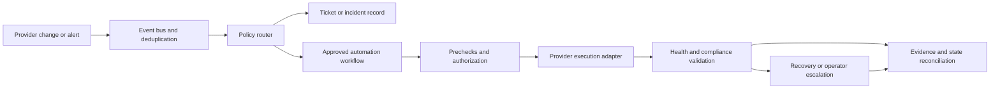

> **Document class:** Infra Architecture reference architecture
> **Normative terms:** **MUST**, **MUST NOT**, **SHOULD**, **SHOULD NOT**, and **MAY** are requirements levels.
> **Applicability:** Federated operations across Azure, AWS, GCP, OCI, datacenters, edge, Kubernetes, and shared service boundaries.
> **Exception process:** Deviations require a documented risk assessment, compensating controls, named risk owner, and expiry date.

| Control field | Value |
|---|---|
| Document ID | `IA-04` |
| Owner | Cloud Center of Excellence |
| Review cycle | At least annually and after material provider, site, identity, or recovery changes |
| Evidence | Asset inventory, identity and access reviews, telemetry correlation, change and incident records, patch and recovery tests, cost reviews, and exception records |

# Hybrid and Multi-Cloud Operations Reference Architecture

> **Decision in brief:** Standardize operating outcomes and evidence across environments while leaving provider-specific execution with accountable local teams.

## Purpose

This reference architecture defines how an enterprise operates workloads across Azure, other public clouds, datacenters, and edge locations without pretending that every provider has identical services or control semantics. It establishes a common operating model for identity, inventory, telemetry, change, configuration, incident response, patching, vulnerability management, backup, recovery, and cost.

Multi-cloud operations should standardize outcomes and interfaces, not flatten provider differences into the least capable common denominator. The architecture uses a federated model: a central operations capability supplies common policies, evidence, and workflows, while provider and workload teams retain local execution authority where it is safer or technically necessary.

## Design outcomes

The organization should be able to:

- identify every asset, owner, service, environment, region, and criticality;
- authenticate operators and automation with provider-appropriate least privilege;
- observe service health across clouds and on-premises boundaries;
- correlate provider changes, application releases, incidents, and automation runs;
- patch and remediate vulnerabilities through bounded, auditable workflows;
- apply common SLO, backup, recovery, and escalation concepts;
- preserve provider-specific controls and failure modes in local runbooks; and
- make portability, concentration, and exit risk visible in architecture decisions.

## Federated operating model


Central operations owns the common data model, routing, policy, and cross-environment coordination. Provider operations own provider-specific service controls, quotas, maintenance behavior, and local recovery execution. Service teams own application behavior and service outcomes.

## Reference layers

### Identity and access layer

Use a central identity lifecycle with provider-specific role mapping. Human operators should use federated identity, conditional access, just-in-time elevation, and strong authentication. Automation should use workload identity, managed identity, or short-lived federation where available.

Keep these permissions separate:

- inventory read;
- observability read and alert management;
- change execution;
- credential or secret administration;
- security remediation;
- backup and restore; and
- provider or tenant administration.

Do not create one global operations credential that bypasses provider boundaries. When a centralized tool needs broad access, document the blast radius, approval, break-glass control, rotation, and monitoring.

### Inventory and ownership layer

The inventory should reconcile provider APIs, CMDB or service registry, Kubernetes clusters, server management agents, and application ownership metadata. It should identify stale records, duplicate assets, unmanaged resources, and conflicting owners.

Required attributes include:

```yaml
asset:
  id: provider-resource-id
  provider: azure
  environment: production
  region: eastus
  service: orders
  owner: team-orders
  criticality: high
  data_classification: confidential
  support_tier: 24x7
  recovery:
    rto_minutes: 60
    rpo_minutes: 15
```

Inventory freshness and authoritative source must be explicit. An asset that cannot be mapped to an owner should generate an operational or governance action, not disappear from the dashboard.

### Observability and event layer

Collect metrics, logs, traces, audit events, resource changes, security findings, patch compliance, backup status, and cost signals into a common correlation model. Keep raw data in the provider or region when residency requires it; centralize derived events and cross-cloud identifiers where appropriate.

Normalize fields such as service, environment, owner, provider, account or subscription, region, resource, change ID, incident ID, severity, timestamp, and correlation ID. Do not normalize away provider-specific details that operators need for diagnosis.

### Change and automation layer

Use a common lifecycle for requests, approvals, execution, validation, and closure. The implementation can vary by provider:

| Operation | Common intent | Provider-specific execution |
|---|---|---|
| Provisioning | Create governed capacity | Terraform, Bicep, CloudFormation, or provider APIs |
| Configuration | Converge server state | Ansible, cloud-init, extensions, or native management |
| Patching | Apply approved updates | Update Manager, SSM, OS tooling, or maintenance service |
| Policy | Detect or prevent violations | Azure Policy, SCP, Config, Organization Policy, Cloud Guard |
| Recovery | Restore service or data | Provider backup, replicas, snapshots, or runbooks |

The common workflow records intent and evidence; it does not require every provider to expose identical task modules.

## High-level operations flow

1. Inventory discovers or receives an asset change.
2. Ownership, classification, and criticality are resolved.
3. Telemetry and policy checks establish baseline health.
4. A change, alert, vulnerability, or incident triggers a workflow.
5. The workflow selects a provider-specific execution path and identity.
6. Prechecks validate scope, dependencies, maintenance window, backup, and capacity.
7. A canary or bounded wave executes.
8. Health and compliance gates determine continuation, stop, rollback, or escalation.
9. Evidence is correlated across provider, automation, ticket, and incident systems.
10. The resulting state is reconciled into inventory and source of truth.

## Low-level control plane



The event bus must authenticate producers, handle replay and duplicates, enforce rate limits, and preserve ordering where the workflow requires it. A provider event should never directly execute arbitrary input as a command.

## Service operations model

Each service must have:

- a service owner and on-call path;
- provider and site dependencies;
- SLOs, error budgets, and alert thresholds;
- deployment, configuration, patch, and recovery runbooks;
- backup and restore evidence;
- data classification and residency requirements;
- vulnerability and maintenance windows;
- escalation and communication plans; and
- an exit or migration assumption for material provider dependencies.

When the same service spans providers, define whether the providers are active-active, active-passive, workload-partitioned, or merely used for portability testing. Do not call a workload multi-cloud resilient when the control plane, identity, data, or operator path still depends on one provider.

## Incident response across boundaries

An incident coordinator needs one timeline but may need several local responders. The operating model should:

1. Assign a single incident commander and service owner.
2. Establish the affected provider, site, region, and dependency.
3. Preserve provider and central evidence.
4. Choose mitigation based on service SLO and data consistency.
5. Coordinate local provider actions through approved identities.
6. Maintain a common status and customer-impact narrative.
7. Validate recovery from the user or service perspective.
8. Reconcile emergency changes after stabilization.

Provider support cases, cloud status, local network teams, and security responders should be included in the escalation tree before an incident occurs.

## Capacity, cost, and resilience

Cross-cloud operations add cost and operational complexity. Track:

- base platform cost per provider and environment;
- telemetry duplication and egress;
- standby or failover capacity;
- identity, connectivity, and support subscriptions;
- operator toil and specialized skills;
- backup and restore cost;
- portability or exit investment; and
- service availability and recovery benefit.

Resilience decisions should compare the probability and impact of failure with the cost and complexity of a second provider or site. A second cloud without tested recovery, replicated data, identity, DNS, and operator access is an expensive dependency, not a recovery strategy.

## Validation

- [ ] Inventory reconciles provider and site assets to owners and service metadata.
- [ ] Human and automation identities are federated, scoped, monitored, and recoverable.
- [ ] Telemetry correlates provider changes, deployments, automation jobs, and incidents.
- [ ] Provider-specific failure and maintenance behavior is represented in runbooks.
- [ ] Central workflows authenticate events, deduplicate, rate-limit, and bound target scope.
- [ ] Patching, vulnerability remediation, backup, and recovery have provider adapters.
- [ ] Cross-cloud recovery has been tested with data, identity, DNS, telemetry, and operators.
- [ ] Cost and portability tradeoffs are reviewed with service owners.
- [ ] Emergency changes are reconciled into the authoritative source of truth.

## Operational considerations

The central operations team owns the cross-environment model, shared observability, workflow standards, and evidence. Provider teams own local service controls and provider limits. Service owners own user outcomes and application runbooks. Security and governance teams define control objectives and independently review high-risk exceptions.

Review the architecture after provider onboarding, major migration, new regulatory scope, a cross-cloud incident, or a material change in data or identity topology.

## Related topics

- [Infrastructure Architecture Reference Model](infrastructure-architecture-reference-model.md)
- [Enterprise Platform Engineering Reference Architecture](enterprise-platform-engineering-reference-architecture.md)
- [Cloud Operations and Reliability Model](../operations-reliability-finops/cloud-operations-and-reliability-model.md)
- [How to Run a Multi-Cloud Incident Response](../how-to-guides/how-to-run-a-multicloud-incident-response.md)
- [Multi-Cloud Architecture and Governance](../cloud-foundations-governance/multi-cloud-architecture-and-governance.md)
- [Enterprise Cloud Network Architecture](../networking-identity-security/nis-enterprise-cloud-network-architecture.md)

## References

- [Azure Well-Architected Framework](https://learn.microsoft.com/en-us/azure/well-architected/)
- [AWS Well-Architected Framework](https://docs.aws.amazon.com/wellarchitected/latest/framework/welcome.html)
- [Google Cloud Architecture Framework](https://cloud.google.com/architecture/framework)
- [Oracle Cloud Infrastructure Architecture Framework](https://docs.oracle.com/en-us/iaas/Content/cloud-adoption-framework/home.htm)
