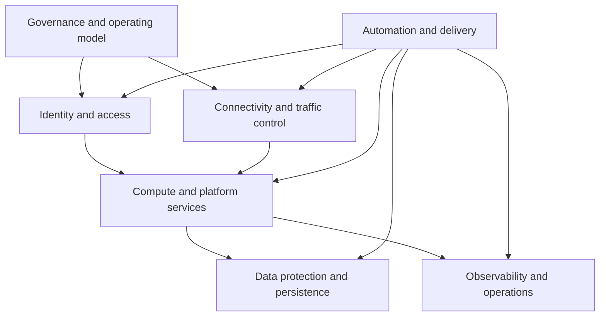

> **文档类型：** 基础设施架构参考模型
> **规范性术语：** **MUST**、**MUST NOT**、**SHOULD**、**SHOULD NOT** 和 **MAY** 是要求级别。
> **适用范围：** 应用于云基础、应用环境、数据平台、共享服务和受监管工作负载的提供商中立基础架构。
> **例外流程：** 偏离要求需要记录风险评估、补偿控制、指定风险负责人和到期日期。

|控制领域|价值|
|---|---|
|文件编号 | `IA-01` |
|负责人|云卓越中心 |
|审核周期|至少每年一次，并且在云、平台、安全性或弹性发生重大变化之后 |
|证据|架构决策、拓扑和信任边界图、身份和网络审查、恢复测试、策略结果、成本控制和异常日志记录 |

# 基础设施架构参考模型

> **决策简述：** 使用提供商原生服务来满足共同的安全性、可靠性、可运维性和治理结果，并记录每个重大偏差。

## 目的

该参考模型提供了一种一致的基础架构设计方法，无需将架构绑定到一个云提供商。它定义了生产就绪平台所需的功能、边界、决策和证据。提供商服务是实施选择；安全性、可靠性、可运维性和治理成果是持久的要求。

在创建 Landing Zone、共享平台、应用环境、数据平台或受监管的工作负载基础时使用此模型。根据工作负载的关键程度定制单独的控制，但记录每个异常及其补偿控制。

## 架构层

每层都必须公开记录在案的接口和所有权边界。中央平台团队应提供可复用的控件和铺好的路径，而工作负载团队仍负责特定于应用的配置、数据分类、服务目标和运营就绪情况。

## 核心设计决策

实施前日志记录以下决定：

- 工作负载关键性、恢复目标、可用性目标和故障域；
- 租户、组织、订阅、账户、项目或隔间边界；
- 人员、工作负载、流水线和紧急访问身份模式；
- 入口、出口、东西向路由、DNS、检查和私有访问要求；
- 计算放置、扩缩容、调度、镜像和修补职责；
- 加密、密钥所有权、备份、保留、复制和恢复要求；
- 遥测所有权、告警路由、审计证据和事件响应集成；
- 基础设施交付、策略执行、升级、回滚和偏差处理；
- 成本分配、配额、容量限制和生命周期管理。

## 多云能力映射

|能力| Azure 示例 | AWS 示例 | GCP 示例 | OCI 示例 |
|---|---|---|---|---|
|组织边界|管理组和订阅|组织和账户 |组织、文件夹和项目 |租户和隔间|
|网络基础|虚拟网络和 Virtual WAN | VPC 和 Transit Gateway | VPC 和 Network Connectivity Center| VCN 和 Dynamic Routing Gateway|
|工作负载身份|托管身份 | IAM 角色 |服务账户和工作负载身份 |Dynamic groups and resource principals |
|策略执行| Azure Policy |Organizations policies and Config|Organization Policy Service|Security Zones 和 Cloud Guard|
|中央遥测| Azure Monitor 和 Log Analytics | CloudWatch 和 CloudTrail |Cloud Monitoring 和 Cloud Logging|Monitoring and Logging|
|密钥管理| Key Vault 和托管 HSM | KMS 和 CloudHSM |Cloud KMS 和 Cloud HSM |Vault 和密钥管理 |

该表是一个映射辅助工具，而不是强制执行相同实现的要求。选择满足相同控制目标并以通用架构决策格式保留证据的提供商原生服务。

## 可靠性和故障边界

针对明确的故障范围进行设计，而不是假设使用多个区域或云会自动创建弹性。识别仍可能同时失败的依赖项，包括身份提供商、DNS、证书颁发机构、CI/CD 系统、共享防火墙、Artifact Registry 和操作访问路径。

对于每项关键服务：

- 日志记录组件和区域故障行为；
- 明确删除或接受单点故障；
- 定义恢复时间和恢复点目标；
- 自动备份和恢复验证；
- 测试降级操作、故障转移和恢复；
- 保留安全的紧急通道；
- 将技术健康状况与所负责的服务目标联系起来。

## 安全架构基线
默认为最小权限、短期凭证、私有连接、加密和集中审计证据。将控制平面管理与工作负载平面访问分开。将 DNS、路由、身份、机密和日志记录视为一个安全系统，因为其中任何一个系统的弱点都可能绕过其他系统的控制。

架构批准应确认：

- 身份具有有限的范围和生命周期所有者；
- 管理路径经过严格验证、监控和恢复；
- 在应用和网络层公开暴露是合理的并受到保护；
- 数据分类决定加密、驻留、保留和访问控制；
- 安全事件到达企业检测和响应流程；
- 策略例外有有效期和补偿控制。

## 运营就绪

基础设施设计在输入运行之前是不完整的。在生产之前，确认仪表板、可操作告警、运行手册、升级路径、服务所有权、维护窗口、容量限制、依赖关系图和成本报告。跨环境验证相同的部署制品和控制证据，而不是通过单独的流程重建生产。

## 验证

- [ ] 日志记录范围、消费者、所有权和服务目标。
- [ ] 信任边界和数据流用图表表示。
- [ ] 身份、网络、DNS、机密和密钥管理决策已获取批准。
- [ ] 可用性和恢复设计与经过测试的故障场景相关。
- [ ] 基础设施是通过经过审查的、版本化的自动化来交付的。
- [ ] 策略和证据在可行的情况下是自动化的。
- [ ] 日志、告警、事件响应和紧急访问可运行。
- [ ] 定义成本分配、配额、容量和退役。
- [ ] 提供商特定的决策映射到提供商中立的控制目标。
- [ ] 例外情况包括所有者、理由、补偿性控制和到期日。

## 相关主题

- [混合和多云运营参考架构](hybrid-and-multi-cloud-operations-reference-architecture.md)
- [Ansible 自动化架构参考模型](ansible-automation-architecture-reference-model.md)
- [企业平台工程参考架构](enterprise-platform-engineering-reference-architecture.md)
