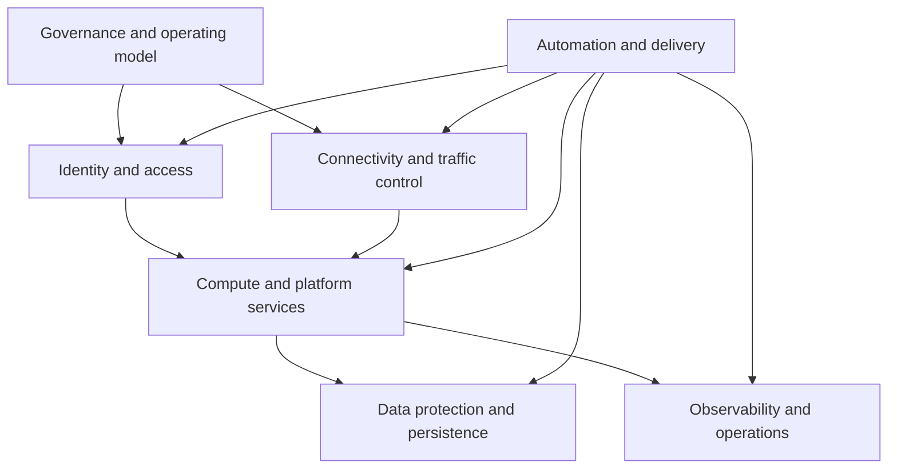

> **Document class:** Infra Architecture reference architecture
> **Normative terms:** **MUST**, **MUST NOT**, **SHOULD**, **SHOULD NOT**, and **MAY** are requirements levels.
> **Applicability:** Provider-neutral infrastructure architecture for cloud foundations, application environments, data platforms, shared services, and regulated workloads.
> **Exception process:** Deviations require a documented risk assessment, compensating controls, named risk owner, and expiry date.

| Control field | Value |
|---|---|
| Document ID | `IA-01` |
| Owner | Cloud Center of Excellence |
| Review cycle | At least annually and after material cloud, platform, security, or resilience changes |
| Evidence | Architecture decisions, topology and trust-boundary diagrams, identity and network reviews, recovery tests, policy results, cost controls, and exception records |

# Infrastructure Architecture Reference Model

> **Decision in brief:** Use provider-native services to satisfy common security, reliability, operability, and governance outcomes, and record every material deviation.

## Purpose

This reference model provides a consistent way to design infrastructure without binding the architecture to one cloud provider. It defines the capabilities, boundaries, decisions, and evidence required for a production-ready platform. Provider services are implementation choices; security, reliability, operability, and governance outcomes are the durable requirements.

Use this model when creating a landing zone, shared platform, application environment, data platform, or regulated workload foundation. Tailor individual controls to workload criticality, but record every exception and its compensating control.

## Architecture layers

Each layer must expose a documented interface and ownership boundary. Central platform teams should provide reusable controls and paved paths, while workload teams remain accountable for application-specific configuration, data classification, service objectives, and operational readiness.

## Core design decisions

Record the following decisions before implementation:

- workload criticality, recovery objectives, availability targets, and failure domains;
- tenant, organization, subscription, account, project, or compartment boundaries;
- human, workload, pipeline, and emergency-access identity patterns;
- ingress, egress, east-west routing, DNS, inspection, and private-access requirements;
- compute placement, scaling, scheduling, image, and patching responsibilities;
- encryption, key ownership, backup, retention, replication, and restoration requirements;
- telemetry ownership, alert routing, audit evidence, and incident-response integration;
- infrastructure delivery, policy enforcement, promotion, rollback, and drift handling;
- cost allocation, quotas, capacity constraints, and lifecycle management.

## Multi-cloud capability mapping

| Capability | Azure example | AWS example | GCP example | OCI example |
|---|---|---|---|---|
| Organization boundary | Management groups and subscriptions | Organizations and accounts | Organizations, folders, and projects | Tenancy and compartments |
| Network foundation | Virtual Network and Virtual WAN | VPC and Transit Gateway | VPC and Network Connectivity Center | VCN and Dynamic Routing Gateway |
| Workload identity | Managed identities | IAM roles | Service accounts and Workload Identity | Dynamic groups and resource principals |
| Policy enforcement | Azure Policy | Organizations policies and Config | Organization Policy Service | Security Zones and Cloud Guard |
| Central telemetry | Azure Monitor and Log Analytics | CloudWatch and CloudTrail | Cloud Monitoring and Cloud Logging | Monitoring and Logging |
| Key management | Key Vault and Managed HSM | KMS and CloudHSM | Cloud KMS and Cloud HSM | Vault and Key Management |

The table is a mapping aid, not a requirement to force identical implementations. Select provider-native services that meet the same control objective and retain evidence in a common architecture decision format.

## Reliability and failure boundaries

Design for explicit failure scopes rather than assuming that using multiple zones or clouds automatically creates resilience. Identify dependencies that can still fail together, including identity providers, DNS, certificate authorities, CI/CD systems, shared firewalls, artifact registries, and operational access paths.

For every critical service:

- document component and regional failure behavior;
- remove or accept single points of failure explicitly;
- define recovery time and recovery point objectives;
- automate backup and restoration verification;
- test degraded operation, failover, and recovery;
- preserve a secured emergency-access path;
- connect technical health to an owned service objective.

## Security architecture baseline

Default to least privilege, short-lived credentials, private connectivity, encryption, and centralized audit evidence. Separate control-plane administration from workload-plane access. Treat DNS, routing, identity, secrets, and logging as one security system because a weakness in any one of them can bypass controls in the others.

Architecture approval should confirm:

- identities have bounded scope and a lifecycle owner;
- administrative paths are strongly authenticated, monitored, and recoverable;
- public exposure is justified and protected at the application and network layers;
- data classification determines encryption, residency, retention, and access controls;
- security events reach the enterprise detection and response process;
- policy exceptions have expiration dates and compensating controls.

## Operational readiness

An infrastructure design is incomplete until it can be operated. Before production, confirm dashboards, actionable alerts, runbooks, escalation paths, service ownership, maintenance windows, capacity limits, dependency maps, and cost reporting. Validate the same deployment artifact and control evidence across environments rather than rebuilding production through a separate process.

## Validation

- [ ] Scope, consumers, ownership, and service objectives are documented.
- [ ] Trust boundaries and data flows are diagrammed.
- [ ] Identity, network, DNS, secrets, and key-management decisions are approved.
- [ ] Availability and recovery designs are tied to tested failure scenarios.
- [ ] Infrastructure is delivered through reviewed, versioned automation.
- [ ] Policies and evidence are automated where practical.
- [ ] Logging, alerting, incident response, and emergency access are operational.
- [ ] Cost allocation, quotas, capacity, and decommissioning are defined.
- [ ] Provider-specific decisions map to provider-neutral control objectives.
- [ ] Exceptions include an owner, rationale, compensating control, and expiry date.

## Related topics

- [Hybrid and Multi-Cloud Operations Reference Architecture](hybrid-and-multi-cloud-operations-reference-architecture.md)
- [Ansible Automation Architecture Reference Model](ansible-automation-architecture-reference-model.md)
- [Enterprise Platform Engineering Reference Architecture](enterprise-platform-engineering-reference-architecture.md)
