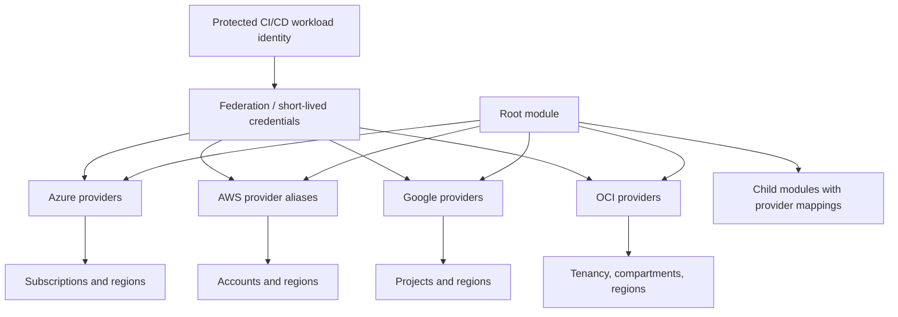

# Azure、AWS、GCP 和 OCI 提供程序模式

## 目的

该标准定义了如何在 Azure、AWS、GCP 和 OCI 中声明、配置、验证、别名、传递到模块、版本控制和操作 Terraform 提供程序。

提供程序配置是一个安全边界。错误的默认提供程序可能会将正确形成的基础设施部署到错误的订阅、账户、项目、区域、租户或隔间中。

## 核心规则

- 根模块 MUST 配置提供程序。
- 子模块 MUST 声明提供程序要求并从调用者接收提供程序配置。
- 凭证 MUST NOT 嵌入到提供程序块中。
- 工作负载身份或短期联合 SHOULD 用于自动化。
- 每个提供程序源和兼容版本范围 MUST 声明。
- 多个作用域 MUST 使用显式的、有意义的别名。
- 提供程序范围 MUST 在应用前进行验证。
- 测试版、预览版或通用 API 提供程序需要记录合理性和有针对性的测试。

## 提供程序架构

## 提供程序要求
```hcl
terraform {
  required_version = ">= 1.7.0, < 2.0.0"

  required_providers {
    azurerm = {
      source  = "hashicorp/azurerm"
      version = "~> 4.0"
    }
    azapi = {
      source  = "azure/azapi"
      version = "~> 2.0"
    }
    aws = {
      source  = "hashicorp/aws"
      version = ">= 5.0, < 7.0"
    }
    google = {
      source  = "hashicorp/google"
      version = ">= 6.0, < 8.0"
    }
    oci = {
      source  = "oracle/oci"
      version = ">= 7.0, < 9.0"
    }
  }
}
```
以上版本仅供参考，并非企业支持矩阵。根模块 MUST 提交依赖项锁定文件并通过审查的依赖项更改来更新它。

## 身份验证层次结构

首选自动化方法：

|云|首选|可接受的受控回退|禁止正常模式|
|---|---|---|---|
|Azure|工作负载身份联合或托管身份|基于证书的服务主体 |代码或变量中的客户端机密 |
|AWS | OIDC 联合到 IAM 角色；在受治理的场景中使用角色链 |短期 STS 凭证 |流水线变量中的长期访问键 |
| GCP |工作负载身份联合和服务账户模拟 |例外情况下的短期服务账户凭据 |仓库中的服务账户 JSON 密钥 |
|OCI |资源主体、实例主体或批准的联合 |来自受保护机密存储的 API 签名密钥 |私钥在 tfvars 中提交或传递 |

本地开发 MAY 使用每个云支持的 CLI 或 SDK 凭证链，但生产行为 MUST 使用流水线身份进行测试。

## Azure 模式

### AzureRM 默认提供程序
```hcl
provider "azurerm" {
  features {}

  subscription_id = var.workload_subscription_id
  tenant_id       = var.tenant_id

  resource_provider_registrations = "none"
}
```
提供程序行为和注册策略 MUST 与 Enterprise Landing Zone 控制保持一致。自动注册资源提供程序可能需要广泛权限，因此 SHOULD 经过有意配置。

### 多个订阅
```hcl
provider "azurerm" {
  alias           = "connectivity"
  features        {}
  subscription_id = var.connectivity_subscription_id
  tenant_id       = var.tenant_id
}

provider "azurerm" {
  alias           = "workload"
  features        {}
  subscription_id = var.workload_subscription_id
  tenant_id       = var.tenant_id
}

module "private_endpoint" {
  source = "./modules/private-endpoint"
  providers = {
    azurerm = azurerm.workload
    azurerm.dns = azurerm.connectivity
  }
}
```
需要 DNS 订阅提供程序 MUST 通过 `configuration_aliases` 声明别名的子模块。

### AzureRM 和 AzAPI

使用 AzureRM 获取受支持的稳定资源。当 Azure Resource Manager 功能尚未公开或特别需要通用 API 访问时，请使用 AzAPI。

AzAPI 使用 MUST 包括：

- API 版本审查。
- 模式或响应验证。
- 适当时迁移到 AzureRM 的计划。
- 对更新和删除行为的附加测试。
- 避免两个提供程序管理相同的资源。

## AWS 模式

### 默认和假定角色提供程序
```hcl
provider "aws" {
  region = var.region

  assume_role {
    role_arn     = var.deployment_role_arn
    session_name = "terraform-${var.environment}"
  }

  default_tags {
    tags = local.standard_tags
  }
}
```
引导程序身份 SHOULD 仅具有承担目标角色的权限。目标角色 范围 MUST 为根模块的资源和操作。

### 多账户、多区域
```hcl
provider "aws" {
  alias  = "network"
  region = "ca-central-1"
  assume_role { role_arn = var.network_role_arn }
}

provider "aws" {
  alias  = "security"
  region = "ca-central-1"
  assume_role { role_arn = var.security_role_arn }
}

provider "aws" {
  alias  = "global"
  region = "us-east-1"
  assume_role { role_arn = var.workload_role_arn }
}
```
全球服务区域要求 MUST 明确。不要依赖操作员环境变量来选择生产区域。

### AWS 提供程序默认值

建议使用提供程序级别的默认标签，但并不统一应用于每种资源类型。模块 MUST 测试实际标记并处理异常。

## GCP 模式

### 项目范围内的提供程序
```hcl
provider "google" {
  project = var.project_id
  region  = var.region
  zone    = var.zone
}
```
自动化 SHOULD 通过工作负载身份联合进行身份验证，并在适当的情况下模拟私有服务账户。

### 多个项目
```hcl
provider "google" {
  alias   = "host"
  project = var.host_project_id
  region  = var.region
}

provider "google" {
  alias   = "service"
  project = var.service_project_id
  region  = var.region
}

module "shared_vpc_attachment" {
  source = "./modules/shared-vpc-attachment"
  providers = {
    google.host    = google.host
    google.service = google.service
  }
}
```
共享 VPC、组织、文件夹和项目操作 SHOULD 使用权限边界不同的单独的提供程序别名和身份。

### `google-beta`

`google-beta` SHOULD 仅用于稳定提供程序不提供的功能或服务明确要求的功能。模块 MUST 记录测试状态、测试升级行为并定义退出计划。稳定版和测试版提供程序 MUST NOT 管理相同的资源。

## OCI 模式

### 区域和租户配置
```hcl
provider "oci" {
  region = var.region
  # Authentication is supplied through the approved identity chain.
}
```
隔间 ID SHOULD 是来自受控身份/基础根的显式模块输入或输出。当不可变的 OCID 可用时，不要通过显示名称发现生产隔间。

### 多个区域或别名
```hcl
provider "oci" {
  alias  = "primary"
  region = "ca-montreal-1"
}

provider "oci" {
  alias  = "dr"
  region = "ca-toronto-1"
}

module "replicated_platform" {
  source = "./modules/replicated-platform"
  providers = {
    oci    = oci.primary
    oci.dr = oci.dr
  }
}
```
可用性域和镜像标识符 SHOULD 通过支持的数据源或目录输入而不是硬编码的位置假设来获取。

## 子模块声明

需要别名 MUST 声明它们的子模块。
```hcl
terraform {
  required_providers {
    google = {
      source = "hashicorp/google"
      configuration_aliases = [
        google.host,
        google.service
      ]
    }
  }
}
```
提供程序别名不会自动按名称继承。根模块必须显式传递映射。

## 范围验证

在应用之前，流水线 SHOULD 验证已解析的执行范围：

|云|验证实例|
|---|---|
|Azure|租户 ID、订阅 ID、主体对象 ID |
|AWS |呼叫者身份 ARN、账户 ID、区域 |
| GCP |主体、项目 ID、组织/文件夹上下文、区域 |
|OCI |租户 OCID、主体类型、区域、目标隔间 OCID |

流水线 MUST 在作业摘要中打印非机密范围标识符。不匹配项 MUST 在规划或应用之前导致失败。

## 提供程序配置所有权

提供程序配置属于根模块，因为它取决于部署上下文。可复用的模块 MUST NOT：

- 验证提供程序。
- 选择凭据。
- 假设本地 CLI 配置文件。
- 硬编码账户、订阅、项目、租户、隔间或区域。
- 配置后端。
- 默默地使用不同的提供程序别名进行特权操作。

## 提供程序镜像和供应链

企业环境 MAY 使用网络镜像或私有注册表。

控制：

- 提供程序源地址保持明确。
- 批准的版本已列入白名单。
- 校验和在 `.terraform.lock.hcl` 中采集。
- 当运行器使用不同的操作系统或架构时，SHOULD 预先填充多平台校验和。
- 根据软件供应链策略对提供程序二进制文件 MUST 进行扫描和来源检查。
- 从未经批准的注册中心直接下载 MUST 在受保护的流水线中被阻止。

## 多云根模块

当所有资源形成一个生命周期单元时，单个根模块 MAY 配置多个云提供程序。示例：为一个平台自动创建联合 DNS 记录和身份信任。

不相关的云资产 SHOULD NOT 仅为方便而组合。当云具有不同的所有者、更改窗口、状态敏感性或回滚行为时，首选单独的根。

## 错误处理和重试

提供程序重试和超时 SHOULD 仅针对已知的服务行为进行调整。过多的超时会隐藏缺陷并使流水线变得不可预测。

- 当提供程序公开资源并且有证据支持调整时，使用资源 `timeouts`。
- 将重复限制视为并发或配额设计问题。
- 考虑有限重试测试中的最终一致性。
- 不要将 Terraform 包装在无限制的 shell 重试循环中。

## 提供程序架构和升级生命周期

提供程序配置只是提供程序治理的一部分。团队还 MUST 管理模式演变和规范化行为。

维护者 SHOULD 在提出提供程序约束或刷新锁定文件之前：

1. 查看提供程序发布说明、弃用和已知问题。
2. 针对现有状态运行代表性计划。
3. 将仅标准化的差异与预期的基础设施更改分开。
4. 测试关键资源类型的导入、创建、更新、替换和销毁路径。
5. 确认提供程序默认值未更改执行范围、标记、注册、重试或删除行为。
6. 与所有者一起记录任何临时抑制或解决方法以及到期日期。
导致广泛但无害的状态规范化 SHOULD 提供程序升级仍被隔离在专用更改中。将规范化与功能基础设施变更混合在一起会使审查和回滚变得更加困难。

## 身份引导和委托边界

工作负载身份联合仍然需要引导信任路径。引导标识 MUST 比常规部署标识受到更严格的控制，因为它们可以创建或修改后续流水线使用的信任关系。

推荐模型分离：

- **引导程序身份**：创建状态存储、联合、注册表访问和初始部署角色。
- **计划身份**：读取配置范围并生成推测计划； SHOULD 缺乏执行平台支持分离的广泛突变权。
- **应用身份**：在一个有限的根范围内执行批准的更改。
- **break-glass 身份**：禁用或严格监控，仅在事件或恢复程序下使用。

角色链和跨范围委派 MUST 明确定义。在 Terraform 初始化之前 SHOULD 记录有效主体、目标范围、会话名称和区域。提供程序别名不是授权控制；云身份策略仍然具有权威性。

## 环境变量和本地凭证安全

提供程序 SDK 通常会检查环境变量、CLI 会话、元数据服务、配置文件和本地凭证文件。这种便利可以选择意想不到的身份或范围。

受保护的流水线 SHOULD 从最小环境开始，显式设置非机密范围值，并拒绝冲突的凭证变量。本地执行指南 SHOULD 包括在规划之前显示有效租户、账户、项目、租户、主体和区域的命令。

示例和测试 MUST NOT 采用开发人员的默认配置文件。当提供程序支持配置文件选择时，生产自动化 SHOULD 更喜欢联合和显式范围配置而不是配置文件名称。默认情况下禁用提供程序调试日志 MUST，因为跟踪可能会暴露标头、请求正文、标识符或敏感计算值。

## 反模式

- 提供程序块中的凭证。
- 应用于所有云和环境的一个高度特权的身份。
- 名为 `one`、`two` 或 `other` 的别名。
- 从开发人员工作站隐式选择区域。
- 目录模块内的提供程序配置。
- 管理相同资源的稳定版和测试版提供程序。
- 无限制的提供程序版本。
- 按显示名称自动跨账户或跨订阅查找。
- 指向生产的默认提供程序，而示例则假定为开发。
- 将不相关的云混合在一种状态。

## 验证

- 声明所需的提供程序和有界版本。
- 根模块负责自己的提供程序配置。
- 自动化使用短暂的身份。
- 范围标识符在应用前进行验证。
- 别名清楚地反映订阅、账户、项目、租户、隔间或区域。
- 子模块显式声明和接收别名。
- 预览或通用提供程序有理由和测试。
- 锁定文件和提供程序供应链控制处于活动状态。
## 相关主题

- [Terraform 多环境 DevOps 和生产实践](iac-terraform-multi-environment-devops-and-production-practices.md)
- [可复用 Terraform 模块工程](iac-engineering-reusable-terraform-modules.md)
- [环境配置和状态管理](iac-environment-configuration-and-state-management.md)

## 参考文档

- Terraform 提供程序要求：https://developer.hashicorp.com/terraform/language/providers/requirements
- 模块内的提供程序：https://developer.hashicorp.com/terraform/language/modules/develop/providers
- Azure Terraform 概述：https://learn.microsoft.com/azure/developer/terraform/overview
- AWS Terraform 提供程序最佳实践：https://docs.aws.amazon.com/prescriptive-guidance/latest/terraform-aws-provider-best-practices/introduction.html
- GCP Terraform 文档：https://cloud.google.com/docs/terraform
- OCI 提供程序配置：https://docs.oracle.com/en-us/iaas/Content/dev/terraform/configuring.htm
- OCI 提供程序注册表：https://registry.terraform.io/providers/oracle/oci/latest/docs
