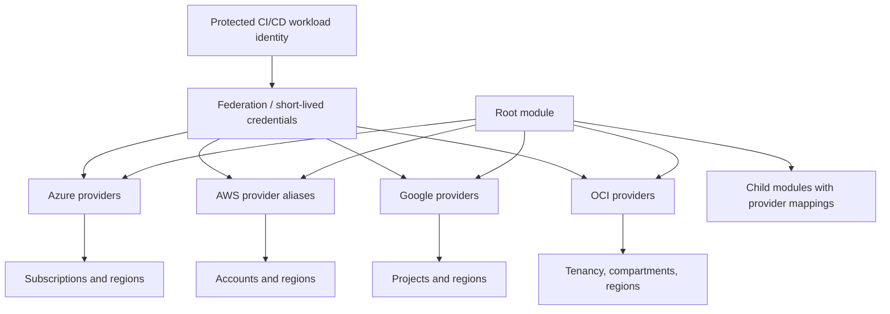

# Azure, AWS, GCP, and OCI Provider Patterns

## Purpose

This standard defines how Terraform providers are declared, configured, authenticated, aliased, passed to modules, versioned, and operated across Azure, AWS, GCP, and OCI.

Provider configuration is a security boundary. A mistaken default provider can deploy correctly formed infrastructure into the wrong subscription, account, project, region, tenancy, or compartment.

## Core rules

- Root modules MUST configure providers.
- Child modules MUST declare provider requirements and receive provider configurations from callers.
- Credentials MUST NOT be embedded in provider blocks.
- Workload identity or short-lived federation SHOULD be used for automation.
- Every provider source and compatible version range MUST be declared.
- Multiple scopes MUST use explicit, meaningful aliases.
- Provider scope MUST be validated before apply.
- Beta, preview, or generic API providers require documented justification and targeted tests.

## Provider architecture



## Provider requirements

```hcl
terraform {
  required_version = ">= 1.7.0, < 2.0.0"

  required_providers {
    azurerm = {
      source  = "hashicorp/azurerm"
      version = "~> 4.0"
    }
    azapi = {
      source  = "azure/azapi"
      version = "~> 2.0"
    }
    aws = {
      source  = "hashicorp/aws"
      version = ">= 5.0, < 7.0"
    }
    google = {
      source  = "hashicorp/google"
      version = ">= 6.0, < 8.0"
    }
    oci = {
      source  = "oracle/oci"
      version = ">= 7.0, < 9.0"
    }
  }
}
```

The versions above are examples, not the enterprise support matrix. Root modules MUST commit the dependency lock file and update it through reviewed dependency changes.

## Authentication hierarchy

Preferred automation methods:

| Cloud | Preferred | Acceptable controlled fallback | Prohibited normal pattern |
|---|---|---|---|
| Azure | Workload identity federation or managed identity | Certificate-based service principal | Client secret in code or variables |
| AWS | OIDC federation to IAM role; role chaining where governed | Short-lived STS credentials | Long-lived access keys in pipeline variables |
| GCP | Workload Identity Federation and service-account impersonation | Short-lived service account credential under exception | Service account JSON key in repository |
| OCI | Resource principal, instance principal, or approved federation | API signing key from protected secret store | Private key committed or passed in tfvars |

Local development MAY use each cloud's supported CLI or SDK credential chain, but production behavior MUST be tested with the pipeline identity.

## Azure patterns

### AzureRM default provider

```hcl
provider "azurerm" {
  features {}

  subscription_id = var.workload_subscription_id
  tenant_id       = var.tenant_id

  resource_provider_registrations = "none"
}
```

Provider behavior and registration policy MUST align with enterprise landing-zone controls. Automatic resource provider registration can require broad permissions and SHOULD be deliberately configured.

### Multiple subscriptions

```hcl
provider "azurerm" {
  alias           = "connectivity"
  features        {}
  subscription_id = var.connectivity_subscription_id
  tenant_id       = var.tenant_id
}

provider "azurerm" {
  alias           = "workload"
  features        {}
  subscription_id = var.workload_subscription_id
  tenant_id       = var.tenant_id
}

module "private_endpoint" {
  source = "./modules/private-endpoint"
  providers = {
    azurerm = azurerm.workload
    azurerm.dns = azurerm.connectivity
  }
}
```

A child module that requires a DNS-subscription provider MUST declare the alias through `configuration_aliases`.

### AzureRM and AzAPI

Use AzureRM for supported stable resources. Use AzAPI when Azure Resource Manager functionality is not yet exposed or when generic API access is specifically required.

AzAPI use MUST include:

- API version review.
- Schema or response validation.
- Migration plan to AzureRM when appropriate.
- Additional testing for update and delete behavior.
- Avoidance of two providers managing the same resource.

## AWS patterns

### Default and assumed-role provider

```hcl
provider "aws" {
  region = var.region

  assume_role {
    role_arn     = var.deployment_role_arn
    session_name = "terraform-${var.environment}"
  }

  default_tags {
    tags = local.standard_tags
  }
}
```

The bootstrap identity SHOULD have permission only to assume the target role. Target roles MUST be scoped to the root module's resources and operations.

### Multi-account and multi-region

```hcl
provider "aws" {
  alias  = "network"
  region = "ca-central-1"
  assume_role { role_arn = var.network_role_arn }
}

provider "aws" {
  alias  = "security"
  region = "ca-central-1"
  assume_role { role_arn = var.security_role_arn }
}

provider "aws" {
  alias  = "global"
  region = "us-east-1"
  assume_role { role_arn = var.workload_role_arn }
}
```

Global-service region requirements MUST be explicit. Do not rely on operator environment variables to select production regions.

### AWS provider defaults

Provider-level default tags are recommended but do not apply uniformly to every resource type. Modules MUST test actual tagging and handle exceptions.

## GCP patterns

### Project-scoped provider

```hcl
provider "google" {
  project = var.project_id
  region  = var.region
  zone    = var.zone
}
```

Automation SHOULD authenticate through Workload Identity Federation and, where appropriate, impersonate a dedicated service account.

### Multiple projects

```hcl
provider "google" {
  alias   = "host"
  project = var.host_project_id
  region  = var.region
}

provider "google" {
  alias   = "service"
  project = var.service_project_id
  region  = var.region
}

module "shared_vpc_attachment" {
  source = "./modules/shared-vpc-attachment"
  providers = {
    google.host    = google.host
    google.service = google.service
  }
}
```

Shared VPC, organization, folder, and project operations SHOULD use separate provider aliases and identities where privilege boundaries differ.

### `google-beta`

`google-beta` SHOULD be used only for features not available in the stable provider or when explicitly required by the service. The module MUST document beta status, test upgrade behavior, and define an exit plan. A stable and beta provider MUST NOT manage the same resource.

## OCI patterns

### Region and tenancy configuration

```hcl
provider "oci" {
  region = var.region
  # Authentication is supplied through the approved identity chain.
}
```

Compartment IDs SHOULD be explicit module inputs or outputs from a controlled identity/foundation root. Do not discover production compartments by display name when an immutable OCID is available.

### Multiple regions or aliases

```hcl
provider "oci" {
  alias  = "primary"
  region = "ca-montreal-1"
}

provider "oci" {
  alias  = "dr"
  region = "ca-toronto-1"
}

module "replicated_platform" {
  source = "./modules/replicated-platform"
  providers = {
    oci    = oci.primary
    oci.dr = oci.dr
  }
}
```

Availability domains and image identifiers SHOULD be obtained through supported data sources or catalog inputs rather than hard-coded positional assumptions.

## Child-module declarations

A child module requiring aliases MUST declare them.

```hcl
terraform {
  required_providers {
    google = {
      source = "hashicorp/google"
      configuration_aliases = [
        google.host,
        google.service
      ]
    }
  }
}
```

Provider aliases are not inherited by name automatically. The root module must pass mappings explicitly.

## Scope verification

Before apply, pipelines SHOULD verify the resolved execution scope:

| Cloud | Verification examples |
|---|---|
| Azure | tenant ID, subscription ID, principal object ID |
| AWS | caller identity ARN, account ID, region |
| GCP | principal, project ID, organization/folder context, region |
| OCI | tenancy OCID, principal type, region, target compartment OCID |

The pipeline MUST print non-secret scope identifiers in the job summary. A mismatch MUST fail before planning or applying.

## Provider configuration ownership

Provider configuration belongs in root modules because it depends on deployment context. Reusable modules MUST NOT:

- Authenticate providers.
- Choose credentials.
- Assume a local CLI profile.
- Hardcode account, subscription, project, tenancy, compartment, or region.
- Configure a backend.
- Silently use a different provider alias for privileged operations.

## Provider mirrors and supply chain

Enterprise environments MAY use a network mirror or private registry.

Controls:

- Provider source addresses remain explicit.
- Approved versions are allowlisted.
- Checksums are captured in `.terraform.lock.hcl`.
- Multi-platform checksums SHOULD be pre-populated when runners use different operating systems or architectures.
- Provider binaries MUST be scanned and provenance-checked according to software supply-chain policy.
- Direct downloads from unapproved registries MUST be blocked in protected pipelines.

## Multi-cloud root modules

A single root module MAY configure multiple cloud providers when all resources form one lifecycle unit. Example: federated DNS records and identity trust created atomically for one platform.

It SHOULD NOT combine unrelated cloud estates only for convenience. Separate roots are preferred when clouds have different owners, change windows, state sensitivity, or rollback behavior.

## Error handling and retries

Provider retries and timeouts SHOULD be tuned only for known service behavior. Excessive timeouts hide defects and make pipelines unpredictable.

- Use resource `timeouts` when the provider exposes them and evidence supports adjustment.
- Treat repeated throttling as a concurrency or quota design issue.
- Account for eventual consistency in tests with bounded retries.
- Do not wrap Terraform in unbounded shell retry loops.

## Provider schema and upgrade lifecycle

Provider configuration is only one part of provider governance. Teams MUST also manage schema evolution and normalization behavior.

Before raising a provider constraint or refreshing a lock file, maintainers SHOULD:

1. Review provider release notes, deprecations, and known issues.
2. Run representative plans against existing state.
3. Separate normalization-only diffs from intended infrastructure changes.
4. Test import, create, update, replacement, and destroy paths for critical resource types.
5. Confirm that provider defaults have not changed execution scope, tagging, registration, retry, or deletion behavior.
6. Record any temporary suppression or workaround with an owner and expiry date.

A provider upgrade that causes broad but harmless state normalization SHOULD still be isolated in a dedicated change. Mixing normalization with functional infrastructure changes makes review and rollback materially harder.

## Identity bootstrap and delegation boundaries

Workload federation still requires a bootstrap trust path. Bootstrap identities MUST be more tightly controlled than routine deployment identities because they can create or modify the trust relationships used by later pipelines.

A recommended model separates:

- **Bootstrap identity**: creates state storage, federation, registry access, and initial deployment roles.
- **Plan identity**: reads configuration scope and produces speculative plans; it SHOULD lack broad mutation rights where the execution platform supports separation.
- **Apply identity**: performs approved changes in one bounded root scope.
- **Break-glass identity**: disabled or tightly monitored, used only under an incident or recovery procedure.

Role chaining and cross-scope delegation MUST be explicit. The effective principal, target scope, session name, and region SHOULD be logged before Terraform initializes. A provider alias is not an authorization control; the cloud identity policy remains authoritative.

## Environment-variable and local credential safety

Provider SDKs commonly inspect environment variables, CLI sessions, metadata services, profiles, and local credential files. This convenience can select an unintended identity or scope.

Protected pipelines SHOULD start from a minimal environment, explicitly set non-secret scope values, and reject conflicting credential variables. Local execution guidance SHOULD include commands that display the effective tenant, account, project, tenancy, principal, and region before planning.

Examples and tests MUST NOT assume a developer's default profile. Where a provider supports profile selection, production automation SHOULD prefer federation and explicit scope configuration over profile names. Provider debug logging MUST be disabled by default because traces can expose headers, request bodies, identifiers, or sensitive computed values.

## Anti-patterns

- Credentials in provider blocks.
- One highly privileged identity for all clouds and environments.
- Aliases named `one`, `two`, or `other`.
- Implicit region selection from a developer workstation.
- Provider configuration inside catalog modules.
- Stable and beta providers managing the same resource.
- Unbounded provider versions.
- Automatic cross-account or cross-subscription lookup by display name.
- A default provider pointing to production while examples assume development.
- Mixing unrelated clouds in one state.

## Validation

- Required providers and bounded versions are declared.
- Root modules own provider configuration.
- Automation uses short-lived identity.
- Scope identifiers are verified before apply.
- Aliases reflect subscriptions, accounts, projects, tenancies, compartments, or regions clearly.
- Child modules declare and receive aliases explicitly.
- Preview or generic providers have justification and tests.
- Lock files and provider supply-chain controls are active.

## Related topics

- [Terraform Multi-Environment DevOps and Production Practices](iac-terraform-multi-environment-devops-and-production-practices.md)
- [Engineering Reusable Terraform Modules](iac-engineering-reusable-terraform-modules.md)
- [Environment Configuration and State Management](iac-environment-configuration-and-state-management.md)

## References

- Terraform provider requirements: https://developer.hashicorp.com/terraform/language/providers/requirements
- Providers within modules: https://developer.hashicorp.com/terraform/language/modules/develop/providers
- Azure Terraform overview: https://learn.microsoft.com/azure/developer/terraform/overview
- AWS Terraform provider best practices: https://docs.aws.amazon.com/prescriptive-guidance/latest/terraform-aws-provider-best-practices/introduction.html
- GCP Terraform documentation: https://cloud.google.com/docs/terraform
- OCI provider configuration: https://docs.oracle.com/en-us/iaas/Content/dev/terraform/configuring.htm
- OCI provider registry: https://registry.terraform.io/providers/oracle/oci/latest/docs
