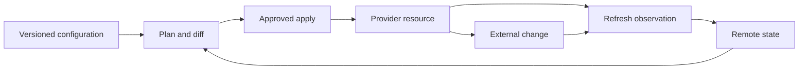

# IaC 漂移检测、协调与安全导入

## 目的

该标准定义了团队如何检测和解决基础设施配置、IaC 状态和真实提供程序资源之间的差异。它涵盖预定的漂移检测、仅刷新计划、批准的协调、资源导入、状态修复操作、所有权冲突和证据。

漂移处理必须保护三个不变量：

1. 预期配置可在版本控制中进行审查。
2. 状态将每个托管资源映射到正确的真实对象。
3. 只能通过批准和理解的计划来更改提供程序资源。

## 三态模型

配置表达意图。状态记录了 Terraform 与真实对象的关系。提供程序是观测到的环境。任何两个事件之间的差异并不一定是同一类型的事件。

## 漂移类别

|类别 |意义|正常动作|
|---|---|---|
|配置漂移|提供程序与声明的配置不同 |审查计划并恢复或编纂|
|状态漂移|状态不反映提供程序对象|仅刷新审查或状态修复 |
|所有权漂移|资源由错误的堆栈或工具管理 |冻结突变并解决所有权问题 |
|清单漂移|资源存在但未出现在预期目录中 |审核后导入或退出 |
|提供程序标准化| API 存储规范值 |狭义的文档或模型计算值 |
|故意例外 |临时或批准的背离 |对即将过期的异常和证据进行编码 |

## 检测时间表

以适合关键性和提供程序 API 限制的节奏运行漂移检测：

- 配置变更的拉取请求计划；
- 生产工作区的预定刷新计划；
- 针对高风险提供程序变更的事件触发调查；
- 事件后或紧急变更协调；和
- 非托管资源的定期清单比较。

检测器应该对重大变化发出告警，而不是对每个计算的或易失的提供程序属性发出告警。定义有意由提供程序控制的字段的白名单，并在提供程序行为发生变化时对其进行审查。

## 安全的仅刷新操作

使用仅刷新计划来监控远程更改而不更改基础设施：
```bash
terraform plan -refresh-only -out=drift.tfplan
terraform show -json drift.tfplan > drift.json
```
应评估该计划的以下方面：

- 资源添加、更新、替换和删除；
- 身份、网络、加密、公共访问和授权变更；
- 依赖关系和输出的更改；
- 提供程序计算的或默认的值；
- 配置或状态中缺少资源；和
- 对下游工作空间或服务的影响。

不要在仅刷新计划上使用 `terraform apply` 作为快捷方式。应用仅刷新更新状态和输出；它不会使远程资源匹配配置。后续行动必须将观测到的值编码化或创建恢复所需状态的正常计划。

## 协调决策树

1. 变更是否已获取批准？观测到的状态是否是预期的未来状态？
   - 更新配置、变量、策略和文档。
2. 变更是否已获批准，但只是暂时的？
   - 记录到期和恢复计划；不要将其隐藏在永久忽略规则中。
3. 变更是否未经授权或不安全？
   - 制定正常计划以在影响审查后恢复已声明的状态。
4. 状态映射是否错误或缺失？
   - 停止正常应用并修复所有权或导入状态。
5. 提供程序行为是否未知？
   - 保持突变、收集证据并在非生产工作空间中进行测试。

每个分支都需要一个所有者、风险分类、变更参考和验证结果。

## 安全导入工作流程

当实际资源应由当前堆栈管理时，例如预先存在的 Landing Zone 资源或在批准的恢复期间创建的资源，请使用导入。

### 准备

- 确认资源 ID 和提供程序订阅、账户、项目或隔间；
- 确认所有权并防止另一个堆栈管理它；
- 检查配置、依赖关系、加密、身份、网络、标签和生命周期；
- 根据后端进程进行状态备份；
- 创建目标资源块和稳定模块地址；和
- 将预期导入定义为已批准的变更。

### 导入并规范化

在支持的情况下使用导入块：
```hcl
import {
  to = azurerm_resource_group.platform
  id = "/subscriptions/00000000-0000-0000-0000-000000000000/resourceGroups/rg-platform"
}
```
运行计划并验证导入是否映射到预期对象。不要接受有不相关变更的计划。导入后，添加应具有权威性的参数，并在适当的情况下将提供程序计算的值保留为计算值。

### 导入后审核

1. 导入后运行计划。
2. 解释每项建议的更新、替换或删除。
3. 添加缺少的配置，直到计划无效或预期的更改明确为止。
4. 验证依赖关系和输出。
5. 仅应用经过审核的导入计划。
6. 运行后续正常计划以证明稳定收敛。
7. 仅在仓库策略允许的情况下删除临时导入块；保留它们可以保留历史意图。

在未确认模块不会创建第二个对象或应用破坏性默认值的情况下，切勿将资源导入模块地址。

## 状态修复和移动资源

当资源更改模块或地址而不更改实际对象时，使用 `moved` 块或批准的状态移动。仅当有意从管理中删除对象并且了解远程资源生命周期时才使用 `terraform state rm`。状态命令是特权操作，需要备份、审查和证据。

不要手动编辑远程状态 JSON。如果提供程序错误、损坏的状态或重复的绑定需要状态修复操作，请停止正常流水线，使用后端支持的恢复过程，并从隔离的管理上下文中执行操作。

## 策略和流水线控制

漂移工作流程必须：

- 使用可读身份进行检测；
- 将检测与突变分开；
- 防止并发计划并应用于一个状态；
- 将计划输出存储为受保护的证据；
- 除非明确批准，否则阻止针对身份、网络、加密、删除和公开曝光的自动修复；
- 需要批准导入、替换、状态迁移和广泛恢复；
- 关联提供程序活动、流水线、票证和状态版本；和
- 当工作区未在其所需窗口内刷新时发出告警。

仅当更改风险低、幂等、有界、可逆且经过测试时，自动协调才应用。标签修复可能符合条件；路由、角色分配、密钥或公共访问更改通常需要审查。

## 验证

- [ ] 每个工作区都有一个所有者、权威来源、状态后端和漂移节奏。
- [ ] 检测使用仅刷新计划或等效的非变异监控。
- [ ] 重大漂移在修复前进行分类。
- [ ] 配置、状态和提供程序所有权不冲突。
- [ ] 导入计划包含明确的目标和资源 ID。
- [ ] 审查导入后计划是否有意外的更改和替换。
- [ ] 状态移动和移除使用备份、批准和证据。
- [ ] 漂移修复不能与其他应用竞争。
- [ ] 重复的漂移会产生预防措施，而不是永久的忽略规则。

## 操作注意事项
平台工程负责共享的工作流程、策略、状态后端和检测标准。堆栈所有者负责配置和接受或恢复更改的业务决策。安全和治理团队审查高风险异常和访问路径。

在提供程序升级、状态事件、大量导入、紧急更改或重复误报后检查漂移策略。漂移检测质量是通过有用的检测和安全收敛来度量的，而不是通过告警的数量来度量的。

## 相关主题

- [基础设施即代码工程标准](iac-infrastructure-as-code-engineering-standards.md)
- [环境配置和状态管理](iac-environment-configuration-and-state-management.md)
- [Terraform 测试和验证](iac-terraform-testing-and-validation.md)
- [Terraform 多环境 DevOps 和生产实践](iac-terraform-multi-environment-devops-and-production-practices.md)
- [如何检测和修复基础设施和配置漂移](../how-to-guides/how-to-detect-and-remediate-infrastructure-and-configuration-drift.md)

## 参考文档

- [管理资源漂移](https://developer.hashicorp.com/terraform/tutorials/state/resource-drift)
- [运行仅刷新操作](https://developer.hashicorp.com/terraform/tutorials/cloud-get-started/cloud-refresh-only)
- [将现有资源导入 Terraform 状态](https://developer.hashicorp.com/terraform/language/import/single-resource)
- [Terraform 规划命令](https://developer.hashicorp.com/terraform/cli/commands/plan)
