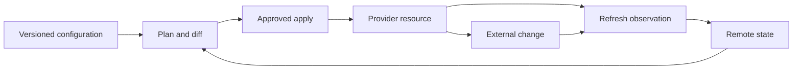

# IaC Drift Detection, Reconciliation, and Safe Import

## Purpose

This standard defines how teams detect and resolve differences between infrastructure configuration, IaC state, and real provider resources. It covers scheduled drift detection, refresh-only planning, approved reconciliation, resource import, state surgery, ownership conflicts, and evidence.

Drift handling must protect three invariants:

1. The intended configuration is reviewable in version control.
2. The state maps each managed resource to the correct real object.
3. The provider resource is changed only through an approved and understood plan.

## Three-state model



Configuration expresses intent. State records Terraform’s relationship to real objects. The provider is the observed environment. A difference between any two is not automatically the same kind of incident.

## Drift categories

| Category | Meaning | Normal action |
|---|---|---|
| Configuration drift | Provider differs from declared configuration | Review plan and revert or codify |
| State drift | State does not reflect the provider object | Refresh-only review or state repair |
| Ownership drift | Resource is managed by the wrong stack or tool | Freeze mutation and resolve ownership |
| Inventory drift | Resource exists but is not represented in the intended catalog | Import or retire after review |
| Provider normalization | API stores a canonical value | Narrowly document or model computed value |
| Intentional exception | Temporary or approved divergence | Encode an expiring exception and evidence |

## Detection schedule

Run drift detection at a cadence appropriate to criticality and provider API limits:

- pull request plan for configuration changes;
- scheduled refresh-only plan for production workspaces;
- event-triggered investigation for high-risk provider changes;
- post-incident or emergency change reconciliation; and
- periodic inventory comparison for unmanaged resources.

The detector should alert on material changes, not every computed or volatile provider attribute. Define an allowlist of intentionally provider-controlled fields and review it when provider behavior changes.

## Safe refresh-only operation

Use a refresh-only plan to observe remote changes without changing infrastructure:

```bash
terraform plan -refresh-only -out=drift.tfplan
terraform show -json drift.tfplan > drift.json
```

The plan should be evaluated for:

- resource additions, updates, replacements, and deletions;
- identity, network, encryption, public access, and authorization changes;
- changes to dependencies and outputs;
- provider-computed or defaulted values;
- resources missing from configuration or state; and
- impact on downstream workspaces or services.

Do not use `terraform apply` on a refresh-only plan as a shortcut. Applying refresh-only updates state and outputs; it does not make the remote resource match configuration. The follow-up action must either codify the observed value or create a normal plan that restores the desired state.

## Reconciliation decision tree

1. Was the change approved and is the observed state the intended future state?
   - Update configuration, variables, policy, and documentation.
2. Was the change approved but temporary?
   - Record the expiry and restore plan; do not hide it in a permanent ignore rule.
3. Was the change unauthorized or unsafe?
   - Create a normal plan to restore the declared state after impact review.
4. Is the state mapping wrong or missing?
   - Stop normal apply and repair ownership or import state.
5. Is the provider behavior unknown?
   - Hold mutation, collect evidence, and test in a non-production workspace.

Every branch needs an owner, risk classification, change reference, and verification result.

## Safe import workflow

Use import when a real resource should become managed by the current stack, such as a pre-existing landing-zone resource or a resource created during an approved recovery.

### Prepare

- confirm the resource ID and provider subscription, account, project, or compartment;
- confirm ownership and prevent another stack from managing it;
- inspect configuration, dependencies, encryption, identity, network, tags, and lifecycle;
- take a state backup according to the backend process;
- create the destination resource block and stable module address; and
- define the intended import as an approved change.

### Import and normalize

Use an import block where supported:

```hcl
import {
  to = azurerm_resource_group.platform
  id = "/subscriptions/00000000-0000-0000-0000-000000000000/resourceGroups/rg-platform"
}
```

Run a plan and verify that the import maps to the expected object. Do not accept a plan with unrelated changes. After import, add arguments that should be authoritative and keep provider-computed values as computed where appropriate.

### Post-import review

1. Run a plan after the import.
2. Explain every proposed update, replacement, or deletion.
3. Add missing configuration until the plan is no-op or the intended change is explicit.
4. Validate dependencies and outputs.
5. Apply only the reviewed import plan.
6. Run a subsequent normal plan to prove stable convergence.
7. Remove temporary import blocks only if the repository policy permits; retaining them can preserve historical intent.

Never import a resource into a module address without confirming that the module will not create a second object or apply destructive defaults.

## State repair and moved resources

Use `moved` blocks or approved state moves when a resource changes module or address without changing the real object. Use `terraform state rm` only when removing an object from management is intentional and the remote resource lifecycle is understood. State commands are privileged operations and require a backup, review, and evidence.

Do not edit remote state JSON manually. If a provider bug, corrupted state, or duplicate binding requires state surgery, stop the normal pipeline, use the backend-supported recovery process, and perform the operation from an isolated administrative context.

## Policy and pipeline controls

The drift workflow must:

- use a read-capable identity for detection;
- separate detection from mutation;
- prevent concurrent plans and applies for one state;
- store plan output as protected evidence;
- block auto-remediation for identity, networking, encryption, deletion, and public exposure unless explicitly approved;
- require approvals for imports, replacements, state moves, and broad reverts;
- correlate provider activity, pipeline, ticket, and state version; and
- alert when a workspace has not been refreshed within its required window.

Automatic reconciliation is appropriate only when the change is low-risk, idempotent, bounded, reversible, and tested. A tag repair may qualify; a route, role assignment, key, or public-access change normally requires review.

## Validation

- [ ] Every workspace has an owner, authoritative source, state backend, and drift cadence.
- [ ] Detection uses refresh-only plans or an equivalent non-mutating observation.
- [ ] Material drift is classified before remediation.
- [ ] Configuration, state, and provider ownership do not conflict.
- [ ] Import plans contain an explicit destination and resource ID.
- [ ] Post-import plans are reviewed for unintended changes and replacements.
- [ ] State moves and removals use backup, approval, and evidence.
- [ ] Drift remediation cannot race with another apply.
- [ ] Repeated drift creates a preventive action rather than a permanent ignore rule.

## Operational considerations

Platform engineering owns shared workflow, policy, state-backend, and detection standards. Stack owners own configuration and the business decision to accept or revert changes. Security and governance teams review high-risk exceptions and access paths.

Review the drift policy after provider upgrades, a state incident, a large import, an emergency change, or repeated false positives. Drift detection quality is measured by useful detection and safe convergence, not by the number of alerts.

## Related topics

- [Infrastructure as Code Engineering Standards](iac-infrastructure-as-code-engineering-standards.md)
- [Environment Configuration and State Management](iac-environment-configuration-and-state-management.md)
- [Terraform Testing and Validation](iac-terraform-testing-and-validation.md)
- [Terraform Multi-Environment DevOps and Production Practices](iac-terraform-multi-environment-devops-and-production-practices.md)
- [How to Detect and Remediate Infrastructure and Configuration Drift](../how-to-guides/how-to-detect-and-remediate-infrastructure-and-configuration-drift.md)

## References

- [Manage resource drift](https://developer.hashicorp.com/terraform/tutorials/state/resource-drift)
- [Run a refresh-only operation](https://developer.hashicorp.com/terraform/tutorials/cloud-get-started/cloud-refresh-only)
- [Import existing resources into Terraform state](https://developer.hashicorp.com/terraform/language/import/single-resource)
- [Terraform plan command](https://developer.hashicorp.com/terraform/cli/commands/plan)
