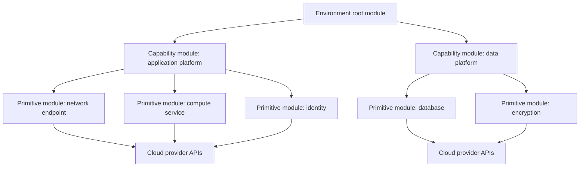
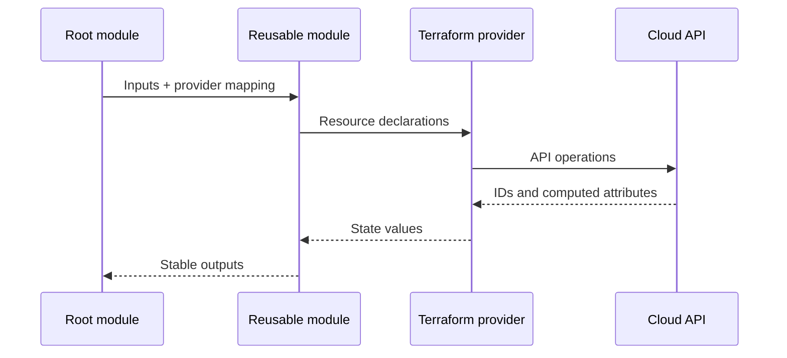

# 可复用 Terraform 模块工程

## 目的

本文档定义了企业 Terraform 模块的设计、实现、测试、日志记录和维护方式。可复用模块是具有受支持接口的内部产品，而不是碰巧包含多个资源的文件夹。

该标准应用于 Azure、AWS、GCP、OCI 和提供程序中立服务的模块。它支持特定于云的模块和常见的组合模式，而不假装不同的提供程序 API 是相同的。

## 模块分类

|模块类型|目的|典型事例|重用期望|
|---|---|---|---|
|原始模块 |包装紧密相关的资源集并强制执行企业默认设置 |存储账户/存储桶、Key Vault/KMS 密钥、子网 |高|
|能力模块 |提供可识别的平台功能 |私有 Web 应用、托管 Kubernetes 基线、安全数据库 |高|
|组合模块|组合目录模块以形成平台模式 |Application Landing Zone、数据平台基础|中到高|
|根模块 |为一个环境实例化模块并负责状态 | `payments-prod-ca`、`analytics-dev-us` |未作为可复用模块发布 |
|引导模块|为 IaC 执行创造先决条件 |状态后端、工作负载身份、注册表集成 |受控再利用|

模块 SHOULD 代表一致的生命周期边界。由于由一个应用使用而提供不相关服务的模块通常是根配置，而不是可复用模块。

## 抽象模型

该架构有意将环境策略保留在根模块中，并将可复用的实现逻辑保留在子模块中。

## 模块设计要求

### 凝聚力和边界

可复用的模块 MUST 满足以下要求：

- 管理通常会一起变化的资源。
- 有一个可以用一句话表达的明确目的。
- 避免使用特定于应用的名称、地址、ID 或组织假设，除非模块明确限定于该平台。
- 使接口比底层提供程序资源表面更小、更稳定。
- 暴露必要的变化，而不暴露每个提供程序的论点。
- 记录它创建的所有资源以及它读取的任何资源。

模块 SHOULD NOT：

- 将多个云合并在一个子模块中只是为了声称可移植性。
- 在同一状态边界中创建共享全局资源和应用本地资源。
- 将主要成本、安全性或拓扑决策隐藏在无害的默认值背后。
- 在资源级别使用 `count` 或 `for_each` 的方式会在列表排序更改时使地址不稳定。

### 明确的默认值

企业模块 SHOULD 强制执行以下安全默认设置：

- 加密和客户管理的密钥选项。
- 私有网络。
- 日志记录和诊断导出。
- 备份和保留。
- 资源元数据和标签。
- 软删除或恢复控制。
- TLS 和最低协议版本。
- 基于身份的访问而不是嵌入的凭据。

调用者 MUST 能够看到默认值何时更改基础设施行为。默认值 MUST NOT 隐式启用可能导致公开暴露、数据丢失或重大成本的行为。

### 界面稳定性

变量和输出形成模块契约。契约 MUST 满足以下要求：

- 具有明确的类型约束。
- 记录在案。
- 在可以本地检测到无效输入的情况下进行验证。
- 在主要版本内稳定。
- 围绕用户意图而不是提供程序实施细节进行设计。

当属性形成一个逻辑概念时，首选一种结构化对象：
```hcl
variable "network" {
  description = "Network attachment for the service."
  type = object({
    subnet_id            = string
    private_dns_zone_ids = optional(set(string), [])
    public_access        = optional(bool, false)
  })

  validation {
    condition     = !var.network.public_access || length(var.network.private_dns_zone_ids) == 0
    error_message = "Public access cannot be combined with private DNS zone attachments."
  }
}
```
避免单个无类型的 `map(any)` 将验证和文档负担迁移给每个调用者。

### 提供程序配置

可复用子模块 MUST 声明提供程序要求，但 SHOULD NOT 配置提供程序凭证、区域、订阅、项目、账户或租户。提供程序配置属于根模块并传递给子模块。
```hcl
terraform {
  required_providers {
    aws = {
      source                = "hashicorp/aws"
      version               = ">= 5.0, < 7.0"
      configuration_aliases = [aws.replica]
    }
  }
}
```
模块文档 MUST 定义别名。当该假设可能导致跨范围部署时，模块 MUST NOT 假设调用者的默认提供程序指向正确的账户、订阅、项目、区域或隔间。

## 标准模块结构
```text
terraform-<provider>-<name>/
├── README.md
├── CHANGELOG.md
├── LICENSE
├── CODEOWNERS
├── versions.tf
├── main.tf
├── variables.tf
├── locals.tf
├── outputs.tf
├── checks.tf
├── data.tf
├── tests/
│   ├── unit.tftest.hcl
│   └── integration.tftest.hcl
├── examples/
│   ├── basic/
│   └── complete/
├── docs/
│   ├── architecture.md
│   └── migration.md
└── .github/ or .azuredevops/
```
规则：

- 模块仓库名称 SHOULD 遵循 `terraform-<provider>-<name>`，以实现注册表兼容性和可搜索性。
- `main.tf` SHOULD 包含主要资源。大模块 MAY 通过连贯的子功能分割文件。
- `variables.tf` 和 `outputs.tf` MUST 继续作为公共接口的事实来源。
- 保留空文件 MUST NOT 仅用于匹配模板。
- 示例 MUST 在测试已发布模块的使用方式时固定已发布的模块版本；本地源示例 MAY 用于仓库集成测试。

## 资源寻址和迭代

- 更喜欢 `for_each`，它具有稳定的、调用者定义的键，用于多个命名对象。
- 对于顺序可能更改的集合，请避免使用 `count`。
- 切勿在未记录替换行为的情况下从可变显示名称派生资源键。
- 重构地址时，包含 `moved` 块以实现兼容迁移。
- 动态块 SHOULD 仅在改进接口时使用；深度嵌套的动态结构通常会重现提供程序模式并降低可读性。
```hcl
resource "azurerm_subnet" "this" {
  for_each = var.subnets

  name                 = each.key
  resource_group_name  = var.resource_group_name
  virtual_network_name = azurerm_virtual_network.this.name
  address_prefixes     = each.value.address_prefixes
}
```
## 命名、标记和元数据

模块 SHOULD 接受规范化元数据对象或与批准的命名模块集成。模块 MUST NOT 发明不兼容的标签键。
```hcl
variable "metadata" {
  description = "Normalized enterprise metadata applied to supported resources."
  type = object({
    application = string
    environment = string
    owner       = string
    cost_center = string
    data_class  = optional(string)
    extra       = optional(map(string), {})
  })
}
```
提供程序映射仍须明确：

- Azure：资源标签。
- AWS：提供程序默认标签以及特定于资源的标签（如果需要）。
- GCP：标签和相关标签。
- OCI：定义标签和自由格式标签。

## 前提条件、后置条件和检查

在提供程序调用之前使用验证失败。当断言依赖于资源或数据源值时，使用生命周期前置条件或后置条件。使用 `check` 块来实现更广泛的不变量，这些不变量应该连续评估，而不必阻塞每个操作。
```hcl
resource "aws_s3_bucket" "this" {
  bucket = var.name

  lifecycle {
    precondition {
      condition     = var.environment != "prod" || var.object_lock_enabled
      error_message = "Production buckets must enable object lock when this module is used for regulated data."
    }
  }
}
```
断言 MUST 具有确定性并产生可操作的错误消息。

## 输出设计

输出 SHOULD 公开持久集成契约，而不是每个资源属性。

好的输出包括：

- 稳定的资源 ID 或自链接。
- 网络连接点。
- 身份主体 ID。
- 服务端点。
- 密钥或机密存储 ID，而不是机密值。
- 用于下游组合的结构化对象。

避免输出：

- 密码、令牌或私钥。
- 完整的资源对象，除非存在特定的组合需求。
- 不必要地暴露提供程序实现细节的值。
- 命名不明确的重复输出。
```hcl
output "service" {
  description = "Stable service integration contract."
  value = {
    id                   = azurerm_linux_web_app.this.id
    hostname             = azurerm_linux_web_app.this.default_hostname
    principal_id         = azurerm_linux_web_app.this.identity[0].principal_id
    private_endpoint_ids = values(azurerm_private_endpoint.this)[*].id
  }
}
```
## 测试要求

每个目录模块 MUST 包括：

1. 格式和验证检查。
2. 使用`terraform test`进行单元或契约测试；模拟提供程序 SHOULD 用于不需要实时 API 的逻辑。
3. 安全和策略检查。
4. 对每个受支持的主要提供程序版本和重要部署模式至少进行一次实时集成测试。
5. 示例验证。
6. 从以前支持的模块版本升级有状态或复杂模块的测试。

测试 MUST 清理资源，使用隔离命名，并在专用的非生产账户、订阅、项目或隔间中运行。

## 文件要求

自述文件 MUST 包括：

- 模块创建和故意不创建的内容。
- 支持的云、区域、提供程序版本和 Terraform 版本。
- 架构图。
- 基本且完整的示例。
- 输入和输出。
- 身份和许可先决条件。
- 网络和 DNS 先决条件。
- 成本较高的选项。
- 安全控制和残余风险。
- 升级和弃用说明。
- 已知的限制。
- 所有权和支持渠道。

## 跨云模块策略

跨云一致性 SHOULD 存在于策略和目录层，而不是通过带有 `cloud = "azure"` 交换机的巨型模块。

首选模型：
```text
terraform-azurerm-private-web-service
terraform-aws-private-web-service
terraform-google-private-web-service
terraform-oci-private-web-service
```
每个模块都实现一个共享的功能配置文件：

- 私有入口。
- 工作负载身份。
- 中央日志记录。
- 加密。
- 标准元数据。
- 备份（如果适用）。

当云存在重大差异时，特定于提供程序的接口可能会有所不同。目录功能记录了等效性和例外情况。

## 许可合同

模块的身份要求是其公共契约的一部分。文档 MUST 标识规划、应用、读取、更新和销毁模块资源所需的权限。所有者或管理员等广泛角色作为正常记录在案的先决条件是不可接受的。

对于复杂的模块，维护者 SHOULD 发布一个权限矩阵：

|运营|所需能力|范围 |
|---|---|---|
|计划/阅读|了解现有网络和策略背景 |目标订阅、账户、项目或隔间 |
|应用 |创建和更新模块管理的资源 |模块部署边界 |
|跨范围集成 |附加 DNS、密钥或网络资源 |显式提供程序别名范围 |
|摧毁|仅删除模块管理的资源 |模块部署边界 |

权限 SHOULD 源自集成测试证据和提供程序 API 行为。隐藏数据源或隐式组织级操作 MUST 记录，因为它们通常需要超出模块可见创建的资源的权限。

## 接口演进和兼容性预算

模块 SHOULD 维护明确的兼容性预算：维护者承诺在主要版本中保留的一组接口和状态行为。

预算 SHOULD 涵盖：

- 变量名称、类型、默认值、空语义和验证行为。
- 输出名称、类型、敏感性和语义。
- 资源地址和导入路径。
- 必需的提供程序别名。
- 默认安全、网络、日志记录和保留状态。
- 支持的升级来源和预期计划效果。

新的可选属性 SHOULD 以保留现有调用者兼容性的方式添加。通过无限期地接受两个名称来重命名属性并不是完整的迁移策略；该模块应定义优先级，警告已弃用的形式，记录删除版本，并在弃用窗口期间测试两个路径。

## 成本和可运维性概览

可复用的模块 MUST 具有显著的成本和运营意义。如果安全默认设置默默地启用高成本复制、高级服务层、广泛的日志摄取或较长的保留期，那么它仍然是不合适的。

自述文件 SHOULD 说明：

- 即使闲置时也会产生基准成本的资源。
- 具有重大成本乘数的变量。
- 默认日志类别和保留行为。
- 备份、复制和灾难恢复影响。
- 预期的操作告警和仪表板。
- 与消费者相关的限制、配额和扩展边界。

模块 SHOULD 公开运行状况检查、监控集成和服务所有权所需的输出，但 SHOULD NOT 创建组织范围的仪表板或告警，除非这些资源共享相同的生命周期所有者。

## 反模式

- 具有多个不相关生命周期所有者的模块。
- 几乎每个提供程序参数的变量。
- 通过显示名称猜测环境资源的隐藏数据源。
- 隐式创建全局 IAM 或组织级资源。
- 变量中的提供程序凭证。
- 机密生成，然后是机密输出。
- 硬编码区域或订阅/账户/项目/隔间 ID。
- 来自 `main` 或另一个可变分支的模块。
- 声明后端的可复用模块。
- 依赖配置工具进行正常资源配置的模块。
- 打破资源地址更改而无需迁移块。

## 验证

仅当满足以下条件时，模块才有资格进行目录发布：

- 范围和生命周期边界是一致的。
- 接口类型和验证已完成。
- 声明提供程序要求和别名。
- 未配置后端或凭据。
- 示例部署成功。
- 测试涵盖默认、可选、无效和升级场景。
- 记录并扫描安全控制。
- 自述文件和生成的输入/输出文档是最新的。
- 配置语义发布自动化。
- 存在指定所有者和支持模型。

## 相关主题

- [Terraform 仓库和模块结构](iac-terraform-repository-and-module-structure.md)
- [输入、输出、依赖关系和组合](iac-inputs-outputs-dependencies-and-composition.md)
- [模块版本控制和发布管理](iac-module-versioning-and-release-management.md)

## 参考文档

- HashiCorp 模块概述：https://developer.hashicorp.com/terraform/language/modules
- HashiCorp 模块参考：https://developer.hashicorp.com/terraform/language/block/module
- HashiCorp Terraform 风格指南：https://developer.hashicorp.com/terraform/language/style
- GCP 可复用模块指南：https://cloud.google.com/docs/terraform/best-practices-for-terraform#reusable_modules
- AWS 代码结构指南：https://docs.aws.amazon.com/prescriptive-guidance/latest/terraform-aws-provider-best-practices/structure.html
