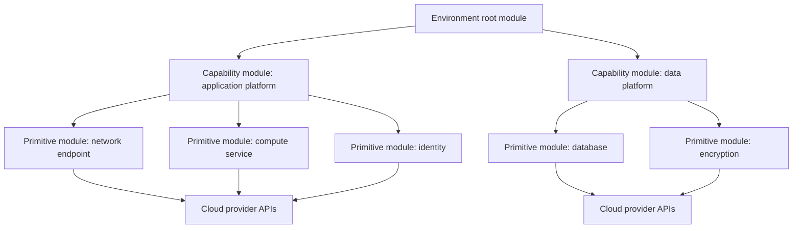
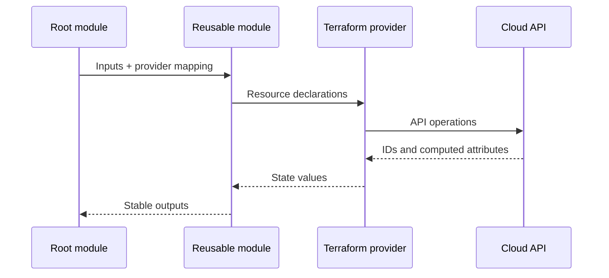

# Engineering Reusable Terraform Modules

## Purpose

This document defines how enterprise Terraform modules are designed, implemented, tested, documented, and maintained. A reusable module is an internal product with a supported interface, not a folder that happens to contain several resources.

The standard applies to modules for Azure, AWS, GCP, OCI, and provider-neutral services. It supports cloud-specific modules and common composition patterns without pretending that different provider APIs are identical.

## Module taxonomy

| Module type | Purpose | Typical examples | Reuse expectation |
|---|---|---|---|
| Primitive module | Wraps a tightly related resource set and enforces enterprise defaults | Storage account/bucket, key vault/KMS key, subnet | High |
| Capability module | Delivers a recognizable platform capability | Private web app, managed Kubernetes baseline, secure database | High |
| Composition module | Combines catalog modules for a platform pattern | Application landing zone, data platform foundation | Medium to high |
| Root module | Instantiates modules for one environment and owns state | `payments-prod-ca`, `analytics-dev-us` | Not published as a reusable module |
| Bootstrap module | Creates prerequisites for IaC execution | State backend, workload identity, registry integration | Controlled reuse |

A module SHOULD represent a coherent lifecycle boundary. A module that provisions unrelated services because they are used by one application is usually a root configuration, not a reusable module.

## Abstraction model



The architecture intentionally keeps environment policy in the root module and reusable implementation logic in child modules.

## Module design requirements

### Cohesion and boundaries

A reusable module MUST:

- Own resources that normally change together.
- Have a clear purpose expressible in one sentence.
- Avoid application-specific names, addresses, IDs, or organizational assumptions unless the module is explicitly scoped to that platform.
- Keep the interface smaller and more stable than the underlying provider resource surface.
- Expose necessary variation without exposing every provider argument.
- Document all resources it creates and any resources it reads.

A module SHOULD NOT:

- Combine multiple clouds in one child module merely to claim portability.
- Create shared global resources and application-local resources in the same state boundary.
- Hide major cost, security, or topology decisions behind innocuous defaults.
- use `count` or `for_each` at the resource level in a way that makes addresses unstable when list ordering changes.

### Opinionated defaults

Enterprise modules SHOULD enforce safe defaults for:

- Encryption and customer-managed key options.
- Private networking.
- Logging and diagnostic export.
- Backup and retention.
- Resource metadata and tags or labels.
- Soft-delete or recovery controls.
- TLS and minimum protocol versions.
- Identity-based access instead of embedded credentials.

A caller MUST be able to see when a default changes infrastructure behavior. Defaults that can create public exposure, data loss, or significant cost MUST NOT be enabled implicitly.

### Interface stability

Variables and outputs form the module contract. The contract MUST be:

- Typed.
- Documented.
- Validated where invalid input can be detected locally.
- Stable within a major version.
- Designed around user intent rather than provider implementation details.

Prefer one structured object when attributes form one logical concept:

```hcl
variable "network" {
  description = "Network attachment for the service."
  type = object({
    subnet_id            = string
    private_dns_zone_ids = optional(set(string), [])
    public_access        = optional(bool, false)
  })

  validation {
    condition     = !var.network.public_access || length(var.network.private_dns_zone_ids) == 0
    error_message = "Public access cannot be combined with private DNS zone attachments."
  }
}
```

Avoid a single untyped `map(any)` that transfers validation and documentation burden to every caller.

### Provider configuration

Reusable child modules MUST declare provider requirements but SHOULD NOT configure provider credentials, regions, subscriptions, projects, accounts, or tenancies. Provider configurations belong in the root module and are passed to child modules.

```hcl
terraform {
  required_providers {
    aws = {
      source                = "hashicorp/aws"
      version               = ">= 5.0, < 7.0"
      configuration_aliases = [aws.replica]
    }
  }
}
```

The module MUST document required aliases. A module MUST NOT assume a caller's default provider points to the correct account, subscription, project, region, or compartment when that assumption can cause cross-scope deployment.

## Standard module structure

```text
terraform-<provider>-<name>/
├── README.md
├── CHANGELOG.md
├── LICENSE
├── CODEOWNERS
├── versions.tf
├── main.tf
├── variables.tf
├── locals.tf
├── outputs.tf
├── checks.tf
├── data.tf
├── tests/
│   ├── unit.tftest.hcl
│   └── integration.tftest.hcl
├── examples/
│   ├── basic/
│   └── complete/
├── docs/
│   ├── architecture.md
│   └── migration.md
└── .github/ or .azuredevops/
```

Rules:

- Module repository names SHOULD follow `terraform-<provider>-<name>` for registry compatibility and searchability.
- `main.tf` SHOULD contain the primary resources. Large modules MAY split files by coherent sub-capability.
- `variables.tf` and `outputs.tf` MUST remain authoritative for the public interface.
- Empty files MUST NOT be retained only to match the template.
- Examples MUST pin a released module version when testing published consumption; local-source examples MAY be used for repository integration tests.

## Resource addressing and iteration

- Prefer `for_each` with stable, caller-defined keys for multiple named objects.
- Avoid `count` for collections whose order can change.
- Never derive resource keys from mutable display names without documenting replacement behavior.
- When refactoring addresses, include `moved` blocks for compatible migrations.
- Dynamic blocks SHOULD be used only when they improve the interface; deeply nested dynamic structures often reproduce the provider schema and reduce readability.

```hcl
resource "azurerm_subnet" "this" {
  for_each = var.subnets

  name                 = each.key
  resource_group_name  = var.resource_group_name
  virtual_network_name = azurerm_virtual_network.this.name
  address_prefixes     = each.value.address_prefixes
}
```

## Naming, tagging, and metadata

Modules SHOULD accept a normalized metadata object or integrate with an approved naming module. They MUST NOT invent incompatible tag keys.

```hcl
variable "metadata" {
  description = "Normalized enterprise metadata applied to supported resources."
  type = object({
    application = string
    environment = string
    owner       = string
    cost_center = string
    data_class  = optional(string)
    extra       = optional(map(string), {})
  })
}
```

Provider translation remains explicit:

- Azure: resource tags.
- AWS: provider default tags plus resource-specific tags where required.
- GCP: labels and, where relevant, tags.
- OCI: defined tags and freeform tags.

## Preconditions, postconditions, and checks

Use validations to fail before provider calls. Use lifecycle preconditions or postconditions when the assertion depends on resource or data-source values. Use `check` blocks for broader invariants that should be continuously evaluated without necessarily blocking every operation.

```hcl
resource "aws_s3_bucket" "this" {
  bucket = var.name

  lifecycle {
    precondition {
      condition     = var.environment != "prod" || var.object_lock_enabled
      error_message = "Production buckets must enable object lock when this module is used for regulated data."
    }
  }
}
```

Assertions MUST be deterministic and produce actionable error messages.

## Output design

Outputs SHOULD expose durable integration contracts, not every resource attribute.

Good outputs include:

- Stable resource IDs or self-links.
- Network attachment points.
- Identity principal IDs.
- Service endpoints.
- Key or secret store IDs, not secret values.
- A structured object intended for downstream composition.

Avoid outputting:

- Passwords, tokens, or private keys.
- Complete resource objects unless a specific composition need exists.
- Values that unnecessarily expose provider implementation details.
- Duplicated outputs with ambiguous naming.

```hcl
output "service" {
  description = "Stable service integration contract."
  value = {
    id                   = azurerm_linux_web_app.this.id
    hostname             = azurerm_linux_web_app.this.default_hostname
    principal_id         = azurerm_linux_web_app.this.identity[0].principal_id
    private_endpoint_ids = values(azurerm_private_endpoint.this)[*].id
  }
}
```

## Testing requirements

Every catalog module MUST include:

1. Formatting and validation checks.
2. Unit or contract tests using `terraform test`; mocked providers SHOULD be used for logic that does not require live APIs.
3. Security and policy checks.
4. At least one live integration test for each supported major provider version and significant deployment mode.
5. Example validation.
6. Upgrade testing from the previous supported module version for stateful or complex modules.

Tests MUST clean up resources, use isolated naming, and run in dedicated nonproduction accounts, subscriptions, projects, or compartments.

## Documentation requirements

The README MUST include:

- What the module creates and deliberately does not create.
- Supported clouds, regions, provider versions, and Terraform versions.
- Architecture diagram.
- Basic and complete examples.
- Inputs and outputs.
- Identity and permission prerequisites.
- Network and DNS prerequisites.
- Cost-significant options.
- Security controls and residual risks.
- Upgrade and deprecation notes.
- Known limitations.
- Ownership and support channel.



## Cross-cloud module strategy

Cross-cloud consistency SHOULD exist at the policy and catalog layers, not through one giant module with a `cloud = "azure"` switch.

Preferred model:

```text
terraform-azurerm-private-web-service
terraform-aws-private-web-service
terraform-google-private-web-service
terraform-oci-private-web-service
```

Each module implements a shared capability profile:

- Private ingress.
- Workload identity.
- Central logging.
- Encryption.
- Standard metadata.
- Backup where applicable.

The provider-specific interfaces may differ when the clouds differ materially. A catalog capability record documents equivalence and exceptions.

## Permission contract

A module's identity requirements are part of its public contract. Documentation MUST identify permissions required to plan, apply, read, update, and destroy the module's resources. Broad roles such as owner or administrator are not acceptable as the normal documented prerequisite.

For complex modules, maintainers SHOULD publish a permission matrix:

| Operation | Required capability | Scope |
|---|---|---|
| Plan/read | Read existing network and policy context | Target subscription, account, project, or compartment |
| Apply | Create and update module-owned resources | Module deployment boundary |
| Cross-scope integration | Attach DNS, key, or network resources | Explicit provider alias scope |
| Destroy | Delete module-owned resources only | Module deployment boundary |

Permissions SHOULD be derived from integration-test evidence and provider API behavior. Hidden data sources or implicit organization-level operations MUST be documented because they often require privileges beyond the resources visibly created by the module.

## Interface evolution and compatibility budget

A module SHOULD maintain an explicit compatibility budget: the set of interface and state behaviors maintainers commit to preserving within a major version.

The budget SHOULD cover:

- Variable names, types, defaults, null semantics, and validation behavior.
- Output names, types, sensitivity, and semantic meaning.
- Resource addresses and import paths.
- Required provider aliases.
- Default security, networking, logging, and retention posture.
- Supported upgrade sources and expected plan effects.

New optional attributes SHOULD be added in a way that preserves existing callers. Renaming an attribute by accepting both names indefinitely is not a complete migration strategy; the module should define precedence, warn about the deprecated form, document a removal release, and test both paths during the deprecation window.

## Cost and operability profile

Reusable modules MUST surface cost-significant and operations-significant behavior. A secure default can still be unsuitable if it silently enables high-cost replication, premium service tiers, extensive log ingestion, or large retention periods.

The README SHOULD state:

- Resources that incur baseline cost even when idle.
- Variables with material cost multipliers.
- Default log categories and retention behavior.
- Backup, replication, and disaster-recovery implications.
- Expected operational alerts and dashboards.
- Limits, quotas, and scaling boundaries relevant to consumers.

Modules SHOULD expose outputs needed for health checks, monitoring integration, and service ownership, but SHOULD NOT create organization-wide dashboards or alerts unless those resources share the same lifecycle owner.

## Anti-patterns

- A module with more than one unrelated lifecycle owner.
- A variable for nearly every provider argument.
- Hidden data sources that guess environment resources by display name.
- Implicit creation of global IAM or organization-level resources.
- Provider credentials in variables.
- Secret generation followed by secret output.
- Hard-coded regions or subscription/account/project/compartment IDs.
- Modules sourced from `main` or another mutable branch.
- Reusable modules that declare a backend.
- Modules that rely on provisioners for normal resource configuration.
- Breaking resource address changes without migration blocks.

## Validation

A module is eligible for catalog publication only when:

- Scope and lifecycle boundary are coherent.
- Interface types and validations are complete.
- Provider requirements and aliases are declared.
- No backend or credentials are configured.
- Examples deploy successfully.
- Tests cover default, optional, invalid, and upgrade scenarios.
- Security controls are documented and scanned.
- README and generated input/output documentation are current.
- Semantic release automation is configured.
- A named owner and support model exist.

## Related topics

- [Terraform Repository and Module Structure](iac-terraform-repository-and-module-structure.md)
- [Inputs, Outputs, Dependencies, and Composition](iac-inputs-outputs-dependencies-and-composition.md)
- [Module Versioning and Release Management](iac-module-versioning-and-release-management.md)

## References

- HashiCorp modules overview: https://developer.hashicorp.com/terraform/language/modules
- HashiCorp module block reference: https://developer.hashicorp.com/terraform/language/block/module
- HashiCorp Terraform style guide: https://developer.hashicorp.com/terraform/language/style
- GCP reusable modules guidance: https://cloud.google.com/docs/terraform/best-practices-for-terraform#reusable_modules
- AWS code structure guidance: https://docs.aws.amazon.com/prescriptive-guidance/latest/terraform-aws-provider-best-practices/structure.html
