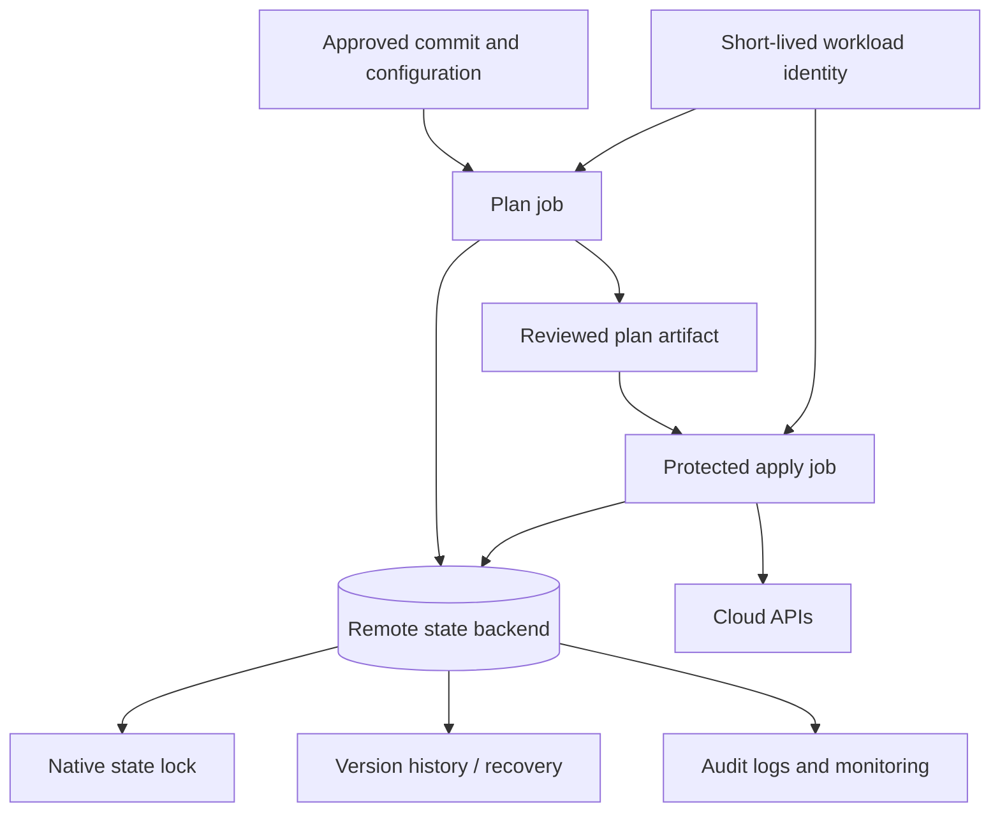
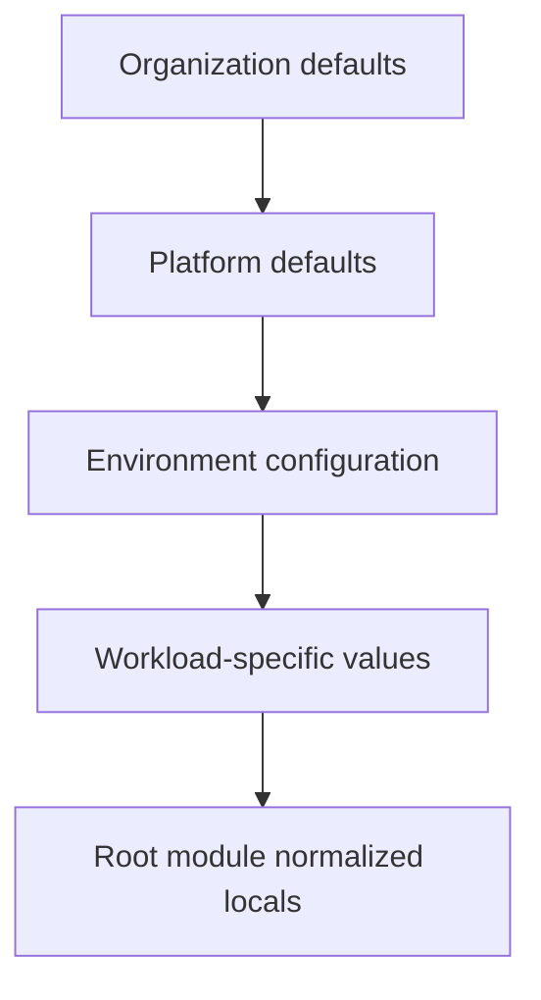
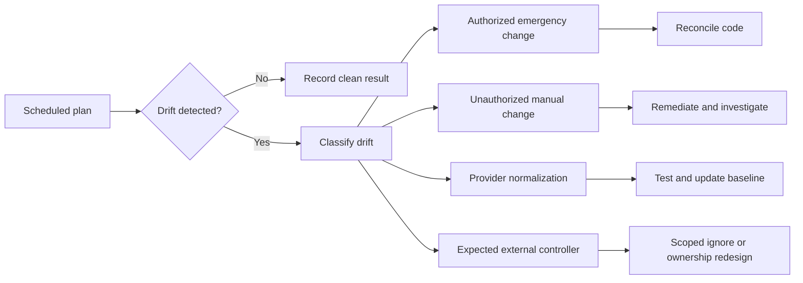

# 环境配置和状态管理

## 目的

Terraform 状态是一个包含资源标识、依赖元数据和潜在敏感属性的操作数据库。该标准定义了如何配置环境以及如何跨 Azure、AWS、GCP 和 OCI 隔离、存储、锁定、备份、访问、迁移和恢复状态。

## 环境模型

环境是受控部署边界，具有以下定义：

- 云控制平面范围。
- 身份和授权模型。
- 一个或多个地区。
- 状态后端和密钥。
- 配置集。
- 批准路径。
- 更改窗口和恢复目标。
- 所有权和支持模型。

环境不仅仅是一个 `.tfvars` 文件。

## 状态架构

## 状态边界设计

当组件有不同时，状态 SHOULD 被拆分：

- 负责人。
- 权限要求。
- 改变频率。
- 失败或回滚域。
- 合规性分类。
- 地区或驻留要求。
- 可用性生命周期。

状态 MUST NOT 被如此积极地分割，以至于每个资源都成为一个单独的根，并且正常的依赖关系需要远程状态读取的网络。

典型边界：
```text
organization-foundation
identity-baseline
regional-connectivity
shared-security-services
container-platform
application-platform
application-instance
```
## 远程后端要求

生产和共享非生产状态 MUST 使用支持锁定的远程后端。后端基础设施 MUST 通过经过批准的引导流程进行配置，与其存储的状态分开。

所有后端 MUST 实现：

- 静态和传输中的加密。
- 原生或 Terraform 支持的锁定。
- 版本控制或等效的时间点恢复。
- 限制数据平面访问。
- 审计日志记录。
- 删除保护或保留控制。
- 监控失败的访问、删除、策略更改和锁定异常。
- 记录在案的恢复程序。

### Azure Blob Storage
```hcl
terraform {
  backend "azurerm" {
    resource_group_name  = "rg-tfstate-prod"
    storage_account_name = "sttfstateprod001"
    container_name       = "tfstate"
    key                  = "connectivity/prod.tfstate"
    use_azuread_auth     = true
  }
}
```
Azure Blob Storage 为 `azurerm` 后端提供原生锁定和一致性支持。在支持的情况下，使用 Microsoft Entra 身份验证而不是存储账户密钥。限制网络访问、启用 blob 版本控制和保护控制，并将后端管理与状态读/写访问分开。

### Amazon S3
```hcl
terraform {
  backend "s3" {
    bucket       = "example-tfstate-prod"
    key          = "connectivity/prod.tfstate"
    region       = "ca-central-1"
    encrypt      = true
    use_lockfile = true
  }
}
```
使用 S3 版本控制、强存储桶策略、加密、访问日志记录和 `use_lockfile = true`。当前 Terraform 指南中已弃用基于 DynamoDB 的锁定，并且 SHOULD 被视为迁移模式，而不是目标设计。原生 S3 锁定文件支持需要 Terraform 1.10.0 或更高版本；任何启用 `use_lockfile = true` 的根模块 MUST 强制执行兼容的 `required_version`。

### Cloud Storage
```hcl
terraform {
  backend "gcs" {
    bucket = "example-tfstate-prod"
    prefix = "connectivity/prod"
  }
}
```
GCS 后端支持锁定。启用对象版本控制、统一存储桶级别访问、公共访问预防、日志记录和范围狭窄的工作负载身份。

### OCI Object Storage
```hcl
terraform {
  backend "oci" {
    bucket    = "tfstate-prod"
    namespace = "example-namespace"
    key       = "connectivity/prod.tfstate"
    region    = "ca-montreal-1"
  }
}
```
OCI 后端通过对象存储中的锁对象支持状态锁定。仅授予特定存储桶和前缀所需的对象操作。启用版本控制和审核控制，并在可行的情况下使用资源或实例主体。

## 后端配置

后端块无法使用普通的 Terraform 输入变量。环境特定的后端值 SHOULD 通过以下方式提供：

- 提交的非机密部分后端配置。
- 在支持的情况下受保护的流水线环境变量。
- 生成的临时后端文件，不包含长期机密。
- 执行平台工作区配置。
```hcl
terraform {
  backend "azurerm" {}
}
```

```bash
terraform init \
  -backend-config=backend/prod.hcl \
  -reconfigure
```
凭证 MUST 通过后端支持的身份链提供，而不是嵌入到 `-backend-config` 中，因为后端配置可以记录在 `.terraform` 下和计划制品中。

## 环境配置模式

### 非机密配置

非机密值 MAY 存储在版本控制中：
```hcl
# env/prod.tfvars
region      = "ca-central-1"
environment = "prod"
service_tier = "critical"
```
### 机密配置

机密 MUST 在运行时从批准的 Secret Manager 或基于身份的数据源注入。避免通过 `.tfvars` 或可记录的命令行标志传递机密。

首选选项：

- 让目标服务生成或轮换凭证。
- 生成一个值并将其直接写入机密存储。
- 通过 ID 引用现有机密。
- 使用工作负载身份，因此不需要凭据。

### 配置分层

分层 MUST 具有确定性优先级。避免跨多个文件或工具 SHOULD 隐藏合并。

## 状态安全

即使输出标记为敏感，Terraform 状态和计划文件 MAY 也包含敏感值。

控制：

- 规定阅读器 MUST 仅限于需要它的平台操作员和自动化。
- 计划制品 MUST 保留和访问受到限制。
- 后端管理员 SHOULD 不会自动获取云应用权限。
- 除非明确批准和保护，否则状态存储 MUST NOT 通过公共端点公开。
- 当数据分类或法规要求时，SHOULD 使用客户管理的加密密钥。
- 访问日志 MUST 根据企业审计标准保留。
- 将 MUST NOT 状态复制到票证、聊天、电子邮件或本地共享驱动器。

## 锁定和并发

- 应用操作 MUST 获取状态锁。
- 流水线 MUST 序列化应用于每个根模块。
- `-lock=false` 禁止用于应用和状态突变。
- 锁定超时 MAY 配置为容忍排队部署。
- 强制解锁需要验证没有进程仍在写入状态、采集锁 ID 和所有者以及事件或变更记录。
- 并行计划 MAY 仅当执行平台可以保证它们不会改变状态并且审核者了解结果可能会过时才运行。

## 工作空间

CLI 工作区共享一个后端配置，对于重复的同类实例非常有用。它们 SHOULD NOT 可用于分隔不同的环境：

- 凭证。
- 访问限制。
- 合规性分类。
- 后端保留。
- 批准路径。
- 拓扑。

生产环境隔离 SHOULD 通常使用单独的根模块、后端密钥或具有不同策略和身份的执行平台工作区。

## 状态操作

状态命令是特权操作。

批准的操作包括：

- 用于诊断的 `terraform state list` 和 `show`。
- 当 `terraform state mv` 块无法使用时，`moved` 用于受控地址重构。
- `terraform state rm` 仅当故意放弃管理时。
- `terraform import`或导入块以采用现有资源。
- `terraform force-unlock`下的锁恢复程序。

要求：

1. 备份或确认版本控制的恢复点。
2. 采集更改前的状态序列和数据血缘。
3. 使用相同的 Terraform 和提供程序兼容性基线。
4. 尽可能在非生产环境中进行测试。
5. 记录命令和结果。
6. 操作后运行完整的计划。

禁止手动编辑状态 JSON。

## 迁移模式

### 本地到远程

- 冻结变更。
- 创建并保护后端。
- 配置后端块。
- 运行`terraform init -migrate-state`。
- 验证数据血缘、资源计数和计划输出。
- 安全删除残留的本地状态副本。

### 拆分状态

- 定义目标所有权和依赖关系交换。
- 添加目的地配置。
- 通过 `moved` 块在支持或受控状态操作的兼容配置之间移动资源。
- 验证没有资源由两个状态管理。
- 通过批准的界面发布所需的输出。
- 针对源和目的地运行计划。

### 重命名和重构

使用 `moved` 块进行地址更改以保留真实对象。
```hcl
moved {
  from = azurerm_storage_account.logs
  to   = module.logging.azurerm_storage_account.this
}
```
在记录在案的兼容期内保留迁移块。

## 备份与恢复

恢复计划 MUST 覆盖：

- 意外状态删除。
- 状态损坏。
- 未经授权的状态修改。
- 后端区域中断。
- 锁丢失。
- 提供程序或 Terraform 回归。
- 部分应用。

恢复优先级：

1.停止一切应用。
2. 保留日志和当前状态对象。
3. 恢复最后一个已知的有效版本或使用执行平台的状态回滚功能。
4. 使用受控版本重新初始化。
5. 根据需要运行仅刷新计划和正常计划。
6. 协调实际云环境和配置。
7. 简历仅在同行评审后应用。

状态恢复 MUST NOT 与基础设施回滚相混淆。如果云资源随后发生变化，恢复的旧状态可能会导致 Terraform 提出破坏性或重复的操作。

## 漂移管理

漂移结果 MUST 有所有者和处置。广泛的生命周期忽略并不是可接受的漂移策略。

## 说明清单和分类

每个远程状态对象 SHOULD 都在记录其所有者、后端位置、密钥或前缀、环境、云范围、数据分类、恢复层、锁定机制、保留策略和上次成功的漂移检查的清单中注册。

状态分类 SHOULD 反映状态可以包含的最敏感值，而不仅仅是声明的输出敏感度。包含数据库连接材料、身份属性、私有端点或加密配置的状态可能需要比源仓库更严格的控制。

清单 MUST 检测：

- 没有活动根仓库的孤立状态。
- 多个根声明相同的状态密钥。
- 生产状态存储在非生产后端。
- 没有版本控制、锁定或最近访问日志的后端。
- 说明在预期运行期间未触及的物体。
- 不再解析的所有权或身份日志记录。

## 过时的计划和状态串行控制

保存的计划仅对于创建它的状态和配置上下文有效。在以下情况下应用工作流程 MUST 使计划失效或重新生成：

- 源提交更改。
- 状态序列或血统发生变化。
- 提供程序选择或依赖性锁定发生变化。
- 后端配置或执行身份发生变化。
- 发生紧急或带外修改。
- 根据变更策略，批准窗口期满。

执行平台 SHOULD 将计划制品绑定到提交、根标识符、状态数据血缘、状态序列、提供程序锁校验和与环境。过时的计划 MUST 失败，而不是在已批准的应用作业中自动重新生成，因为重新生成会更改批准的制品审阅者。

## 恢复练习和后端中断处理

状态恢复程序 MUST 得到执行，而不仅仅是日志记录。关键后端 SHOULD 使用非生产副本或受控恢复范围进行定期恢复测试。

恢复练习 SHOULD 证明操作员可以：

1. 识别正确的状态对象和有效的历史版本。
2. 停止所有编写器和计划的自动化。
3. 恢复或复制所选版本而不覆盖证据。
4. 使用批准的 Terraform 和提供程序版本重新初始化。
5. 使用安全计划将恢复的状态与实际云环境进行比较。
6. 协调部分应用和外部更改的资源。
7. 仅在同行评审后恢复自动化。

在后端中断期间，团队 MUST NOT 将生产根切换到临时本地状态。正确的响应是暂停写入，保护云环境免受不受控制的更改，并恢复受管控的后端或激活已批准的连续性设计。

## 反模式

- 共享或生产基础设施的本地状态。
- 所有云和环境的一种状态。
- 源代码中的后端凭据。
- 授予所有开发人员状态存储桶/容器访问权限。
- 禁用锁定以修复流水线争用。
- 附加到支持工单的状态文件。
- 直接状态 JSON 编辑。
- 使用工作空间隐藏具有不同安全模型的环境。
- 无版本的后端存储。
- 永久陈旧的锁，没有操作程序。
- 无需先停止应用自动化即可恢复状态。

## 验证

- 每个根模块都有一个记录在案的状态所有者和后端密钥。
- 启用远程锁定和版本控制。
- 后端身份验证在支持的情况下使用短期身份。
- 状态访问比代码访问更窄。
- 环境配置是确定性的，机密是外部化的。
- 记录恢复、强制解锁、迁移和漂移程序。
- 预定的漂移检测正在运行。

## 相关主题

- [模块版本控制和发布管理](iac-module-versioning-and-release-management.md)
- [可复用 Terraform 模块工程](iac-engineering-reusable-terraform-modules.md)
- [输入、输出、依赖关系和组合](iac-inputs-outputs-dependencies-and-composition.md)

## 参考文档

- Terraform 后端：https://developer.hashicorp.com/terraform/language/backend
- AzureRM 后端：https://developer.hashicorp.com/terraform/language/backend/azurerm
- S3 后端：https://developer.hashicorp.com/terraform/language/backend/s3
- GCS 后端：https://developer.hashicorp.com/terraform/language/backend/gcs
- OCI 后端：https://developer.hashicorp.com/terraform/language/backend/oci
- Terraform 状态锁定：https://developer.hashicorp.com/terraform/language/state/locking
- Terraform 远程状态数据：https://developer.hashicorp.com/terraform/language/state/remote-state-data
- Terraform 敏感数据：https://developer.hashicorp.com/terraform/language/manage-sensitive-data
