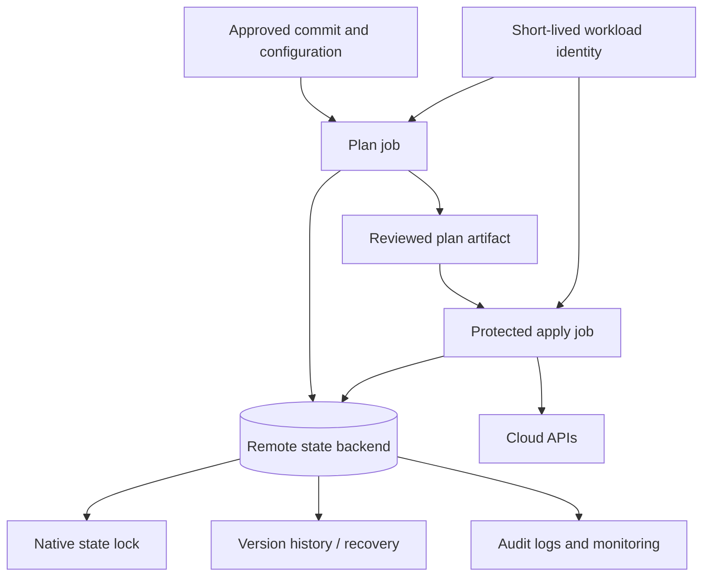
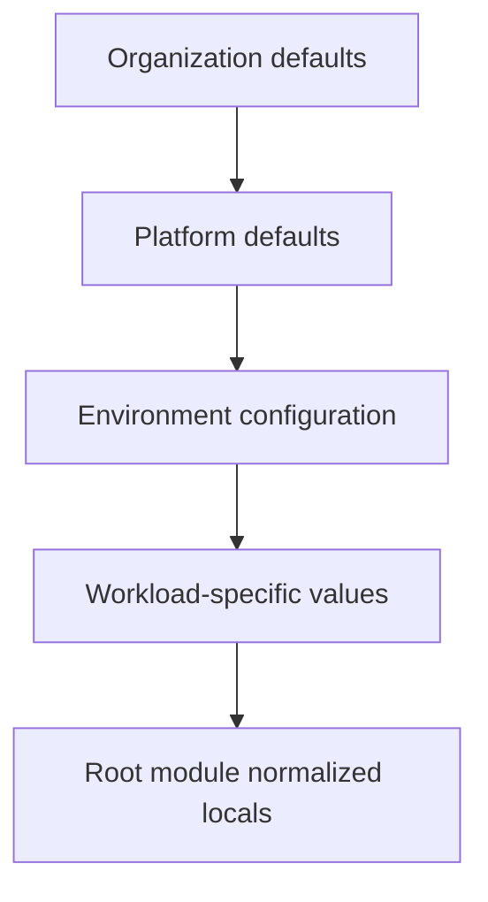
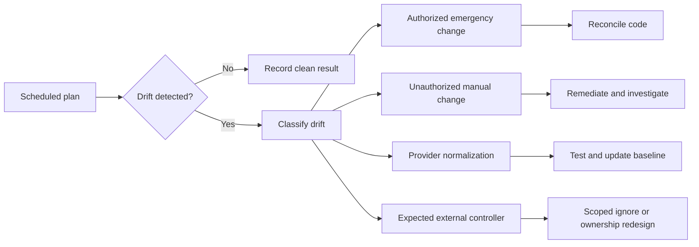

# Environment Configuration and State Management

## Purpose

Terraform state is an operational database containing resource identity, dependency metadata, and potentially sensitive attributes. This standard defines how environments are configured and how state is isolated, stored, locked, backed up, accessed, migrated, and recovered across Azure, AWS, GCP, and OCI.

## Environment model

An environment is a governed deployment boundary with a defined:

- Cloud control-plane scope.
- Identity and authorization model.
- Region or regions.
- State backend and key.
- Configuration set.
- Approval path.
- Change window and recovery objective.
- Ownership and support model.

An environment is not merely a `.tfvars` file.

## State architecture



## State boundary design

State SHOULD be split when components have different:

- Owners.
- Privilege requirements.
- Change frequency.
- Failure or rollback domain.
- Compliance classification.
- Region or residency requirement.
- Availability lifecycle.

State MUST NOT be split so aggressively that every resource becomes a separate root and normal dependencies require a web of remote-state reads.

Typical boundaries:

```text
organization-foundation
identity-baseline
regional-connectivity
shared-security-services
container-platform
application-platform
application-instance
```

## Remote backend requirements

Production and shared nonproduction state MUST use a remote backend that supports locking. Backend infrastructure MUST be provisioned through an approved bootstrap process separate from the state it stores.

All backends MUST implement:

- Encryption at rest and in transit.
- Native or Terraform-supported locking.
- Versioning or equivalent point-in-time recovery.
- Restricted data-plane access.
- Audit logging.
- Deletion protection or retention controls.
- Monitoring for failed access, deletion, policy changes, and lock anomalies.
- A documented recovery procedure.

### Azure Blob Storage

```hcl
terraform {
  backend "azurerm" {
    resource_group_name  = "rg-tfstate-prod"
    storage_account_name = "sttfstateprod001"
    container_name       = "tfstate"
    key                  = "connectivity/prod.tfstate"
    use_azuread_auth     = true
  }
}
```

Azure Blob Storage provides native locking and consistency support for the `azurerm` backend. Use Microsoft Entra authentication rather than storage account keys where supported. Restrict network access, enable blob versioning and protection controls, and separate backend administration from state read/write access.

### Amazon S3

```hcl
terraform {
  backend "s3" {
    bucket       = "example-tfstate-prod"
    key          = "connectivity/prod.tfstate"
    region       = "ca-central-1"
    encrypt      = true
    use_lockfile = true
  }
}
```

Use S3 versioning, strong bucket policy, encryption, access logging, and `use_lockfile = true`. DynamoDB-based locking is deprecated in current Terraform guidance and SHOULD be treated as a migration pattern, not the target design. Native S3 lockfile support requires Terraform 1.10.0 or later; any root that enables `use_lockfile = true` MUST enforce a compatible `required_version`.

### GCP Storage

```hcl
terraform {
  backend "gcs" {
    bucket = "example-tfstate-prod"
    prefix = "connectivity/prod"
  }
}
```

The GCS backend supports locking. Enable Object Versioning, uniform bucket-level access, public access prevention, logging, and narrowly scoped workload identity.

### OCI Object Storage

```hcl
terraform {
  backend "oci" {
    bucket    = "tfstate-prod"
    namespace = "example-namespace"
    key       = "connectivity/prod.tfstate"
    region    = "ca-montreal-1"
  }
}
```

The OCI backend supports state locking through lock objects in Object Storage. Grant only the object operations required for the specific bucket and prefix. Enable versioning and audit controls, and use resource or instance principals where practical.

## Backend configuration

Backend blocks cannot use normal Terraform input variables. Environment-specific backend values SHOULD be supplied through:

- A checked-in non-secret partial backend configuration.
- Protected pipeline environment variables where supported.
- A generated ephemeral backend file that contains no long-lived secret.
- An execution platform workspace configuration.

```hcl
terraform {
  backend "azurerm" {}
}
```

```bash
terraform init \
  -backend-config=backend/prod.hcl \
  -reconfigure
```

Credentials MUST be provided through the backend's supported identity chain, not embedded in `-backend-config`, because backend configuration can be recorded under `.terraform` and in plan artifacts.

## Environment configuration patterns

### Non-secret configuration

Non-secret values MAY be stored in version control:

```hcl
# env/prod.tfvars
region      = "ca-central-1"
environment = "prod"
service_tier = "critical"
```

### Secret configuration

Secrets MUST be injected at runtime from an approved secret manager or identity-based data source. Avoid passing secrets through `.tfvars` or command-line flags that can be logged.

Preferred options:

- Let the target service generate or rotate credentials.
- Generate a value and write it directly to a secret store.
- Reference an existing secret by ID.
- Use workload identity so no credential is needed.

### Configuration layering



Layering MUST have deterministic precedence. Hidden merging across many files or tools SHOULD be avoided.

## State security

Terraform state and plan files MAY contain sensitive values even when outputs are marked sensitive.

Controls:

- State readers MUST be limited to platform operators and automation that require it.
- Plan artifacts MUST have restricted retention and access.
- Backend administrators SHOULD not automatically have cloud apply permissions.
- State storage MUST not be exposed through public endpoints unless explicitly approved and protected.
- Customer-managed encryption keys SHOULD be used when required by data classification or regulation.
- Access logs MUST be retained according to the enterprise audit standard.
- State MUST NOT be copied to tickets, chat, email, or local shared drives.

## Locking and concurrency

- Apply operations MUST acquire a state lock.
- The pipeline MUST serialize applies per root module.
- `-lock=false` is prohibited for apply and state mutation.
- Lock timeout MAY be configured to tolerate queued deployments.
- Force-unlock requires verification that no process is still writing state, capture of the lock ID and owner, and an incident or change record.
- Parallel plans MAY run only when the execution platform can guarantee that they do not mutate state and reviewers understand that results may become stale.

## Workspaces

CLI workspaces share one backend configuration and are useful for repeated homogeneous instances. They SHOULD NOT be used to separate environments with different:

- Credentials.
- Access restrictions.
- Compliance classification.
- Backend retention.
- Approval paths.
- Topology.

Production environment isolation SHOULD normally use separate root modules, backend keys, or execution-platform workspaces with distinct policy and identity.

## State operations

State commands are privileged operations.

Approved operations include:

- `terraform state list` and `show` for diagnosis.
- `terraform state mv` for controlled address refactoring when `moved` blocks cannot be used.
- `terraform state rm` only when deliberately relinquishing management.
- `terraform import` or import blocks to adopt existing resources.
- `terraform force-unlock` under the lock recovery procedure.

Requirements:

1. Back up or confirm a versioned recovery point.
2. Capture the pre-change state serial and lineage.
3. Use the same Terraform and provider compatibility baseline.
4. Test in nonproduction where possible.
5. Record commands and outcomes.
6. Run a full plan after the operation.

Manual editing of the state JSON is prohibited.

## Migration patterns

### Local to remote

- Freeze changes.
- Create and secure the backend.
- Configure the backend block.
- Run `terraform init -migrate-state`.
- Verify lineage, resource count, and plan output.
- Securely delete residual local state copies.

### Splitting state

- Define target ownership and dependency exchange.
- Add destination configuration.
- Move resources through `moved` blocks across compatible configurations where supported or controlled state operations.
- Validate that no resource is managed by two states.
- Publish required outputs through an approved interface.
- Run plans against both source and destination.

### Renaming and refactoring

Use `moved` blocks for address changes that preserve the real object.

```hcl
moved {
  from = azurerm_storage_account.logs
  to   = module.logging.azurerm_storage_account.this
}
```

Retain migration blocks for a documented compatibility period.

## Backup and recovery

The recovery plan MUST address:

- Accidental state deletion.
- State corruption.
- Unauthorized state modification.
- Backend region outage.
- Lost lock.
- Provider or Terraform regression.
- Partial apply.

Recovery priority:

1. Stop all applies.
2. Preserve logs and the current state object.
3. Restore the last known valid version or use the execution platform's state rollback capability.
4. Reinitialize using controlled versions.
5. Run refresh-only and normal plans as appropriate.
6. Reconcile cloud reality and configuration.
7. Resume applies only after peer review.

State restoration MUST NOT be confused with infrastructure rollback. A restored old state may cause Terraform to propose destructive or duplicate actions if cloud resources changed afterward.

## Drift management



Drift findings MUST have an owner and disposition. Broad lifecycle ignores are not an acceptable drift strategy.

## State inventory and classification

Every remote state object SHOULD be registered in an inventory that records its owner, backend location, key or prefix, environment, cloud scope, data classification, recovery tier, lock mechanism, retention policy, and last successful drift check.

State classification SHOULD reflect the most sensitive value the state can contain, not merely the declared sensitivity of outputs. A state containing database connection material, identity attributes, private endpoints, or encryption configuration may require stricter controls than the source repository.

The inventory MUST detect:

- Orphaned state with no active root repository.
- Multiple roots claiming the same state key.
- Production state stored in a nonproduction backend.
- Backends without versioning, locking, or recent access logs.
- State objects not touched within the expected operational period.
- Ownership or identity records that no longer resolve.

## Stale plans and state serial control

A saved plan is valid only for the state and configuration context against which it was created. Apply workflows MUST invalidate or regenerate a plan when:

- The source commit changes.
- The state serial or lineage changes.
- Provider selections or dependency locks change.
- The backend configuration or execution identity changes.
- An emergency or out-of-band modification occurs.
- The approval window expires under change policy.

The execution platform SHOULD bind the plan artifact to the commit, root identifier, state lineage, state serial, provider lock checksum, and environment. A stale plan MUST fail rather than be automatically regenerated inside an already approved apply job, because regeneration changes the artifact reviewers approved.

## Recovery exercises and backend outage handling

State recovery procedures MUST be exercised, not merely documented. Critical backends SHOULD undergo periodic restoration tests using nonproduction copies or controlled recovery scopes.

A recovery exercise SHOULD prove that operators can:

1. Identify the correct state object and valid historical version.
2. Stop all writers and scheduled automation.
3. Restore or copy the selected version without overwriting evidence.
4. Reinitialize with approved Terraform and provider versions.
5. Compare restored state with cloud reality using safe plans.
6. Reconcile partial applies and externally changed resources.
7. Resume automation only after peer review.

During a backend outage, teams MUST NOT switch production roots to ad hoc local state. The correct response is to pause writes, protect the cloud environment from uncontrolled changes, and recover the governed backend or activate an approved continuity design.

## Anti-patterns

- Local state for shared or production infrastructure.
- One state for all clouds and environments.
- Backend credentials in source code.
- State bucket/container access granted to all developers.
- Disabled locking to fix pipeline contention.
- State files attached to support tickets.
- Direct state JSON editing.
- Using workspaces to conceal environments with different security models.
- Unversioned backend storage.
- Permanent stale locks with no operational procedure.
- Restoring state without first stopping apply automation.

## Validation

- Every root module has a documented state owner and backend key.
- Remote locking and versioning are enabled.
- Backend authentication uses short-lived identity where supported.
- State access is narrower than code access.
- Environment configuration is deterministic and secrets are externalized.
- Recovery, force-unlock, migration, and drift procedures are documented.
- Scheduled drift detection is operational.

## Related topics

- [Module Versioning and Release Management](iac-module-versioning-and-release-management.md)
- [Engineering Reusable Terraform Modules](iac-engineering-reusable-terraform-modules.md)
- [Inputs, Outputs, Dependencies, and Composition](iac-inputs-outputs-dependencies-and-composition.md)

## References

- Terraform backends: https://developer.hashicorp.com/terraform/language/backend
- AzureRM backend: https://developer.hashicorp.com/terraform/language/backend/azurerm
- S3 backend: https://developer.hashicorp.com/terraform/language/backend/s3
- GCS backend: https://developer.hashicorp.com/terraform/language/backend/gcs
- OCI backend: https://developer.hashicorp.com/terraform/language/backend/oci
- Terraform state locking: https://developer.hashicorp.com/terraform/language/state/locking
- Terraform remote state data: https://developer.hashicorp.com/terraform/language/state/remote-state-data
- Terraform sensitive data: https://developer.hashicorp.com/terraform/language/manage-sensitive-data
