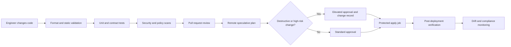

# 基础设施即代码工程标准

## 目的

该标准定义了通过代码配置和更改云基础设施的最低工程控制。它应用于 Terraform 根模块、可复用模块、部署流水线、状态后端、策略控制以及跨 Azure、AWS、GCP 和 Oracle Cloud Infrastructure (OCI) 使用的支持自动化。

目标不仅仅是在 Git 中存储基础设施定义。目标是通过自动化使基础设施变更可审查、可重复、可测试、可归因、可恢复和可执行。

## 规范语言

术语 **MUST**、**MUST NOT**、**SHOULD**、**SHOULD NOT** 和 **MAY** 是规范性的。

- **MUST / MUST NOT**：强制控制。例外情况需要获取云卓越中心 (CCoE) 和相关安全或风险负责人的书面批准。
- **SHOULD / SHOULD NOT**：预期做法。偏差需要有记录在案的技术原则。
- **MAY**：根据工作负载要求选择的可选练习。

## 范围

该标准涵盖：

- Terraform 配置和模块。
- 云基础、平台、应用、数据、身份、网络和安全基础设施。
- 用于初始化、验证、计划、批准、应用和销毁 Terraform 管理的资源的 CI/CD 系统。
- 远程状态、状态锁定、备份、恢复、漂移检测和状态访问。
- 公共、私有和内部开发的提供程序和模块。
- 用于建立状态后端、工作负载身份、注册表和流水线先决条件的引导基础设施。

它并不授权 Terraform 管理每个可能的云对象。团队 MUST 在加入资源之前确认资源适合声明式生命周期管理。

## 工程原则

1. **声明性所有权**：托管资源具有一个权威配置和一个状态所有者。
2. **不可变的审查跟踪**：生产更改源自版本控制的提交和批准的流水线。
3. **最小权限**：人员和工作负载身份仅接收应用计划或适用范围所需的权限。
4. **关注点分离**：模块暴露稳定的功能；根模块组合了针对特定环境的这些功能。
5. **爆炸半径小**：故意限制状态边界和部署单位。
6. **确定性执行**：Terraform、提供程序、模块和策略工具受版本限制且可复制。
7. **失败关闭**：缺少验证、策略失败、未经审查的破坏性更改或未知的执行身份阻止部署。
8. **云间能力对等，而非强求一致**：通用控制已标准化，而提供程序特定的功能仍然明确。

## 标准交付工作流程

## 强制控制

### 源代码控制和变更管理

- 所有生产的 IaC MUST 存储在经过批准的版本控制平台中。
- 阻止对受保护分支 MUST 直接更改。
- 拉取请求 MUST 确定受影响的环境、状态边界、预期影响、回滚或恢复方法以及验证证据。
- 至少一位独立于作者的审阅者 MUST 批准生产变更。高风险基础、身份、网络或安全更改 SHOULD 要求域所有者批准。
- 在正常工作流程之外进行的紧急更改 MUST 在稳定后立即导入或协调到代码中，并通过标准流程进行审查。
- 生成的计划 MUST 与不可变的提交相关联。应用作业 MUST NOT 应用由不同源内容生成的计划。

### 工具链控制

- Terraform CLI MUST 通过 `required_version` 声明支持的版本约束。
- 提供程序 MUST 在 `required_providers` 中声明，具有显式源地址和有界版本约束。
- 根模块 MUST 提交 `.terraform.lock.hcl`。
- 提供程序升级 MUST 通过专用拉取请求或明确标识的依赖项更新进行。
- 团队 MUST NOT 手动编辑 `.terraform.lock.hcl`。
- 构建镜像和流水线 Action SHOULD 由不可变摘要、提交 SHA 或批准的发布版本固定。
```hcl
terraform {
  required_version = ">= 1.7.0, < 2.0.0"

  required_providers {
    azurerm = {
      source  = "hashicorp/azurerm"
      version = "~> 4.0"
    }
  }
}
```
该示例是说明性的。模块目录中企业支持的版本矩阵仍然具有权威性。

### 代码质量

每个拉取请求 MUST 至少通过：
```text
terraform fmt -check -recursive
terraform init -backend=false
terraform validate
terraform test
```
流水线还 MUST 运行经过批准的 linter、安全扫描器、文档检查和适合仓库的策略评估。团队 SHOULD 在可用的情况下使用特定于提供程序的 lint 规则。

所有可复用的模块 MUST 包括：

- 清晰的自述文件，包含目的、约束、用法、输入、输出、提供程序要求、示例和升级说明。
- 带描述的键入变量。
- 验证业务关键约束。
- 输出的描述。
- 至少一个可部署的示例。
- 自动化测试。
- 所有权元数据。
- 语义版本和更改历史记录。

### 安全和机密

- 静态云凭证、客户端机密、私钥、令牌、密码和证书 MUST NOT 提交到源代码控制、Terraform 变量文件、后端配置、保存的计划或构建日志。
- CI/CD SHOULD 通过工作负载身份联合或短期身份进行身份验证：Azure 工作负载联邦身份或托管身份、AWS IAM 角色联合、GCP 工作负载联邦身份以及 OCI resource principals、实例主体或批准的联合模式。
- 敏感变量和输出 MUST 标记为 `sensitive = true`，但团队 MUST 明白这只会抑制显示；它不会从状态中删除值。
- 状态和保存的计划文件 MUST 被视为敏感数据，并通过加密、限制访问、审计日志记录和保留控制进行保护。
- 提供程序和模块源 MUST 来自批准的注册中心或镜像。未经验证的二进制提供程序 MUST NOT 在企业流水线中运行。
- 安全扫描 MUST 检测公开暴露、过于广泛的 IAM、未加密的存储、禁用的日志、薄弱的网络控制以及禁止的区域或服务。

### 状态所有权

- 生产状态 MUST 使用带锁定支持的远程后端。
- 状态 MUST 由环境和有意界定的基础设施域分隔。
- 根模块 MUST 有一个状态所有者和一个序列化应用路径。
- `-lock=false` MUST NOT 用于自动化应用工作流程。
- `terraform force-unlock` MUST 有事件级验证，表明原始进程不再持有锁。
- 状态访问 MUST 比一般贡献者访问更窄，因为状态可以公开敏感资源属性。
- 后端存储 MUST 在支持的情况下启用版本控制或等效恢复、加密、访问日志记录和删除保护。

### 规划并应用控制

- 拉取请求 MUST 生成人类可读的计划摘要。
- 流水线 MUST 明确标记替换、删除、IAM 升级、网络暴露、加密更改、策略豁免和状态迁移。
- 生产应用 MUST 在受保护的环境中运行，身份和批准受到限制。
- 人类工作站 MUST NOT 成为正常的生产应用机制。
- 使用保存的计划 SHOULD，执行平台可以安全地保存和应用精确审查的制品。
- `-auto-approve` MAY 仅可在已完成所需审批关卡的批准流水线内使用。
- 销毁操作 MUST 使用单独的受保护工作流程和明确批准。

### 漂移和带外变化
- 生产根模块 MUST 按计划或通过等效的漂移检测服务执行漂移检测。
- 漂移 MUST 被分类为授权的紧急变更、提供程序标准化、非管理突变或预期的短暂行为。
- 持久性 `ignore_changes` 条目 MUST 有所有者、理由和审核日期。
- 团队 MUST NOT 通过广泛忽略资源属性来规范系统漂移。
- 云策略和组织控制 MAY 拒绝不合规的更改，但代码和策略所有权 MUST 保持协调，以防止无休止的计划冲突。

## 仓库基线
```text
repository/
├── README.md
├── CODEOWNERS
├── .editorconfig
├── .gitignore
├── .terraform-version
├── .terraform.lock.hcl
├── versions.tf
├── providers.tf
├── backend.tf
├── main.tf
├── variables.tf
├── locals.tf
├── outputs.tf
├── checks.tf
├── tests/
├── examples/
├── policies/
└── scripts/
```
并非每个模块中的每个文件都是必需的。创建空占位符文件 SHOULD NOT。文件名 SHOULD 遵循标准，除非明确的特定于域的分割可以改进导航。

## 特定于云的基线控制

|控制区|Azure|AWS | GCP |OCI |
|---|---|---|---|---|
|执行身份 |托管身份或联合服务主体 |联合 IAM 角色 |工作负载身份联合或服务账户模拟 |资源主体、实例主体或联合主体 |
|状态后端 | Azure Blob Storage |带有锁文件的 Amazon S3 | Cloud Storage | OCI Object Storage 后端 |
|主要提供程序| `hashicorp/azurerm`； `azure/azapi` 何时合理 | `hashicorp/aws` | `hashicorp/google`； `google-beta`仅在合理时| `oracle/oci` |
|范围边界|管理组、订阅、资源组|组织、账户、地区 |组织、文件夹、项目、区域 |租户、隔间、区域 |
|原生策略集成 | Azure Policy | SCPs、IAM controls、Config |Organization Policy、IAM、Asset Inventory | IAM policies、Security Zones、Cloud Guard |

## 证据、来源证明和供应链完整性

生产 IaC 版本 SHOULD 生成一个证据记录，将已审查的提交链接到工具链并应用结果。日志 SHOULD 至少标识：

- 源提交和仓库。
- Terraform CLI 和提供程序版本。
- 模块源版本和锁定文件校验和。
- 策略、安全、测试和计划结果。
- 建立镜像或运行器身份。
- 应用身份、目标范围和时间戳。
- 部署后验证结果。

发布自动化 SHOULD 为内部发布的模块和流水线制品生成来源。可复用模块、提供程序、辅助二进制文件和 CI Action MUST 来自具有不可变引用或经过验证的校验和的批准来源。成功的安全扫描并不能取代源验证。

受保护的运行器 SHOULD 是短暂的或在作业之间明显清洁。缓存 MUST NOT 允许不受信任的拉取请求来替换稍后由受保护的生产作业使用的提供程序、模块、策略包或辅助二进制文件。

## 资源采用和所有权迁移

现有基础设施 MUST 被特意采用。将资源导入 Terraform 状态并不能证明配置已完成或 Terraform 应该管理每个属性。

采用计划 SHOULD 包括：

1. 确认权威所有者和维护窗口。
2. 采集当前资源配置和依赖关系。
3. 创建匹配的 Terraform 配置。
4. 使用导入块或受控导入操作。
5. 制定计划并对每个提议的变更进行分类。
6. 解决非托管属性、外部控制器和生命周期排除。
7. 建立状态、流水线、监控和回滚所有权。
8.删除或更新之前的变更机制。

两个状态或自动化系统 MUST NOT 同时管理相同的资源。根之间的所有权迁移需要受控的状态移动或导入序列以及源所有者已放弃控制的证据。

## 工程指标和持续改进
IaC 程序 SHOULD 度量控制有效性而不仅仅是部署量。有用的指标包括：

- 具有当前漂移结果的生产根的百分比。
- 计划和应用提前期和应用失败率。
- 使用短期身份执行应用操作的百分比。
- 计划外更换和破坏性变更频率。
- 状态恢复测试成功和平均恢复时间。
- 模块采用、不支持的版本暴露和升级延迟。
- 策略例外计数、期限和复发情况。
- 集成测试清理失败和泄漏资源成本。

指标 MUST NOT 产生绕过审查或人为分割变更的动机。高部署数量并不代表质量；低漂移、可重现的恢复、有界故障和当前支持的依赖性是更强的信号。

## 禁止的模式

除非批准有时限的例外，否则以下模式不合规：

- 本地生产状态。
- 不相关平台或应用的共享状态。
- 嵌入在提供程序块中的凭证。
- 无上限的提供程序版本，例如 `>= 3.0`，没有上层兼容性策略。
- 直接使用生产模块的无版本分支。
- 可复用子模块内的提供程序配置，但无法通过提供程序传递来表达的记录在案的提供程序特定要求除外。
- 广泛使用 `null_resource`、`local-exec` 或 `remote-exec` 作为提供程序、镜像构建、配置管理或部署系统的替代品。
- 手动修改状态 JSON。
- `terraform apply -target`的日常使用。
- 毯子 `ignore_changes = all`。
- 复制和粘贴目录模块的分支，无需所有权和分歧批准。
- 应用不是从已审查的提交生成的计划。

## 异常处理

例外请求 MUST 包括：

1. 放弃确切的控制权。
2. 业务和技术理由。
3. 受影响的环境和资源。
4.风险分析和补偿控制。
5. 指定所有者。
6. 有效期。
7. 修复计划。

不允许永久例外。过期的异常会阻止部署，直到更新或修复为止。

## 验证

在以下情况下，仓库符合此标准：

- 存在元数据和所有权。
- 配置远程状态和锁定。
- 版本约束和锁定文件受到控制。
- 所需的测试和策略检查通过。
- 源和日志中不存在机密。
- 生产应用使用受保护的工作负载身份。
- 计划审查和批准是可审计的。
- 存在漂移检测和恢复程序。
- 模块或根配置根据需要在基础设施模块目录中注册。

## 相关主题

- [可复用 Terraform 模块工程](iac-engineering-reusable-terraform-modules.md)
- [基础设施模块目录](iac-infrastructure-module-catalog.md)
- [Terraform 仓库和模块结构](iac-terraform-repository-and-module-structure.md)

## 参考文档

- HashiCorp Terraform 风格指南：https://developer.hashicorp.com/terraform/language/style
- HashiCorp 依赖锁定文件：https://developer.hashicorp.com/terraform/language/files/dependency-lock
- HashiCorp 状态后端和锁定：https://developer.hashicorp.com/terraform/language/state/backends
- AWS Terraform 提供程序最佳实践：https://docs.aws.amazon.com/prescriptive-guidance/latest/terraform-aws-provider-best-practices/introduction.html
- GCP Terraform 最佳实践：https://cloud.google.com/docs/terraform/best-practices-for-terraform
- Azure 上的 Microsoft Terraform：https://learn.microsoft.com/azure/developer/terraform/
- OCI Terraform 最佳实践：https://docs.oracle.com/en-us/iaas/Content/dev/terraform/best-practices.htm
