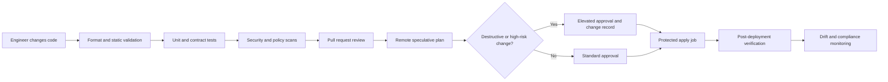

# Infrastructure as Code Engineering Standards

## Purpose

This standard defines the minimum engineering controls for provisioning and changing cloud infrastructure through code. It applies to Terraform root modules, reusable modules, deployment pipelines, state backends, policy controls, and supporting automation used across Azure, AWS, GCP, and Oracle Cloud Infrastructure (OCI).

The objective is not merely to store infrastructure definitions in Git. The objective is to make infrastructure changes reviewable, repeatable, testable, attributable, recoverable, and enforceable through automation.

## Normative language

The terms **MUST**, **MUST NOT**, **SHOULD**, **SHOULD NOT**, and **MAY** are normative.

- **MUST / MUST NOT**: mandatory control. Exceptions require documented approval from the Cloud Center of Excellence (CCoE) and the relevant security or risk owner.
- **SHOULD / SHOULD NOT**: expected practice. A deviation requires a documented technical rationale.
- **MAY**: optional practice selected according to workload requirements.

## Scope

This standard covers:

- Terraform configurations and modules.
- Cloud foundation, platform, application, data, identity, network, and security infrastructure.
- CI/CD systems that initialize, validate, plan, approve, apply, and destroy Terraform-managed resources.
- Remote state, state locking, backup, recovery, drift detection, and state access.
- Public, private, and internally developed providers and modules.
- Bootstrap infrastructure used to establish state backends, workload identity, registries, and pipeline prerequisites.

It does not authorize Terraform to manage every possible cloud object. Teams MUST confirm that a resource is appropriate for declarative lifecycle management before onboarding it.

## Engineering principles

1. **Declarative ownership**: a managed resource has one authoritative configuration and one state owner.
2. **Immutable review trail**: production changes originate from version-controlled commits and approved pipelines.
3. **Least privilege**: human and workload identities receive only the permissions required for the applicable plan or apply scope.
4. **Separation of concerns**: modules expose stable capabilities; root modules compose those capabilities for a specific environment.
5. **Small blast radius**: state boundaries and deployment units are intentionally limited.
6. **Deterministic execution**: Terraform, providers, modules, and policy tooling are version constrained and reproducible.
7. **Fail closed**: missing validation, policy failure, unreviewed destructive change, or an unknown execution identity blocks deployment.
8. **Cloud parity without forced sameness**: common controls are standardized, while provider-specific capabilities remain explicit.

## Standard delivery workflow



## Mandatory controls

### Source control and change management

- All production IaC MUST be stored in an approved version-control platform.
- Direct changes to protected branches MUST be blocked.
- Pull requests MUST identify the affected environment, state boundary, expected impact, rollback or recovery approach, and validation evidence.
- At least one reviewer independent of the author MUST approve production changes. High-risk foundation, identity, network, or security changes SHOULD require domain-owner approval.
- Emergency changes made outside the normal workflow MUST be imported or reconciled into code immediately after stabilization and reviewed through the standard process.
- Generated plans MUST be tied to an immutable commit. An apply job MUST NOT apply a plan generated from different source content.

### Toolchain control

- Terraform CLI MUST declare a supported version constraint through `required_version`.
- Providers MUST be declared in `required_providers` with explicit source addresses and bounded version constraints.
- Root modules MUST commit `.terraform.lock.hcl`.
- Provider upgrades MUST occur through a dedicated pull request or an explicitly identified dependency update.
- Teams MUST NOT edit `.terraform.lock.hcl` manually.
- Build images and pipeline actions SHOULD be pinned by immutable digest, commit SHA, or approved release version.

```hcl
terraform {
  required_version = ">= 1.7.0, < 2.0.0"

  required_providers {
    azurerm = {
      source  = "hashicorp/azurerm"
      version = "~> 4.0"
    }
  }
}
```

The example is illustrative. The enterprise-supported version matrix in the module catalog remains authoritative.

### Code quality

Every pull request MUST pass, at minimum:

```text
terraform fmt -check -recursive
terraform init -backend=false
terraform validate
terraform test
```

The pipeline MUST also run an approved linter, security scanner, documentation check, and policy evaluation appropriate to the repository. Teams SHOULD use provider-specific lint rules where available.

All reusable modules MUST include:

- A clear README with purpose, constraints, usage, inputs, outputs, provider requirements, examples, and upgrade notes.
- Typed variables with descriptions.
- Validation for business-critical constraints.
- Descriptions for outputs.
- At least one deployable example.
- Automated tests.
- Ownership metadata.
- A semantic version and change history.

### Security and secrets

- Static cloud credentials, client secrets, private keys, tokens, passwords, and certificates MUST NOT be committed to source control, Terraform variable files, backend configuration, saved plans, or build logs.
- CI/CD SHOULD authenticate by workload identity federation or short-lived identity: Azure workload identity federation or managed identity, AWS IAM role federation, GCP Workload Identity Federation, and OCI resource principals, instance principals, or approved federation patterns.
- Sensitive variables and outputs MUST be marked `sensitive = true`, but teams MUST understand that this only suppresses display; it does not remove values from state.
- State and saved plan files MUST be treated as sensitive data and protected with encryption, restricted access, audit logging, and retention controls.
- Provider and module sources MUST come from approved registries or mirrors. Unverified binary providers MUST NOT run in enterprise pipelines.
- Security scanning MUST detect public exposure, overly broad IAM, unencrypted storage, disabled logging, weak network controls, and prohibited regions or services.

### State ownership

- Production state MUST use a remote backend with locking support.
- State MUST be separated by environment and by a deliberately bounded infrastructure domain.
- A root module MUST have one state owner and one serialized apply path.
- `-lock=false` MUST NOT be used in automated apply workflows.
- `terraform force-unlock` MUST require incident-level validation that the original process no longer owns the lock.
- State access MUST be narrower than general contributor access because state can expose sensitive resource attributes.
- Backend storage MUST enable versioning or equivalent recovery, encryption, access logging, and deletion protection where supported.

### Plan and apply controls

- Pull requests MUST produce a human-readable plan summary.
- The pipeline MUST explicitly flag replacement, deletion, IAM escalation, network exposure, encryption changes, policy exemptions, and state migration.
- Production applies MUST run from a protected environment with restricted identities and approvals.
- Human workstations MUST NOT be the normal production apply mechanism.
- A saved plan SHOULD be used where the execution platform can securely preserve and apply the exact reviewed artifact.
- `-auto-approve` MAY be used only inside an approved pipeline that has already completed required approval gates.
- Destroy operations MUST use a separate protected workflow and explicit approval.

### Drift and out-of-band changes

- Production root modules MUST be planned on a schedule or through an equivalent drift-detection service.
- Drift MUST be classified as authorized emergency change, provider normalization, unmanaged mutation, or expected ephemeral behavior.
- Persistent `ignore_changes` entries MUST have an owner, rationale, and review date.
- Teams MUST NOT normalize systematic drift by broadly ignoring resource attributes.
- Cloud policies and organization controls MAY deny noncompliant changes, but code and policy ownership MUST remain coordinated to prevent endless plan conflicts.

## Repository baseline

```text
repository/
├── README.md
├── CODEOWNERS
├── .editorconfig
├── .gitignore
├── .terraform-version
├── .terraform.lock.hcl
├── versions.tf
├── providers.tf
├── backend.tf
├── main.tf
├── variables.tf
├── locals.tf
├── outputs.tf
├── checks.tf
├── tests/
├── examples/
├── policies/
└── scripts/
```

Not every file is mandatory in every module. Empty placeholder files SHOULD NOT be created. File names SHOULD follow the standard unless a clear domain-specific split improves navigation.

## Cloud-specific baseline controls

| Control area | Azure | AWS | GCP | OCI |
|---|---|---|---|---|
| Execution identity | Managed identity or federated service principal | Federated IAM role | Workload Identity Federation or service account impersonation | Resource principal, instance principal, or federated principal |
| State backend | Azure Blob Storage | Amazon S3 with lockfile | GCP Storage | OCI Object Storage backend |
| Primary provider | `hashicorp/azurerm`; `azure/azapi` when justified | `hashicorp/aws` | `hashicorp/google`; `google-beta` only when justified | `oracle/oci` |
| Scope boundary | Management group, subscription, resource group | Organization, account, region | Organization, folder, project, region | Tenancy, compartment, region |
| Native policy integration | Azure Policy | SCPs, IAM controls, Config | Organization Policy, IAM, Asset Inventory | IAM policies, Security Zones, Cloud Guard |

## Evidence, provenance, and supply-chain integrity

A production IaC release SHOULD produce an evidence record that links the reviewed commit to the toolchain and apply result. At minimum, the record SHOULD identify:

- Source commit and repository.
- Terraform CLI and provider versions.
- Module source versions and lock-file checksum.
- Policy, security, test, and plan results.
- Build image or runner identity.
- Apply identity, target scope, and timestamp.
- Post-deployment verification result.

Release automation SHOULD generate provenance for internally published modules and pipeline artifacts. Reusable modules, providers, helper binaries, and CI actions MUST come from approved sources with immutable references or verified checksums. A successful security scan does not replace source verification.

Protected runners SHOULD be ephemeral or demonstrably cleaned between jobs. Caches MUST NOT allow an untrusted pull request to replace providers, modules, policy bundles, or helper binaries later consumed by a protected production job.

## Resource adoption and ownership transfer

Existing infrastructure MUST be adopted deliberately. Importing a resource into Terraform state does not prove that the configuration is complete or that Terraform should own every attribute.

An adoption plan SHOULD include:

1. Confirm the authoritative owner and maintenance window.
2. Capture the current resource configuration and dependencies.
3. Create matching Terraform configuration.
4. Use import blocks or controlled import operations.
5. Generate a plan and classify every proposed change.
6. Resolve unmanaged attributes, external controllers, and lifecycle exclusions.
7. Establish state, pipeline, monitoring, and rollback ownership.
8. Remove or update the previous change mechanism.

Two states or automation systems MUST NOT manage the same resource concurrently. Ownership transfer between roots requires a controlled state move or import sequence and evidence that the source owner has relinquished control.

## Engineering metrics and continual improvement

IaC programs SHOULD measure control effectiveness rather than only deployment volume. Useful indicators include:

- Percentage of production roots with current drift results.
- Plan-to-apply lead time and failed-apply rate.
- Percentage of applies using short-lived identity.
- Unplanned replacements and destructive-change frequency.
- State recovery-test success and mean time to recover.
- Module adoption, unsupported-version exposure, and upgrade latency.
- Policy exception count, age, and recurrence.
- Integration-test cleanup failures and leaked-resource cost.

Metrics MUST not create incentives to bypass review or split changes artificially. A high deployment count is not evidence of quality; low drift, reproducible recovery, bounded failures, and current supported dependencies are stronger signals.

## Prohibited patterns

The following patterns are noncompliant unless a time-bounded exception is approved:

- Local production state.
- Shared state for unrelated platforms or applications.
- Credentials embedded in provider blocks.
- Unbounded provider versions such as `>= 3.0` without an upper compatibility strategy.
- Direct consumption of an unversioned branch for production modules.
- Provider configuration inside reusable child modules, except a documented provider-specific requirement that cannot be expressed through provider passing.
- Broad use of `null_resource`, `local-exec`, or `remote-exec` as a substitute for a provider, image build, configuration management, or deployment system.
- Manual modification of state JSON.
- Routine use of `terraform apply -target`.
- Blanket `ignore_changes = all`.
- Copy-and-paste forks of catalog modules without ownership and divergence approval.
- Applying a plan that was not generated from the reviewed commit.

## Exception process

An exception request MUST include:

1. The exact control being waived.
2. Business and technical rationale.
3. Affected environments and resources.
4. Risk analysis and compensating controls.
5. Named owner.
6. Expiration date.
7. Remediation plan.

Permanent exceptions are not permitted. An expired exception blocks deployment until renewed or remediated.

## Validation

A repository conforms to this standard when:

- Metadata and ownership are present.
- Remote state and locking are configured.
- Version constraints and lock files are controlled.
- Required tests and policy checks pass.
- Secrets are absent from source and logs.
- Production applies use protected workload identity.
- Plan review and approval are auditable.
- Drift detection and recovery procedures exist.
- The module or root configuration is registered in the Infrastructure Module Catalog where required.

## Related topics

- [Engineering Reusable Terraform Modules](iac-engineering-reusable-terraform-modules.md)
- [Infrastructure Module Catalog](iac-infrastructure-module-catalog.md)
- [Terraform Repository and Module Structure](iac-terraform-repository-and-module-structure.md)

## References

- HashiCorp Terraform style guide: https://developer.hashicorp.com/terraform/language/style
- HashiCorp dependency lock file: https://developer.hashicorp.com/terraform/language/files/dependency-lock
- HashiCorp state backends and locking: https://developer.hashicorp.com/terraform/language/state/backends
- AWS Terraform provider best practices: https://docs.aws.amazon.com/prescriptive-guidance/latest/terraform-aws-provider-best-practices/introduction.html
- GCP Terraform best practices: https://cloud.google.com/docs/terraform/best-practices-for-terraform
- Microsoft Terraform on Azure: https://learn.microsoft.com/azure/developer/terraform/
- OCI Terraform best practices: https://docs.oracle.com/en-us/iaas/Content/dev/terraform/best-practices.htm
