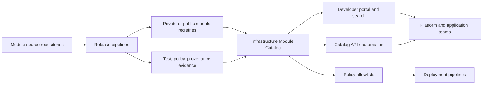
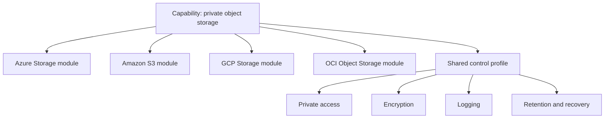
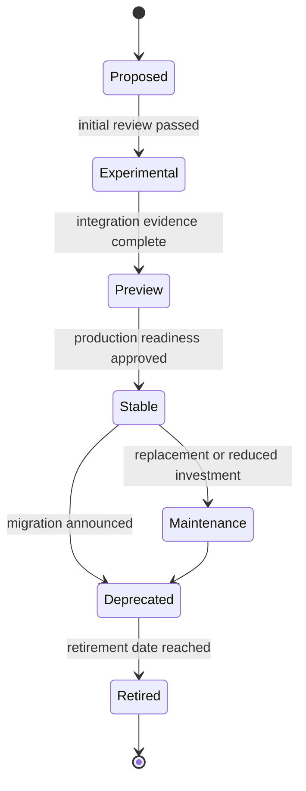

# 基础设施模块目录

## 目的

基础设施模块目录是已批准的 Terraform 模块、蓝图、等效功能、所有者、版本、支持状态和消费指南的企业事实来源。

注册表存储制品。目录添加了治理、产品上下文、生命周期状态、兼容性、证据和可发现性。

## 目标

目录 MUST 使用户能够回答：

- 我应该使用哪个模块来实现此功能？
- 支持哪些云和区域？
- 什么版本被批准生产？
- 谁负责并支持该模块？
- 内置了哪些安全控制？
- 该模块的成本或实质用途是什么？
- 哪些 Terraform 和提供程序版本兼容？
- 我当前的版本需要进行哪些迁移？
- Azure、AWS、GCP 或 OCI 中是否提供同等功能？

## 目录架构

## 目录范围

该目录包括：

- 可复用的 Terraform 模块。
- 实现同等多云功能的模块系列。
- 构图蓝图。
- 引导模块。
- 提供程序支持矩阵。
- 批准的相关策略包和流水线模板。
- 弃用、迁移和退役日志记录。

活动根模块 SHOULD 作为已部署产品单独盘点，但 MAY 链接到它们使用的模块。

## 目录日志记录模式

每个模块记录 MUST 包括以下字段。
```yaml
name: terraform-azurerm-private-storage
capability: private-object-storage
summary: Secure Azure storage with private access, logging, encryption, and recovery controls.
cloud: Azure
provider: hashicorp/azurerm
registry_source: app.terraform.io/example/private-storage/azurerm
repository: https://example.invalid/cloud/terraform-azurerm-private-storage
owner: Cloud Storage Platform
support_channel: cloud-storage-platform
support_tier: stable
latest_version: 3.2.1
approved_versions:
  - 3.2.1
terraform_versions:
  - ">= 1.7.0, < 2.0.0"
provider_versions:
  - ">= 4.0, < 5.0"
regions:
  - canada-central
  - east-us
security_profile:
  public_access_default: false
  encryption_default: platform-managed
  logging_default: true
compliance:
  - enterprise-baseline
  - protected-b
lifecycle:
  status: active
  review_date: 2027-02-01
```
实现 MAY 使用 JSON、YAML、数据库字段或门户元数据，但信息模型必须保持一致。

## 所需的元数据

### 身份

- 唯一的目录 ID。
- 模块名称。
- 能力名称。
- 云和提供程序。
- 注册表源。
- 仓库 URL。
- 许可和分发限制。

### 所有权

- 产品负责人。
- 技术所有者。
- 支持渠道。
- 升级路径。
- 维护层。
- 应用时关键缺陷的服务级别目标。

### 兼容性

- 支持的 Terraform 版本。
- 支持的提供程序版本。
- 必需的提供程序别名。
- 支持的区域和分区或领域。
- 对其他模块或平台服务的依赖。
- 已知的不兼容性。

### 安全与合规性

- 默认曝光模型。
- 加密行为。
- 身份行为。
- 日志记录和监控集成。
- 数据驻留注意事项。
- 策略认证。
- 已知的残余风险。
- 最后安全审查日期。

### 生命周期

- 最新版本。
- 批准的生产版本。
- 发布通道。
- 弃用日期。
- 退休日期。
- 更换模块。
- 迁移指南。
- 最后一次成功测试日期。

## 能力族

目录 SHOULD 组提供通用功能下的特定模块。

目录 MUST 记录云服务之间的不等效之处。 MUST NOT 通过隐藏持久性、访问控制、网络、密钥管理、复制或成本方面的实质性差异来声称可移植性。

## 发布工作流程

模块通过受控的工作流程进入目录。

1. 维护者提交模块日志记录和所有权。
2. 自动检查验证命名、来源、版本、文档、测试和来源证明。
3. 安全和架构审查评估功能和默认设置。
4. 附集成升级证据。
5. 为模块分配生命周期通道。
6. 批准的版本将被列入部署策略的白名单中。
7. 门户和 API 更新。

## 质量记分卡

目录 SHOULD 显示一份记分卡，但 MUST NOT 将细微风险压缩成无法解释的数字。

建议尺寸：

|尺寸|证据|
|---|---|
|文档 |自述文件、示例、架构、限制、迁移 |
|测试覆盖率|单位、策略、集成、升级、清理|
|安全|扫描状态、默认控制、审核日期 |
|可靠性 |发布成功率、缺陷率、提供程序兼容性 |
|操作性|日志、监控、诊断、恢复|
|领养|活跃消费者和版本 |
|保养|所有者响应能力、发布新近度、依赖性健康状况 |

无论总评分如何，严重的安全故障或缺少所有者 MUST 阻止其进入稳定状态。

## 搜索和发现

用户 SHOULD 通过以下方式搜索：

- 能力。
- 云。
- 提供程序。
- 服务名称。
- 合规概况。
- 地区。
- 数据分类。
- 支持层。
- 所有者。
- 生命周期状态。
- 输入或输出能力。

目录描述 MUST 使用用户语言和云原生术语。同义词 SHOULD 映射存储账户、存储桶、对象存储、Vault、密钥管理、VPC、VNet 和虚拟云网络等术语。

## 批准版本策略

该目录区分：

- 最新的上游版本。
- 最新测试版本。
- 最新批准的生产版本。
- 最低支持版本。
- 由于缺陷或漏洞而被阻止的版本。

流水线 SHOULD 查询或使用生成的白名单。当生产部署 MUST 引用被阻止的版本时，它会失败，除非存在有时间限制的异常。

## 消费体验

每个稳定的目录条目 MUST 提供：

- 可复制的源代码和版本片段。
- 基本示例。
- 完整的例子。
- 所需的身份权限。
- 输入和输出。
- 架构图。
- 预期资源。
- 成本显著的设置。
- 安全默认值。
- 已知的限制。
- 升级指导。
```hcl
module "private_storage" {
  source  = "app.terraform.io/example/private-storage/aws"
  version = "3.2.1"

  name        = "payments-prod-archive"
  environment = "prod"
  data_class  = "confidential"
}
```
## 所有权和支持

没有活跃所有者的模块 MUST NOT 保持稳定。

负责人负责：

- 依赖性和提供程序监控。
- 安全建议。
- 发布和弃用管理。
- 测试环境健康状况。
- 文档准确性。
- 消费者支持和缺陷分类。
- 兼容性证据。
- 审查日期续订。

目录 MUST 自动标记逾期审查、过时版本、失败的计划测试和所有者变更。

## 消费者反馈

目录 SHOULD 收集以下反馈：

- 缺陷报告。
- 功能请求。
- 文档空白。
- 采用障碍。
- 云区域请求。
- 升级成果。

反馈 MUST 路由至模块积压。光有知名度并不能保证质量；采用指标必须用支持和风险数据来解释。

## 策略集成

该目录可以驱动自动化控制：

- 允许的模块源。
- 批准的版本。
- 阻止发布。
- 受监管工作负载所需的功能模块。
- 提供程序版本基线。
- 弃用警告。
- 所有权检查。

策略 MUST 允许在不消除可审核性的情况下进行紧急响应。例外情况需要所有者、原因、范围和到期时间。

## 多云标准化

目录 SHOULD 标准化共享字段，同时保留云原生差异。

|共享领域| Azure 示例 | AWS 示例 | GCP 示例 | OCI 示例 |
|---|---|---|---|---|
|范围 |订阅 |账户 |项目|隔间|
|地区 | `canadacentral` | `ca-central-1` | `northamerica-northeast1` | `ca-montreal-1` |
|网络|互联网络|专有网络|专有网络|维网|
|对象存储 |存储账户/容器 | S3 桶| GCS 存储桶|对象存储桶 |
|重点服务|Key Vault |KMS |Cloud KMS | Vault/KMS |

搜索可以统一这些概念，但模块文档必须使用真正的提供程序词汇。

## 弃用和退役

当模块被弃用时，目录 MUST 显示：

- 弃用原因。
- 替代品。
- 最后支持的版本。
- 迁移指南。
- 新采用区块日期。
- 退休日期。
- 已知的消费者，清单支持它。

退役模块 MUST 仍然在审核历史记录中可见，但 MUST 被排除在正常搜索结果之外，并阻止新的生产环境使用。

## 目录 API 和自动化

目录 SHOULD 公开以下机器可读数据：

- 脚手架工具。
- CI 验证。
- 依赖更新自动化。
- 漏洞响应。
- 开发者门户。
- 架构审查证据。
- 成本和策略工具。
- 消费者清单。

API 日志 MUST 进行版本控制和模式验证。自动化 MUST 安全地处理目录不可用；受保护的部署 SHOULD 无法关闭审批检查。

## 依赖图和消费者清单

目录 SHOULD 维护一个连接模块、提供程序、蓝图、活动根和消费产品的版本化依赖关系图。该图支持漏洞响应、提供程序升级、退休计划和所有权分析。

对于每个生产消费者，清单 SHOULD 记录：

- 根仓库和状态标识符。
- 模块来源和确切版本。
- 提供程序选择。
- 环境和云范围。
- 负责团队和支持联系人。
- 上次成功的计划或应用。
- 当前生命周期和合规状态。

依赖关系图 MUST 将声明的依赖项与已监控的部署区分开来。仓库中的模块引用并不能证明它已部署，并且部署状态可能比创建它的源寿命更长。目录自动化 SHOULD 协调注册表下载、仓库引用、流水线证据和状态清单，而无需将任何一个信号视为完整。

## 黄金路径和脚手架

目录 SHOULD 提供明确的黄金路径，可以生成合规的起点，而不是强迫消费者手动组装每个控件。

脚手架 MAY 创建：

- 根模块文件和标准目录结构。
- 批准的模块源和固定版本。
- 没有凭据的后端和提供程序占位符。
- 流水线模板、所有权元数据和策略绑定。
- 环境配置示例。
- 测试和部署后验证存根。
- 目录注册元数据。

生成的代码 MUST 保持可理解和可编辑。脚手架 MUST NOT 将状态边界、提供程序范围或不透明生成器背后的安全决策隐藏起来。在消费者添加特定于工作负载的配置之前，生成的结果应通过基线验证。

## 目录服务级别和治理节奏

目录操作需要可度量的维护承诺。稳定条目 SHOULD 定义关键缺陷、安全建议、提供程序不兼容性和消费者支持的目标响应时间。

治理审查 SHOULD 检查：

- 所有者有效性和支持响应能力。
- 与支持的 Terraform 和提供程序版本的兼容性。
- 计划测试失败或安全审查过时。
- 采用被阻止或弃用的版本。
- 开放迁移阻碍和逾期退休日期。
- 片段支持的重复模块。

屡次错过维护义务的模块 SHOULD 从稳定状态转为维护状态或已弃用，即使代码仍然有效。生命周期状态必须反映当前的实际支持状态，而不是历史批准。

## 反模式

- 以目录形式呈现的注册表，没有所有权或支持元数据。
- 相同功能的多个模块，没有推荐。
- 陈旧的“最新”标签。
- 稳定的模块，无需集成测试。
- 隐藏公共访问默认值或成本重大行为的目录条目。
- 一种通用的多云条目，消除了提供程序的差异。
- 删除了删除审核历史记录在案的已弃用条目。
- 批准仅基于下载次数。
- 在不相关的流水线中手动维护模块允许列表。

## 验证

该目录在以下情况下可运行：

- 每个稳定模块都有完整的身份、所有权、兼容性、安全性和生命周期元数据。
- 特定于提供程序的模块被分为功能系列。
- 批准和阻止的版本是机器可读的。
- 搜索支持云原生和能力术语。
- 发表需要测试和审查证据。
- 强制弃用和退役。
- 流水线执行目录策略。
- 监控审核日期和所有者状态。
## 相关主题

- [可复用 Terraform 模块工程](iac-engineering-reusable-terraform-modules.md)
- [模块版本控制和发布管理](iac-module-versioning-and-release-management.md)
- [基础设施即代码工程标准](iac-infrastructure-as-code-engineering-standards.md)

## 参考文档

- Terraform 公共注册表模块发布：https://developer.hashicorp.com/terraform/registry/modules/publish
- HCP Terraform 私有注册表：https://developer.hashicorp.com/terraform/cloud-docs/registry
- Terraform 模块概述：https://developer.hashicorp.com/terraform/language/modules
- GCP Terraform 蓝图和模块：https://cloud.google.com/docs/terraform/blueprints/terraform-blueprints
