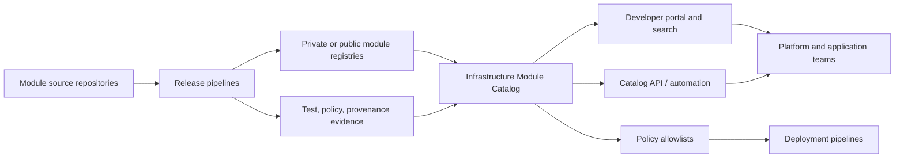
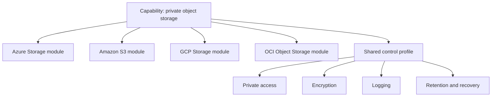
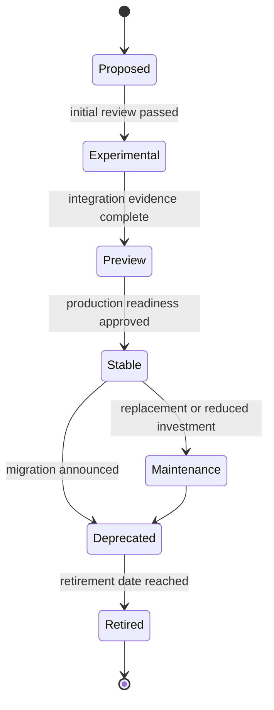

# Infrastructure Module Catalog

## Purpose

The Infrastructure Module Catalog is the enterprise system of record for approved Terraform modules, blueprints, capability equivalents, owners, versions, support status, and consumption guidance.

A registry stores artifacts. A catalog adds governance, product context, lifecycle status, compatibility, evidence, and discoverability.

## Objectives

The catalog MUST enable users to answer:

- Which module should I use for this capability?
- Which clouds and regions are supported?
- What version is approved for production?
- Who owns and supports the module?
- What security controls are built in?
- What does the module cost or materially enable?
- Which Terraform and provider versions are compatible?
- What migration is required from my current version?
- Is an equivalent capability available in Azure, AWS, GCP, or OCI?

## Catalog architecture



## Catalog scope

The catalog includes:

- Reusable Terraform modules.
- Module families implementing equivalent multi-cloud capabilities.
- Composition blueprints.
- Bootstrap modules.
- Provider support matrix.
- Approved policy packs and pipeline templates where relevant.
- Deprecation, migration, and retirement records.

Live root modules SHOULD be inventoried separately as deployed products but MAY link to the modules they consume.

## Catalog record schema

Every module record MUST include the following fields.

```yaml
name: terraform-azurerm-private-storage
capability: private-object-storage
summary: Secure Azure storage with private access, logging, encryption, and recovery controls.
cloud: Azure
provider: hashicorp/azurerm
registry_source: app.terraform.io/example/private-storage/azurerm
repository: https://example.invalid/cloud/terraform-azurerm-private-storage
owner: Cloud Storage Platform
support_channel: cloud-storage-platform
support_tier: stable
latest_version: 3.2.1
approved_versions:
  - 3.2.1
terraform_versions:
  - ">= 1.7.0, < 2.0.0"
provider_versions:
  - ">= 4.0, < 5.0"
regions:
  - canada-central
  - east-us
security_profile:
  public_access_default: false
  encryption_default: platform-managed
  logging_default: true
compliance:
  - enterprise-baseline
  - protected-b
lifecycle:
  status: active
  review_date: 2027-02-01
```

The implementation MAY use JSON, YAML, database fields, or portal metadata, but the information model must remain consistent.

## Required metadata

### Identity

- Unique catalog ID.
- Module name.
- Capability name.
- Cloud and provider.
- Registry source.
- Repository URL.
- License and distribution restrictions.

### Ownership

- Product owner.
- Technical owner.
- Support channel.
- Escalation path.
- Maintenance tier.
- Service-level objective for critical defects where applicable.

### Compatibility

- Supported Terraform versions.
- Supported provider versions.
- Required provider aliases.
- Supported regions and partitions or realms.
- Dependencies on other modules or platform services.
- Known incompatibilities.

### Security and compliance

- Default exposure model.
- Encryption behavior.
- Identity behavior.
- Logging and monitoring integration.
- Data residency considerations.
- Policy certifications.
- Known residual risks.
- Last security review date.

### Lifecycle

- Latest release.
- Approved production releases.
- Release channel.
- Deprecation date.
- Retirement date.
- Replacement module.
- Migration guide.
- Last successful test date.

## Capability families

The catalog SHOULD group provider-specific modules under a common capability.



The catalog MUST document where cloud services are not equivalent. It MUST NOT claim portability by hiding material differences in durability, access control, networking, key management, replication, or cost.

## Publication workflow

A module enters the catalog through a controlled workflow.

1. Maintainer submits the module record and ownership.
2. Automated checks verify naming, source, releases, documentation, tests, and provenance.
3. Security and architecture reviews assess the capability and defaults.
4. Integration and upgrade evidence is attached.
5. The module is assigned a lifecycle channel.
6. Approved versions are allowlisted in deployment policy.
7. The portal and API are updated.



## Quality scorecard

The catalog SHOULD display a scorecard but MUST not reduce nuanced risk to one unexplained number.

Suggested dimensions:

| Dimension | Evidence |
|---|---|
| Documentation | README, examples, architecture, limitations, migration |
| Test coverage | Unit, policy, integration, upgrade, cleanup |
| Security | Scan status, default controls, review date |
| Reliability | Release success, defect rate, provider compatibility |
| Operability | Logging, monitoring, diagnostics, recovery |
| Adoption | Active consumers and versions |
| Maintenance | Owner responsiveness, release recency, dependency health |

A critical security failure or absent owner MUST block stable status regardless of aggregate score.

## Search and discovery

Users SHOULD be able to search by:

- Capability.
- Cloud.
- Provider.
- Service name.
- Compliance profile.
- Region.
- Data classification.
- Support tier.
- Owner.
- Lifecycle status.
- Input or output capability.

Catalog descriptions MUST use user language and cloud-native terminology. Synonyms SHOULD map terms such as storage account, bucket, object storage, vault, key management, VPC, VNet, and virtual cloud network.

## Approved version policy

The catalog distinguishes:

- Latest upstream version.
- Latest tested version.
- Latest approved production version.
- Minimum supported version.
- Versions blocked due to defects or vulnerabilities.

Pipelines SHOULD query or consume a generated allowlist. A production deployment MUST fail when it references a blocked version unless a time-bounded exception exists.

## Consumption experience

Each stable catalog entry MUST provide:

- Copyable source and version snippet.
- Basic example.
- Complete example.
- Required identity permissions.
- Inputs and outputs.
- Architecture diagram.
- Expected resources.
- Cost-significant settings.
- Security defaults.
- Known limitations.
- Upgrade guidance.

```hcl
module "private_storage" {
  source  = "app.terraform.io/example/private-storage/aws"
  version = "3.2.1"

  name        = "payments-prod-archive"
  environment = "prod"
  data_class  = "confidential"
}
```

## Ownership and support

A module without an active owner MUST NOT remain stable.

Owners are responsible for:

- Dependency and provider monitoring.
- Security advisories.
- Release and deprecation management.
- Test environment health.
- Documentation accuracy.
- Consumer support and defect triage.
- Compatibility evidence.
- Review-date renewal.

The catalog MUST automatically flag overdue reviews, stale releases, failing scheduled tests, and owner changes.

## Consumer feedback

The catalog SHOULD collect:

- Defect reports.
- Feature requests.
- Documentation gaps.
- Adoption blockers.
- Cloud-region requests.
- Upgrade outcomes.

Feedback MUST route to the module backlog. Popularity alone does not establish quality; adoption metrics must be interpreted with support and risk data.

## Policy integration

The catalog can drive automated controls:

- Allowed module sources.
- Approved versions.
- Blocked releases.
- Required capability modules for regulated workloads.
- Provider version baselines.
- Deprecation warnings.
- Ownership checks.

Policies MUST allow emergency response without erasing auditability. Exceptions require owner, reason, scope, and expiration.

## Multi-cloud normalization

The catalog SHOULD normalize shared fields while preserving cloud-native differences.

| Shared field | Azure example | AWS example | GCP example | OCI example |
|---|---|---|---|---|
| Scope | Subscription | Account | Project | Compartment |
| Region | `canadacentral` | `ca-central-1` | `northamerica-northeast1` | `ca-montreal-1` |
| Network | VNet | VPC | VPC network | VCN |
| Object storage | Storage account/container | S3 bucket | GCS bucket | Object Storage bucket |
| Key service | Key Vault | KMS | Cloud KMS | Vault/KMS |

Search may unify these concepts, but module documentation must use the real provider vocabulary.

## Deprecation and retirement

When a module is deprecated, the catalog MUST show:

- Deprecation reason.
- Replacement.
- Last supported version.
- Migration guide.
- New-adoption block date.
- Retirement date.
- Known consumers, where inventory supports it.

Retired modules MUST remain visible for audit history but MUST be excluded from normal search results and blocked from new production consumption.

## Catalog API and automation

The catalog SHOULD expose machine-readable data for:

- Scaffolding tools.
- CI validation.
- Dependency update automation.
- Vulnerability response.
- Developer portals.
- Architecture review evidence.
- Cost and policy tooling.
- Consumer inventory.

API records MUST be versioned and schema validated. Automation MUST handle catalog unavailability safely; protected deployments SHOULD fail closed for approval checks.

## Dependency graph and consumer inventory

The catalog SHOULD maintain a versioned dependency graph connecting modules, providers, blueprints, live roots, and consuming products. This graph supports vulnerability response, provider upgrades, retirement planning, and ownership analysis.

For each production consumer, the inventory SHOULD record:

- Root repository and state identifier.
- Module source and exact version.
- Provider selections.
- Environment and cloud scope.
- Owning team and support contact.
- Last successful plan or apply.
- Current lifecycle and compliance status.

The graph MUST distinguish declared dependencies from observed deployments. A module reference in a repository does not prove it is deployed, and a deployed state may outlive the source that created it. Catalog automation SHOULD reconcile registry downloads, repository references, pipeline evidence, and state inventory without treating any one signal as complete.

## Golden paths and scaffolding

The catalog SHOULD provide opinionated golden paths that generate a compliant starting point rather than forcing consumers to assemble every control manually.

A scaffold MAY create:

- Root-module files and standard directory structure.
- Approved module source and pinned version.
- Backend and provider placeholders without credentials.
- Pipeline templates, ownership metadata, and policy bindings.
- Example environment configuration.
- Test and post-deployment verification stubs.
- Catalog registration metadata.

Generated code MUST remain understandable and editable. Scaffolding MUST NOT hide state boundaries, provider scopes, or security decisions behind an opaque generator. The generated result should pass baseline validation before the consumer adds workload-specific configuration.

## Catalog service levels and governance cadence

Catalog operation requires measurable maintenance commitments. Stable entries SHOULD define target response times for critical defects, security advisories, provider incompatibility, and consumer support.

Governance reviews SHOULD examine:

- Owner validity and support responsiveness.
- Compatibility with supported Terraform and provider versions.
- Failed scheduled tests or stale security reviews.
- Adoption on blocked or deprecated versions.
- Open migration blockers and overdue retirement dates.
- Duplicate modules that fragment support.

A module that repeatedly misses its maintenance obligations SHOULD move from Stable to Maintenance or Deprecated even when the code still works. Lifecycle status must reflect the current support reality, not historical approval.

## Anti-patterns

- A registry presented as a catalog without ownership or support metadata.
- Multiple modules for the same capability with no recommendation.
- Stale “latest” labels.
- Stable modules with no integration tests.
- Catalog entries that hide public-access defaults or cost-significant behavior.
- One generic multi-cloud entry that erases provider differences.
- Deleted deprecated entries that remove audit history.
- Approval based only on download count.
- Module allowlists maintained manually in unrelated pipelines.

## Validation

The catalog is operational when:

- Every stable module has complete identity, ownership, compatibility, security, and lifecycle metadata.
- Provider-specific modules are grouped into capability families.
- Approved and blocked versions are machine readable.
- Search supports cloud-native and capability terminology.
- Publication requires test and review evidence.
- Deprecation and retirement are enforced.
- Pipelines consume catalog policy.
- Review dates and owner status are monitored.

## Related topics

- [Engineering Reusable Terraform Modules](iac-engineering-reusable-terraform-modules.md)
- [Module Versioning and Release Management](iac-module-versioning-and-release-management.md)
- [Infrastructure as Code Engineering Standards](iac-infrastructure-as-code-engineering-standards.md)

## References

- Terraform public registry module publishing: https://developer.hashicorp.com/terraform/registry/modules/publish
- HCP Terraform private registry: https://developer.hashicorp.com/terraform/cloud-docs/registry
- Terraform modules overview: https://developer.hashicorp.com/terraform/language/modules
- GCP Terraform blueprints and modules: https://cloud.google.com/docs/terraform/blueprints/terraform-blueprints
