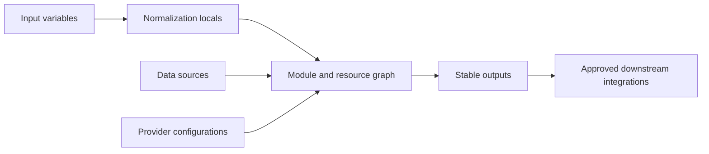
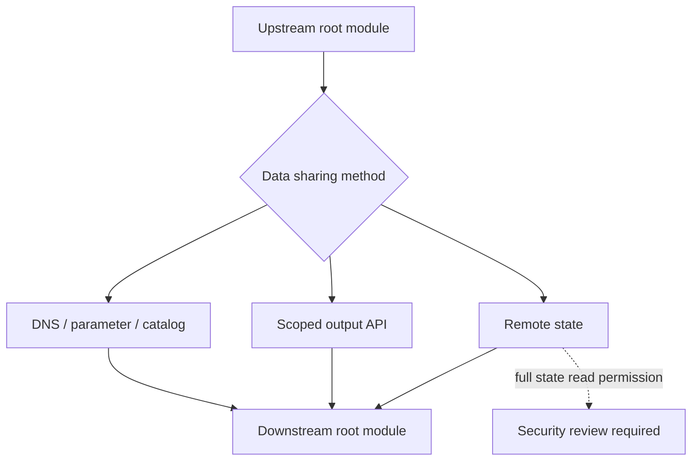
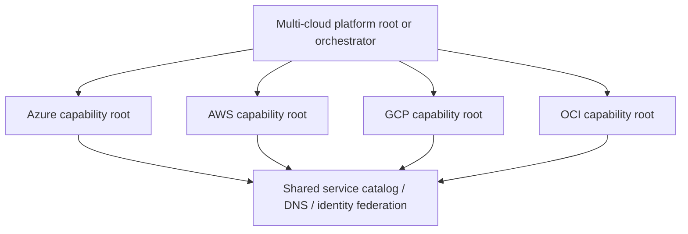

# 输入、输出、依赖性和组合

## 目的

该标准定义了 Terraform 模块如何在不产生脆弱耦合的情况下交换配置和数据。它涵盖输入设计、输出契约、显式和隐式依赖关系、提供程序传递、跨状态数据交换和多云组合。

主要规则很简单：依赖结构必须保持可见。 Terraform 的依赖图引擎仅在配置准确表达所有权和关系时才有效。

## 界面设计原则

- 输入表达呼叫者意图。
- 本地人标准化价值观并得出实施细节。
- 资源实现所需的状态。
- 输出公开稳定的集成契约。
- 根模块由模块和提供程序组合。
- 状态边界将所有权和爆炸半径分开。

## 输入变量标准

### 必需的属性

每个公共变量 MUST 声明：

- 一个有意义的名字。
- 精确的描述。
- 具体类型约束。
- 仅当省略具有一种可预测的含义时才是安全的默认值。
- `nullable = false`，其中 null 不是有效的语义状态。
- 验证无需云 API 调用即可评估的约束。
- `sensitive = true`（当值保密时）。
```hcl
variable "environment" {
  description = "Deployment environment classification."
  type        = string
  nullable    = false

  validation {
    condition     = contains(["dev", "test", "stage", "prod"], var.environment)
    error_message = "environment must be one of dev, test, stage, or prod."
  }
}
```
### 结构化对象

使用对象进行内聚配置。当键标识重复的命名实例时使用映射。当顺序无关且值唯一时使用集合。仅当订购是有意义的契约时才使用列表。
```hcl
variable "subnets" {
  description = "Subnets keyed by stable logical name."
  type = map(object({
    cidrs             = list(string)
    service_endpoints = optional(set(string), [])
    delegation        = optional(string)
  }))
  default = {}
}
```
不要使用 `map(any)` 作为架构设计的逃避。它会禁用有意义的验证，削弱编辑器支持，并使重大更改更难以检测。

### 默认值

默认值 SHOULD 表示安全且广泛接受的行为。不要默认：

- 生产标识符。
- 当数据驻留很重要时的云区域。
- 对 `true` 的公共访问。
- 具有破坏性或易于更换的选项。
- 组织、订阅、账户、项目或隔间 ID。
- 特权 IAM 角色。

可选对象属性 SHOULD 优先于标记字符串（例如 `"none"`）。

### 标准化

使用局部变量将灵活的调用者输入转换为一种内部表示形式。
```hcl
locals {
  normalized_tags = merge(
    var.metadata.extra,
    {
      application = var.metadata.application
      environment = var.metadata.environment
      managed_by  = "terraform"
    }
  )
}
```
归一化逻辑 SHOULD 具有确定性并由单元测试覆盖。

## 输出标准

输出是一个 API。删除或更改输出类型是一项重大更改。

每个 MUST 输出都有一个描述。输出 SHOULD 仅公开调用者所需的值。
```hcl
output "network_attachment" {
  description = "Network attachment contract consumed by workload modules."
  value = {
    subnet_id        = module.network.subnet_ids["application"]
    security_zone_id = module.network.security_zone_id
    dns_zone_ids     = module.network.private_dns_zone_ids
  }
}
```
### 敏感值

将机密输出标记为敏感，但不要假设标记会从状态中删除该值。
```hcl
output "generated_password" {
  value       = random_password.initial.result
  sensitive   = true
  description = "Initial generated password. Prefer direct write to a secret store instead of consuming this output."
}
```
首选模式是将生成的凭据直接写入经批准的机密服务并仅输出机密引用。

### 输出兼容性

在主要模块版本中：

- 现有输出名称和类型 MUST 保持兼容。
- 当调用者能够容忍结构扩展时，MAY 添加新的对象属性。
- 如果没有主要版本，输出值 MUST NOT 改变语义。
- 在可行的情况下，特定于提供程序的值 SHOULD 被包装在面向能力的输出对象中。

## 依赖类型

### 隐式依赖

当一个表达式引用另一资源或模块输出时，Terraform 会自动创建依赖图边。
```hcl
resource "google_compute_subnetwork" "app" {
  network = google_compute_network.core.id
}
```
隐式依赖是首选，因为它们描述了精确的值关系。

### 显式依赖

仅当存在实际操作依赖性但没有表达式承载该关系时，才使用 `depends_on`。
```hcl
module "workload" {
  source = "./modules/workload"

  depends_on = [module.organization_policy]
}
```
模块级`depends_on`可以使许多值在规划过程中未知，而 SHOULD 使用范围较窄。注释 MUST 解释非明显的显式依赖关系。

### 避免人为依赖

当一个 ID 足够时，不要传递整个资源对象。这会增加耦合并可能导致不必要的未知值。

坏的：
```hcl
module "app" {
  source  = "./app"
  network = azurerm_virtual_network.core
}
```
首选：
```hcl
module "app" {
  source    = "./app"
  subnet_id = module.network.subnet_ids["app"]
}
```
## 构图模式

### 平面构图

根模块直接调用多个对等模块。这对于特定于环境的编排来说是首选，因为依赖关系仍然可见。
```hcl
module "network" {
  source  = "app.terraform.io/example/network/azurerm"
  version = "1.8.2"
  # ...
}

module "service" {
  source  = "app.terraform.io/example/private-service/azurerm"
  version = "2.3.0"

  subnet_id = module.network.subnet_ids["application"]
}
```
### 分层组合

当组合可跨多个环境重用时，功能模块可以调用原始模块。嵌套 SHOULD 仍然足够浅，以便审阅者跟踪所有权和默认值。

###集合构成

在模块上使用 `for_each` 以获取具有稳定密钥的重复独立实例。
```hcl
module "storage" {
  for_each = var.storage_instances
  source   = "app.terraform.io/example/storage/aws"
  version  = "3.1.0"

  name       = each.key
  data_class = each.value.data_class
}
```
## 提供程序传递和别名

根模块为所需范围配置提供程序。子模块接收提供程序映射。
```hcl
provider "aws" {
  alias  = "primary"
  region = "ca-central-1"
}

provider "aws" {
  alias  = "replica"
  region = "us-east-1"
}

module "replicated_service" {
  source = "./modules/replicated-service"

  providers = {
    aws         = aws.primary
    aws.replica = aws.replica
  }
}
```
提供程序别名 MUST 传达范围，例如 `hub`、`spoke`、`security`、`primary`、`replica` 或区域代码。避免使用 `one` 和 `two` 等别名。

## 跨状态数据交换

状态边界 SHOULD 是独立的。当数据必须跨越边界时，选择耦合度最低的机制。

优先顺序：

1. 服务发现或稳定的云原生发布：DNS、参数存储、配置服务、资源目录、机密引用或 API。
2. 上游流水线生成的已批准制品。
3. HCP Terraform/Enterprise 输出 API 或等效范围输出服务。
4. 仅当完全状态访问可接受并记录时，`terraform_remote_state`。

由于 `terraform_remote_state` 读取器通常需要访问完整的状态快照，因此 MUST NOT 可用于高度敏感的上游状态，除非补偿控制得到批准。

## 数据来源

数据源适合稳定的外部管理的资源。它们 MUST NOT 成为一种不受控制的查找机制。

- 与显示名称搜索相比，更喜欢不可变的 ID。
- 如果需要名称查找，请验证唯一性。
- 记录外部管理的依赖项的所有者。
- 避免查询同一根模块应管理的资源。
- 不要使用数据源来隐藏丢失的输入契约。
- 计划行为 MUST 考虑最终一致性或 API 限制。

## 多云组合

多云平台 SHOULD 由根层或编排层组合。

一种 Terraform 状态 MAY 在技术上包括多个云提供程序，但此 SHOULD 仅限于共享一个所有者、一种变更节奏、一种批准路径和一种故障域的资源。否则，请使用单独的根和外部编排工作流程。

## 条件和断言

使用最窄的断言机制：

|机制|最佳使用 |
|---|---|
|变量验证 |输入值约束 |
|资源前提 |资源操作前的要求 |
|资源后置条件|关于创建或读取资源的保证 |
| `check` 块 |跨资源或连续断言 |
|策略引擎|跨仓库的组织范围规则 |

断言 MUST 生成可识别无效值和预期修复措施的消息，而不会暴露机密。

## 处理可选资源

当未来可能扩展时，可选资源 SHOULD 使用稳定的 `for_each` 密钥而不是位置 `count`。
```hcl
resource "oci_core_public_ip" "this" {
  for_each = var.create_public_ip ? { primary = true } : {}
  # ...
}
```
将选项从 `false` 更改为 `true` 然后创建一个可预测的地址：`oci_core_public_ip.this["primary"]`。

## 空、未知和可选值语义

Terraform 区分缺失值、显式 `null`、空集合以及应用前未知的值。模块接口 MUST 定义如何解释每个状态。

- **缺少可选属性**：使用记录在案的模块默认值。
- **显式`null`**：要么视为遗漏，要么用`nullable = false`拒绝它；不要让行为变得模棱两可。
- **空集合**：通常意味着“管理零个实例”，而不是“使用默认值”，除非明确记录。
- **未知值**：保持计划的正确性；当提供程序稍后可以解析该值时，避免需要在应用之前知道该值的逻辑。

验证和条件表达式 SHOULD 考虑未知值。仅当值已知时才安全的条件可能会将失败推迟到应用为止。当所需事实取决于提供程序计算的数据时，模块 SHOULD 使用前置条件或后置条件。

即使 HCL 类型保持不变，更改 `null`、空集合或省略属性的含义也是契约更改。

## 状态之间的契约版本控制

当一个状态向另一个状态发布数据时，发布的形状 SHOULD 具有明确的契约版本或能力标识符。
```hcl
output "network_contract" {
  description = "Versioned network integration contract."
  value = {
    contract_version = "1"
    subnet_ids       = module.network.subnet_ids
    private_dns      = module.network.private_dns_zone_ids
  }
}
```
消费者 SHOULD 验证契约版本和所需密钥。生产者 MAY 在契约版本中添加向后兼容的属性，但删除密钥、更改类型或更改语义需要新的契约版本和迁移周期。

契约版本不会消除部署顺序。上游流水线 SHOULD 在下游消费者采用新契约之前发布新契约，并应保留之前的兼容形式直到迁移完成。

## 跨独立根的编排

单独的状态边界需要尊重所有权和故障隔离的编排。中央工作流程 MAY 协调根，但 MUST NOT 将它们折叠成 Terraform 无法自动回滚的一个隐式事务。

安全的编排序列 SHOULD 满足以下要求：

1. 确定已声明契约的依赖顺序。
2. 根据预期的上游版本规划每个根。
3.先涂抹基础根部。
4. 验证已发布的契约和运营状况。
5. 应用从属根。
6. 停止并评估失败，而不是自动销毁成功的上游更改。

跨云编排 SHOULD 使用持久的已发布接口，例如 DNS、配置服务、目录日志或范围输出 API。跨云和安全域的直接状态读取创建了广泛的访问和紧密的操作耦合。

## 反模式

- 公开每个资源的所有属性的输出。
- 没有类型或描述的变量。
- 可复用模块中的默认订阅、账户、项目、租户或区域值。
- `depends_on` 广泛应用于整个模块，没有真正的隐藏依赖项。
- 循环状态依赖。
- 当存在稳定的服务端点时，下游模块读取上游状态。
- 将凭证或提供程序对象作为变量传递。
- 由 `cloud_provider` 字符串选择的模块逻辑隐藏了四个不相关的实现。
- 与 `count` 一起使用的列表，其中重新排序会导致替换。
- 包含生成的机密的输出。

## 验证

- 输入是否经过键入、验证并与调用者意图保持一致？
- 默认值是否安全且明确？
- 输出名称、类型和语义稳定吗？
- 依赖图边是否尽可能隐式？
- 每个显式依赖是否合理？
- 提供程序别名和映射是否可见？
- 跨状态访问是否被最小化？
- 数据源是否稳定且为外部所有？
- 组合是否保留有界状态和所有权？

## 相关主题

- [可复用 Terraform 模块工程](iac-engineering-reusable-terraform-modules.md)
- [模块版本控制和发布管理](iac-module-versioning-and-release-management.md)
- [Terraform 仓库和模块结构](iac-terraform-repository-and-module-structure.md)

## 参考文档

- HashiCorp 输入变量：https://developer.hashicorp.com/terraform/language/values/variables
- HashiCorp 输出值：https://developer.hashicorp.com/terraform/language/values/outputs
- HashiCorp 模块组合：https://developer.hashicorp.com/terraform/language/modules/develop/composition
- HashiCorp 远程状态数据：https://developer.hashicorp.com/terraform/language/state/remote-state-data
- 模块内的 HashiCorp 提供程序：https://developer.hashicorp.com/terraform/language/modules/develop/providers
