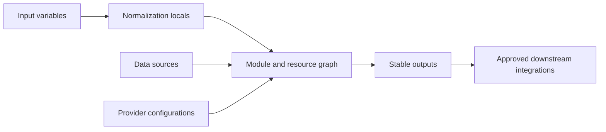
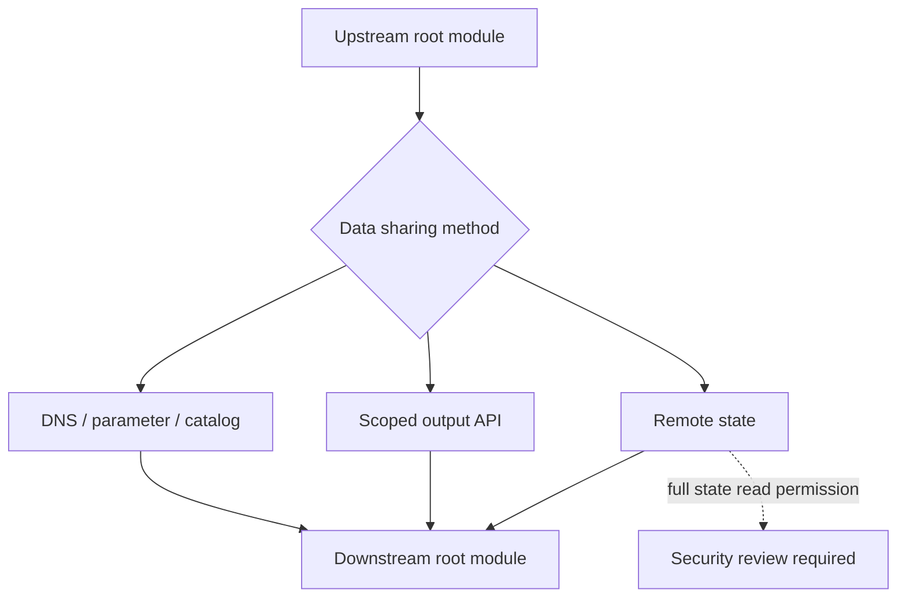
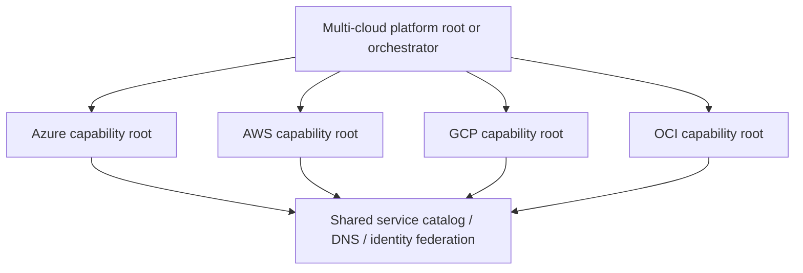

# Inputs, Outputs, Dependencies, and Composition

## Purpose

This standard defines how Terraform modules exchange configuration and data without creating fragile coupling. It covers input design, output contracts, explicit and implicit dependencies, provider passing, cross-state data exchange, and multi-cloud composition.

The primary rule is simple: dependency structure must remain visible. Terraform's graph engine is effective only when configuration accurately expresses ownership and relationships.

## Interface design principles

- Inputs express caller intent.
- Locals normalize values and derive implementation details.
- Resources implement the desired state.
- Outputs expose stable integration contracts.
- Root modules compose modules and providers.
- State boundaries separate ownership and blast radius.



## Input variable standards

### Required attributes

Every public variable MUST declare:

- A meaningful name.
- A precise description.
- A concrete type constraint.
- A safe default only when omission has one predictable meaning.
- `nullable = false` where null is not a valid semantic state.
- Validation for constraints that can be evaluated without cloud API calls.
- `sensitive = true` when the value is confidential.

```hcl
variable "environment" {
  description = "Deployment environment classification."
  type        = string
  nullable    = false

  validation {
    condition     = contains(["dev", "test", "stage", "prod"], var.environment)
    error_message = "environment must be one of dev, test, stage, or prod."
  }
}
```

### Structured objects

Use objects for cohesive configuration. Use maps when keys identify repeated named instances. Use sets when order is irrelevant and values are unique. Use lists only when ordering is a meaningful contract.

```hcl
variable "subnets" {
  description = "Subnets keyed by stable logical name."
  type = map(object({
    cidrs             = list(string)
    service_endpoints = optional(set(string), [])
    delegation        = optional(string)
  }))
  default = {}
}
```

Do not use `map(any)` as an escape from schema design. It disables meaningful validation, weakens editor support, and makes breaking changes harder to detect.

### Defaults

A default SHOULD represent a secure and broadly acceptable behavior. Do not default:

- Production identifiers.
- Cloud regions when data residency matters.
- Public access to `true`.
- Destructive or replacement-prone options.
- Organization, subscription, account, project, or compartment IDs.
- Privileged IAM roles.

Optional object attributes SHOULD be preferred over sentinel strings such as `"none"`.

### Normalization

Use locals to convert flexible caller input into one internal representation.

```hcl
locals {
  normalized_tags = merge(
    var.metadata.extra,
    {
      application = var.metadata.application
      environment = var.metadata.environment
      managed_by  = "terraform"
    }
  )
}
```

Normalization logic SHOULD be deterministic and covered by unit tests.

## Output standards

Outputs are an API. Removing or changing an output's type is a breaking change.

Each output MUST have a description. Outputs SHOULD expose only values required by callers.

```hcl
output "network_attachment" {
  description = "Network attachment contract consumed by workload modules."
  value = {
    subnet_id        = module.network.subnet_ids["application"]
    security_zone_id = module.network.security_zone_id
    dns_zone_ids     = module.network.private_dns_zone_ids
  }
}
```

### Sensitive values

Mark confidential outputs as sensitive, but do not assume that marking removes the value from state.

```hcl
output "generated_password" {
  value       = random_password.initial.result
  sensitive   = true
  description = "Initial generated password. Prefer direct write to a secret store instead of consuming this output."
}
```

The preferred pattern is to write generated credentials directly to an approved secret service and output only the secret reference.

### Output compatibility

Within a major module version:

- Existing output names and types MUST remain compatible.
- New object attributes MAY be added when callers tolerate structural extension.
- Output values MUST not change semantic meaning without a major release.
- Provider-specific values SHOULD be wrapped in capability-oriented output objects where practical.

## Dependency types

### Implicit dependencies

Terraform automatically creates graph edges when one expression references another resource or module output.

```hcl
resource "google_compute_subnetwork" "app" {
  network = google_compute_network.core.id
}
```

Implicit dependencies are preferred because they describe the exact value relationship.

### Explicit dependencies

Use `depends_on` only when a real operational dependency exists but no expression carries the relationship.

```hcl
module "workload" {
  source = "./modules/workload"

  depends_on = [module.organization_policy]
}
```

Module-level `depends_on` can make many values unknown during planning and SHOULD be used narrowly. A comment MUST explain non-obvious explicit dependencies.

### Avoiding artificial dependencies

Do not pass an entire resource object when one ID is sufficient. This increases coupling and can cause unnecessary unknown values.

Bad:

```hcl
module "app" {
  source  = "./app"
  network = azurerm_virtual_network.core
}
```

Preferred:

```hcl
module "app" {
  source    = "./app"
  subnet_id = module.network.subnet_ids["app"]
}
```

## Composition patterns

### Flat composition

A root module directly calls several peer modules. This is preferred for environment-specific orchestration because dependencies remain visible.

```hcl
module "network" {
  source  = "app.terraform.io/example/network/azurerm"
  version = "1.8.2"
  # ...
}

module "service" {
  source  = "app.terraform.io/example/private-service/azurerm"
  version = "2.3.0"

  subnet_id = module.network.subnet_ids["application"]
}
```

### Layered composition

Capability modules may call primitive modules when the composition is reusable across multiple environments. Nesting SHOULD remain shallow enough for reviewers to trace ownership and defaults.

### Collection composition

Use `for_each` on module blocks for repeated independent instances with stable keys.

```hcl
module "storage" {
  for_each = var.storage_instances
  source   = "app.terraform.io/example/storage/aws"
  version  = "3.1.0"

  name       = each.key
  data_class = each.value.data_class
}
```

## Provider passing and aliases

Root modules configure providers for the required scopes. Child modules receive provider mappings.

```hcl
provider "aws" {
  alias  = "primary"
  region = "ca-central-1"
}

provider "aws" {
  alias  = "replica"
  region = "us-east-1"
}

module "replicated_service" {
  source = "./modules/replicated-service"

  providers = {
    aws         = aws.primary
    aws.replica = aws.replica
  }
}
```

Provider aliases MUST communicate scope, such as `hub`, `spoke`, `security`, `primary`, `replica`, or a region code. Avoid aliases like `one` and `two`.

## Cross-state data exchange

State boundaries SHOULD be independent. When data must cross boundaries, choose the least-coupled mechanism.

Priority order:

1. Service discovery or stable cloud-native publication: DNS, parameter store, configuration service, resource catalog, secret reference, or API.
2. Approved artifact generated by the upstream pipeline.
3. HCP Terraform/Enterprise output APIs or equivalent scoped output service.
4. `terraform_remote_state` only when full state access is acceptable and documented.



Because `terraform_remote_state` readers generally require access to the complete state snapshot, it MUST NOT be used for highly sensitive upstream state unless compensating controls are approved.

## Data sources

Data sources are appropriate for stable, externally owned resources. They MUST NOT become an uncontrolled lookup mechanism.

- Prefer immutable IDs over display-name searches.
- If name lookup is required, validate uniqueness.
- Document the owner of externally managed dependencies.
- Avoid querying resources that the same root module should own.
- Do not use data sources to hide missing input contracts.
- Plan behavior under eventual consistency or API throttling MUST be considered.

## Multi-cloud composition

Multi-cloud platforms SHOULD be composed at the root or orchestration layer.



One Terraform state MAY technically include multiple cloud providers, but this SHOULD be limited to resources that share one owner, one change cadence, one approval path, and one failure domain. Otherwise, use separate roots and an external orchestration workflow.

## Conditions and assertions

Use the narrowest assertion mechanism:

| Mechanism | Best use |
|---|---|
| Variable validation | Input value constraints |
| Resource precondition | Requirement before resource operation |
| Resource postcondition | Guarantee about created or read resource |
| `check` block | Cross-resource or continuous assertion |
| Policy engine | Organization-wide rules across repositories |

Assertions MUST produce messages that identify the invalid value and expected remediation without exposing secrets.

## Handling optional resources

Optional resources SHOULD use stable `for_each` keys rather than positional `count` when future expansion is likely.

```hcl
resource "oci_core_public_ip" "this" {
  for_each = var.create_public_ip ? { primary = true } : {}
  # ...
}
```

Changing an option from `false` to `true` then creates a predictable address: `oci_core_public_ip.this["primary"]`.

## Null, unknown, and optional-value semantics

Terraform distinguishes absent values, explicit `null`, empty collections, and values that are unknown until apply. Module interfaces MUST define how each state is interpreted.

- **Absent optional attribute**: use the documented module default.
- **Explicit `null`**: either treat as omission or reject it with `nullable = false`; do not leave the behavior ambiguous.
- **Empty collection**: normally means “manage zero instances,” not “use defaults,” unless explicitly documented.
- **Unknown value**: preserve plan correctness; avoid logic that requires the value to be known before apply when the provider can resolve it later.

Validation and condition expressions SHOULD account for unknown values. A condition that is safe only when a value is known may defer failure until apply. Modules SHOULD use preconditions or postconditions when the required fact depends on provider-computed data.

Changing the meaning of `null`, an empty collection, or an omitted attribute is a contract change even when the HCL type remains unchanged.

## Contract versioning between states

When one state publishes data for another, the published shape SHOULD have an explicit contract version or capability identifier.

```hcl
output "network_contract" {
  description = "Versioned network integration contract."
  value = {
    contract_version = "1"
    subnet_ids       = module.network.subnet_ids
    private_dns      = module.network.private_dns_zone_ids
  }
}
```

Consumers SHOULD validate the contract version and required keys. Producers MAY add backward-compatible attributes within a contract version, but removing keys, changing types, or changing semantics requires a new contract version and migration period.

A contract version does not eliminate deployment ordering. The upstream pipeline SHOULD publish the new contract before downstream consumers adopt it, and should retain the previous compatible form until migration is complete.

## Orchestration across independent roots

Separate state boundaries require orchestration that respects ownership and failure isolation. A central workflow MAY coordinate roots, but it MUST NOT collapse them into one implicit transaction that Terraform cannot roll back atomically.

A safe orchestration sequence SHOULD:

1. Determine the dependency order from declared contracts.
2. Plan each root against the intended upstream version.
3. Apply foundation roots first.
4. Verify published contracts and operational health.
5. Apply dependent roots.
6. Stop and assess on failure rather than automatically destroying successful upstream changes.

Cross-cloud orchestration SHOULD use durable published interfaces such as DNS, configuration services, catalog records, or scoped output APIs. Direct state reads across clouds and security domains create broad access and tight operational coupling.

## Anti-patterns

- Outputs that expose all attributes of every resource.
- Variables with no type or description.
- Default subscription, account, project, tenancy, or region values in reusable modules.
- `depends_on` applied broadly to entire modules without a real hidden dependency.
- Circular state dependencies.
- Downstream modules reading upstream state when a stable service endpoint exists.
- Passing credentials or provider objects as variables.
- Module logic selected by a `cloud_provider` string that hides four unrelated implementations.
- Lists used with `count` where reordering causes replacement.
- Outputs containing generated secrets.

## Validation

- Are inputs typed, validated, and aligned with caller intent?
- Are defaults secure and unambiguous?
- Are output names, types, and semantics stable?
- Are graph edges implicit wherever possible?
- Is every explicit dependency justified?
- Are provider aliases and mappings visible?
- Is cross-state access minimized?
- Are data sources stable and externally owned?
- Does composition preserve bounded state and ownership?

## Related topics

- [Engineering Reusable Terraform Modules](iac-engineering-reusable-terraform-modules.md)
- [Module Versioning and Release Management](iac-module-versioning-and-release-management.md)
- [Terraform Repository and Module Structure](iac-terraform-repository-and-module-structure.md)

## References

- HashiCorp input variables: https://developer.hashicorp.com/terraform/language/values/variables
- HashiCorp output values: https://developer.hashicorp.com/terraform/language/values/outputs
- HashiCorp module composition: https://developer.hashicorp.com/terraform/language/modules/develop/composition
- HashiCorp remote state data: https://developer.hashicorp.com/terraform/language/state/remote-state-data
- HashiCorp providers within modules: https://developer.hashicorp.com/terraform/language/modules/develop/providers
