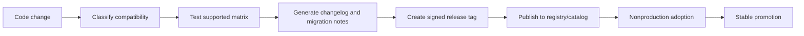
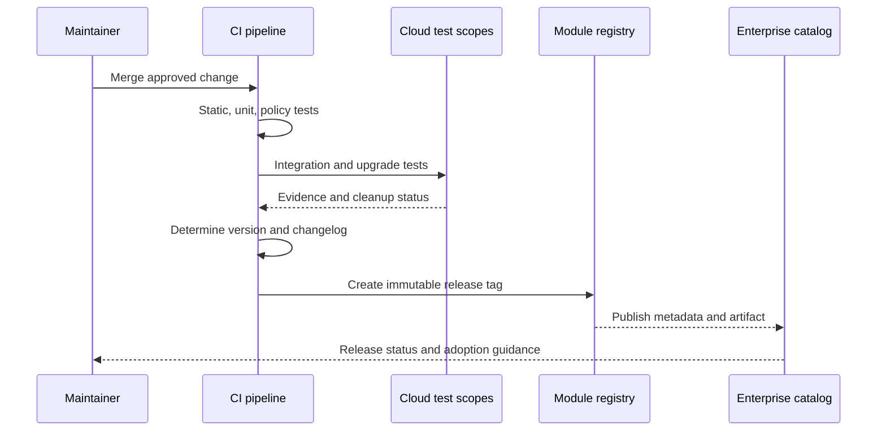

# 模块版本控制和发布管理

## 目的

该标准定义了如何对可复用的 Terraform 模块进行版本控制、发布、升级、弃用和退役。它保护消费者免受不受控制的更改的影响，并为维护人员提供程序升级、接口更改、资源重构和安全修复的严格路径。

## 版本模型

已发布的模块 MUST 使用 `MAJOR.MINOR.PATCH` 形式的语义版本控制。

- **主要**：不兼容的更改需要消费者采取行动或可能更改资源身份或行为。
- **次要**：向后兼容功能或可选行为。
- **PATCH**：向后兼容的缺陷、文档、测试或安全更正。

注册表发布标记 MUST 是语义版本，可以选择以 `v` 为前缀，例如 `v2.4.1`。

## 更改分类

|改变 |典型版本 |
|---|---|
|文档更正 |补丁|
|添加可选输出 |次要|
|添加可选资源默认禁用 |次要|
|测试后扩展兼容提供程序约束 |基于风险的补丁或次要版本 |
|更改修改现有基础设施的安全默认设置 |除非明确选择迁移，否则重大 |
|重命名变量 |主要版本 |
|删除输出 |主要版本 |
|更改输出类型 |主要版本 |
|在没有 `moved` 块的情况下更改资源地址 |重大且通常不可接受 |
|添加 `moved` 块保留对象身份 |补丁或次要|
|提高最低 Terraform 版本 |主要版本，除非旧版本已根据发布的策略停止支持 |
|改变行为的安全修复|具有明确建议的最小安全版本；可能仍需要主要版本升级 |

版本号无法使不安全的更改变得安全。维护者 MUST 解释基础设施的影响，而不仅仅是 API 兼容性。

## 兼容性尺寸

发布契约包括：

- Terraform CLI 系列。
- 提供程序范围。
- 模块输入和输出模式。
- 资源地址和状态迁移。
- 默认行为。
- 支持的云区域和服务层。
- 身份和许可先决条件。
- 从支持的先前版本的升级路径。

## 版本限制

消费者 MUST 固定模块版本或使用注册表支持的有界约束。
```hcl
module "network" {
  source  = "app.terraform.io/example/network/azurerm"
  version = "~> 3.4"
}
```
对于生产，当需要确定性升级时，首选精确版本。

可复用模块中的提供程序约束 SHOULD 声明兼容性，而无需不必要地选择一个补丁：
```hcl
terraform {
  required_version = ">= 1.7.0, < 2.0.0"

  required_providers {
    google = {
      source  = "hashicorp/google"
      version = ">= 6.0, < 8.0"
    }
  }
}
```
根模块使用组合约束和 `.terraform.lock.hcl` 来选择精确的提供程序构建。

## 分支和标签策略

- `main` MUST 保持可发布或受发布标准保护。
- 生产消费者 MUST NOT 来自分支的源模块。
- 发布标签 MUST 是不可变的。
- 禁止重新标记现有版本。
- 发布标签 SHOULD 由受保护的自动化签名或创建。
- 预发布标签 MAY 使用语义标识符，例如 `v3.0.0-rc.1`。
- 受损或有缺陷的版本 MUST 在目录中被标记为已弃用或撤回；标签和审核证据 SHOULD 保持完好。

## 发布流水线

发布流水线 MUST 满足以下要求：

1. 验证干净的源代码和批准的提交。
2. 运行完整的测试矩阵。
3. 生成或验证文档。
4. 生成变更日志条目。
5. 根据变更标签或常规提交策略确定版本。
6. 创建不可变标签和发布说明。
7. 发布到批准的注册表。
8. 更新目录元数据。
9. 提供来源证明和测试证据。
10. 通知负责人重大变更或建议。

## 变更日志标准

每次发布 MUST 记录：

- 增加了功能。
- 行为改变。
- 修复了缺陷。
- 安全修正。
- 已弃用的接口。
- 删除了接口。
- Terraform 和提供程序兼容性更改。
- 预期计划影响。
- 所需的迁移步骤。

例子：
```markdown
## [2.3.0] - 2026-08-01

### Added
- Optional customer-managed encryption configuration.

### Changed
- Diagnostic log categories are discovered dynamically.

### Upgrade impact
- No resource replacement is expected from 2.2.x.
```
## 状态安全重构

地址更改 SHOULD 使用 `moved` 块。
```hcl
moved {
  from = aws_kms_key.logs
  to   = module.encryption.aws_kms_key.this
}
```
规则：

- 从先前支持的版本迁移时 MUST 进行测试。
- 发布说明 MUST 确定预期的移动和替换。
- 当声明性移动不可行但需要受控执行时，MAY 提供 `terraform state mv` 指令。
- 迁移块 SHOULD 保持足够长的时间，以便所有支持的源版本进行升级。
- 重构 MUST NOT 导致有状态资源的静默重新创建。

## 弃用策略

弃用是一个生命周期，而不是注释。

1. 宣布已弃用的输入、输出、行为或模块。
2. 提供受支持的替代品。
3. 在可行的情况下发布验证、文档或策略指导。
4. 至少在已发布的弃用窗口内保持兼容性。
5.仅在下一个主要版本中删除。

默认企业弃用窗口 SHOULD 至少为 180 天，除非安全或提供程序生命周期结束情况需要更快的操作。

## 发布渠道

目录 MAY 公开：

- **实验性**：设计仍在变化；没有生产支持。
- **预览版**：功能完整，但采用或区域覆盖范围有限。
- **稳定**：生产支持的版本。
- **维护**：仅限安全和关键修复。
- **已弃用**：可以替换；退休日期已公布。
- **退休**：不支持消费。

语义版本不指示支持渠道。这两个字段都是必需的。

## 主要版本发布要求

主要版本 MUST 包括：

- 迁移指南。
- 前后示例。
- 从最新支持的先前主要版本或记录在案的过渡版本升级测试证据。
- 规划影响和替代矩阵。
- 提供程序和 Terraform 兼容性矩阵。
- 弃用处理表。
- 回滚限制。
- 指定采用支持负责人。

如果可能，请在先前的主要版本中提供一个次要版本，在重大版本之前引入 `moved` 块、兼容性输出或警告。

## 安全版本

安全修复需要协调处理。

- 问题 MUST 进行风险评级。
- 当披露会增加风险时，利用详细信息 SHOULD 受到限制，直至采取修复措施。
- 修复版本和公告 MUST 识别受影响的版本。
- 消费者 MUST 收到明确的升级紧迫性以及任何所需的状态或凭证轮换步骤。
- 通过状态暴露的凭证或机密需要事件响应；仅靠代码补丁是不够的。
- 当修复风险证明合理时，不受支持的主要版本 MAY 收到特殊补丁。

## 提供程序升级

可行时，提供程序升级 MUST 与不相关的模块更改分开进行测试。

对于每次升级：

- 查看发布说明和弃用。
- 更新兼容的约束。
- 刷新测试根模块中的锁定文件。
- 针对代表性的现有状态运行计划。
- 测试创建、更新、导入和销毁。
- 仅日志记录标准化差异。
- 确认没有隐藏资源替换。

模块 SHOULD 支持有限范围，而不是强迫每个消费者使用一个精确的提供程序补丁。根模块保留精确的锁定选择。

## 回滚

模块回滚并不等同于应用回滚。
在建议降级之前，维护者 MUST 确定较新版本是否：

- 通过提供程序更改了状态模式。
- 创建了旧版本未知的资源。
- 删除或重命名输出。
- 应用了不可逆转的云 API 更改。
- 轮换密钥或凭证。
- 迁移的数据。

发布说明 MUST 表示不支持降级。优选的恢复可以是前向修复。

## 生命终结和退休

退役模块 MUST 满足以下要求：

- 在注册表和目录中标记为已弃用。
- 确定其替代品或解释为什么不存在。
- 发布最终支持的版本和日期。
- 通过策略禁止采用新产品。
- 根据保留策略保留源代码和发布历史记录。
- 仅在消费者迁移或接受风险后才删除主动测试计划。

## 发布候选版本并逐步采用

高影响力版本 SHOULD 在稳定升级之前使用候选版本阶段。候选版本是不可变的，并使用将成为最终版本的相同源提交和制品进行测试。

逐步采用 MAY 过程如下：

1. 维护者集成环境。
2. 具有代表性的非生产消费者。
3、策略允许的情况下，低风险生产金丝雀。
4.更广泛的认可消费。

升级证据 SHOULD 包括现有状态的计划、应用后验证、清理或回滚结果、提供程序兼容性以及任何观测到的标准化差异。测试后重建制品会使证据无效；升级的版本必须可追溯到经过测试的提交和标签。

## 消费者影响和弃用跟踪

维护者 SHOULD 在弃用接口或模块之前使用目录或清单数据来识别消费者。弃用日志 SHOULD 跟踪受影响的根、所有者确认、目标迁移版本、阻止程序和完成状态。

当没有人知道谁使用该功能时，弃用窗口是无效的。对于关键模块，发布自动化 SHOULD 在已知消费者使用以下内容时发出警告：

- 被阻止或易受攻击的版本。
- 不支持升级路径的版本。
- 已弃用的变量、输出或提供程序约束。
- 即将退役的版本。

退休 SHOULD 基于消费者已迁移或正式接受剩余风险的证据，而不仅仅是因为日期已到。

## 发布来源、撤回和前向恢复

每个版本 SHOULD 链接到源、不可变标签、测试证据、生成的文档、依赖项选择和来源元数据。目录日志 SHOULD 在弃用或停用后保留此证据。

当版本有缺陷时：

- 将其标记为阻止或撤回以供新用途。
- 确定受影响的消费者并计划影响。
- 发布替换或修复版本。
- 说明降级是否安全。
- 保留原始标签和证据以供审核。
对于有状态模块，前向修复通常比降级更安全，因为较新的提供程序或模块可能已更改状态模式或云配置。发布指导 MUST 区分代码回滚、模块降级、状态恢复、基础设施恢复；它们是具有不同风险的独立操作。

## 反模式

- 生产模块来源来自`main`。
- 浮动 Git 引用。
- 重新标记版本。
- 打破补丁版本中的默认更改。
- 提供程序主要升级与不相关的功能混合在一起。
- 无需 `moved` 块或迁移指令的地址重构。
- 变更日志条目仅显示“更新的依赖项”。
- 声称向后兼容性，无需升级测试。
- 删除不良发布并清除证据。
- 主要版本没有迁移指南。

## 验证

- 语义版本控制是自动的或一致执行的。
- 标签是不可变的并且受到保护。
- 发布前通过完整测试。
- 变更日志和迁移说明确定基础设施影响。
- 声明了提供程序和 Terraform 兼容性。
- 升级路径经过测试。
- 目录支持渠道和所有权是最新的。
- 弃用和退役日期是可执行的。

## 相关主题

- [可复用 Terraform 模块工程](iac-engineering-reusable-terraform-modules.md)
- [环境配置与状态管理](iac-environment-configuration-and-state-management.md)
- [输入、输出、依赖关系和组合](iac-inputs-outputs-dependencies-and-composition.md)

## 参考文档

- 发布 Terraform 模块：https://developer.hashicorp.com/terraform/registry/modules/publish
- Terraform 版本限制：https://developer.hashicorp.com/terraform/language/expressions/version-constraints
- Terraform 依赖锁定文件：https://developer.hashicorp.com/terraform/language/files/dependency-lock
- Terraform 移动块：https://developer.hashicorp.com/terraform/language/block/moved
- 语义版本控制：https://semver.org/
