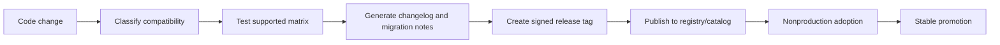
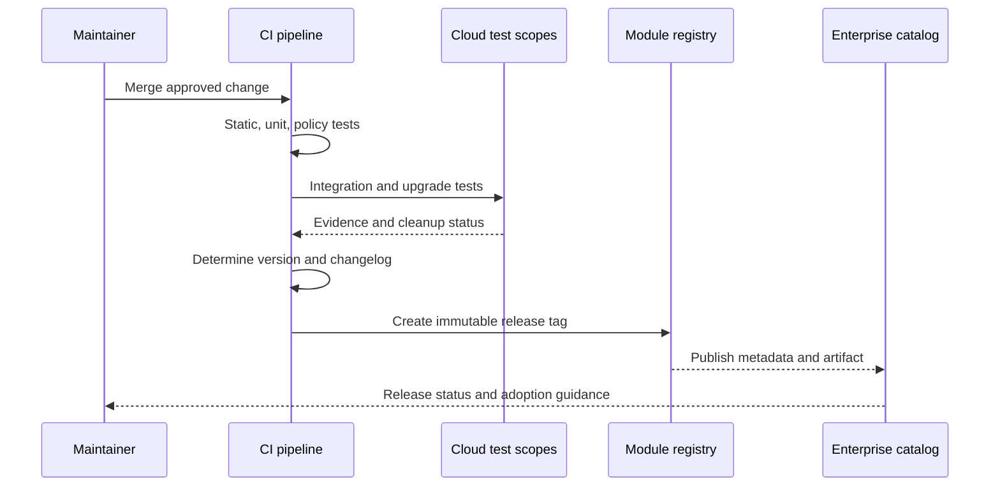

# Module Versioning and Release Management

## Purpose

This standard defines how reusable Terraform modules are versioned, released, promoted, deprecated, and retired. It protects consumers from uncontrolled changes and gives maintainers a disciplined path for provider upgrades, interface changes, resource refactoring, and security fixes.

## Version model

Published modules MUST use Semantic Versioning in the form `MAJOR.MINOR.PATCH`.

- **MAJOR**: incompatible change requiring consumer action or potentially changing resource identity or behavior.
- **MINOR**: backward-compatible capability or optional behavior.
- **PATCH**: backward-compatible defect, documentation, test, or security correction.

Registry release tags MUST be semantic versions, optionally prefixed with `v`, such as `v2.4.1`.

## Change classification

| Change | Typical version |
|---|---|
| Documentation correction | Patch |
| Add optional output | Minor |
| Add optional resource disabled by default | Minor |
| Expand compatible provider constraint after testing | Patch or minor based on risk |
| Change secure default that modifies existing infrastructure | Major unless migration is explicitly opt-in |
| Rename variable | Major |
| Remove output | Major |
| Change output type | Major |
| Change resource address without `moved` block | Major and generally unacceptable |
| Add `moved` block preserving object identity | Patch or minor |
| Raise minimum Terraform version | Major unless the old version was already out of support by published policy |
| Security fix that changes behavior | Smallest safe version with explicit advisory; may still require major |

A version number cannot make an unsafe change safe. Maintainers MUST explain infrastructure impact, not only API compatibility.

## Compatibility dimensions

A release contract includes:

- Terraform CLI range.
- Provider ranges.
- Module input and output schemas.
- Resource addresses and state migrations.
- Default behavior.
- Supported cloud regions and service tiers.
- Identity and permission prerequisites.
- Upgrade path from supported previous versions.



## Version constraints

Consumers MUST pin a module version or use a bounded constraint supported by the registry.

```hcl
module "network" {
  source  = "app.terraform.io/example/network/azurerm"
  version = "~> 3.4"
}
```

For production, exact versions are preferred when deterministic promotion is required.

Provider constraints in reusable modules SHOULD declare compatibility without unnecessarily selecting one patch:

```hcl
terraform {
  required_version = ">= 1.7.0, < 2.0.0"

  required_providers {
    google = {
      source  = "hashicorp/google"
      version = ">= 6.0, < 8.0"
    }
  }
}
```

Root modules use the combined constraints and `.terraform.lock.hcl` to select exact provider builds.

## Branch and tag policy

- `main` MUST remain releasable or be protected by release criteria.
- Production consumers MUST NOT source modules from branches.
- Release tags MUST be immutable.
- Re-tagging an existing version is prohibited.
- Release tags SHOULD be signed or created by protected automation.
- Pre-release tags MAY use semantic identifiers such as `v3.0.0-rc.1`.
- A compromised or defective release MUST be marked deprecated or withdrawn in the catalog; the tag and audit evidence SHOULD remain intact.

## Release pipeline



The release pipeline MUST:

1. Verify clean source and approved commit.
2. Run the complete test matrix.
3. Generate or validate documentation.
4. Generate a changelog entry.
5. Determine version according to change labels or conventional commit policy.
6. Create an immutable tag and release notes.
7. Publish to the approved registry.
8. Update catalog metadata.
9. Produce provenance and test evidence.
10. Notify owners of significant changes or advisories.

## Changelog standard

Every release MUST document:

- Added capabilities.
- Changed behavior.
- Fixed defects.
- Security corrections.
- Deprecated interfaces.
- Removed interfaces.
- Terraform and provider compatibility changes.
- Expected plan impact.
- Required migration steps.

Example:

```markdown
## [2.3.0] - 2026-08-01

### Added
- Optional customer-managed encryption configuration.

### Changed
- Diagnostic log categories are discovered dynamically.

### Upgrade impact
- No resource replacement is expected from 2.2.x.
```

## State-safe refactoring

Address changes SHOULD use `moved` blocks.

```hcl
moved {
  from = aws_kms_key.logs
  to   = module.encryption.aws_kms_key.this
}
```

Rules:

- A migration MUST be tested from the previous supported release.
- Release notes MUST identify expected moves and replacements.
- `terraform state mv` instructions MAY be provided when a declarative move is not possible, but they require controlled execution.
- Migration blocks SHOULD remain long enough for all supported source versions to upgrade.
- Refactoring MUST NOT cause silent recreation of stateful resources.

## Deprecation policy

Deprecation is a lifecycle, not a comment.

1. Announce the deprecated input, output, behavior, or module.
2. Provide a supported replacement.
3. Emit validation, documentation, or policy guidance where practical.
4. Maintain compatibility for at least the published deprecation window.
5. Remove only in the next major version.

The default enterprise deprecation window SHOULD be at least 180 days unless a security or provider end-of-life condition requires faster action.

## Release channels

The catalog MAY expose:

- **Experimental**: design is still changing; no production support.
- **Preview**: feature-complete but limited adoption or region coverage.
- **Stable**: production-supported release.
- **Maintenance**: security and critical fixes only.
- **Deprecated**: replacement available; retirement date published.
- **Retired**: no supported consumption.

A semantic version does not indicate support channel. Both fields are required.

## Major-version release requirements

A major release MUST include:

- Migration guide.
- Before-and-after examples.
- Upgrade test evidence from the latest supported prior major or a documented bridge release.
- Plan impact and replacement matrix.
- Provider and Terraform compatibility matrix.
- Deprecation resolution table.
- Rollback limitations.
- Named adoption support owner.

Where possible, provide a minor release in the previous major that introduces `moved` blocks, compatibility outputs, or warnings before the breaking release.

## Security releases

Security fixes require coordinated handling.

- The issue MUST be risk-rated.
- Exploit details SHOULD be restricted until remediation is available when disclosure would increase risk.
- A fixed release and advisory MUST identify affected versions.
- Consumers MUST receive clear upgrade urgency and any required state or credential rotation steps.
- Credentials or secrets exposed through state require incident response; a code patch alone is insufficient.
- Unsupported major versions MAY receive an exceptional patch when remediation risk justifies it.

## Provider upgrades

Provider upgrades MUST be tested separately from unrelated module changes when practical.

For each upgrade:

- Review release notes and deprecations.
- Update compatible constraints.
- Refresh lock files in test root modules.
- Run plans against representative existing state.
- Test creation, update, import, and destroy.
- Record normalization-only diffs.
- Confirm no hidden resource replacement.

A module SHOULD support a bounded range rather than forcing every consumer to one exact provider patch. Root modules retain exact lock selections.

## Rollback

Module rollback is not equivalent to application rollback.

Before recommending a downgrade, maintainers MUST determine whether the newer release:

- Changed state schema through the provider.
- Created resources unknown to the old version.
- Removed or renamed outputs.
- Applied irreversible cloud API changes.
- Rotated keys or credentials.
- Migrated data.

Release notes MUST state when downgrade is unsupported. The preferred recovery may be a forward fix.

## End-of-life and retirement

A retired module MUST:

- Be marked deprecated in the registry and catalog.
- Identify its replacement or explain why none exists.
- Publish the final supported version and date.
- Disable new production adoption through policy.
- Preserve source and release history according to retention policy.
- Remove active test schedules only after consumers have migrated or accepted risk.

## Release candidates and progressive adoption

High-impact releases SHOULD use a release-candidate stage before Stable promotion. A release candidate is immutable and tested using the same source commit and artifact that will become the final release.

Progressive adoption MAY proceed through:

1. Maintainer integration environments.
2. A representative nonproduction consumer.
3. A low-risk production canary where policy permits.
4. Broader approved consumption.

Promotion evidence SHOULD include plans from existing state, post-apply verification, cleanup or rollback results, provider compatibility, and any observed normalization differences. Rebuilding the artifact after testing invalidates the evidence; the promoted release must be traceable to the tested commit and tag.

## Consumer impact and deprecation tracking

Maintainers SHOULD use catalog or inventory data to identify consumers before deprecating an interface or module. The deprecation record SHOULD track affected roots, owner acknowledgements, target migration release, blockers, and completion status.

A deprecation window is ineffective when no one knows who consumes the feature. For critical modules, release automation SHOULD warn known consumers when they use:

- A blocked or vulnerable version.
- A version outside the supported upgrade path.
- A deprecated variable, output, or provider constraint.
- A release approaching retirement.

Retirement SHOULD be based on evidence that consumers migrated or formally accepted the residual risk, not solely on the passage of a date.

## Release provenance, withdrawal, and forward recovery

Each release SHOULD link to source, immutable tag, test evidence, generated documentation, dependency selections, and provenance metadata. Catalog records SHOULD preserve this evidence after deprecation or retirement.

When a release is defective:

- Mark it blocked or withdrawn for new use.
- Identify affected consumers and plan impact.
- Publish a replacement or remediation release.
- State whether downgrade is safe.
- Preserve the original tag and evidence for audit.

For stateful modules, a forward fix is often safer than downgrading because the newer provider or module may have changed state schema or cloud configuration. Release guidance MUST distinguish code rollback, module downgrade, state restoration, and infrastructure recovery; they are separate operations with different risks.

## Anti-patterns

- Production module source from `main`.
- Floating Git references.
- Re-tagging a release.
- Breaking default changes in a patch release.
- Provider major upgrades mixed with unrelated features.
- Address refactoring without `moved` blocks or migration instructions.
- Changelog entries that say only “updated dependencies.”
- Claiming backward compatibility without upgrade testing.
- Deleting a bad release and erasing evidence.
- Major release with no migration guide.

## Validation

- Semantic versioning is automated or consistently enforced.
- Tags are immutable and protected.
- Full tests pass before publication.
- Changelog and migration notes identify infrastructure impact.
- Provider and Terraform compatibility are declared.
- Upgrade paths are tested.
- Catalog support channel and ownership are current.
- Deprecation and retirement dates are enforceable.

## Related topics

- [Engineering Reusable Terraform Modules](iac-engineering-reusable-terraform-modules.md)
- [Environment Configuration and State Management](iac-environment-configuration-and-state-management.md)
- [Inputs, Outputs, Dependencies, and Composition](iac-inputs-outputs-dependencies-and-composition.md)

## References

- Publish Terraform modules: https://developer.hashicorp.com/terraform/registry/modules/publish
- Terraform version constraints: https://developer.hashicorp.com/terraform/language/expressions/version-constraints
- Terraform dependency lock file: https://developer.hashicorp.com/terraform/language/files/dependency-lock
- Terraform moved blocks: https://developer.hashicorp.com/terraform/language/block/moved
- Semantic Versioning: https://semver.org/
