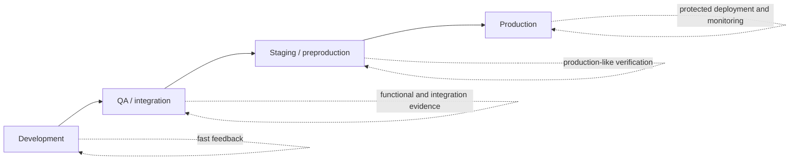
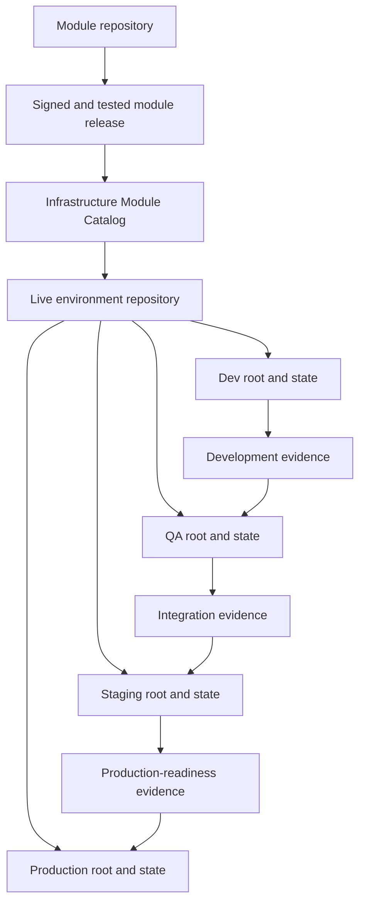
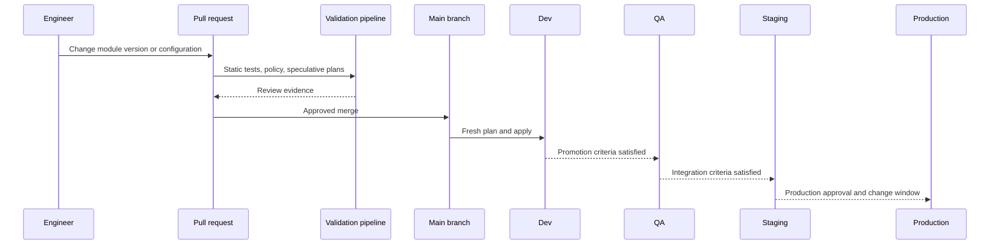
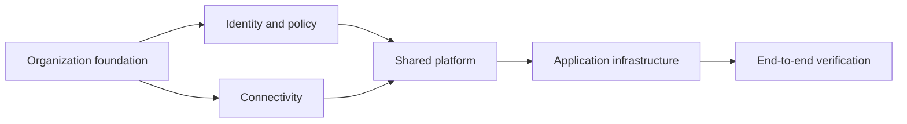

# Terraform 多环境 DevOps 和生产实践

## 目的

本文档定义了跨开发、QA、暂存和生产环境操作 Terraform 的成熟实践。它扩展了企业基础设施即仓库结构、可复用模块、状态管理、接口、测试、提供程序、版本控制和目录治理的代码标准。

目标是在环境中实现基础设施变更，无需复制可变代码、重用生产凭证、共享状态或依赖手动 Terraform 执行。

目标结果是一个受控交付系统，其中：

- 每个环境都有明确的状态边界、身份、批准路径和配置集。
- 可复用模块被版本控制并作为不可变的制品进行升级。
- 计划是从不可变的来源生成的，并在应用前进行审查。
- 生产应用使用受保护的工作负载身份和序列化流水线。
- GitHub Actions 或 Azure DevOps 实现相同的控制模型，即使语法不同。
- 漂移、紧急更改、失败应用、状态恢复和回滚限制是可操作定义的。

## 规范语言

术语 **MUST**、**MUST NOT**、**SHOULD**、**SHOULD NOT** 和 **MAY** 是规范性的。

- **MUST / MUST NOT**：强制控制。例外情况需要书面批准和到期日期。
- **SHOULD / SHOULD NOT**：预期做法。偏差需要技术理由。
- **MAY**：根据工作负载和监管要求选择的可选实践。

## 环境模型

环境是受管控的部署边界。它不仅仅是分支、变量文件、Terraform 工作区、资源组、账户或订阅。

每个环境 MUST 定义：

|关注|所需定义 |
|---|---|
|云范围 |订阅、账户、项目、租户、隔间和区域 |
|状态|后端、密钥或工作区、锁定、恢复和访问策略 |
|身份 |规划身份、应用身份、权限和联合信任 |
|配置|批准的非机密值和外部机密参考 |
|晋级|准入标准、审批策略和证据要求 |
|运营|所有者、支持路径、更改窗口、监控和恢复过程 |
|合规|数据分类、驻留、策略基线和证据保留 |

典型的生命周期是：

### 发展

开发验证模块使用、配置和普通更改。它可能使用成本较低的服务层，但它 SHOULD 保留生产中使用的相同身份、网络、策略、日志记录和状态管理模式。

当爆炸半径有限并且自动化测试通过时，开发 MAY 在合并后自动部署。

### 质量检查

QA 验证集成平台行为和应用依赖性。 SHOULD 包括实时基础设施测试、策略检查、身份测试、DNS 和网络验证以及应用的破坏性清理测试。

QA MUST 具有独立于开发的状态和证书。

### 分期

暂存是生产就绪环境。除非存在记录在案的成本或容量异常，否则其拓扑 SHOULD 在实质上等同于生产。

分阶段验证 SHOULD 包括：

- 用于生产的确切模块版本。
- 用于生产的 Provider 和 Terraform 版本。
- 类似生产的身份和网络控制。
- 针对现有状态的升级行为。
- 监控、备份、恢复和操作手册。
- 变更窗口持续时间和预期计划影响。

### 生产

生产需要最强有力的隔离和证据。生产应用 MUST 使用受保护的流水线、短期工作负载身份、显式批准、序列化状态访问和部署后验证。

作为正常操作实践，禁止从工程师工作站直接进行生产。

## 推荐企业运营模式

默认的企业模式是：

1. 可复用模块是使用语义版本从模块仓库中发布的。
2. 实时基础设施仓库包含已部署环境的根模块。
3. 每个环境根都有一个单独的远程状态密钥或执行平台工作空间。
4.非保密环境配置受版本控制。
5. 机密和云凭证通过工作负载身份和批准的机密服务提供。
6. 拉取请求产生验证和推测计划。
7. 合并后，部署流水线从不可变的合并提交生成一个新保存的计划。
8. 保存的计划经环境保护工作批准并应用。
9. 晋级更改模块版本或批准的配置；它不会在分支之间复制编辑后的 Terraform 文件。

## 参考仓库拓扑

### 首选：每个环境的显式根目录
```text
platform-infra-live/
├── README.md
├── CODEOWNERS
├── .github/
│   └── workflows/
├── .azuredevops/
│   ├── pipelines/
│   └── templates/
├── policies/
├── scripts/
├── azure/
│   └── application-platform/
│       ├── dev/
│       ├── qa/
│       ├── staging/
│       └── prod/
├── aws/
│   └── application-platform/
│       ├── dev/
│       ├── qa/
│       ├── staging/
│       └── prod/
├── gcp/
│   └── application-platform/
│       ├── dev/
│       ├── qa/
│       ├── staging/
│       └── prod/
└── oci/
    └── application-platform/
        ├── dev/
        ├── qa/
        ├── staging/
        └── prod/
```
每个叶子目录都是一个独立的根模块和应用单元：
```text
prod/
├── README.md
├── backend.tf
├── backend.hcl.example
├── versions.tf
├── providers.tf
├── main.tf
├── variables.tf
├── locals.tf
├── outputs.tf
├── checks.tf
├── production.tfvars
├── tests/
└── .terraform.lock.hcl
```
优点：

- 强大的状态、访问和批准隔离。
- 特定于环境的代码差异在审查中可见。
- 生产可以使用不同的所有者并更改策略。
- 一条路径清楚地映射到一个后端和一个工作负载身份。

费用：

- 根模块组合可以复用。
- 版本升级需要跨目录协调拉取请求。
- 团队必须防止出现不受控制的分歧。

重复实现逻辑 MUST 被移动到可复用模块中。根模块 SHOULD 保持薄的组合。

## 支持的环境组织替代方案

没有一种布局适合每个企业。选择 MUST 经过充分论证。

### 替代方案 A：与环境变量文件共享根目录
```text
application-platform/
├── backend/
│   ├── dev.hcl
│   ├── qa.hcl
│   ├── staging.hcl
│   └── prod.hcl
├── env/
│   ├── dev.tfvars
│   ├── qa.tfvars
│   ├── staging.tfvars
│   └── prod.tfvars
├── main.tf
├── variables.tf
├── outputs.tf
└── .terraform.lock.hcl
```
当环境结构相同且差异仅限于类型化配置时，此模式应用。

强制控制：

- 每个环境 MUST 使用不同的后端密钥或执行工作空间。
- 流水线 MUST 通过一个白名单映射绑定环境、后端配置、身份和变量文件。
- 生产变量文件 MUST NOT 可与非生产后端或身份一起使用。
- 环境值 MUST 经过模式验证。
- 条件逻辑 MUST NOT 成长为一组不可读的特定于环境的分支。

映射示例：
```yaml
# deployment-map.yaml
application-platform:
  dev:
    root: application-platform
    backend: backend/dev.hcl
    variables: env/dev.tfvars
    identity: tf-application-dev
  qa:
    root: application-platform
    backend: backend/qa.hcl
    variables: env/qa.tfvars
    identity: tf-application-qa
  staging:
    root: application-platform
    backend: backend/staging.hcl
    variables: env/staging.tfvars
    identity: tf-application-staging
  prod:
    root: application-platform
    backend: backend/prod.hcl
    variables: env/prod.tfvars
    identity: tf-application-prod
```
### 替代方案 B：每个环境的 HCP Terraform 或 Terraform Enterprise 工作区

为每个 Terraform 配置和环境使用一个执行工作区。这可以集中远程执行、策略实施、变量管理、运行历史记录、状态和批准。

推荐关系：
```text
networking-dev
networking-qa
networking-staging
networking-prod
application-platform-dev
application-platform-qa
application-platform-staging
application-platform-prod
```
当企业需要集中式 Terraform 治理并准备将执行平台作为关键服务进行操作时，此模型应用。

工作区命名模型 MUST NOT 隐藏组件所有权或组合不相关的生命周期单元。

### 替代方案 C：每个环境单独的实时仓库

示例：
```text
application-platform-nonprod-live
application-platform-prod-live
```
或者，在严格的监管分离下：
```text
application-platform-dev-live
application-platform-qa-live
application-platform-staging-live
application-platform-prod-live
```
仅当仓库访问、法律边界、数据主权、组织所有权或发布控制存在重大差异时才使用此模式。

风险：

- 代码和流水线模板可能会有所不同。
- 升级成为跨仓库版本更新。
- 策略和依赖升级更难协调。

缓解措施：

- 使用相同的不可变模块版本。
- 使用集中维护的流水线模板。
- 自动执行拉取请求以提升已批准的版本。
- 在模块目录中日志记录环境到版本的清单。

### 替代方案 D：Terraform CLI 工作区

CLI 工作区为同一工作目录维护单独的状态实例。它们 MAY 用于同质临时环境、训练、测试副本或短期预览部署。

当环境需要不同的凭据、后端保留、访问控制、策略或批准路径时，它们 SHOULD NOT 成为生产的默认机制。

生产系统 MUST NOT 取决于操作员手动选择正确的工作空间。

### 决策矩阵

|模式|隔离|代码重复 |治理|推荐用途 |
|---|---:|---:|---:|---|
|每个环境的目录 |高|中等|强|生产系统的默认设置 |
|共享根加环境文件 |受流水线限制时为中到高 |低|只有严格映射才强大 |结构相同的环境|
|每个环境的 HCP Terraform/Enterprise 工作区 |高|低|强大而集中|使用托管或私有 Terraform 执行的企业 |
|每个环境单独的仓库 |非常高|分歧风险高 |强大的访问分离|监管或组织隔离|
| CLI 工作区 |仅状态分离 |低|不同安全模型的弱点|短暂或同构实例 |

## 状态和后端设计

### 所需的状态分离

开发、QA、暂存和生产 MUST NOT 共享一个状态文件。

每个根模块 MUST 映射到一个状态所有者和一个序列化应用路径。

后端键示例：
```text
application-platform/dev.tfstate
application-platform/qa.tfstate
application-platform/staging.tfstate
application-platform/prod.tfstate
```
为了加强隔离，请使用单独的后端存储账户、存储桶、项目、隔间或执行组织进行生产。

### 后端访问模型

|角色 |状态阅读 |状态写 |云计划 |云应用|
|---|---:|---:|---:|---:|
|开发商|通常没有直接生产访问|没有 |通过流水线|没有 |
| PR 验证身份 |需要时请阅读 |除了安全规划行为之外，没有任何状态突变 |是的，以阅读为导向 |没有 |
|环境应用身份|是的 |是的 |是的 |是的，范围为环境 |
|后台管理员|仅限行政|恢复程序下|无隐式云权利 |无隐式云权利 |
|审计员|受控阅读证据 |没有 |没有 |没有 |

在较低环境中规划和应用身份 MAY 是相同的。当执行平台和后端允许实际的最小权限模型时，生产 SHOULD 将它们分开。

### 后端初始化

使用部分后端配置和工作负载身份：
```hcl
terraform {
  backend "azurerm" {}
}
```

```bash
terraform init \
  -backend-config="backend/prod.hcl" \
  -reconfigure \
  -input=false
```
后端文件 MUST NOT 包含长期凭据。后端和提供程序身份验证 SHOULD 使用该平台支持的短期身份链。

### 锁定和并发

- 应用 MUST 使用状态锁定。
- 每个根模块和环境 MUST 设置一个流水线并发组。
- `-lock=false` 禁止用于应用和状态突变。
- 仅当并行计划不改变状态并且明确识别过时的结果时才允许并行计划。
- 强制解锁需要验证原始编写者已终止并需要记录在案的运维操作。

## 配置管理

### 非机密值

环境特定的非机密值 MAY 受版本控制。
```hcl
# env/prod.tfvars
location         = "canadacentral"
environment      = "prod"
service_tier     = "critical"
zone_redundant   = true
public_access    = false
backup_retention = 35
```
### 机密值

机密 MUST NOT 提交到 `.tfvars`、后端文件、工作流程 YAML、流水线变量组或源代码控制配置。

首选模式：

1. 通过工作负载身份消除机密。
2. 通过不可变标识符引用现有机密。
3. 生成机密并将其直接写入 Secret Manager。
4. 在运行时从经批准的机密存储注入一个短期值。

将 Terraform 变量标记为敏感会抑制普通显示，但不会从状态中删除该值。

### 环境平价

平等并不意味着同等规模。这意味着同等的行为和控制。

登台和生产 SHOULD 使用相同的：

- 模块主要版本和次要版本。
- 提供程序主要版本。
- 网络曝光模型。
- 身份模式。
- 加密模型。
- 策略基线。
- 日志记录和告警集成。
- 备份和恢复行为。

允许的差异包括实例数量、容量、保留、性能层和成本控制，前提是这些差异不会使生产就绪测试失效。

## 分支和提升

### 推荐的 Git 模型

使用一根受保护的主线。环境状态和配置由目录、文件或执行工作区表示，而不是长期存在的 Git 分支。

长期存在的环境分支不受欢迎，因为它们隐藏了分歧，并将晋级变成了挑选。

### 晋级单位

提升以下不可变单位之一：

- 模块版本。
- 根仓库提交。
- 容器化的 Terraform 运行器镜像摘要。
- 策略捆绑版本。
- 经批准的配置更改。

请勿通过将已编辑的 `.tf` 文件从一个环境目录复制到另一环境目录来进行升级。

### 晋级策略

### 顺序自动晋级

合并后开发自动部署。测试后进行质量检查和分期。生产暂停以等待批准。

当环境共享频繁的发布节奏和可靠的自动验证时使用。

### 拉取请求晋级

成功的环境部署会创建或更新拉取请求，以更改下一个环境的模块版本或配置。

当需要明确的环境证据和审查时使用。

### 发布清单晋级

签名的清单日志记录批准的模块、提供程序、策略和配置版本。
```yaml
release: platform-2026.08.04.1
components:
  network: 4.6.2
  private-service: 3.2.1
  observability: 2.8.0
terraform: 1.15.8
policy_bundle: 5.4.0
```
应用于多个根模块必须使用同一组经过测试的发布版本的大型平台。该清单并不意味着一种共享状态或一种原子多根应用。

## 流水线控制模型

每个流水线实现 MUST 保留以下逻辑阶段：

```mermaid
flowchart LR
    A[Checkout immutable commit] --> B[Toolchain verification]
    B --> C[Format, validate, lint, test]
    C --> D[Security and policy checks]
    D --> E[Initialize selected backend]
    E --> F[Scope and identity verification]
    F --> G[Create saved plan]
    G --> H[Plan classification and review]
    H --> I[Protected environment approval]
    I --> J[Apply exact saved plan]
    J --> K[Post-apply verification]
    K --> L[Evidence retention and drift schedule]
```

### 拉取请求流水线

拉取请求流水线 SHOULD 包含以下阶段：

- 尽可能在没有后端的情况下运行格式化、初始化、验证、linting、测试、安全扫描、策略检查和文档检查。
- 为受影响的根部制定推测计划。
- 对创建、更改、替换、删除、IAM 更改、网络暴露、加密更改和策略例外进行分类。
- 将简洁的计划摘要发布到拉取请求，而不暴露敏感值。
- 切勿将不受信任的拉取请求代码应用于生产。
- 使用受限制的凭据或不使用云凭据来进行分叉贡献。

### 合并后部署流水线

合并后部署流水线 MUST 满足以下要求：

- 检查确切的不可变合并提交。
- 重新初始化正确的环境后端。
- 验证云账户、订阅、项目、租户、区域和主体。
- 生成新保存的计划。
- 将计划制品作为敏感信息进行保护。
- 批准后应用确切保存的计划。
- 拒绝过期、修改或环境不匹配的计划。

Pull-Request 计划是审查证据；它不一定是生产应用制品。 PR 验证和合并之间的状态可能会发生变化。受保护的部署流水线 SHOULD 在合并后重新生成计划并获取对该计划的批准。

### 计划制品控制

保存的计划可以包含敏感值并耦合到：

- 配置提交。
- Terraform 和提供程序版本。
- 变量值。
- 计划时的后端状态。
- 提供程序凭证和已解析的 API 数据。

流水线 MUST 至少记录：
```text
commit SHA
root path
environment
backend identifier
state lineage and serial when obtainable
Terraform version
provider lock-file checksum
variable-file checksum
plan checksum
creation time
approval identity
```
计划的保留时间 SHOULD 较短。过时的计划 MUST 被废弃并重新生成。

## GitHub Actions 实施

### GitHub 控件映射

|Terraform 控制| GitHub Actions 实施 |
|---|---|
|受保护的主线|分支机构保护和必要的检查|
|环境审批 |独立的`<environment>-plan`和受保护的应用环境；应用时所需的审阅者和部署保护 |
|短暂的云身份| GitHub OIDC 与 `id-token: write` |
|串行应用| `concurrency` 由 root 和环境键入 |
|共享流水线逻辑 |固定到不可变引用的可复用工作流程|
|计划证据|受保护的工作流程制品和作业摘要 |
|最小令牌权利 |显式 `permissions` 块 |
|生产机密|仅当身份无法消除环境范围的机密时才使用它们 |

### 仓库工作流程示例

以下示例使用 Azure OIDC 进行身份验证。AWS、GCP 和 OCI 应使用其等效的 federation Action 或经批准的凭证引导程序。截至文档日期，Terraform 1.15.8 和主要 Action 标签是说明性的；企业支持矩阵是权威的，受保护的工作流程 SHOULD 将 Action 固定到已审核的提交 SHA。
```yaml
name: terraform-deploy

on:
  pull_request:
    branches: [main]
    paths:
      - "azure/application-platform/**"
      - ".github/workflows/terraform-deploy.yml"
  push:
    branches: [main]
    paths:
      - "azure/application-platform/**"
      - ".github/workflows/terraform-deploy.yml"
  workflow_dispatch:
    inputs:
      environment:
        description: Environment to deploy
        required: true
        type: choice
        options: [dev, qa, staging, prod]

permissions:
  contents: read

jobs:
  validate:
    runs-on: ubuntu-latest
    permissions:
      contents: read
    steps:
      - uses: actions/checkout@v4
      - uses: hashicorp/setup-terraform@v3
        with:
          terraform_version: "1.15.8"
          terraform_wrapper: false
      - name: Format
        run: terraform fmt -check -recursive
      - name: Validate roots
        shell: bash
        run: |
          set -euo pipefail
          for dir in azure/application-platform/{dev,qa,staging,prod}; do
            terraform -chdir="$dir" init -backend=false -input=false
            terraform -chdir="$dir" validate
            terraform -chdir="$dir" test
          done

  plan:
    if: github.event_name != 'pull_request' || github.event.pull_request.head.repo.fork == false
    needs: validate
    runs-on: ubuntu-latest
    environment: ${{ format('{0}-plan', inputs.environment || 'dev') }}
    concurrency:
      group: terraform-${{ inputs.environment || 'dev' }}-application-platform
      cancel-in-progress: false
    permissions:
      contents: read
      id-token: write
    env:
      TF_IN_AUTOMATION: "true"
      TF_INPUT: "false"
      ENVIRONMENT: ${{ inputs.environment || 'dev' }}
    steps:
      - uses: actions/checkout@v4
      - uses: hashicorp/setup-terraform@v3
        with:
          terraform_version: "1.15.8"
          terraform_wrapper: false
      - name: Azure login with OIDC
        uses: azure/login@v2
        with:
          client-id: ${{ vars.AZURE_CLIENT_ID }}
          tenant-id: ${{ vars.AZURE_TENANT_ID }}
          subscription-id: ${{ vars.AZURE_SUBSCRIPTION_ID }}
      - name: Verify execution scope
        shell: bash
        run: |
          set -euo pipefail
          actual_subscription="$(az account show --query id -o tsv)"
          test "$actual_subscription" = "${{ vars.AZURE_SUBSCRIPTION_ID }}"
          az account show --query '{subscription:id,tenant:tenantId,user:user.name}' -o json
      - name: Initialize and plan
        shell: bash
        run: |
          set -euo pipefail
          root="azure/application-platform/${ENVIRONMENT}"
          terraform -chdir="$root" init -input=false -reconfigure
          terraform -chdir="$root" plan \
            -input=false \
            -lock-timeout=10m \
            -out=tfplan
          terraform -chdir="$root" show -json tfplan > "$root/tfplan.json"
          (cd "$root" && sha256sum tfplan .terraform.lock.hcl > plan-manifest.sha256)
      - name: Upload protected plan artifact
        uses: actions/upload-artifact@v4
        with:
          name: tfplan-${{ env.ENVIRONMENT }}-${{ github.sha }}
          path: |
            azure/application-platform/${{ env.ENVIRONMENT }}/tfplan
            azure/application-platform/${{ env.ENVIRONMENT }}/tfplan.json
            azure/application-platform/${{ env.ENVIRONMENT }}/plan-manifest.sha256
            azure/application-platform/${{ env.ENVIRONMENT }}/.terraform.lock.hcl
          retention-days: 3
          if-no-files-found: error

  apply:
    if: github.event_name != 'pull_request'
    needs: plan
    runs-on: ubuntu-latest
    environment: ${{ inputs.environment || 'dev' }}
    concurrency:
      group: terraform-${{ inputs.environment || 'dev' }}-application-platform
      cancel-in-progress: false
    permissions:
      contents: read
      id-token: write
      actions: read
    env:
      TF_IN_AUTOMATION: "true"
      TF_INPUT: "false"
      ENVIRONMENT: ${{ inputs.environment || 'dev' }}
    steps:
      - uses: actions/checkout@v4
      - uses: hashicorp/setup-terraform@v3
        with:
          terraform_version: "1.15.8"
          terraform_wrapper: false
      - name: Azure login with OIDC
        uses: azure/login@v2
        with:
          client-id: ${{ vars.AZURE_CLIENT_ID }}
          tenant-id: ${{ vars.AZURE_TENANT_ID }}
          subscription-id: ${{ vars.AZURE_SUBSCRIPTION_ID }}
      - uses: actions/download-artifact@v4
        with:
          name: tfplan-${{ env.ENVIRONMENT }}-${{ github.sha }}
          path: azure/application-platform/${{ env.ENVIRONMENT }}
      - name: Verify and apply reviewed plan
        shell: bash
        run: |
          set -euo pipefail
          root="azure/application-platform/${ENVIRONMENT}"
          (cd "$root" && sha256sum -c plan-manifest.sha256)
          terraform -chdir="$root" init -input=false -reconfigure
          terraform -chdir="$root" apply \
            -input=false \
            -lock-timeout=10m \
            tfplan
      - name: Post-apply verification
        shell: bash
        run: ./scripts/verify-environment.sh "$ENVIRONMENT"
```
### GitHub 工作流程强化

- 将第三方 Action 固定到受保护仓库中经过审查的不可变提交 SHA。版本标签可读但可变，除非发布者保证不变性。
- 设置明确的工作流程权限；不要依赖广泛的默认值。
- 按仓库、分支或环境、工作流身份和受众限制 OIDC 信任策略。
- 将订阅、账户、项目、租户和区域标识符存储为非机密环境变量，并在计划前对其进行验证。
- 要求生产环境审核人员无法修改正在批准的工作流程。
- 防止不受信任的拉取请求接收云凭据或环境机密。
- 使用可复用工作流程实现标准行为，但将调用的工作流程固定到不可变版本。
- 不要将自托管运行器用于不受信任的拉取请求。生产自托管运行器 SHOULD 是短暂的、隔离的、修补的，并且防止保留状态或凭据。

### GitHub 晋级设计

成熟的设计将部署编排与 Terraform 执行分开：
```text
terraform-ci.yml                 # PR validation and speculative plan
terraform-deploy.yml             # one protected environment deployment
promote-release.yml              # promotes approved version/config to next environment
.github/workflows/reusable/
  terraform-plan-apply.yml       # centrally governed execution logic
```
对于生产，手动调用部署或从签名的发布事件调用部署，并将作业绑定到 `prod` GitHub 环境。

## Azure DevOps Pipelines 实施

### Azure DevOps 控制映射

|Terraform 控制| Azure DevOps 实施 |
|---|---|
|受保护的来源|分支策略和所需的构建验证 |
|短暂的 Azure 身份|使用工作负载身份联合的 Azure Resource Manager 服务连接 |
|环境审批 | Azure Pipelines 环境批准和检查 |
|串行应用|独占锁检查或流水线/环境并发策略 |
|共享流水线逻辑 |受保护仓库中的版本化 YAML 模板 |
|计划证据|保留受限的流水线制品 |
|范围限制 |服务连接授权和环境特定身份|
|机密检索| Key Vault 集成或工作负载身份，而不是静态流水线变量 |

### 推荐的 Azure DevOps 文件结构
```text
.azuredevops/
├── pipelines/
│   └── terraform-platform.yml
└── templates/
    ├── terraform-validate.yml
    ├── terraform-plan.yml
    └── terraform-apply.yml
```
### 验证模板

Azure DevOps 示例假定已批准的代理镜像已安装 Terraform CLI 1.15.8 和 Azure CLI。企业 SHOULD 发布并扫描版本化的运行器镜像，或使用集中管理的安装程序来验证官方校验和。该版本仍然受企业支持矩阵的约束。
```yaml
# .azuredevops/templates/terraform-validate.yml
parameters:
  - name: roots
    type: object

steps:
  - checkout: self
    clean: true
    fetchDepth: 1

  - bash: |
      set -euo pipefail
      terraform version
      terraform fmt -check -recursive
      for root in $ROOTS; do
        terraform -chdir="$root" init -backend=false -input=false
        terraform -chdir="$root" validate
        terraform -chdir="$root" test
      done
    displayName: Validate Terraform roots
    env:
      TF_IN_AUTOMATION: "true"
      TF_INPUT: "false"
      ROOTS: ${{ join(' ', parameters.roots) }}
```
### 计划模板
```yaml
# .azuredevops/templates/terraform-plan.yml
parameters:
  - name: environment
    type: string
  - name: root
    type: string
  - name: serviceConnection
    type: string
  - name: expectedSubscriptionId
    type: string

jobs:
  - job: Plan
    displayName: Plan ${{ parameters.environment }}
    pool:
      vmImage: ubuntu-latest
    variables:
      TF_IN_AUTOMATION: "true"
      TF_INPUT: "false"
    steps:
      - checkout: self
        clean: true
        fetchDepth: 1

      - task: AzureCLI@2
        displayName: Verify scope and create plan
        inputs:
          azureSubscription: ${{ parameters.serviceConnection }}
          scriptType: bash
          scriptLocation: inlineScript
          addSpnToEnvironment: true
          inlineScript: |
            set -euo pipefail
            actual_subscription="$(az account show --query id -o tsv)"
            test "$actual_subscription" = "${{ parameters.expectedSubscriptionId }}"
            az account show --query '{subscription:id,tenant:tenantId,user:user.name}' -o json

            terraform -chdir="${{ parameters.root }}" init \
              -input=false \
              -reconfigure

            terraform -chdir="${{ parameters.root }}" plan \
              -input=false \
              -lock-timeout=10m \
              -out=tfplan

            terraform -chdir="${{ parameters.root }}" show -json tfplan \
              > "${{ parameters.root }}/tfplan.json"

            (cd "${{ parameters.root }}" && \
              sha256sum tfplan .terraform.lock.hcl > plan-manifest.sha256)

            artifact_dir="$(Build.ArtifactStagingDirectory)/tfplan-${{ parameters.environment }}"
            mkdir -p "$artifact_dir"
            cp "${{ parameters.root }}/tfplan" "$artifact_dir/"
            cp "${{ parameters.root }}/tfplan.json" "$artifact_dir/"
            cp "${{ parameters.root }}/plan-manifest.sha256" "$artifact_dir/"
            cp "${{ parameters.root }}/.terraform.lock.hcl" "$artifact_dir/"

      - publish: $(Build.ArtifactStagingDirectory)/tfplan-${{ parameters.environment }}
        artifact: tfplan-${{ parameters.environment }}-$(Build.SourceVersion)
        displayName: Publish protected plan
```
Azure 服务连接 SHOULD 使用工作负载身份联合。Terraform 的 AzureRM 后端和提供程序可以使用已批准的任务或通过显式配置的环境变量桥公开的联合 Azure 身份。MUST 使用选定的 Terraform 和提供程序版本测试确切的引导流程。

### 应用模板
```yaml
# .azuredevops/templates/terraform-apply.yml
parameters:
  - name: environment
    type: string
  - name: root
    type: string
  - name: serviceConnection
    type: string
  - name: expectedSubscriptionId
    type: string

jobs:
  - deployment: Apply
    displayName: Apply ${{ parameters.environment }}
    environment: terraform-${{ parameters.environment }}
    strategy:
      runOnce:
        deploy:
          steps:
            - checkout: self
              clean: true
              fetchDepth: 1

            - download: current
              artifact: tfplan-${{ parameters.environment }}-$(Build.SourceVersion)

            - task: AzureCLI@2
              displayName: Verify and apply reviewed plan
              inputs:
                azureSubscription: ${{ parameters.serviceConnection }}
                scriptType: bash
                scriptLocation: inlineScript
                addSpnToEnvironment: true
                inlineScript: |
                  set -euo pipefail
                  actual_subscription="$(az account show --query id -o tsv)"
                  test "$actual_subscription" = "${{ parameters.expectedSubscriptionId }}"

                  artifact="$(Pipeline.Workspace)/tfplan-${{ parameters.environment }}-$(Build.SourceVersion)"
                  cp "$artifact/tfplan" "${{ parameters.root }}/tfplan"
                  cp "$artifact/plan-manifest.sha256" "${{ parameters.root }}/plan-manifest.sha256"

                  cd "${{ parameters.root }}"
                  sha256sum -c plan-manifest.sha256
                  terraform init -input=false -reconfigure
                  terraform apply \
                    -input=false \
                    -lock-timeout=10m \
                    tfplan

                  "$(Build.SourcesDirectory)/scripts/verify-environment.sh" \
                    "${{ parameters.environment }}"
```
### 主要 Azure DevOps 流水线
```yaml
# .azuredevops/pipelines/terraform-platform.yml
trigger:
  branches:
    include: [main]
  paths:
    include:
      - azure/application-platform/*
      - .azuredevops/*

pr:
  branches:
    include: [main]
  paths:
    include:
      - azure/application-platform/*
      - .azuredevops/*

lockBehavior: sequential

stages:
  - stage: Validate
    jobs:
      - job: Validate
        pool:
          vmImage: ubuntu-latest
        steps:
          - template: ../templates/terraform-validate.yml
            parameters:
              roots:
                - azure/application-platform/dev
                - azure/application-platform/qa
                - azure/application-platform/staging
                - azure/application-platform/prod

  - stage: PlanDev
    dependsOn: Validate
    condition: and(succeeded(), ne(variables['Build.Reason'], 'PullRequest'))
    jobs:
      - template: ../templates/terraform-plan.yml
        parameters:
          environment: dev
          root: azure/application-platform/dev
          serviceConnection: sc-terraform-dev-plan-wif
          expectedSubscriptionId: 00000000-0000-0000-0000-000000000001

  - stage: ApplyDev
    dependsOn: PlanDev
    jobs:
      - template: ../templates/terraform-apply.yml
        parameters:
          environment: dev
          root: azure/application-platform/dev
          serviceConnection: sc-terraform-dev-apply-wif
          expectedSubscriptionId: 00000000-0000-0000-0000-000000000001

  - stage: PlanQA
    dependsOn: ApplyDev
    jobs:
      - template: ../templates/terraform-plan.yml
        parameters:
          environment: qa
          root: azure/application-platform/qa
          serviceConnection: sc-terraform-qa-plan-wif
          expectedSubscriptionId: 00000000-0000-0000-0000-000000000002

  - stage: ApplyQA
    dependsOn: PlanQA
    jobs:
      - template: ../templates/terraform-apply.yml
        parameters:
          environment: qa
          root: azure/application-platform/qa
          serviceConnection: sc-terraform-qa-apply-wif
          expectedSubscriptionId: 00000000-0000-0000-0000-000000000002

  - stage: PlanStaging
    dependsOn: ApplyQA
    jobs:
      - template: ../templates/terraform-plan.yml
        parameters:
          environment: staging
          root: azure/application-platform/staging
          serviceConnection: sc-terraform-staging-plan-wif
          expectedSubscriptionId: 00000000-0000-0000-0000-000000000003

  - stage: ApplyStaging
    dependsOn: PlanStaging
    jobs:
      - template: ../templates/terraform-apply.yml
        parameters:
          environment: staging
          root: azure/application-platform/staging
          serviceConnection: sc-terraform-staging-apply-wif
          expectedSubscriptionId: 00000000-0000-0000-0000-000000000003

  - stage: PlanProd
    dependsOn: ApplyStaging
    jobs:
      - template: ../templates/terraform-plan.yml
        parameters:
          environment: prod
          root: azure/application-platform/prod
          serviceConnection: sc-terraform-prod-plan-wif
          expectedSubscriptionId: 00000000-0000-0000-0000-000000000004

  - stage: ApplyProd
    dependsOn: PlanProd
    jobs:
      - template: ../templates/terraform-apply.yml
        parameters:
          environment: prod
          root: azure/application-platform/prod
          serviceConnection: sc-terraform-prod-apply-wif
          expectedSubscriptionId: 00000000-0000-0000-0000-000000000004
```
`terraform-prod` Azure Pipelines 环境 MUST 具有独占锁定检查和在 YAML 外部配置的适当批准。生产服务连接 SHOULD 还强制执行批准和所需模板检查，因此不能通过编辑或创建另一个流水线来绕过使用生产身份的授权。生产保护 MUST 不仅仅依赖于可编辑的流水线代码。

### Azure DevOps 强化

- 使用不同的计划并为每个环境或权限边界应用工作负载身份联合服务连接。计划标识 SHOULD 是面向读取的；应用身份仅接收该根所需的写入权限。
- 不要向所有流水线授予服务连接。明确授权批准的流水线。
- 在 Terraform 仓库和共享模板仓库上启用分支策略、所需的审阅者和构建验证。
- 使用流水线环境进行审批、工作时间、变更管理集成和独占锁定。
- 将作业授权范围限制为当前项目，除非明确需要跨项目访问。
- 保护变量组和 Key Vault 引用。优先考虑身份而不是机密变量。
- 仅当私有连接需要时才使用自托管代理。生产代理 SHOULD 是短暂的并分配到受保护的池。
- 工作前后清洁工作空间。状态、计划、凭证、`.terraform` 和云 CLI 缓存 MUST NOT 在租户或信任区域之间保留。

## 多云身份验证模式

CI/CD 控制模型是云中立的。身份验证实现是特定于提供程序的。

|云| GitHub Actions 首选模式 | Azure DevOps 首选模式 |
|---|---|---|
|Azure| GitHub OIDC 到 Microsoft Entra 联合凭据 |与工作负载身份联合的 Azure Resource Manager 服务连接 |
|AWS | GitHub OIDC 到狭窄范围的 IAM 角色 |联合代理或经批准的短期角色承担集成；避免存储访问密钥 |
| GCP | GitHub OIDC 到工作负载身份联合和服务账户模拟 |经批准的联邦代理或短期凭证集成；避免使用服务账户 JSON 键 |
|OCI |批准的 OIDC/联合模式（如果可用），或使用资源/实例主体的隔离运行器 |独立运行器或批准联盟的资源/实例主体；避免提交 API 密钥 |

每个流水线 MUST 在规划或应用之前验证已解析的主体、云范围和区域。

禁止在所有云和环境中使用一种通用的高特权身份。

## 按环境进行测试和质量控制

|控制|拉取请求 |开发|质量保证 |分期|生产|
|---|---:|---:|---:|---:|---:|
|格式化、初始化、验证 |必填 |必填 |必填 |必填 |必填 |
|单元和契约测试|必填 |必填 |必填 |必填 |必填 |
|安全和策略扫描|必填 |必填 |必填 |必填 |必填 |
|投机计划|必填 |必填 |必填 |必填 |必填 |
|实时集成测试|选择性|必填 |必填 |必填 |部署后 |
|当前版本升级测试 |基于风险|推荐|必填 |必填 |使用情况证据|
|成本估算或预算检查 |推荐|必填 |必填 |必填 |必填 |
|人工审批|没有 |可选|基于风险|推荐|必填 |
|应用后功能验证 |没有 |必填 |必填 |必填 |必填 |
|漂移检测|没有 |预定 |预定 |预定 |已安排并发出告警 |

成功的 `terraform apply` 并不足以作为验收证据。验证 MUST 测试预期行为，例如私有 DNS 解析、拒绝公共访问、工作负载身份权限、记录交付、策略合规性、备份注册和服务运行状况。

## 策略、安全和成本控制

### 强制计划分类

流水线 SHOULD 解析计划 JSON 和标志：

- 资源创建、更新、替换和删除。
- IAM 角色、策略、组、分配和权限更改。
- 公共 IP、防火墙、入口、路由和私有端点更改。
- 加密、密钥、证书和机密存储更改。
- 日志、监控、备份和保留更改。
- 地区、驻留、SKU 和容量变化。
- 策略豁免和生命周期被忽略。
- 巨大的或意外的成本变化。

包含未记录的替换的技术上有效的计划尚未做好生产准备。

### 破坏性改变

破坏性行为 MUST 单独突出显示。高风险删除或替换 SHOULD 要求更高的批准和恢复计划。

销毁工作流程 MUST 与普通应用工作流程分开，除非明确授权，否则禁用生产。

### 供应链控制

- Terraform、提供程序、模块、操作、任务、运行器镜像和策略包 MUST 受版本限制。
- 根模块 MUST 提交 `.terraform.lock.hcl`。
- 共享工作流程和 YAML 模板 MUST 纳入版本控制并受到保护。
- 提供程序和模块源 SHOULD 仅限于批准的注册中心或镜像。
- 流水线制品 MUST 包括链接源提交、工具版本和校验和的来源证明。

## 部署顺序和跨状态依赖

不要仅仅为了获取部署顺序而将不相关的基础设施置于一种状态。

首选依赖交换：

1. DNS、参数存储、配置服务、服务目录或云原生发现。
2. 限定范围的输出 API 或批准的流水线制品。
3. 等待上游运行状况的受控编排。
4. `terraform_remote_state` 仅在安全审查后才能使用，因为它通常授予对完整上游状态快照的访问权限。

对于多个根，请使用具有显式依赖顺序的编排流水线：

失败的下游部署 MUST NOT 触发稳定上游基础设施的自动破坏性回滚。

## 处理失败的应用

部分修改基础设施后，Terraform 应用可能会失败。正确的应对措施是和解，而不是盲目回滚。

程序：

1. 停止对受影响状态执行并发应用。
2. 保留流水线日志、已保存计划、当前状态版本和云活动日志。
3. 确定哪些资源更改成功。
4. 纠正身份验证、配额、策略、依赖项、提供程序或配置失败。
5. 根据当前配置和状态生成新计划。
6. 检查意外删除、替换或重复的资源。
7. 应用最小的安全前向修正。
8. 运行部署后验证。
9. 记录事件并更新测试或控制。

在状态或实际云环境发生变化后重新应用旧计划是不安全的。

## 回滚和恢复

Terraform 回滚并不等同于应用回滚。

### 配置回滚

仅当云操作可逆并且旧配置仍然与当前状态和提供程序架构兼容时，恢复 Git 提交和应用才能反转声明性设置。

### 模块降级

当新版本更改资源地址、创建新对象、迁移数据、轮换凭证或需要更新的提供程序状态模式时，模块降级 MAY 是不安全的。

首选前向修复，除非模块发布说明明确支持降级。

### 状态恢复

状态恢复 MUST 遵循状态管理流程：

- 停止应用。
- 保留当前状态和日志。
- 仅在与实际云环境进行比较后才恢复已知的有效状态版本。
- 根据需要运行仅刷新计划和正常计划。
- 不要假设恢复旧状态会恢复基础设施。

### 应用回滚协调

基础设施和应用部署系统 SHOULD 发布兼容的版本元数据。应用回滚 MUST 不假设数据库、身份、网络或托管服务更改是可逆的。

## 漂移和带外变化

每个生产根 MUST 有预定的漂移检测或等效的托管服务。

漂移 MUST 分类为：

- 授权紧急变更。
- 未经授权的手动更改。
- 预期的外部控制器所有权。
- 提供程序标准化。
- 云平台行为。
- Terraform 配置缺陷。

配置 MUST 是以下之一：

- 将更改协调为代码。
- 通过 Terraform 恢复云更改。
- 重新设计所有权。
- 添加范围狭窄的生命周期忽略，包含所有者和审核日期。
- 升级为安全或运营事件。

禁止广泛的 `ignore_changes = all` 作为漂移策略。

## 紧急生产变更

紧急更改 MAY 绕过普通时序但 MUST NOT 擦除治理。

最低程序：

1. 宣布事件或紧急变更。
2. 确定生产状态所有者。
3. 停止竞争应用流水线。
4. 更喜欢快速的 Terraform 更改和受保护的流水线。
5. 当控制台或直接 API 更改不可避免时，准确记录变更和操作员。
6、稳定服务。
7. 立即协调配置和状态。
8. 运行完整的计划和验证。
9. 完成复盘并修复控制项。

紧急情况并不能成为永久不受管理的基础设施的理由。

## 临时和预览环境

临时环境对于模块集成、拉取请求预览和破坏性测试非常有用。

要求：

- 使用专用的非生产账户、订阅、项目或隔间。
- 从有界标识符生成稳定的唯一名称。
- 应用配额、预算、TTL 元数据和自动清理。
- 每个预览实例使用单独的状态。
- 请勿泄露生产数据、机密、DNS 区域或身份。
- 验证销毁并检测泄漏的资源。
- 不要为不受信任的分叉代码提供特权云身份。

当身份和后端已经限制在短暂范围内时，CLI 工作区 MAY 在这里是可以接受的。

## 操作证据和审计

对于每个生产部署，保留：

- 源提交和拉取请求。
- 审查和批准身份。
- 模块、Terraform、提供程序、策略、工作流程和运行器版本。
- 根路径、环境、后端标识符和云范围。
- 计划摘要和受保护的已保存计划校验和。
- 策略、安全性、成本和测试结果。
- 应用日志和部署后验证。
- 变更记录或发布标识符。
- 例外情况和到期日期。

不要保留敏感计划 JSON 或状态超过所需时间。证据系统 SHOULD 存储经过净化的摘要和不可变的来源，而不是不受限制的状态副本。

## 环境准备清单

### 发展

- 存在专用状态和身份。
- 自动部署是有界且可监控的。
- 可复用的模块是版本固定的。
- 集成测试和清理运行。
- 预算和 TTL 控制可防止资源泄漏。

### 质量检查

- 状态和身份与发展是分开的。
- 运行功能、策略、网络和身份测试。
- 测试阴性对照。
- 升级测试涵盖预期的发布路径。

### 分期

- 拓扑和控制与生产类似。
- 部署精确的生产候选版本。
- 备份、监控、事件和恢复程序经过验证。
- 预计计划持续时间和运营影响已知。
- 记录生产回滚限制。

### 生产

- 受保护的工作负载身份和环境批准处于活动状态。
- 验证后端、锁定、版本控制、访问日志记录和恢复。
- 应用被序列化并使用批准的保存计划。
- 范围验证成功。
- 破坏性的和特权的改变受到更高的审查。
- 部署后检查、偏差监控和证据保留均正常运行。

## 反模式

- 开发、QA、登台和生产共享一个状态文件。
- 应用于所有环境的一个高度特权的服务主体或云密钥。
- 仅通过手动输入的变量选择生产。
- 长期存在的环境分支具有不受控制的分歧。
- 升级期间在环境文件夹之间复制 Terraform 代码。
- 在状态或来源更改后应用拉取请求计划。
- 从笔记本电脑运行生产应用。
- 当联合可用时，将云凭据保存在 GitHub 机密或 Azure DevOps 变量中。
- 将 CLI 工作区视为完全的生产隔离。
- 自动批准生产，因为较低的环境成功了。
- 重新运行失败的应用而不检查部分更改。
- 通过应用旧计划自动回滚基础设施。
- 允许生产运行器保留 `.terraform`、状态、计划或云 CLI 凭据。
- 使用 `terraform_remote_state` 作为默认集成机制。
- 通过广泛的生命周期忽略永久漂移抑制。

## 验证

多环境 Terraform 实现在以下情况下符合：

- 开发、质量保证、分期和生产分别管理独立的状态，并明确所有权。
- 环境、后端、身份和变量映射不能任意混合。
- 可复用模块和提供程序选择是不可变的且受版本控制。
- 拉取请求产生验证、策略、安全和计划证据。
- 部署流水线从不可变的合并源重新生成计划。
- 受保护的作业应用确切批准的已保存计划。
- 生产使用短期工作负载身份和外部审批控制。
- 应用按状态序列化。
- 验证部署后行为。
- 记录并测试漂移、紧急更改、失败应用、回滚和状态恢复程序。
- GitHub Actions 或 Azure DevOps 流水线模板进行集中管理和固定。
- 保留生产证据，不会泄露不受限制的状态或机密。

## 实施建议

对于大多数企业，使用以下基准：

1. 每个平台或有界基础设施域一个实时仓库。
2. 每个环境一个根目录和远程状态。
3. 每个环境单独的联合工作负载身份。
4. 通过批准的目录发布可复用的模块。
5、受保护的主枝1个；没有长期存在的环境分支。
6. PR 验证和投机计划。
7. 合并后新保存的计划。
8. 自动开发部署、门控 QA 和分期以及明确批准的生产部署。
9. GitHub 环境或 Azure Pipelines 环境作为外部部署控制边界。
10. 预定的漂移检测和测试状态恢复。

仅当拓扑确实相同并且流水线强制执行不可变的环境映射时，才将共享根与环境文件一起使用。当集中式远程执行和策略证明平台合理时，请使用 HCP Terraform 或 Terraform Enterprise。仅将单独的仓库用于实际访问或监管分离。将 CLI 工作区限制为同类或临时实例。

## 相关主题

- [可复用 Terraform 模块工程](iac-engineering-reusable-terraform-modules.md)
- [环境配置与状态管理](iac-environment-configuration-and-state-management.md)
- [Terraform 仓库和模块结构](iac-terraform-repository-and-module-structure.md)

## 参考文档

- [Terraform CLI 工作区](https://developer.hashicorp.com/terraform/cli/workspaces)
- [Terraform 工作空间限制](https://developer.hashicorp.com/terraform/language/state/workspaces)
- [Terraform 自动化指导](https://developer.hashicorp.com/terraform/tutorials/automation/automate-terraform)
- [Terraform 应用并保存计划](https://developer.hashicorp.com/terraform/cli/commands/apply)
- [Terraform 规划命令](https://developer.hashicorp.com/terraform/cli/commands/plan)
- [Terraform JSON 计划格式](https://developer.hashicorp.com/terraform/internals/json-format)
- [Terraform 依赖项锁定文件和提供程序版本控制](https://developer.hashicorp.com/terraform/tutorials/configuration-language/provider-versioning)
- [HCP Terraform 推荐工作空间模型](https://developer.hashicorp.com/terraform/cloud-docs/recommended-practices/part1)
- [GitHub Actions OpenID 连接](https://docs.github.com/en/actions/concepts/security/openid-connect)
- [GitHub Actions 安全使用参考](https://docs.github.com/en/actions/reference/security/secure-use)
- [具有可复用工作流程的 GitHub OIDC](https://docs.github.com/actions/deployment/security-hardening-your-deployments/using-openid-connect-with-reusable-workflows)
- [Azure DevOps 工作负载联邦身份验证服务连接](https://learn.microsoft.com/azure/devops/pipelines/release/configure-workload-identity)
- [Azure DevOps 流水线安全](https://learn.microsoft.com/azure/devops/pipelines/security/overview)
- [Azure DevOps Terraform OIDC CI/CD 示例](https://learn.microsoft.com/samples/azure-samples/azure-devops-terraform-oidc-ci-cd/azure-devops-terraform-oidc-ci-cd/)
