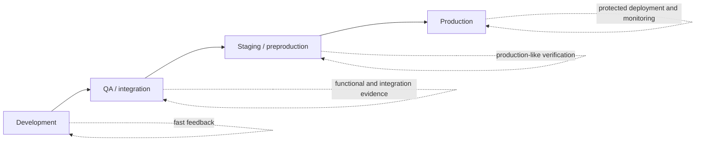
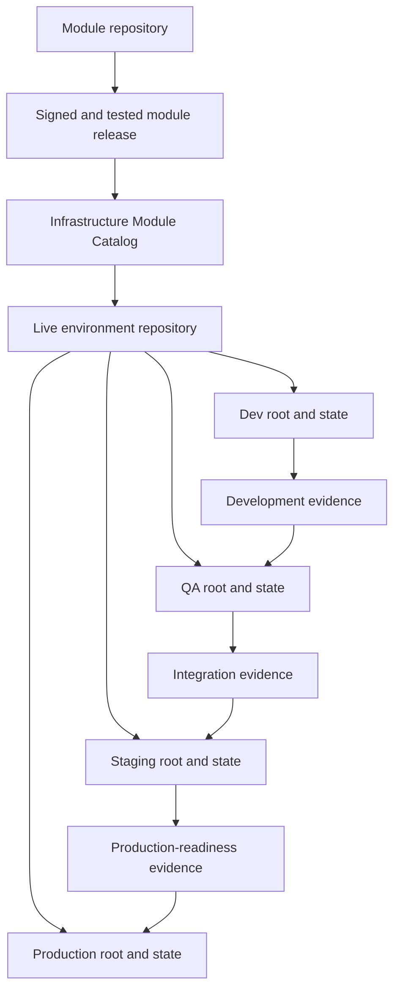
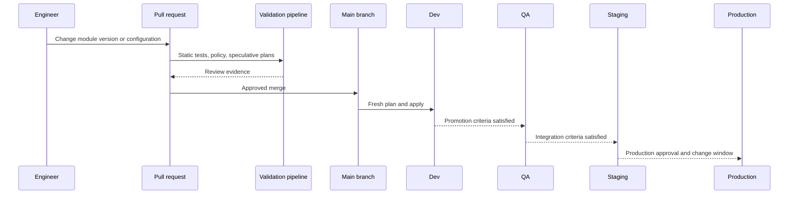
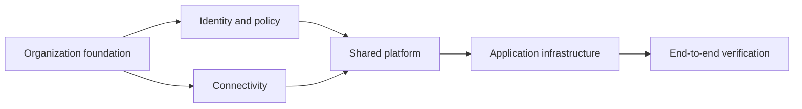

# Terraform Multi-Environment DevOps and Production Practices

## Purpose

This document defines mature practices for operating Terraform across development, QA, staging, and production environments. It extends the enterprise Infrastructure as Code standards for repository structure, reusable modules, state management, interfaces, testing, providers, versioning, and catalog governance.

The objective is to make an infrastructure change progress through environments without copying mutable code, reusing production credentials, sharing state, or relying on manual Terraform execution.

The target outcome is a controlled delivery system in which:

- Each environment has an explicit state boundary, identity, approval path, and configuration set.
- Reusable modules are versioned and promoted as immutable artifacts.
- Plans are generated from immutable source and reviewed before apply.
- Production apply uses a protected workload identity and a serialized pipeline.
- GitHub Actions or Azure DevOps implements the same control model, even when syntax differs.
- Drift, emergency changes, failed applies, state recovery, and rollback limitations are operationally defined.

## Normative language

The terms **MUST**, **MUST NOT**, **SHOULD**, **SHOULD NOT**, and **MAY** are normative.

- **MUST / MUST NOT**: mandatory control. Exceptions require documented approval and an expiration date.
- **SHOULD / SHOULD NOT**: expected practice. Deviations require a technical rationale.
- **MAY**: optional practice selected according to workload and regulatory requirements.

## Environment model

An environment is a governed deployment boundary. It is not merely a branch, variable file, Terraform workspace, resource group, account, or subscription.

Each environment MUST define:

| Concern | Required definition |
|---|---|
| Cloud scope | Subscription, account, project, tenancy, compartment, and region |
| State | Backend, key or workspace, locking, recovery, and access policy |
| Identity | Plan identity, apply identity, permissions, and federation trust |
| Configuration | Approved non-secret values and external secret references |
| Promotion | Entry criteria, approval policy, and evidence requirements |
| Operations | Owner, support path, change window, monitoring, and recovery procedure |
| Compliance | Data classification, residency, policy baseline, and evidence retention |

A typical lifecycle is:



### Development

Development validates module consumption, configuration, and ordinary changes. It may use lower-cost service tiers, but it SHOULD preserve the same identity, network, policy, logging, and state-management patterns used in production.

Development MAY deploy automatically after merge when the blast radius is bounded and automated tests pass.

### QA

QA validates integrated platform behavior and application dependencies. It SHOULD include live infrastructure tests, policy checks, identity tests, DNS and network verification, and destructive cleanup tests where applicable.

QA MUST have state and credentials independent from development.

### Staging

Staging is the production-readiness environment. Its topology SHOULD be materially equivalent to production unless a documented cost or capacity exception exists.

Staging SHOULD validate:

- The exact module versions intended for production.
- Provider and Terraform versions intended for production.
- Production-like identity and network controls.
- Upgrade behavior against existing state.
- Monitoring, backup, recovery, and operational runbooks.
- Change-window duration and expected plan impact.

### Production

Production requires the strongest isolation and evidence. Production applies MUST use a protected pipeline, short-lived workload identity, explicit approval, serialized state access, and post-deployment verification.

Direct production apply from an engineer workstation is prohibited as a normal operating practice.

## Recommended enterprise operating model

The default enterprise pattern is:

1. Reusable modules are released from module repositories using semantic versions.
2. A live infrastructure repository contains root modules for deployed environments.
3. Each environment root has a separate remote state key or execution-platform workspace.
4. Non-secret environment configuration is version controlled.
5. Secrets and cloud credentials are supplied through workload identity and approved secret services.
6. A pull request produces validation and speculative plans.
7. After merge, the deployment pipeline generates a fresh saved plan from the immutable merge commit.
8. The saved plan is approved and applied by the protected environment job.
9. Promotion changes module versions or approved configuration; it does not copy edited Terraform files between branches.



## Reference repository topology

### Preferred: explicit root directory per environment

```text
platform-infra-live/
├── README.md
├── CODEOWNERS
├── .github/
│   └── workflows/
├── .azuredevops/
│   ├── pipelines/
│   └── templates/
├── policies/
├── scripts/
├── azure/
│   └── application-platform/
│       ├── dev/
│       ├── qa/
│       ├── staging/
│       └── prod/
├── aws/
│   └── application-platform/
│       ├── dev/
│       ├── qa/
│       ├── staging/
│       └── prod/
├── gcp/
│   └── application-platform/
│       ├── dev/
│       ├── qa/
│       ├── staging/
│       └── prod/
└── oci/
    └── application-platform/
        ├── dev/
        ├── qa/
        ├── staging/
        └── prod/
```

Each leaf directory is an independent root module and apply unit:

```text
prod/
├── README.md
├── backend.tf
├── backend.hcl.example
├── versions.tf
├── providers.tf
├── main.tf
├── variables.tf
├── locals.tf
├── outputs.tf
├── checks.tf
├── production.tfvars
├── tests/
└── .terraform.lock.hcl
```

Advantages:

- Strong state, access, and approval isolation.
- Environment-specific code differences are visible in review.
- Production can use distinct owners and change policies.
- A path maps clearly to one backend and one workload identity.

Costs:

- Root composition may be repeated.
- Version upgrades require coordinated pull requests across directories.
- Teams must prevent uncontrolled divergence.

Repeated implementation logic MUST be moved into reusable modules. Root modules SHOULD remain thin compositions.

## Supported environment-organization alternatives

No single layout is correct for every enterprise. The selection MUST be deliberate.

### Alternative A: shared root with environment variable files

```text
application-platform/
├── backend/
│   ├── dev.hcl
│   ├── qa.hcl
│   ├── staging.hcl
│   └── prod.hcl
├── env/
│   ├── dev.tfvars
│   ├── qa.tfvars
│   ├── staging.tfvars
│   └── prod.tfvars
├── main.tf
├── variables.tf
├── outputs.tf
└── .terraform.lock.hcl
```

This pattern is appropriate when environments are structurally identical and differences are limited to typed configuration.

Mandatory controls:

- Every environment MUST use a distinct backend key or execution workspace.
- The pipeline MUST bind environment, backend configuration, identity, and variable file through one allowlisted mapping.
- A production variable file MUST NOT be usable with a nonproduction backend or identity.
- Environment values MUST be schema validated.
- Conditional logic MUST not grow into an unreadable set of environment-specific branches.

Example mapping:

```yaml
# deployment-map.yaml
application-platform:
  dev:
    root: application-platform
    backend: backend/dev.hcl
    variables: env/dev.tfvars
    identity: tf-application-dev
  qa:
    root: application-platform
    backend: backend/qa.hcl
    variables: env/qa.tfvars
    identity: tf-application-qa
  staging:
    root: application-platform
    backend: backend/staging.hcl
    variables: env/staging.tfvars
    identity: tf-application-staging
  prod:
    root: application-platform
    backend: backend/prod.hcl
    variables: env/prod.tfvars
    identity: tf-application-prod
```

### Alternative B: HCP Terraform or Terraform Enterprise workspace per environment

Use one execution workspace for each Terraform configuration and environment. This can centralize remote execution, policy enforcement, variable management, run history, state, and approvals.

Recommended relationship:

```text
networking-dev
networking-qa
networking-staging
networking-prod
application-platform-dev
application-platform-qa
application-platform-staging
application-platform-prod
```

This model is appropriate when the enterprise requires centralized Terraform governance and is prepared to operate the execution platform as a critical service.

The workspace naming model MUST not hide component ownership or combine unrelated lifecycle units.

### Alternative C: separate live repository per environment

Examples:

```text
application-platform-nonprod-live
application-platform-prod-live
```

or, under strict regulatory separation:

```text
application-platform-dev-live
application-platform-qa-live
application-platform-staging-live
application-platform-prod-live
```

Use this pattern only when repository access, legal boundaries, data sovereignty, organizational ownership, or release controls differ materially.

Risks:

- Code and pipeline templates can diverge.
- Promotion becomes a cross-repository version update.
- Policy and dependency upgrades are harder to coordinate.

Mitigations:

- Consume the same immutable module releases.
- Use centrally maintained pipeline templates.
- Automate pull requests that promote approved versions.
- Record environment-to-version inventory in the module catalog.

### Alternative D: Terraform CLI workspaces

CLI workspaces maintain separate state instances for the same working directory. They MAY be used for homogeneous ephemeral environments, training, test replicas, or short-lived preview deployments.

They SHOULD NOT be the default mechanism for production when environments require different credentials, backend retention, access control, policy, or approval paths.

A production system MUST NOT depend on an operator manually selecting the correct workspace.

### Decision matrix

| Pattern | Isolation | Code duplication | Governance | Recommended use |
|---|---:|---:|---:|---|
| Directory per environment | High | Moderate | Strong | Default for production systems |
| Shared root plus environment files | Medium to high when pipeline-bound | Low | Strong only with strict mapping | Structurally identical environments |
| HCP Terraform/Enterprise workspace per environment | High | Low | Strong and centralized | Enterprises using managed or private Terraform execution |
| Separate repository per environment | Very high | High risk of divergence | Strong access separation | Regulatory or organizational isolation |
| CLI workspaces | State separation only | Low | Weak for distinct security models | Ephemeral or homogeneous instances |

## State and backend design

### Required state separation

Development, QA, staging, and production MUST NOT share one state file.

Each root module MUST map to one state owner and one serialized apply path.

Example backend keys:

```text
application-platform/dev.tfstate
application-platform/qa.tfstate
application-platform/staging.tfstate
application-platform/prod.tfstate
```

For stronger isolation, use separate backend storage accounts, buckets, projects, compartments, or execution organizations for production.

### Backend access model

| Role | State read | State write | Cloud plan | Cloud apply |
|---|---:|---:|---:|---:|
| Developer | Normally no direct production access | No | Through pipeline | No |
| PR validation identity | Read where required | No state mutation beyond safe planning behavior | Yes, read-oriented | No |
| Environment apply identity | Yes | Yes | Yes | Yes, scoped to environment |
| Backend administrator | Administrative only | Recovery under procedure | No implicit cloud rights | No implicit cloud rights |
| Auditor | Controlled read to evidence | No | No | No |

Plan and apply identities MAY be the same in lower environments. Production SHOULD separate them when the execution platform and backend permit a practical least-privilege model.

### Backend initialization

Use partial backend configuration and workload identity:

```hcl
terraform {
  backend "azurerm" {}
}
```

```bash
terraform init \
  -backend-config="backend/prod.hcl" \
  -reconfigure \
  -input=false
```

Backend files MUST NOT contain long-lived credentials. Backend and provider authentication SHOULD use the platform's supported short-lived identity chain.

### Locking and concurrency

- Apply MUST use state locking.
- One pipeline concurrency group MUST exist per root and environment.
- `-lock=false` is prohibited for apply and state mutation.
- Parallel plans are permitted only when they do not mutate state and stale results are clearly identified.
- Force-unlock requires validation that the original writer has terminated and requires a recorded operational action.

## Configuration management

### Non-secret values

Environment-specific non-secret values MAY be version controlled.

```hcl
# env/prod.tfvars
location         = "canadacentral"
environment      = "prod"
service_tier     = "critical"
zone_redundant   = true
public_access    = false
backup_retention = 35
```

### Secret values

Secrets MUST NOT be committed to `.tfvars`, backend files, workflow YAML, pipeline variable groups, or source-controlled configuration.

Preferred patterns:

1. Eliminate the secret through workload identity.
2. Reference an existing secret by immutable identifier.
3. Generate a secret and write it directly to a secret manager.
4. Inject a short-lived value at runtime from an approved secret store.

Marking a Terraform variable as sensitive suppresses ordinary display but does not remove the value from state.

### Environment parity

Parity does not mean equal scale. It means equivalent behavior and controls.

Staging and production SHOULD use the same:

- Module major and minor versions.
- Provider major versions.
- Network exposure model.
- Identity pattern.
- Encryption model.
- Policy baseline.
- Logging and alerting integration.
- Backup and recovery behavior.

Permitted differences include instance count, capacity, retention, performance tier, and cost controls, provided those differences do not invalidate production-readiness testing.

## Branching and promotion

### Recommended Git model

Use one protected mainline. Environment state and configuration are represented by directories, files, or execution workspaces, not long-lived Git branches.



Long-lived environment branches are discouraged because they conceal divergence and turn promotion into cherry-picking.

### Promotion unit

Promote one of the following immutable units:

- A module version.
- A root-repository commit.
- A containerized Terraform runner image digest.
- A policy bundle version.
- An approved configuration change.

Do not promote by copying edited `.tf` files from one environment directory to another.

### Promotion strategies

### Sequential automatic promotion

Development deploys automatically after merge. QA and staging follow after tests. Production pauses for approval.

Use when environments share a frequent release cadence and reliable automated verification.

### Pull-request promotion

A successful environment deployment creates or updates a pull request that changes the next environment's module version or configuration.

Use when explicit environment evidence and review are required.

### Release-manifest promotion

A signed manifest records approved module, provider, policy, and configuration versions.

```yaml
release: platform-2026.08.04.1
components:
  network: 4.6.2
  private-service: 3.2.1
  observability: 2.8.0
terraform: 1.15.8
policy_bundle: 5.4.0
```

Use for large platforms where multiple roots must consume one tested release set. The manifest does not imply one shared state or one atomic multi-root apply.

## Pipeline control model

Every pipeline implementation MUST preserve the following logical stages:

```mermaid
flowchart LR
    A[Checkout immutable commit] --> B[Toolchain verification]
    B --> C[Format, validate, lint, test]
    C --> D[Security and policy checks]
    D --> E[Initialize selected backend]
    E --> F[Scope and identity verification]
    F --> G[Create saved plan]
    G --> H[Plan classification and review]
    H --> I[Protected environment approval]
    I --> J[Apply exact saved plan]
    J --> K[Post-apply verification]
    K --> L[Evidence retention and drift schedule]
```



### Pull-request pipeline

A pull-request pipeline SHOULD:

- Run formatting, initialization without backend where possible, validation, linting, tests, security scanning, policy checks, and documentation checks.
- Produce speculative plans for affected roots.
- Classify creates, changes, replacements, deletes, IAM changes, network exposure, encryption changes, and policy exceptions.
- Post a concise plan summary to the pull request without exposing sensitive values.
- Never apply untrusted pull-request code to production.
- Use restricted credentials or no cloud credentials for contributions from forks.

### Post-merge deployment pipeline

A post-merge deployment pipeline MUST:

- Check out the exact immutable merge commit.
- Reinitialize the correct environment backend.
- Verify cloud account, subscription, project, tenancy, region, and principal.
- Generate a fresh saved plan.
- Protect the plan artifact as sensitive.
- Apply that exact saved plan after approval.
- Reject an expired, modified, or environment-mismatched plan.

A pull-request plan is review evidence; it is not necessarily the production apply artifact. State may change between PR validation and merge. The protected deployment pipeline SHOULD regenerate the plan after merge and obtain approval on that plan.

### Plan artifact controls

A saved plan can contain sensitive values and is coupled to:

- The configuration commit.
- Terraform and provider versions.
- Variable values.
- Backend state at plan time.
- Provider credentials and resolved API data.

The pipeline MUST record at least:

```text
commit SHA
root path
environment
backend identifier
state lineage and serial when obtainable
Terraform version
provider lock-file checksum
variable-file checksum
plan checksum
creation time
approval identity
```

Plan retention SHOULD be short. A stale plan MUST be discarded and regenerated.

## GitHub Actions implementation

### GitHub control mapping

| Terraform control | GitHub Actions implementation |
|---|---|
| Protected mainline | Branch protection and required checks |
| Environment approval | Separate `<environment>-plan` and protected apply environments; required reviewers and deployment protection on apply |
| Short-lived cloud identity | GitHub OIDC with `id-token: write` |
| Serialized apply | `concurrency` keyed by root and environment |
| Shared pipeline logic | Reusable workflows pinned to immutable references |
| Plan evidence | Protected workflow artifact and job summary |
| Minimal token rights | Explicit `permissions` block |
| Production secrets | Environment-scoped secrets only when identity cannot eliminate them |

### Example repository workflow

The following example uses Azure OIDC for authentication. AWS, GCP, and OCI should use their equivalent federation action or approved credential bootstrap. Terraform 1.15.8 and major action tags are illustrative as of the document date; the enterprise support matrix is authoritative, and protected workflows SHOULD pin actions to reviewed commit SHAs.

```yaml
name: terraform-deploy

on:
  pull_request:
    branches: [main]
    paths:
      - "azure/application-platform/**"
      - ".github/workflows/terraform-deploy.yml"
  push:
    branches: [main]
    paths:
      - "azure/application-platform/**"
      - ".github/workflows/terraform-deploy.yml"
  workflow_dispatch:
    inputs:
      environment:
        description: Environment to deploy
        required: true
        type: choice
        options: [dev, qa, staging, prod]

permissions:
  contents: read

jobs:
  validate:
    runs-on: ubuntu-latest
    permissions:
      contents: read
    steps:
      - uses: actions/checkout@v4
      - uses: hashicorp/setup-terraform@v3
        with:
          terraform_version: "1.15.8"
          terraform_wrapper: false
      - name: Format
        run: terraform fmt -check -recursive
      - name: Validate roots
        shell: bash
        run: |
          set -euo pipefail
          for dir in azure/application-platform/{dev,qa,staging,prod}; do
            terraform -chdir="$dir" init -backend=false -input=false
            terraform -chdir="$dir" validate
            terraform -chdir="$dir" test
          done

  plan:
    if: github.event_name != 'pull_request' || github.event.pull_request.head.repo.fork == false
    needs: validate
    runs-on: ubuntu-latest
    environment: ${{ format('{0}-plan', inputs.environment || 'dev') }}
    concurrency:
      group: terraform-${{ inputs.environment || 'dev' }}-application-platform
      cancel-in-progress: false
    permissions:
      contents: read
      id-token: write
    env:
      TF_IN_AUTOMATION: "true"
      TF_INPUT: "false"
      ENVIRONMENT: ${{ inputs.environment || 'dev' }}
    steps:
      - uses: actions/checkout@v4
      - uses: hashicorp/setup-terraform@v3
        with:
          terraform_version: "1.15.8"
          terraform_wrapper: false
      - name: Azure login with OIDC
        uses: azure/login@v2
        with:
          client-id: ${{ vars.AZURE_CLIENT_ID }}
          tenant-id: ${{ vars.AZURE_TENANT_ID }}
          subscription-id: ${{ vars.AZURE_SUBSCRIPTION_ID }}
      - name: Verify execution scope
        shell: bash
        run: |
          set -euo pipefail
          actual_subscription="$(az account show --query id -o tsv)"
          test "$actual_subscription" = "${{ vars.AZURE_SUBSCRIPTION_ID }}"
          az account show --query '{subscription:id,tenant:tenantId,user:user.name}' -o json
      - name: Initialize and plan
        shell: bash
        run: |
          set -euo pipefail
          root="azure/application-platform/${ENVIRONMENT}"
          terraform -chdir="$root" init -input=false -reconfigure
          terraform -chdir="$root" plan \
            -input=false \
            -lock-timeout=10m \
            -out=tfplan
          terraform -chdir="$root" show -json tfplan > "$root/tfplan.json"
          (cd "$root" && sha256sum tfplan .terraform.lock.hcl > plan-manifest.sha256)
      - name: Upload protected plan artifact
        uses: actions/upload-artifact@v4
        with:
          name: tfplan-${{ env.ENVIRONMENT }}-${{ github.sha }}
          path: |
            azure/application-platform/${{ env.ENVIRONMENT }}/tfplan
            azure/application-platform/${{ env.ENVIRONMENT }}/tfplan.json
            azure/application-platform/${{ env.ENVIRONMENT }}/plan-manifest.sha256
            azure/application-platform/${{ env.ENVIRONMENT }}/.terraform.lock.hcl
          retention-days: 3
          if-no-files-found: error

  apply:
    if: github.event_name != 'pull_request'
    needs: plan
    runs-on: ubuntu-latest
    environment: ${{ inputs.environment || 'dev' }}
    concurrency:
      group: terraform-${{ inputs.environment || 'dev' }}-application-platform
      cancel-in-progress: false
    permissions:
      contents: read
      id-token: write
      actions: read
    env:
      TF_IN_AUTOMATION: "true"
      TF_INPUT: "false"
      ENVIRONMENT: ${{ inputs.environment || 'dev' }}
    steps:
      - uses: actions/checkout@v4
      - uses: hashicorp/setup-terraform@v3
        with:
          terraform_version: "1.15.8"
          terraform_wrapper: false
      - name: Azure login with OIDC
        uses: azure/login@v2
        with:
          client-id: ${{ vars.AZURE_CLIENT_ID }}
          tenant-id: ${{ vars.AZURE_TENANT_ID }}
          subscription-id: ${{ vars.AZURE_SUBSCRIPTION_ID }}
      - uses: actions/download-artifact@v4
        with:
          name: tfplan-${{ env.ENVIRONMENT }}-${{ github.sha }}
          path: azure/application-platform/${{ env.ENVIRONMENT }}
      - name: Verify and apply reviewed plan
        shell: bash
        run: |
          set -euo pipefail
          root="azure/application-platform/${ENVIRONMENT}"
          (cd "$root" && sha256sum -c plan-manifest.sha256)
          terraform -chdir="$root" init -input=false -reconfigure
          terraform -chdir="$root" apply \
            -input=false \
            -lock-timeout=10m \
            tfplan
      - name: Post-apply verification
        shell: bash
        run: ./scripts/verify-environment.sh "$ENVIRONMENT"
```

### GitHub workflow hardening

- Pin third-party actions to reviewed immutable commit SHAs in protected repositories. Version tags are readable but mutable unless the publisher guarantees immutability.
- Set explicit workflow permissions; do not rely on broad defaults.
- Restrict the OIDC trust policy by repository, branch or environment, workflow identity, and audience.
- Store subscription, account, project, tenant, and region identifiers as non-secret environment variables and verify them before plan.
- Require production environment reviewers who cannot modify the workflow being approved.
- Prevent untrusted pull requests from receiving cloud credentials or environment secrets.
- Use reusable workflows for standard behavior, but pin the called workflow to an immutable release.
- Do not use self-hosted runners for untrusted pull requests. Production self-hosted runners SHOULD be ephemeral, isolated, patched, and prevented from retaining state or credentials.

### GitHub promotion design

A mature design separates deployment orchestration from Terraform execution:

```text
terraform-ci.yml                 # PR validation and speculative plan
terraform-deploy.yml             # one protected environment deployment
promote-release.yml              # promotes approved version/config to next environment
.github/workflows/reusable/
  terraform-plan-apply.yml       # centrally governed execution logic
```

For production, invoke deployment manually or from a signed release event and bind the job to the `prod` GitHub Environment.

## Azure DevOps Pipelines implementation

### Azure DevOps control mapping

| Terraform control | Azure DevOps implementation |
|---|---|
| Protected source | Branch policies and required build validation |
| Short-lived Azure identity | Azure Resource Manager service connection using workload identity federation |
| Environment approval | Azure Pipelines Environment approvals and checks |
| Serialized apply | Exclusive lock check or pipeline/environment concurrency policy |
| Shared pipeline logic | Versioned YAML templates in a protected repository |
| Plan evidence | Pipeline artifact with restricted retention |
| Scope restriction | Service connection authorization and environment-specific identity |
| Secret retrieval | Key Vault integration or workload identity, not static pipeline variables |

### Recommended Azure DevOps file structure

```text
.azuredevops/
├── pipelines/
│   └── terraform-platform.yml
└── templates/
    ├── terraform-validate.yml
    ├── terraform-plan.yml
    └── terraform-apply.yml
```

### Validation template

The Azure DevOps examples assume an approved agent image with Terraform CLI 1.15.8 and the Azure CLI installed. Enterprises SHOULD publish and scan a versioned runner image, or use a centrally governed installer that verifies official checksums. The version remains subject to the enterprise support matrix.

```yaml
# .azuredevops/templates/terraform-validate.yml
parameters:
  - name: roots
    type: object

steps:
  - checkout: self
    clean: true
    fetchDepth: 1

  - bash: |
      set -euo pipefail
      terraform version
      terraform fmt -check -recursive
      for root in $ROOTS; do
        terraform -chdir="$root" init -backend=false -input=false
        terraform -chdir="$root" validate
        terraform -chdir="$root" test
      done
    displayName: Validate Terraform roots
    env:
      TF_IN_AUTOMATION: "true"
      TF_INPUT: "false"
      ROOTS: ${{ join(' ', parameters.roots) }}
```

### Plan template

```yaml
# .azuredevops/templates/terraform-plan.yml
parameters:
  - name: environment
    type: string
  - name: root
    type: string
  - name: serviceConnection
    type: string
  - name: expectedSubscriptionId
    type: string

jobs:
  - job: Plan
    displayName: Plan ${{ parameters.environment }}
    pool:
      vmImage: ubuntu-latest
    variables:
      TF_IN_AUTOMATION: "true"
      TF_INPUT: "false"
    steps:
      - checkout: self
        clean: true
        fetchDepth: 1

      - task: AzureCLI@2
        displayName: Verify scope and create plan
        inputs:
          azureSubscription: ${{ parameters.serviceConnection }}
          scriptType: bash
          scriptLocation: inlineScript
          addSpnToEnvironment: true
          inlineScript: |
            set -euo pipefail
            actual_subscription="$(az account show --query id -o tsv)"
            test "$actual_subscription" = "${{ parameters.expectedSubscriptionId }}"
            az account show --query '{subscription:id,tenant:tenantId,user:user.name}' -o json

            terraform -chdir="${{ parameters.root }}" init \
              -input=false \
              -reconfigure

            terraform -chdir="${{ parameters.root }}" plan \
              -input=false \
              -lock-timeout=10m \
              -out=tfplan

            terraform -chdir="${{ parameters.root }}" show -json tfplan \
              > "${{ parameters.root }}/tfplan.json"

            (cd "${{ parameters.root }}" && \
              sha256sum tfplan .terraform.lock.hcl > plan-manifest.sha256)

            artifact_dir="$(Build.ArtifactStagingDirectory)/tfplan-${{ parameters.environment }}"
            mkdir -p "$artifact_dir"
            cp "${{ parameters.root }}/tfplan" "$artifact_dir/"
            cp "${{ parameters.root }}/tfplan.json" "$artifact_dir/"
            cp "${{ parameters.root }}/plan-manifest.sha256" "$artifact_dir/"
            cp "${{ parameters.root }}/.terraform.lock.hcl" "$artifact_dir/"

      - publish: $(Build.ArtifactStagingDirectory)/tfplan-${{ parameters.environment }}
        artifact: tfplan-${{ parameters.environment }}-$(Build.SourceVersion)
        displayName: Publish protected plan
```

The Azure service connection SHOULD use workload identity federation. Terraform's AzureRM backend and provider can consume the federated Azure identity exposed by the approved task or by an explicitly configured environment-variable bridge. The exact bootstrap MUST be tested with the selected Terraform and provider versions.

### Apply template

```yaml
# .azuredevops/templates/terraform-apply.yml
parameters:
  - name: environment
    type: string
  - name: root
    type: string
  - name: serviceConnection
    type: string
  - name: expectedSubscriptionId
    type: string

jobs:
  - deployment: Apply
    displayName: Apply ${{ parameters.environment }}
    environment: terraform-${{ parameters.environment }}
    strategy:
      runOnce:
        deploy:
          steps:
            - checkout: self
              clean: true
              fetchDepth: 1

            - download: current
              artifact: tfplan-${{ parameters.environment }}-$(Build.SourceVersion)

            - task: AzureCLI@2
              displayName: Verify and apply reviewed plan
              inputs:
                azureSubscription: ${{ parameters.serviceConnection }}
                scriptType: bash
                scriptLocation: inlineScript
                addSpnToEnvironment: true
                inlineScript: |
                  set -euo pipefail
                  actual_subscription="$(az account show --query id -o tsv)"
                  test "$actual_subscription" = "${{ parameters.expectedSubscriptionId }}"

                  artifact="$(Pipeline.Workspace)/tfplan-${{ parameters.environment }}-$(Build.SourceVersion)"
                  cp "$artifact/tfplan" "${{ parameters.root }}/tfplan"
                  cp "$artifact/plan-manifest.sha256" "${{ parameters.root }}/plan-manifest.sha256"

                  cd "${{ parameters.root }}"
                  sha256sum -c plan-manifest.sha256
                  terraform init -input=false -reconfigure
                  terraform apply \
                    -input=false \
                    -lock-timeout=10m \
                    tfplan

                  "$(Build.SourcesDirectory)/scripts/verify-environment.sh" \
                    "${{ parameters.environment }}"
```

### Main Azure DevOps pipeline

```yaml
# .azuredevops/pipelines/terraform-platform.yml
trigger:
  branches:
    include: [main]
  paths:
    include:
      - azure/application-platform/*
      - .azuredevops/*

pr:
  branches:
    include: [main]
  paths:
    include:
      - azure/application-platform/*
      - .azuredevops/*

lockBehavior: sequential

stages:
  - stage: Validate
    jobs:
      - job: Validate
        pool:
          vmImage: ubuntu-latest
        steps:
          - template: ../templates/terraform-validate.yml
            parameters:
              roots:
                - azure/application-platform/dev
                - azure/application-platform/qa
                - azure/application-platform/staging
                - azure/application-platform/prod

  - stage: PlanDev
    dependsOn: Validate
    condition: and(succeeded(), ne(variables['Build.Reason'], 'PullRequest'))
    jobs:
      - template: ../templates/terraform-plan.yml
        parameters:
          environment: dev
          root: azure/application-platform/dev
          serviceConnection: sc-terraform-dev-plan-wif
          expectedSubscriptionId: 00000000-0000-0000-0000-000000000001

  - stage: ApplyDev
    dependsOn: PlanDev
    jobs:
      - template: ../templates/terraform-apply.yml
        parameters:
          environment: dev
          root: azure/application-platform/dev
          serviceConnection: sc-terraform-dev-apply-wif
          expectedSubscriptionId: 00000000-0000-0000-0000-000000000001

  - stage: PlanQA
    dependsOn: ApplyDev
    jobs:
      - template: ../templates/terraform-plan.yml
        parameters:
          environment: qa
          root: azure/application-platform/qa
          serviceConnection: sc-terraform-qa-plan-wif
          expectedSubscriptionId: 00000000-0000-0000-0000-000000000002

  - stage: ApplyQA
    dependsOn: PlanQA
    jobs:
      - template: ../templates/terraform-apply.yml
        parameters:
          environment: qa
          root: azure/application-platform/qa
          serviceConnection: sc-terraform-qa-apply-wif
          expectedSubscriptionId: 00000000-0000-0000-0000-000000000002

  - stage: PlanStaging
    dependsOn: ApplyQA
    jobs:
      - template: ../templates/terraform-plan.yml
        parameters:
          environment: staging
          root: azure/application-platform/staging
          serviceConnection: sc-terraform-staging-plan-wif
          expectedSubscriptionId: 00000000-0000-0000-0000-000000000003

  - stage: ApplyStaging
    dependsOn: PlanStaging
    jobs:
      - template: ../templates/terraform-apply.yml
        parameters:
          environment: staging
          root: azure/application-platform/staging
          serviceConnection: sc-terraform-staging-apply-wif
          expectedSubscriptionId: 00000000-0000-0000-0000-000000000003

  - stage: PlanProd
    dependsOn: ApplyStaging
    jobs:
      - template: ../templates/terraform-plan.yml
        parameters:
          environment: prod
          root: azure/application-platform/prod
          serviceConnection: sc-terraform-prod-plan-wif
          expectedSubscriptionId: 00000000-0000-0000-0000-000000000004

  - stage: ApplyProd
    dependsOn: PlanProd
    jobs:
      - template: ../templates/terraform-apply.yml
        parameters:
          environment: prod
          root: azure/application-platform/prod
          serviceConnection: sc-terraform-prod-apply-wif
          expectedSubscriptionId: 00000000-0000-0000-0000-000000000004
```

The `terraform-prod` Azure Pipelines Environment MUST have an exclusive-lock check and appropriate approvals configured outside YAML. The production apply service connection SHOULD also enforce approval and a required-template check so authorization to use the production identity cannot be bypassed by editing or creating another pipeline. Production protection MUST not depend solely on editable pipeline code.

### Azure DevOps hardening

- Use distinct plan and apply workload identity federation service connections for every environment or privilege boundary. The plan identity SHOULD be read-oriented; the apply identity receives only the write permissions required by that root.
- Do not grant service connections to all pipelines. Explicitly authorize approved pipelines.
- Enable branch policies, required reviewers, and build validation on the Terraform repository and shared-template repository.
- Use pipeline Environments for approvals, business hours, change-management integration, and exclusive locks.
- Limit job authorization scope to the current project unless cross-project access is explicitly required.
- Protect variable groups and Key Vault references. Prefer identity over secret variables.
- Use self-hosted agents only when private connectivity requires them. Production agents SHOULD be ephemeral and assigned to a protected pool.
- Clean workspaces before and after jobs. State, plans, credentials, `.terraform`, and cloud CLI caches MUST not persist between tenants or trust zones.

## Multi-cloud authentication patterns

The CI/CD control model is cloud-neutral. Authentication implementation is provider-specific.

| Cloud | GitHub Actions preferred pattern | Azure DevOps preferred pattern |
|---|---|---|
| Azure | GitHub OIDC to Microsoft Entra federated credential | Azure Resource Manager service connection with workload identity federation |
| AWS | GitHub OIDC to narrowly scoped IAM role | Federated broker or approved short-lived role-assumption integration; avoid stored access keys |
| GCP | GitHub OIDC to Workload Identity Federation and service-account impersonation | Approved federation broker or short-lived credential integration; avoid service-account JSON keys |
| OCI | Approved OIDC/federation pattern where available, or isolated runner using resource/instance principal | Resource/instance principal on isolated runner or approved federation; avoid committed API keys |

Each pipeline MUST verify the resolved principal, cloud scope, and region before planning or applying.

One universal highly privileged identity across all clouds and environments is prohibited.

## Testing and quality gates by environment

| Control | Pull request | Dev | QA | Staging | Production |
|---|---:|---:|---:|---:|---:|
| Format, init, validate | Required | Required | Required | Required | Required |
| Unit and contract tests | Required | Required | Required | Required | Required |
| Security and policy scan | Required | Required | Required | Required | Required |
| Speculative plan | Required | Required | Required | Required | Required |
| Live integration tests | Selective | Required | Required | Required | Post-deploy |
| Upgrade test from current release | Risk based | Recommended | Required | Required | Evidence consumed |
| Cost estimation or budget check | Recommended | Required | Required | Required | Required |
| Manual approval | No | Optional | Risk based | Recommended | Required |
| Post-apply functional verification | No | Required | Required | Required | Required |
| Drift detection | No | Scheduled | Scheduled | Scheduled | Scheduled and alerted |

A successful `terraform apply` is not sufficient acceptance evidence. Verification MUST test intended behavior, such as private DNS resolution, denied public access, workload identity permissions, logging delivery, policy compliance, backup enrollment, and service health.

## Policy, security, and cost controls

### Mandatory plan classification

The pipeline SHOULD parse plan JSON and flag:

- Resource creation, update, replacement, and deletion.
- IAM role, policy, group, assignment, and privilege changes.
- Public IP, firewall, ingress, route, and private-endpoint changes.
- Encryption, key, certificate, and secret-store changes.
- Logging, monitoring, backup, and retention changes.
- Region, residency, SKU, and capacity changes.
- Policy exemptions and lifecycle ignores.
- Large or unexpected cost changes.

A technically valid plan containing an undocumented replacement is not production-ready.

### Destructive changes

Destructive actions MUST be separately highlighted. High-risk deletion or replacement SHOULD require elevated approval and a recovery plan.

Destroy workflows MUST be separate from ordinary apply workflows and disabled for production unless explicitly authorized.

### Supply-chain controls

- Terraform, providers, modules, actions, tasks, runner images, and policy bundles MUST be version constrained.
- Root modules MUST commit `.terraform.lock.hcl`.
- Shared workflows and YAML templates MUST be versioned and protected.
- Provider and module sources SHOULD be restricted to approved registries or mirrors.
- Pipeline artifacts MUST include provenance linking source commit, tool versions, and checksums.

## Deployment sequencing and cross-state dependencies

Do not place unrelated infrastructure in one state merely to obtain deployment order.

Preferred dependency exchange:

1. DNS, parameter store, configuration service, service catalog, or cloud-native discovery.
2. Scoped output API or approved pipeline artifact.
3. Controlled orchestration that waits for upstream health.
4. `terraform_remote_state` only after security review because it usually grants access to the full upstream state snapshot.

For multiple roots, use an orchestration pipeline with explicit dependency order:



A failed downstream deployment MUST not trigger an automatic destructive rollback of stable upstream infrastructure.

## Handling failed applies

Terraform apply can fail after partially modifying infrastructure. The correct response is reconciliation, not blind rollback.

Procedure:

1. Stop concurrent applies for the affected state.
2. Preserve the pipeline logs, saved plan, current state version, and cloud activity logs.
3. Determine which resources changed successfully.
4. Correct authentication, quota, policy, dependency, provider, or configuration failure.
5. Generate a new plan from the current configuration and state.
6. Review unexpected deletes, replacements, or duplicate resources.
7. Apply the smallest safe forward correction.
8. Run post-deployment verification.
9. Record the incident and update tests or controls.

Reapplying the old plan after state or cloud reality has changed is unsafe.

## Rollback and recovery

Terraform rollback is not equivalent to application rollback.

### Configuration rollback

Reverting a Git commit and applying can reverse declarative settings only when the cloud operation is reversible and the older configuration remains compatible with current state and provider schemas.

### Module downgrade

A module downgrade MAY be unsafe when the newer version changed resource addresses, created new objects, migrated data, rotated credentials, or required a newer provider state schema.

Prefer a forward fix unless the module release notes explicitly support downgrade.

### State recovery

State recovery MUST follow the state-management procedure:

- Stop applies.
- Preserve current state and logs.
- Restore a known valid state version only after comparing it with cloud reality.
- Run refresh-only and normal plans as appropriate.
- Do not assume restoring old state restores infrastructure.

### Application rollback coordination

Infrastructure and application deployment systems SHOULD publish compatible release metadata. An application rollback MUST not assume that a database, identity, network, or managed service change is reversible.

## Drift and out-of-band changes

Every production root MUST have scheduled drift detection or an equivalent managed service.

Drift MUST be classified as:

- Authorized emergency change.
- Unauthorized manual change.
- Expected external-controller ownership.
- Provider normalization.
- Cloud platform behavior.
- Terraform configuration defect.

The disposition MUST be one of:

- Reconcile the change into code.
- Revert the cloud change through Terraform.
- Redesign ownership.
- Add a narrowly scoped lifecycle ignore with owner and review date.
- Escalate as a security or operational incident.

Broad `ignore_changes = all` is prohibited as a drift strategy.

## Emergency production changes

Emergency changes MAY bypass ordinary timing but MUST NOT erase governance.

Minimum procedure:

1. Declare an incident or emergency change.
2. Identify the production state owner.
3. Stop competing apply pipelines.
4. Prefer an expedited Terraform change and protected pipeline.
5. When a console or direct API change is unavoidable, record the exact mutation and operator.
6. Stabilize the service.
7. Reconcile configuration and state immediately.
8. Run a full plan and verification.
9. Complete retrospective and control remediation.

An emergency is not justification for permanent unmanaged infrastructure.

## Ephemeral and preview environments

Ephemeral environments are useful for module integration, pull-request previews, and destructive testing.

Requirements:

- Use a dedicated nonproduction account, subscription, project, or compartment.
- Generate stable unique names from a bounded identifier.
- Apply quotas, budgets, TTL metadata, and automated cleanup.
- Use separate state per preview instance.
- Do not expose production data, secrets, DNS zones, or identities.
- Verify destroy and detect leaked resources.
- Do not give untrusted forked code a privileged cloud identity.

CLI workspaces MAY be acceptable here when the identity and backend are already restricted to the ephemeral scope.

## Operational evidence and audit

For each production deployment, retain:

- Source commit and pull request.
- Review and approval identities.
- Module, Terraform, provider, policy, workflow, and runner versions.
- Root path, environment, backend identifier, and cloud scope.
- Plan summary and protected saved-plan checksum.
- Policy, security, cost, and test results.
- Apply logs and post-deployment verification.
- Change record or release identifier.
- Exceptions and expiration dates.

Do not retain sensitive plan JSON or state longer than required. Evidence systems SHOULD store sanitized summaries and immutable provenance rather than unrestricted state copies.

## Environment readiness checklist

### Development

- Dedicated state and identity exist.
- Automatic deployment is bounded and observable.
- Reusable modules are version pinned.
- Integration tests and cleanup run.
- Budget and TTL controls prevent resource leakage.

### QA

- State and identity are separate from development.
- Functional, policy, network, and identity tests run.
- Negative controls are tested.
- Upgrade tests cover the intended release path.

### Staging

- Topology and controls are production-like.
- Exact production candidate versions are deployed.
- Backup, monitoring, incident, and recovery procedures are validated.
- Expected plan duration and operational impact are known.
- Production rollback limitations are documented.

### Production

- Protected workload identity and environment approval are active.
- Backend, locking, versioning, access logging, and recovery are verified.
- The apply is serialized and uses the approved saved plan.
- Scope verification succeeds.
- Destructive and privilege changes receive elevated review.
- Post-deployment checks, drift monitoring, and evidence retention are operational.

## Anti-patterns

- One state file shared by development, QA, staging, and production.
- One highly privileged service principal or cloud key for all environments.
- Production selected only by a manually entered variable.
- Long-lived environment branches with uncontrolled divergence.
- Copying Terraform code between environment folders during promotion.
- Applying a pull-request plan after state or source changed.
- Running production apply from a laptop.
- Saving cloud credentials in GitHub secrets or Azure DevOps variables when federation is available.
- Treating CLI workspaces as complete production isolation.
- Auto-approving production because lower environments succeeded.
- Re-running a failed apply without examining partial changes.
- Automatically rolling back infrastructure by applying an old plan.
- Allowing production runners to retain `.terraform`, state, plan, or cloud CLI credentials.
- Using `terraform_remote_state` as the default integration mechanism.
- Permanent drift suppression through broad lifecycle ignores.

## Validation

A multi-environment Terraform implementation conforms when:

- Development, QA, staging, and production have independent state and explicit ownership.
- Environment, backend, identity, and variable mappings cannot be mixed arbitrarily.
- Reusable modules and provider selections are immutable and version controlled.
- Pull requests produce validation, policy, security, and plan evidence.
- Deployment pipelines regenerate plans from immutable merged source.
- Protected jobs apply the exact approved saved plan.
- Production uses short-lived workload identity and an external approval control.
- Applies are serialized per state.
- Post-deployment behavior is verified.
- Drift, emergency change, failed apply, rollback, and state recovery procedures are documented and tested.
- GitHub Actions or Azure DevOps pipeline templates are centrally governed and pinned.
- Production evidence is retained without exposing unrestricted state or secrets.

## Implementation recommendation

For most enterprises, use the following baseline:

1. One live repository per platform or bounded infrastructure domain.
2. One root directory and remote state per environment.
3. Separate federated workload identity per environment.
4. Reusable modules released through an approved catalog.
5. One protected main branch; no long-lived environment branches.
6. PR validation and speculative plans.
7. Fresh saved plan after merge.
8. Automatic development deployment, gated QA and staging, and explicitly approved production deployment.
9. GitHub Environments or Azure Pipelines Environments as the external deployment-control boundary.
10. Scheduled drift detection and tested state recovery.

Use a shared root with environment files only when topology is genuinely identical and the pipeline enforces an immutable environment mapping. Use HCP Terraform or Terraform Enterprise when centralized remote execution and policy justify the platform. Use separate repositories only for real access or regulatory separation. Restrict CLI workspaces to homogeneous or ephemeral instances.

## Related topics

- [Engineering Reusable Terraform Modules](iac-engineering-reusable-terraform-modules.md)
- [Environment Configuration and State Management](iac-environment-configuration-and-state-management.md)
- [Terraform Repository and Module Structure](iac-terraform-repository-and-module-structure.md)

## References

- [Terraform CLI workspaces](https://developer.hashicorp.com/terraform/cli/workspaces)
- [Terraform workspace limitations](https://developer.hashicorp.com/terraform/language/state/workspaces)
- [Terraform automation guidance](https://developer.hashicorp.com/terraform/tutorials/automation/automate-terraform)
- [Terraform apply and saved plans](https://developer.hashicorp.com/terraform/cli/commands/apply)
- [Terraform plan command](https://developer.hashicorp.com/terraform/cli/commands/plan)
- [Terraform JSON plan format](https://developer.hashicorp.com/terraform/internals/json-format)
- [Terraform dependency lock file and provider versioning](https://developer.hashicorp.com/terraform/tutorials/configuration-language/provider-versioning)
- [HCP Terraform recommended workspace model](https://developer.hashicorp.com/terraform/cloud-docs/recommended-practices/part1)
- [GitHub Actions OpenID Connect](https://docs.github.com/en/actions/concepts/security/openid-connect)
- [GitHub Actions secure use reference](https://docs.github.com/en/actions/reference/security/secure-use)
- [GitHub OIDC with reusable workflows](https://docs.github.com/actions/deployment/security-hardening-your-deployments/using-openid-connect-with-reusable-workflows)
- [Azure DevOps workload identity federation service connections](https://learn.microsoft.com/azure/devops/pipelines/release/configure-workload-identity)
- [Azure DevOps pipeline security](https://learn.microsoft.com/azure/devops/pipelines/security/overview)
- [Azure DevOps Terraform OIDC CI/CD sample](https://learn.microsoft.com/samples/azure-samples/azure-devops-terraform-oidc-ci-cd/azure-devops-terraform-oidc-ci-cd/)
