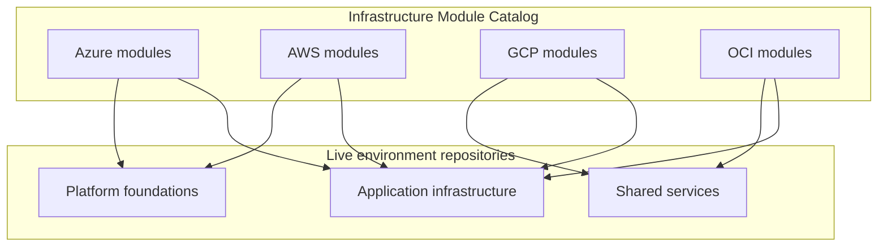
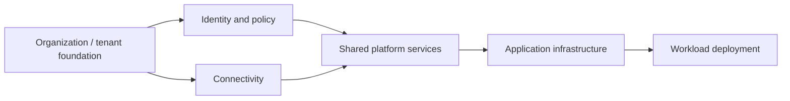
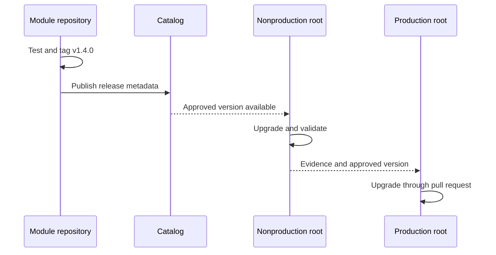

# Terraform 仓库和模块结构

## 目的

该标准定义了 Terraform 仓库的组织方式，以便团队可以定位代码、了解状态边界、审查更改、应用一致的控制以及跨 Azure、AWS、GCP 和 OCI 安全地晋级基础设施。

仓库结构是一种操作控制。糟糕的结构会产生过大的状态、不明确的所有权、意外的跨环境变化、重复的模块和薄弱的审查边界。

## 仓库类

该企业使用四个仓库类。

|班级 |包含 |发布可复用的制品 |负责部署状态|
|---|---|---:|---:|
|模块仓库 |一个可复用的子模块 |是的 |没有 |
|现场环境仓库 |已部署环境的根模块 |没有 |是的 |
|蓝图仓库 |自以为是的构图示例或脚手架 |有时|通常没有 |
|策略/工具仓库 | Linters、策略、流水线、生成器 |工具或策略包|没有 |

仓库 MUST 在其 README 和目录元数据中声明其类。

## 选择：单一仓库或多仓库

这两种模型都不是普遍正确的。

### Multirepo 是首选

- 模块具有独立的所有者和发布周期。
- 访问限制不同。
- 团队需要与注册表兼容的发布标签。
- 根配置具有独立的状态和部署流水线。
- 更改不应触发不相关系统的验证。

### Monorepo 是可以接受的

- 平台团队负责紧密集成的模块系列。
- 跨模块的原子更改很常见并一起测试。
- 工具可以检测受影响的路径并维护独立版本。
- 访问和保留要求相同。

monorepo MUST NOT 意味着一种共享状态。状态边界在根模块目录中保持明确。

## 推荐的企业拓扑

可复用的代码从模块仓库中发布。实时仓库使用不可变的模块版本和自己的状态。

## 模块仓库结构
```text
terraform-azurerm-private-storage/
├── README.md
├── CHANGELOG.md
├── LICENSE
├── CODEOWNERS
├── versions.tf
├── main.tf
├── variables.tf
├── locals.tf
├── outputs.tf
├── checks.tf
├── tests/
│   ├── unit.tftest.hcl
│   └── integration.tftest.hcl
├── examples/
│   ├── basic/
│   │   ├── main.tf
│   │   ├── versions.tf
│   │   └── variables.tf
│   └── complete/
├── docs/
│   ├── architecture.md
│   └── migration.md
├── scripts/
└── .github/ or .azuredevops/
```
### 标准 Terraform 文件

|文件 |预期内容 |
|---|---|
| `versions.tf` | Terraform 和提供程序要求 |
| `providers.tf` |仅根模块提供程序配置；通常在子模块中不存在 |
| `backend.tf` |仅根模块后端声明 |
| `main.tf` |主要资源和模块调用|
| `variables.tf` |公共输入变量 |
| `locals.tf` |共同的本地价值观|
| `outputs.tf` |公共输出 |
| `data.tf` |数据源时单独的文件可以提高清晰度 |
| `checks.tf` |跨资源检查和断言|
| `moved.tf` |用于地址迁移的临时或持久移动块 |
| `import.tf` |导入块以进行受控采用或迁移 |

Terraform 将 `.tf` 文件合并到目录中。文件命名是为了人类、审查工具和可维护性。团队 SHOULD 避免任意文件扩散。

## 实时环境仓库结构

推荐的实时仓库将云、组织范围、区域、环境和可部署组件分开。
```text
cloud-live/
├── README.md
├── CODEOWNERS
├── pipelines/
├── policies/
├── azure/
│   └── corp-platform/
│       ├── canada-central/
│       │   ├── prod/
│       │   │   ├── connectivity/
│       │   │   ├── identity/
│       │   │   └── shared-services/
│       │   └── nonprod/
│       └── east-us/
├── aws/
│   └── organization-a/
│       ├── ca-central-1/
│       │   ├── prod/
│       │   └── nonprod/
├── gcp/
│   └── organization-a/
│       ├── northamerica-northeast1/
│       │   ├── prod/
│       │   └── nonprod/
└── oci/
    └── tenancy-a/
        ├── ca-montreal-1/
        │   ├── prod/
        │   └── nonprod/
```
每个叶可部署目录都是一个根模块，具有自己的后端密钥或工作区以及自己的计划/应用单元。

## 根模块基线
```text
connectivity/
├── README.md
├── backend.tf
├── versions.tf
├── providers.tf
├── main.tf
├── variables.tf
├── locals.tf
├── outputs.tf
├── checks.tf
├── environment.tfvars.example
├── tests/
└── .terraform.lock.hcl
```
规则：

- 根模块 MUST 声明后端，但 MUST NOT 硬编码后端凭据。
- `.terraform.lock.hcl` MUST 被提交到根模块中。
- 真实机密值 MUST NOT 提交到 `.tfvars` 文件中。
- 当所有权和审查明确时，环境特定的非机密值 MAY 将存储在版本控制中。
- 根目录 MUST 映射到一个状态边界。
- 嵌套根模块 MUST 不依赖于从父目录执行。

## 环境组织模式

### 每个环境的目录

当环境需要强隔离、独立批准或实质上不同的拓扑时，首选用于生产。
```text
service/
├── dev/
├── test/
└── prod/
```
优点：明确的状态和代码边界、清晰的访问控制、简单的审计跟踪。成本：重复的组合代码，除非将常见行为移至模块中。

### 共享根目录加变量文件

当环境结构相同并且部署工具可靠地将每个变量集绑定到单独的后端密钥时，这是可接受的。
```text
service/
├── main.tf
├── env/
│   ├── dev.tfvars
│   ├── test.tfvars
│   └── prod.tfvars
└── backend/
    ├── dev.hcl
    ├── test.hcl
    └── prod.hcl
```
流水线 MUST 证明 `prod.tfvars` 不能与非生产状态密钥或身份组合。

### CLI 工作区

CLI 工作区 MAY 用于同质临时环境或重复实例。它们 SHOULD NOT 是需要不同凭据、批准规则或爆炸半径的生产环境的默认隔离机制。

## 云范围层次结构

仓库路径 SHOULD 公开确定身份和策略的云控制平面边界。

|云|推荐的层次元素|
|---|---|
|Azure|租户或平台、管理组、订阅、区域、环境、组件 |
|AWS |组织、组织单位或账户、区域、环境、组件 |
| GCP |组织、文件夹、项目、区域、环境、组件 |
|OCI |租户、隔间、区域、环境、组合部分 |

当每个层次结构级别不增加决策价值时，不要对其进行编码。路径 MUST 对操作员保持明确。

## 依赖方向

依赖关系 SHOULD 从稳定的基础层流向更高级别的工作负载。禁止状态之间的循环依赖。

当一个根模块使用另一层的输出时，团队 SHOULD 优先选择发布的服务发现机制、参数存储、DNS、资源标签或受控目录 API，而不是直接的全状态访问。 `terraform_remote_state` 需要访问完整的状态快照，因此 MUST 仅在安全审查后使用。

## 所有权和审查边界

- 每个仓库 MUST 包含 `CODEOWNERS` 或等效的所有权规则。
- 路径所有权 MUST 与云和平台责任保持一致。
- 身份、组织层次结构、网络中转、安全控制或状态后端更改 SHOULD 要求域所有者批准。
- 共享流水线模板 MUST 集中维护；仓库本地扩展 MUST NOT 绕过强制门。
- 已存档或已弃用的仓库 MUST 被标记为只读并从计划的应用工作流程中删除。

## 命名约定

### 仓库名称

- 可复用的模块：`terraform-<provider>-<capability>`。
- 实时仓库：`<domain>-infra-live` 或 `<platform>-terraform-live`。
- 策略仓库：`terraform-policy-<engine>` 或 `iac-governance`。
- 蓝图仓库：`terraform-blueprint-<capability>`。

使用小写的 kebab-case。避免使用未被广泛理解的内部缩写词。

### Terraform 标识符

使用小写的 Snake_case 表示资源、变量、局部变量、输出和模块标签。仅当模块管理一个主实例且更具描述性的本地名称不会增加任何价值时，才使用 `this`。

## 生成和忽略的内容

以下内容 MUST NOT 提交：
```text
.terraform/
*.tfstate
*.tfstate.*
crash.log
crash.*.log
*.tfplan
override.tf
override.tf.json
*_override.tf
*_override.tf.json
```
为根模块提交依赖性锁定文件 SHOULD。对于可复用的子模块，仓库 MAY 省略锁定文件，因为使用根配置选择提供程序版本；但是，当需要可重复性时，测试工具根模块 SHOULD 提交自己的锁定文件。

## 晋级模式

基础设施代码是通过不可变版本来提升的，而不是通过在环境分支之间复制编辑后的文件来提升。

不鼓励长期存在的环境分支，因为它们隐藏漂移并使升级复杂化。首选一条主线加上显式环境目录或配置。

## 仓库清单和执行映射

每个实时仓库 SHOULD 都包含一个机器可读的清单，该清单将可部署目录映射到其执行控件。清单不能替代 Terraform 配置；它是流水线、目录、访问审查和漂移服务使用的清单。
```yaml
roots:
  - path: azure/corp-platform/canada-central/prod/connectivity
    state_id: azure-corp-prod-connectivity
    owner: network-platform
    risk_tier: critical
    apply_identity: tf-connectivity-prod
    approval_group: network-architecture
    schedule: weekly-drift
```
清单 SHOULD 至少标识根路径、状态标识符、所有者、环境、云范围、风险层、应用身份、批准策略和计划验证策略。流水线 MUST 验证每个可部署根目录仅表示一次，并且没有清单条目指向丢失或非根目录。

对于模块仓库，等效元数据 SHOULD 标识注册表源、发布通道、支持的 Terraform 和提供程序版本以及集成测试范围。这允许仓库发现，而无需从目录名称推断生命周期数据。

## 路径感知 CI 和变更影响

大型仓库需要确定性路径过滤。在昂贵的验证开始之前，变更影响阶段 SHOULD 对修改的路径进行分类。

|更改路径 |最低响应 |
|---|---|
|共享流水线或策略文件 |重新验证每个受影响的根或模块 |
|根模块目录 |验证并规划根 |
|共享本地模块|验证使用它的每个根 |
|仅文档 |运行文档和链接检查；除非生成的契约发生更改，否则跳过云应用测试 |
|所有权或清单文件 |重新验证所有权、目录和执行映射 |

路径过滤 MUST 故障安全。当无法自信地解析依赖关系图时，流水线 SHOULD 运行更广泛的测试集，而不是假设更改是隔离的。每当模块源或本地模块引用发生更改时，生成的依赖关系映射 MUST 刷新。

仓库本地工具 MAY 计算受影响的根，但强制策略、身份和审批控制 MUST 保持集中执行。路径过滤器 MUST NOT 允许生产根绕过所需的计划，仅仅是因为过滤器逻辑中省略了共享文件依赖性。

## 架构决策和生成的文档

仓库 SHOULD 保留简明的架构决策记录，用于对状态边界、提供程序别名、环境拓扑、后端设计或模块所有权产生重大影响的选择。
```text
docs/
├── adr/
│   ├── 0001-state-boundaries.md
│   ├── 0002-provider-alias-model.md
│   └── 0003-environment-promotion.md
├── dependency-map.md
└── operations.md
```
生成的输入/输出文档、依赖关系图和根清单 SHOULD 通过自动化生成并检查漂移。生成的内容 MUST 明确标记，且 MUST NOT 覆盖手写的操作指南。审阅者应该能够区分权威配置、生成的参考材料和解释性文档。

## 反模式

- 整个企业的一个仓库和一个状态。
- 存储在应用环境目录中的可复用模块，无需版本控制。
- 子模块内的后端配置。
- 不同的环境仅通过手动选择的凭据来区分。
- 复制生产目录以创建新环境并允许永久分歧。
- 循环远程状态依赖。
- 生成的提供程序文件在流水线运行之间存在不可预测的差异。
- 环境分支与不受控制的樱桃采摘。
- 从可变 Git 分支下载模块的根模块。

## 验证

仓库在以下情况下符合要求：

- 声明其仓库类和所有者。
- 根模块和子模块明显分开。
- 每个根目录映射到一个远程状态边界。
- 云和环境范围明确。
- 提供所需的文件、测试、示例和文档。
- 机密和本地状态被排除在外。
- 依赖关系是非循环的并且有明确记录。
- 晋级使用已发布的版本并经过审查的拉取请求。

## 相关主题

- [可复用 Terraform 模块工程](iac-engineering-reusable-terraform-modules.md)
- [输入、输出、依赖关系和组合](iac-inputs-outputs-dependencies-and-composition.md)
- [模块版本控制和发布管理](iac-module-versioning-and-release-management.md)

## 参考文档

- HashiCorp 文件和配置结构：https://developer.hashicorp.com/terraform/language/files
- HashiCorp 风格指南：https://developer.hashicorp.com/terraform/language/style
- GCP 通用样式和结构：https://cloud.google.com/docs/terraform/best-practices/general-style-structure
- AWS 代码库结构指南：https://docs.aws.amazon.com/prescriptive-guidance/latest/terraform-aws-provider-best-practices/structure.html